# Cantera Mechanism Reduction Evaluation Report

対象: 表面反応・気相反応を含む大規模3ケース  
対象手法: `baseline`, `learnckpp`, `pooling`

## 要旨

半導体製造で使われる CVD、表面反応、プラズマ・熱化学プロセスでは、気相反応、表面吸着、脱離、表面成長、熱・物質移動が強く結合する。詳細反応機構を使うと、反応経路の説明性と条件外挿性は高まるが、species 数、reaction 数、剛性、流体計算との結合コストが急増する。したがって、実用的な反応機構縮退には、単に小さい機構を作るだけでなく、元素保存、phase / site 整合、重要 QoI、時間発展、ネットワーク解釈性を同時に満たす必要がある。

本コードは、Cantera 系の詳細反応機構と trace artifact を入力に、`baseline`、`learnckpp`、`pooling` の3系統の縮退候補を比較する評価基盤である。特徴は、反応ネットワーク、stoichiometry、production rate、rate of progress、phase / site metadata を同じ artifact 契約で扱い、縮退候補に対して物理 gate、QoI 評価、ネットワーク可視化、圧縮率 sweep、full/reduced Cantera 再実行を段階的に適用する点にある。

本レポートの主張は二段階である。第一に、保存済み評価出力から、縮退候補の構造、trace ベース QoI、density 診断の危険箇所を整理する。第二に、acetylene/N2 希釈条件と SiF4/O2 添加条件の代替機構で圧縮率を変えた independent Cantera rerun を行い、どの圧縮率から時間発展が崩れるかを success / accept / failed として明示する。これにより、化学反応シミュレーション専門家には物理的妥当性の確認点を、データサイエンティストには特徴量、スコアリング、圧縮率、外れ点の読み方を提示する。

## 読者向けロードマップと主要結論

本レポートは、背景説明、手法、保存済み出力の診断、代替機構による Cantera 再実行、資産整理を順に読む構成である。短時間で評価する場合は、まず次の表の順に確認すると全体像を把握しやすい。

| 読む箇所 | 何を判断するか | 主な結論 |
|---|---|---|
| 1-3章 | なぜ反応機構縮退が必要で、本コードにどのような独自性があるか | 詳細化学をそのまま多条件・流体計算へ入れるのは重く、artifact、物理 gate、QoI、Cantera rerun を一体化した評価基盤が必要である。 |
| 4章 | 手法が何を入力に、何を出力し、どの基準で候補を分けるか | `success` は実行成功、`accept` は誤差基準通過であり、両者を分けることが重要である。 |
| 5章 | 評価対象、保存済み出力の意味、限界 | 保存済み図は構造・trace 診断であり、独立 Cantera 再実行の代替ではない。density 診断で再評価優先条件を抽出する。 |
| 6章 | 縮退前後のネットワーク構造 | baseline は解釈性、learnCK は反応数削減、pooling は cluster 化に強みがあるが、pooling は node map 併読が必須である。 |
| 7章 | 圧縮率を変えたとき、どこまで Cantera 時間発展を保てるか | `ac/dilute_N2` と `sif4/add_O2` では learnCK `ratio_100` が最も説明しやすい採用境界である。 |
| 8章 | 全体解釈、限界、次に必要な検証 | 元の詳細機構と縮退機構を復元した正式 rerun が最終判断には必要である。 |
| 10章 | コード資産としての規模、専門性、外部評価の観点 | 実装コードだけでなく、課題整理、評価設計、検証 artifact、説明資料まで含む技術資産として評価する必要がある。 |

主要な結論は3点である。第一に、保存済み評価では全 run が gate を通過し、baseline は trace ベース QoI が安定し、learnCK / pooling は高い圧縮率を示した。ただし保存済み macro 図は独立再積分ではない。第二に、density 診断では diamond CVD の pooling と acetylene/N2 希釈条件の learnCK が高リスク候補として抽出された。第三に、代替機構による Cantera sweep では learnCK が最も高圧縮と時間発展再現を両立し、`ratio_100` が2ケースでの実用的な採用境界になった。

## 1. 化学反応系でのモデリング背景

半導体製造における CVD、MOCVD、PECVD、ホットウォール / コールドウォール reactor では、原料ガスの輸送、熱分解、気相反応、表面吸着、表面反応、脱離、膜成長が同時に進む。CVD reactor のモデリングは、実験だけで装置条件を探索する負担を下げ、温度、圧力、滞留時間、前駆体濃度、表面反応速度が成膜速度や組成に与える影響を定量化するために使われる。Sherman は、CVD reactor 開発が実験依存から数学モデル利用へ移行し、反応性ガス流れ、気相反応、表面反応を含めて deposition rate を計算する必要があると整理している [R3]。また Bernard らは、CVD モデリングが熱力学、反応速度、熱・物質移動データを結合し、膜特性とプロセス条件を結びつけることを目的にすると述べている [R4]。

反応速度論モデルは、反応式、熱力学データ、輸送データ、反応速度式を使って、濃度、温度、反応進行、生成物量、表面被覆率を時間または空間に沿って解く。CVD のような薄膜成長では、成長速度は気相の拡散・対流、均一気相反応、不均一表面反応、界面形態の競合で決まる [R5]。そのため、反応機構は単なる化学式リストではなく、装置内の熱流体場と結合される source term として扱われる。

Cantera は、化学反応速度、熱力学、輸送過程を扱うオープンソースのツール群であり、Python / C++ / Fortran / Matlab などから利用できる [R1]。相モデル、kinetics、thermodynamics、transport をオブジェクト指向で扱えるため、0D reactor、1D flame、surface chemistry、thin film deposition などの解析に使われる。一方 CHEMKIN は、気相・多相反応、shock tube、premixed flame、gas/surface/plasma reactor、rotating disk deposition などを扱う Fortran 系コード群として整備され、反応機構ファイルと感度解析を含む反応速度論ワークフローの基盤になってきた [R2]。

本レポートで扱う反応機構縮退は、このような詳細反応速度論モデルを、半導体プロセスや反応流体計算で扱いやすい大きさへ落とすための中間技術である。重要なのは、縮退が「化学を省略する」処理ではなく、対象 QoI、条件範囲、phase / site 制約、time scale を明示したうえで、再現すべき反応経路を選ぶモデル化手続きだという点である。

## 2. 従来の課題

縮退を行わない詳細反応機構では、まず反応メカニズム特定そのものが難しい。半導体 CVD では、前駆体分解、ラジカル反応、表面吸着、表面 site 反応、成長・エッチング経路が絡み、重要な中間体や sticking coefficient を直接測定しにくい。Bernard らは、CVD モデリングでは高品質な熱力学・反応速度データがなければ高度なモデルも価値を失い、rate constant や sticking coefficient の不足が問題になると指摘している [R4]。

第二の課題は計算コストである。詳細反応機構を CFD に組み込む場合、各 cell または particle で剛な化学 ODE を繰り返し解く必要がある。Lu and Law は、現実的な燃料化学を大規模計算に入れるには、詳細機構をそのまま使うのではなく、縮退・簡略化・適応的手法が必要になると整理している [R7]。また Pope の ISAT は詳細化学を反応流計算で扱うための代表的な加速手法であり、詳細化学の計算時間を大きく削減できることを示した [R8]。このような加速法が必要になる事実自体が、詳細化学をそのまま多次元流体計算へ入れることの重さを示している。

第三の課題は、従来の削除ベース縮退の限界である。DRG、DRGEP、DRGASA、DRGEPSA、感度解析、QSSA などは、重要 species / reaction を選ぶ有力な手法であり、燃焼機構では広く使われてきた。Niemeyer らは DRGEP と感度解析を組み合わせることで large detailed mechanism から skeletal mechanism を生成できることを示した [R6]。一方で、これらの手法は target species、しきい値、条件範囲、誤差許容、探索順序に依存しやすく、表面反応や phase / site 制約を含む CVD 系では、単純な削除だけで安全に縮退できるとは限らない。

CHEMKIN や Cantera は、詳細反応機構の読み込み、反応速度計算、感度解析、反応経路解析、reactor 計算を支える強力な基盤である。しかし、それらは「任意の大規模表面反応機構を、QoI と物理制約を満たす形で自動縮退し、縮退前後のネットワーク、artifact、Cantera rerun を一貫管理する」ことを直接保証するものではない。従来ワークフローでは、縮退処理、可視化、評価、再実行、失敗候補の管理が別々になりやすく、第三者が「どこまでが成功で、どこからが採用可能か」を追いにくい。

本レポートでは、この課題を次のように定義する。単に species 数や reaction 数を減らすのではなく、1) 反応機構として load / integrate できること、2) 元素・phase・site・coverage などの物理制約を守ること、3) 温度・密度・主要 species・deposition proxy などの QoI を保つこと、4) 圧縮後のネットワーク構造を第三者が説明できること、5) success と accept を明確に分けること、を同時に満たす必要がある。

## 3. 本コードの新規性、独創的な点

本コードの新規性は、反応機構縮退を単独の pruning algorithm として扱わず、artifact 契約、物理 gate、QoI 評価、ネットワーク可視化、Cantera rerun を同じ評価面上に載せる点にある。化学反応シミュレーション専門家にとっては、縮退候補が反応機構として意味を保っているかを追いやすく、データサイエンティストにとっては、特徴量、スコア、圧縮率、外れ条件、失敗条件を構造化データとして扱いやすい。

独創的な点は次の5つである。

| 観点 | 本コードの特徴 | 専門家にとっての意味 |
|---|---|---|
| Artifact-first evaluation | simulation、graph、table、features、summary を artifact として接続し、task 間の暗黙依存を減らす。 | 評価の再現性と追跡性が上がり、後から「どの入力でこの図が出たか」を確認しやすい。 |
| Physics-aware reduction | phase、site、element、coverage、minimum species / reaction floor を gate として扱う。 | 単純な重要度順削除で壊れやすい表面反応・多相反応の安全性を高める。 |
| Trace-driven reaction scoring | mole fraction、production rate、ROP、QoI 寄与、reaction metadata から reaction importance を作る。 | 感度解析だけに依存せず、実際の運転条件で活動している反応経路を選びやすい。 |
| LearnCK / pooling branches | reaction scoring による aggressive selection と、species / state clustering による coarse graining を比較する。 | 「反応を選ぶ縮退」と「状態をまとめる縮退」を同じ評価軸で比べられる。 |
| Success / accept separation | Cantera が走っただけの success と、誤差基準を満たす accept を明示する。 | 失敗候補や見かけ上小さいだけの候補を、採用候補と混同しない。 |

機械学習的な重要性は、反応機構を固定ルールだけで削るのではなく、trace から得られる高次元特徴量を使って reaction / species / cluster の重要度を推定する点にある。詳細化学は剛性、非線形性、条件依存性が強いため、単一しきい値で全条件を安全に扱うのは難しい。本コードでは、特徴量 $\Phi$、reaction score $s_j$、cluster mapping $S$、QoI 誤差 $\overline{e}$ を同じ評価ループに入れ、縮退候補を「小ささ」だけでなく「再現すべき時間発展を保つか」で選ぶ。

ただし、本レポートでは実学習済み重みが残っていない箇所があるため、learnCK 型の代替スコアリングとして明示した評価も含む。これは過度な主張を避けるためであり、手法の有用性は、特徴量設計、score 生成、postselect、physics gate、Cantera rerun の一貫ワークフローとして評価する。

## 4. 本コードの手法説明

本コードは、詳細機構を直接1つの縮退結果へ変換するのではなく、入力 artifact、特徴量抽出、縮退候補生成、物理 gate、QoI 評価、可視化、Cantera rerun を分けて実行する。これにより、縮退候補が不採用になった場合でも、原因が「機構生成失敗」「Cantera load 失敗」「積分失敗」「QoI 誤差過大」「構造解釈困難」のどこにあるかを分離できる。

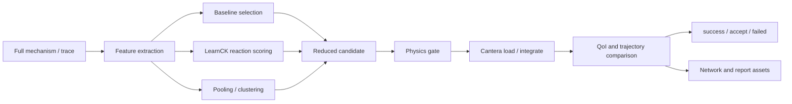
```mermaid
flowchart LR
    A[Full mechanism / trace] --> B[Feature extraction]
    B --> C1[Baseline selection]
    B --> C2[LearnCK reaction scoring]
    B --> C3[Pooling / clustering]
    C1 --> D[Reduced candidate]
    C2 --> D
    C3 --> D
    D --> E[Physics gate]
    E --> F[Cantera load / integrate]
    F --> G[QoI and trajectory comparison]
    G --> H[success / accept / failed]
    G --> I[Network and report assets]
```

評価上の状態は次のように定義する。

| 状態 | 定義 | 本レポートでの扱い |
|---|---|---|
| `failed` | reduced mechanism の生成、load、または Cantera 積分が成立しない。 | 採用しない。失敗理由は隠さず集計する。 |
| `success` | Cantera 実行は成立した。 | まだ採用可能とは限らない。QoI 誤差を見る。 |
| `accept` | `success` かつ final T と final density が1%以内。 | 圧縮率 sweep での採用可能候補。 |
| `accepted boundary` | accept の中で最も強く圧縮された候補。 | 推奨境界として時系列・ネットワーク図で確認する。 |

### 4.1 共通表現

詳細機構を有向グラフとして表す。

$$
G = (V, E)
$$

ここで、

- $V$: species または縮退後の状態ノード集合
- $E$: reaction に由来する状態間エッジ集合
- $n = |V|$: ノード数
- $m = |E|$: エッジまたは反応数

このグラフは可視化と構造比較のための射影表現である。実際の反応は、複数の反応物・生成物を同時に結ぶ stoichiometric hyperedge であり、特に表面反応では gas / surface / bulk、site、coverage 依存 rate law が絡む。したがって、図中の edge は素反応そのものではなく、反応に由来する状態間関係として扱う。

反応系の stoichiometric matrix を次で表す。

$$
\nu \in \mathbb{R}^{N_s \times N_r}
$$

- $N_s$: 縮退前 species 数
- $N_r$: 縮退前 reaction 数
- $\nu_{ij}$: species $i$ の reaction $j$ における正味係数

元素保存や site balance は、少なくとも次の診断で確認する必要がある。

$$
A^{\top}\nu_j = 0
$$

ここで $A$ は species ごとの元素組成行列である。表面反応では、これに加えて site 種の保存、phase をまたぐ反応の整合、coverage による rate law の適用範囲も確認対象になる。

縮退では、species または状態を縮約写像 $S$ で低次元に写す。

$$
Y = X S
$$

- $X \in \mathbb{R}^{T \times N_s}$: trace から得た時系列状態量
- $S \in \mathbb{R}^{N_s \times K}$: species から縮退ノードへの写像
- $Y \in \mathbb{R}^{T \times K}$: 縮退後状態
- $K$: 縮退後ノード数
- $T$: 時系列サンプル数

reaction の選択は keep mask で表す。

$$
z_j \in \{0, 1\}
$$

- $z_j = 1$: reaction $j$ を保持
- $z_j = 0$: reaction $j$ を削除

縮退率は次で計算する。

$$
r_{\mathrm{sp}} = 1 - \frac{N_s^{\mathrm{after}}}{N_s^{\mathrm{before}}}
$$

$$
r_{\mathrm{rxn}} = 1 - \frac{N_r^{\mathrm{after}}}{N_r^{\mathrm{before}}}
$$

QoI 誤差は相対誤差で評価する。

$$
\mathrm{relerr}(q) =
\frac{|q_{\mathrm{reduced}} - q_{\mathrm{full}}|}
{|q_{\mathrm{full}}| + \epsilon}
$$

- $q_{\mathrm{full}}$: 詳細機構の QoI
- $q_{\mathrm{reduced}}$: 縮退機構の QoI
- $\epsilon$: ゼロ割り防止の小定数

平均誤差は次で集計する。

$$
\overline{e} = \frac{1}{|\mathcal{Q}|}
\sum_{q \in \mathcal{Q}} \mathrm{relerr}(q)
$$

- $\mathcal{Q}$: 評価対象 QoI 集合

pass rate は、閾値を満たした評価項目の割合である。本レポートの `mandatory pass` は条件数だけを分母にした割合ではなく、mandatory QoI チェック集合に対する通過割合として読む。

$$
\mathrm{pass\_rate} =
\frac{1}{|\mathcal{C}|}
\sum_{c \in \mathcal{C}}
\mathbf{1}\left[e_c \le \tau\right]
$$

- $\mathcal{C}$: 評価条件、QoI、fold などから構成される評価チェック集合
- $e_c$: 評価チェック $c$ の誤差
- $\tau$: 合格閾値

マクロ密度は理想気体近似で確認した。

$$
\rho =
\frac{P \overline{M}}{R T}
$$

- $\rho$: gas density
- $P$: pressure
- $T$: temperature
- $R$: universal gas constant
- $\overline{M}$: 混合平均分子量

$$
\overline{M} = \sum_i X_i M_i
$$

- $X_i$: gas species $i$ の mole fraction
- $M_i$: species $i$ の分子量

縮退後の密度は、縮退後ネットワークに残った、またはマージされた gas species を用いて再正規化して計算した。縮退後の独立した Cantera マクロ時系列は保存されていないため、温度と圧力は trace の値を before/after に重ねている。この density は「縮退後 gas basis で再計算した診断値」であり、縮退機構の状態方程式・熱収支・反応速度を再積分して得た物理 trajectory ではない。

### 4.2 Baseline

`baseline` は rule-based な reaction / species 選択を行う。元素 overlap、phase / site mask、物理 floor、balance gate を使い、危険な削除を避ける。

主な特徴:

- gas / surface の反応分解が追いやすい。
- reaction 数の削減は中程度。
- 物理的な診断性が高い。

選択は、おおまかに次の制約付きスコア選択として見られる。これは厳密な数理最適化問題を解いたという意味ではなく、保持したい reaction の重要度と安全制約を説明するための概念式である。

$$
\max_z \quad \sum_j z_j w_j
$$

subject to:

$$
N_s^{\mathrm{after}} \ge N_s^{\min}
$$

$$
N_r^{\mathrm{after}} \ge N_r^{\min}
$$

$$
\mathrm{coverage}_{\mathrm{active}} \ge \gamma
$$

- $w_j$: reaction $j$ の重要度
- $N_s^{\min}$: 最低 species 数
- $N_r^{\min}$: 最低 reaction 数
- $\gamma$: active species coverage の閾値

### 4.3 LearnCK++ 型選択

`learnckpp` は trace 由来の特徴量から重要 reaction を選び、反応数を強く削減する。選択後に coverage-aware postselect と物理 gate を適用する。

ここでの `learnckpp` は、保存済み trace から作った特徴量に基づく scoring / surrogate selection として扱う。教師あり学習済みモデルを用いたことを主張する場合は、学習データ、損失関数、検証分割、再現性 seed を別途明記する必要がある。

特徴量の例:

$$
\phi_i =
[
\max_t X_i(t),
\mathrm{mean}_t X_i(t),
\max_t |\dot{\omega}_i(t)|,
\mathrm{element}(i),
\mathrm{phase}(i)
]
$$

- $\phi_i$: species $i$ の特徴量
- $X_i(t)$: mole fraction または状態量
- $\dot{\omega}_i(t)$: production rate

reaction 選択の score は次の形で考えられる。

$$
s_j = f_{\theta}(\phi_{\mathrm{reactants}}, \phi_{\mathrm{products}}, r_j)
$$

- $s_j$: reaction $j$ の重要度 score
- $f_{\theta}$: 学習済みモデルまたは heuristic / surrogate による scoring 関数
- $r_j$: reaction 固有特徴

主な特徴:

- reaction 数を大きく減らせる。
- overall 再合成 reaction になる場合があり、gas/surface の1対1分解は baseline より読みにくい。
- 今回は多くのケースで非常に高い reaction reduction を得た。

### 4.4 Pooling

`pooling` は species をクラスタへ集約する。

`pooling` の縮退後ノードは、通常の chemical species と一対一対応しない。複数 species、場合によっては phase の異なる species を代表する cluster であり、after reactions も素反応数ではなく cluster 間の aggregate edge として解釈する。

$$
S_{ik} =
\begin{cases}
1 & \text{species } i \text{ が cluster } k \text{ に属する} \\
0 & \text{otherwise}
\end{cases}
$$

クラスタ後の状態は、

$$
Y_k(t) = \sum_i X_i(t) S_{ik}
$$

となる。

反応フラックス行列も cluster 空間へ写す。

$$
F_{\mathrm{red}} = S^{\top} F S
$$

- $F$: 縮退前の species 間 reaction flow
- $F_{\mathrm{red}}$: 縮退後 cluster 間 flow

クラスタリングでは、次のような損失を抑える。

$$
\mathcal{L}
= \mathcal{L}_{\mathrm{recon}}
+ \lambda_{\mathrm{phys}}\mathcal{L}_{\mathrm{phys}}
+ \lambda_{\mathrm{cov}}\mathcal{L}_{\mathrm{coverage}}
$$

- $\mathcal{L}_{\mathrm{recon}}$: dynamics reconstruction error
- $\mathcal{L}_{\mathrm{phys}}$: 元素・phase・site などの物理制約違反
- $\mathcal{L}_{\mathrm{coverage}}$: 重要 species / cluster coverage の不足
- $\lambda_{\mathrm{phys}}, \lambda_{\mathrm{cov}}$: 各制約の重み

主な特徴:

- species 数を最も強く削れる。
- ノードがマージされるため、縮退後ネットワークの可読性は node map と併用する必要がある。
- AC case では species 91.5% 削減、reaction 96.9% 削減を達成した。

### 4.5 Workflow

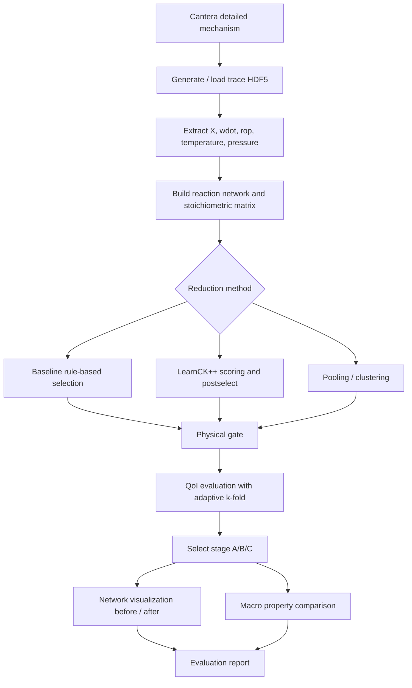
```mermaid
flowchart TD
    A[Cantera detailed mechanism] --> B[Generate / load trace HDF5]
    B --> C[Extract X, wdot, rop, temperature, pressure]
    C --> D[Build reaction network and stoichiometric matrix]
    D --> E{Reduction method}
    E --> F[Baseline rule-based selection]
    E --> G[LearnCK++ scoring and postselect]
    E --> H[Pooling / clustering]
    F --> I[Physical gate]
    G --> I
    H --> I
    I --> J[QoI evaluation with adaptive k-fold]
    J --> K[Select stage A/B/C]
    K --> L[Network visualization before / after]
    K --> M[Macro property comparison]
    L --> N[Evaluation report]
    M --> N
```

### 4.6 縮退手法の学習・選択フロー

3手法は、同じ trace と評価 gate を使うが、縮退候補の作り方が異なる。`baseline` は明示ルール、`learnckpp` は特徴量に基づく reaction scoring、`pooling` は species / state のクラスタリングを中心に使う。

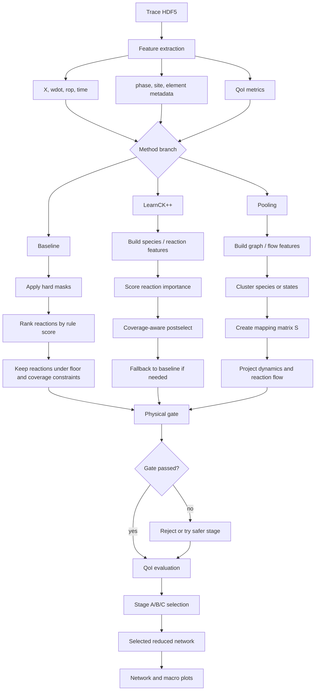
```mermaid
flowchart TD
    A[Trace HDF5] --> B[Feature extraction]
    B --> B1[X, wdot, rop, time]
    B --> B2[phase, site, element metadata]
    B --> B3[QoI metrics]

    B1 --> C{Method branch}
    B2 --> C
    B3 --> C

    C --> D[Baseline]
    D --> D1[Apply hard masks]
    D1 --> D2[Rank reactions by rule score]
    D2 --> D3[Keep reactions under floor and coverage constraints]

    C --> E[LearnCK++]
    E --> E1[Build species / reaction features]
    E1 --> E2[Score reaction importance]
    E2 --> E3[Coverage-aware postselect]
    E3 --> E4[Fallback to baseline if needed]

    C --> F[Pooling]
    F --> F1[Build graph / flow features]
    F1 --> F2[Cluster species or states]
    F2 --> F3[Create mapping matrix S]
    F3 --> F4[Project dynamics and reaction flow]

    D3 --> G[Physical gate]
    E4 --> G
    F4 --> G

    G --> H{Gate passed?}
    H -- no --> I[Reject or try safer stage]
    H -- yes --> J[QoI evaluation]
    I --> J
    J --> K[Stage A/B/C selection]
    K --> L[Selected reduced network]
    L --> M[Network and macro plots]
```

学習・選択で使う代表的な量は以下である。

$$
\Phi =
\left[
X,\ \dot{\omega},\ \mathrm{ROP},\ A,\ p,\ s
\right]
$$

- $\Phi$: 縮退候補を作るための特徴量集合
- $X$: species mole fraction または state value
- $\dot{\omega}$: species production rate
- $\mathrm{ROP}$: reaction rate of progress
- $A$: element composition や保存量の行列
- $p$: phase label。gas / surface / bulk など
- $s$: site label。surface site type など

`learnckpp` では reaction $j$ の重要度を、

$$
s_j = f_{\theta}(\Phi_j)
$$

として求める。ここで、$s_j$ は reaction score、$\Phi_j$ は reaction $j$ に関係する reactant / product / flow 特徴量、$f_{\theta}$ は学習済みモデルまたは heuristic / surrogate に相当する scoring 関数である。本レポート内の式は評価フローを説明するための抽象表現であり、学習モデルの存在を単独で保証しない。

`pooling` では、species から cluster への写像 $S$ を学習または探索し、縮退後状態を

$$
Y = XS
$$

として得る。さらに、反応 flow を

$$
F_{\mathrm{red}} = S^{\top}FS
$$

で cluster 空間へ写す。この操作で得られる cluster 状態は、濃度や被覆率の物理単位をそのまま保持するとは限らない。特に phase や site 種が混在する cluster では、node map による中身の確認が必須である。

最終選択では、品質と圧縮を同時に見る。

$$
\mathrm{score}
= \alpha r_{\mathrm{rxn}}
+ \beta r_{\mathrm{sp}}
- \lambda \overline{e}
- \mu d_{\mathrm{struct}}
$$

- $r_{\mathrm{rxn}}$: reaction reduction
- $r_{\mathrm{sp}}$: species reduction
- $\overline{e}$: QoI 平均相対誤差
- $d_{\mathrm{struct}}$: structure deficit。coverage や cluster guard の不足量
- $\alpha,\beta,\lambda,\mu$: 各項の重み

### 4.7 特徴量と学習 / surrogate scoring の位置づけ

本コードで扱う機械学習的な量は、反応機構そのものを black-box に置き換えるものではない。詳細機構から得た trace と metadata を使い、reaction、species、cluster の重要度を定量化するために使う。代表的な特徴量は次の通りである。

| feature group | 記号 | 例 | 役割 |
|---|---|---|---|
| 状態量 | $X_i(t)$ | mole fraction、coverage、surface site fraction | どの species / site が実際に現れるかを見る。 |
| 生成速度 | $\dot{\omega}_i(t)$ | species production rate | 生成・消費が強い species を検出する。 |
| 反応進行 | $\mathrm{ROP}_j(t)$ | forward / reverse / net rate of progress | active reaction と inactive reaction を分ける。 |
| 構造特徴 | $A_i, p_i, s_i$ | element vector、phase、site label | 元素保存、phase guard、site guard に使う。 |
| QoI 寄与 | $g_{ij}$ | reaction と temperature / density / deposition proxy の関連 | 目的変数に効く反応を残す。 |
| graph特徴 | $d_i, c_i, F_{ij}$ | degree、centrality、flux edge | ネットワーク上の局所重要度を見る。 |

`learnckpp` または learnCK 型の代替スコアリングでは、reaction $j$ の特徴量を

$$
\Phi_j =
\left[
\phi_{\mathrm{reactants}(j)},
\phi_{\mathrm{products}(j)},
\max_t |\mathrm{ROP}_j(t)|,
\int |\mathrm{ROP}_j(t)| dt,
\Delta q_j,
\mathrm{metadata}_j
\right]
$$

としてまとめ、score を

$$
s_j = f_{\theta}(\Phi_j)
$$

で与える。$f_{\theta}$ は、実学習済みモデルがある場合はその推論器、ない場合は integrated ROP や QoI 近似値を使う surrogate scoring として扱う。本レポートでは、実学習済み score が確認できない箇所を learnCK 型の代替スコアリングとして扱い、学習済みモデルの性能としては主張しない。

縮退候補は、score 上位 reaction を残すだけではなく、duplicate reaction group、重要 species coverage、phase / site guard、minimum reaction floor を通した後に作る。すなわち、実際の keep mask は

$$
z_j =
\mathbf{1}
\left[
s_j \ge \tau
\right]
\lor
\mathbf{1}
\left[
j \in \mathcal{G}_{\mathrm{protected}}
\right]
$$

で表される。ここで $\mathcal{G}_{\mathrm{protected}}$ は初期組成 species、主要 QoI species、surface site、duplicate reaction group などから誘導される保護集合である。このため、target keep ratio と実際の reaction reduction は一致しないことがある。

### 4.8 手法比較

| 手法 | 概要 | コア技術 | メリット | デメリット |
|---|---|---|---|---|
| `baseline` | 物理ルールと重要度 ranking に基づいて species / reaction を直接選択する。 | hard mask、element overlap、phase/site guard、physics floor、coverage gate、stage A/B/C 探索 | 物理的に説明しやすい。gas / surface の反応分解が追いやすい。trace ベースの QoI が安定しやすい。 | reaction 削減率は learnckpp / pooling より控えめ。既存ルールに強く依存する。 |
| `learnckpp` | trace 由来特徴量から reaction importance を評価し、重要 reaction を残す。 | species / reaction feature、surrogate scoring、coverage-aware postselect、fallback policy | reaction 数を大きく削れる。baseline より aggressive な縮退候補を作れる。 | overall 再合成 reaction になりやすく、反応ドメインの解釈性が下がる。特徴量と scoring の設計に依存する。 |
| `pooling` | species / state を cluster に集約し、少数の代表ノードで反応ネットワークを表す。 | mapping matrix $S$、graph pooling、cluster guard、flow projection、dynamics reconstruction check | cluster 数と aggregate edge 数を強く削れる。巨大機構の粗視化候補に向く。 | ノードが複数 species を代表するため、単独ノードの意味が広くなる。node map なしでは解釈しづらい。 |

この比較から、第三者に説明しやすい縮退候補を作るなら `baseline` が扱いやすい。一方で、候補ネットワークを極端に小さくしたい場合は `learnckpp` または `pooling` が有力である。特に `pooling` は「状態をまとめる」手法なので、縮退後ネットワーク図では node map と併読することが重要である。

## 5. 評価対象、Cantera 時間発展と縮退影響

5章では、縮退後の良し悪しを論じる前に、まず縮退前の full Cantera trajectory が各ケースでどのように時間変化しているかを確認する。そのうえで、保存済みの構造図と trace 診断を「独立再積分前の一次評価」として位置づける。圧縮率を変えた full/reduced Cantera 再実行比較は、手法横断の評価として7章に分離した。

重要な前提として、現 checkout には元の大規模ケースの full mechanism YAML と reduced mechanism YAML が完全には残っていない。したがって、本章の Cantera 再実行は、復元不能な元機構を置き換えるものではなく、透明に生成した代替機構による評価経路である。単独の GRI30 ケースは本章の比較対象から除外した。acetylene/N2 希釈条件の代替機構はローカル gas mechanism を acetylene 条件で使うが、これは当該条件を実行可能にするための実装詳細であり、GRI30 ケースを評価対象に追加する意図ではない。

### 5.1 評価範囲と重要な注意

本レポートは、Cantera で扱う表面反応を含む大規模反応機構について、物理制約を守る縮退候補を作れるか、またその候補が trace ベースの QoI、ネットワーク構造、独立 Cantera rerun の観点でどの程度妥当かを評価する。

評価対象は次の3ケースである。

| 評価対象 | 反応系 | 縮退前 species | 縮退前 reactions | 条件数 |
|---|---|---:|---:|---:|
| Diamond CVD | diamond CVD 表面反応系 | 78 | 385 | 4 |
| SiF4 系 CVD | SiF4 / NH3 / Si3N4 CVD 系 | 82 | 365 | 6 |
| Acetylene 系 CVD | acetylene hydrocarbon CVD 系 | 94 | 425 | 8 |

各評価対象に対し、`baseline`、`learnckpp`、`pooling` の3つの縮退手法を適用した。結果は、縮退前後のネットワーク図、QoI 指標、温度・圧力・密度などのマクロ診断図で確認する。ただし、保存済み出力のマクロ診断図は、縮退後機構の独立再積分結果ではない。

したがって、本レポートの結果は次のように読む。

- `gate=true` は、実装済みの構造・coverage・物理診断 gate を通過したことを示す。
- mandatory / optional mean は、保存済み trace と縮退候補上の事後評価指標である。
- 保存済み図の温度・圧力 before/after 一致は、縮退機構の熱力学的再現を意味しない。両者に同じ trace の値を使っている。
- density は、縮退後 gas basis を用いた理想気体密度の診断値であり、縮退機構を再実行して得た密度ではない。
- `pooling` の after species / reactions は、厳密な chemical species / elementary reaction 数ではなく、cluster / aggregate edge 数として解釈する。
- 7章の代替機構 sweep では、full と reduced を別々に Cantera rerun しているため、`success` と `accept` を分けて評価する。

反応機構縮退の最終的な妥当性を主張するには、縮退機構を Cantera で再実行し、温度、圧力、密度、表面被覆率、deposition rate、主要濃度の full vs reduced trajectory を直接比較する必要がある。本レポートでは、その正式評価に向けた前段として、保存済み出力の診断と代替機構による rerun の両方を整理する。

ネットワーク図の読み方:

- ノード: 状態または species。マージされた場合は代表ノードとして描画する。
- エッジ: 反応により結ばれる状態間の関係。
- ノード色: 青 = gas、橙 = surface、緑 = bulk または mixed/other。
- ノードサイズ: 全ノード固定。密度と接続数を見やすくするため。
- ノード番号と反応式: 各 `*_node_map.md` に記載。

| 色 | 意味 | 説明 |
|---|---|---|
| ● 青 | gas | 気相 species または気相 species を代表する縮退ノード |
| ● 橙 | surface | 表面 species、表面 site、または表面 species を代表する縮退ノード |
| ● 緑 | bulk / mixed / other | bulk species、bulk を含むノード、または phase が混在・未分類の縮退ノード |

縮退後の `pooling` では、1つのノードが複数 species を代表することがある。その場合、色は代表ノードに含まれる主な phase bucket を示す。正確なマージ内容は各 `*_node_map.md` の `Names` 欄で確認する。

### 5.2 縮退前 full Cantera trajectory

縮退前の時間発展を見ずに縮退効果だけを議論すると、「reduced が何からずれたのか」が分からない。そこで、`diamond`、`sif4/add_O2`、`ac/dilute_N2` について、reduced と比較する前の full trajectory を先に示す。

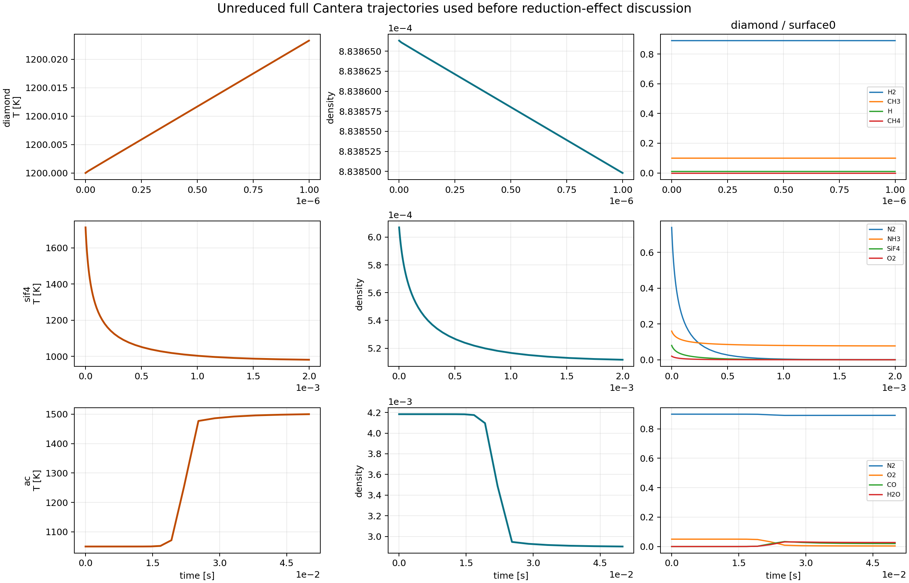

| 評価対象 | 条件 | full trajectory source | time end | T change | density change | 読み取り |
|---|---|---|---:|---:|---:|---|
| Diamond CVD | 表面反応条件 | Cantera 同梱の diamond 表面反応を使った代替機構 | 1.0e-6 s | +0.023 K | -0.0019% | 短時間の表面反応評価であり、主に被覆率と deposition proxy の確認に使う。 |
| SiF4 系 CVD | O2 添加条件 | 生成した SiF4/NH3/O2 代替機構 | 2.0e-3 s | -731.2 K | -15.70% | 反応進行で温度が大きく下がるため、reduced 側が冷却履歴を保つかが評価点になる。 |
| Acetylene 系 CVD | N2 希釈条件 | 生成した acetylene 代替機構 | 5.0e-2 s | +450.0 K | -30.63% | 加熱と生成物増加が明瞭で、反応経路を削りすぎると温度履歴が壊れやすい。 |

個別図は [full time evolution index](reports/eval53_full_time_evolution/index.md) に保存した。ここでの目的は、縮退前の基準時間発展を先に固定し、以降の reduced 比較を「この full trajectory からどの程度ずれるか」として読めるようにすることである。

### 5.3 保存済み構造・trace 診断の位置づけ

保存済みの9 run は、縮退前後の構造図と trace ベース QoI 指標が揃った出力である。これは有用な比較であるが、縮退後 mechanism を Cantera で独立再積分した結果ではない。したがって、ここでは「構造・trace 診断のサマリ」として読む。

| 評価対象 | method | gate | stage | species before→after | species reduction | reactions before→after | reaction reduction | mandatory pass | mandatory mean | optional mean |
|---|---|---:|---|---:|---:|---:|---:|---:|---:|---:|
| diamond | baseline | true | B | 78→43 | 44.9% | 385→203 | 47.3% | 1.000 | 0.085 | 0.047 |
| diamond | learnckpp | true | B | 78→43 | 44.9% | 385→100 | 74.0% | 0.897 | 0.208 | 0.137 |
| diamond | pooling | true | B | 78→40 | 48.7% | 385→100 | 74.0% | 0.897 | 0.208 | 0.137 |
| sif4 | baseline | true | C | 82→29 | 64.6% | 365→146 | 60.0% | 0.972 | 0.152 | 0.128 |
| sif4 | learnckpp | true | C | 82→28 | 65.9% | 365→11 | 97.0% | 0.933 | 0.182 | 0.168 |
| sif4 | pooling | true | C | 82→21 | 74.4% | 365→11 | 97.0% | 0.917 | 0.168 | 0.245 |
| ac | baseline | true | C | 94→33 | 64.9% | 425→170 | 60.0% | 0.951 | 0.115 | 0.163 |
| ac | learnckpp | true | C | 94→33 | 64.9% | 425→22 | 94.8% | 0.951 | 0.151 | 0.221 |
| ac | pooling | true | C | 94→8 | 91.5% | 425→13 | 96.9% | 0.951 | 0.151 | 0.221 |

全9 run で `gate=true`、primary blocker は `none` だった。これは、実装済みの構造・coverage・物理診断 gate を通過したという意味であり、縮退後 mechanism の独立 Cantera 再積分が成功したことを意味しない。`baseline` は trace ベースの mandatory mean が安定し、`learnckpp` と `pooling` は reaction / aggregate edge reduction が大きい。

表の読み方:

- `baseline` と `learnckpp` の after species は、原則として保持された chemical species 数として読める。
- `pooling` の after species は cluster 数、after reactions は aggregate edge 数として読む。
- `mandatory mean` と `optional mean` は、QoI の絶対的な物理妥当性ではなく、保存済み評価指標上の平均相対誤差である。
- `stage` は選択された縮退段階であり、熱力学的な品質等級ではない。

### 5.4 density 診断と再評価対象

保存済み macro density 診断では、before は full gas species basis、after は縮退後 gas basis を用いて理想気体密度を再計算した。ここでの after 側は、縮退 mechanism を Cantera で独立再実行した時系列ではない。したがって、この図は「縮退後機構が良い」と証明する図ではなく、「縮退後 gas basis の変更だけで、すでに密度診断が壊れていないか」を見る triage 図である。

判定基準は次のように置いた。

| 判定 | 指標 | 意味 | 次の扱い |
|---|---:|---|---|
| OK | `|rho_after/rho_before - 1| <= 5%` | gas basis 変更だけでは大きな密度破綻は見えない。 | kinetics が正しい証明ではないため、候補として残す。 |
| watch | `5–20%` | 条件依存のずれが見え始めている。 | 優先的に full/reduced Cantera 再実行で確認する。 |
| rerun priority | `>20%` | gas basis 変更だけで大きな密度差が出ている。 | そのまま良い縮退候補とは読まず、正式再実行の高優先対象にする。 |

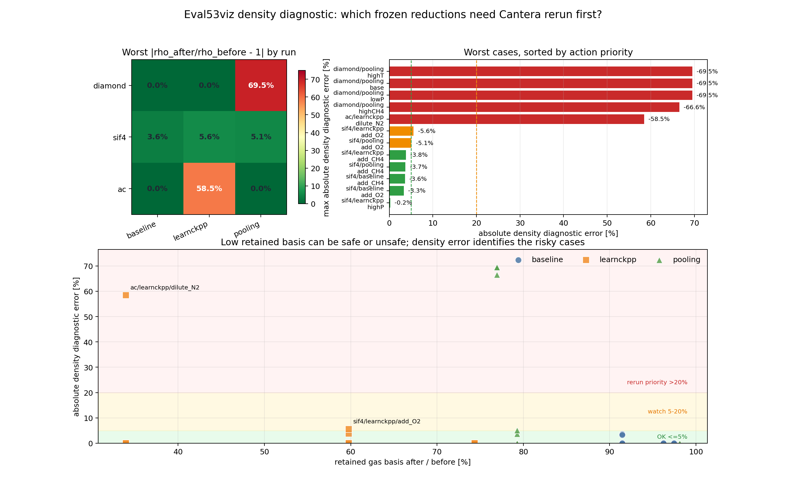

この図は3つの読み方をまとめている。左上の heatmap は評価対象/手法ごとの「最悪ケースの密度診断誤差」を示す。右上の bar chart は、どの条件から再実行すべきかを大きい順に並べる。下段の scatter は、gas basis を何%残したかと密度誤差の関係を示す。

結論は明確である。

| 評価対象 / method | 最大密度診断誤差 | 最悪条件 | 判定 | 解釈 |
|---|---:|---|---|---|
| diamond / pooling | 69.5% | highT | rerun priority | 4条件すべてで約67–70%ずれる。pooling の cluster basis では密度診断が大きく崩れており、独立Cantera再実行なしに妥当とは言えない。 |
| ac / learnckpp | 58.5% | dilute_N2 | rerun priority | 平均では 7.3% だが、`dilute_N2` だけが大きく外れる。希釈条件で重要 gas species basis が落ちた可能性が高い。 |
| sif4 / learnckpp | 5.6% | add_O2 | watch | ずれは小さめだが、`add_O2` 条件は正式再実行の対象に残す。 |
| sif4 / pooling | 5.1% | add_O2 | watch | `sif4/learnckpp` と同様に、O2追加条件でやや密度差が出る。 |
| baseline 全体 | 0–3.6% | sif4/add_CH4 | OK | density basis だけを見る限り大きな破綻はない。 |
| diamond / learnckpp、ac / pooling | ほぼ0% | - | OK | density basis 診断では問題は見えない。ただし kinetics の正しさは別途Cantera再実行で確認する。 |

ここで重要なのは、gas basis retention が低いほど必ず悪いわけではない点である。`ac/learnckpp` は gas basis を 34% まで落としており、`dilute_N2` で大きく破綻した。一方で、`sif4/learnckpp` は 60% 程度まで落としても多くの条件はOK域に残る。つまり、この診断は「圧縮率」そのものではなく、「残した gas basis が対象条件の平均分子量・密度を保てているか」を見ている。

5.4の結論として、Diamond CVD の `pooling` は保存済み図上の構造縮退としては強いが、density 診断では悪い候補である。Acetylene/N2 希釈条件の `learnckpp` は単一条件の危険信号が強く、7章で実施する圧縮率 sweep のように独立Cantera再実行で温度・密度・主要speciesの時間発展を確認する必要がある。SiF4/O2 添加条件は watch 域であり、優先度は下がるが確認対象には残す。

詳細CSVは [density decision summary](reports/eval53viz_labeled_networks/diagnostics/eval53viz_density_decision_summary.csv) と [condition diagnostics](reports/eval53viz_labeled_networks/diagnostics/eval53viz_condition_diagnostics.csv) に保存した。

### 5.5 5章から7章への接続

5章で得られる判断は、「保存済み出力だけで採用を断定しない」という点である。保存済み出力は構造、trace ベース QoI、density basis の危険信号を見つけるには有用だが、縮退後 mechanism の独立時間発展を保証しない。したがって、5章で抽出した Acetylene/N2 希釈条件と SiF4/O2 添加条件を、7章で代替機構による Cantera rerun の圧縮率 sweep として再評価する。

この接続により、6章のネットワーク図は「構造を読む図」、7章の時系列比較は「動力学を読む図」として役割が分かれる。第三者が採否を判断する場合は、6章の after network の小ささだけではなく、7章で full/reduced trajectory が保たれているかを合わせて読む必要がある。

## 6. ケース別構造図アトラス

6章は、5章の定量評価を繰り返す章ではなく、保存済みの before/after network と node map を確認するための図録である。`baseline` と `learnckpp` の after species / reactions は保持 species / reaction、`pooling` の after species / reactions は cluster / aggregate edge を指す略記として扱う。各 `macro` パネルは trace ベース診断であり、縮退後 mechanism の独立 Cantera 再積分結果ではない。

6章の読み方は次の通りである。

| 見る項目 | 何を確認するか | 注意点 |
|---|---|---|
| before network | 詳細機構の species / reaction 接続密度 | 図は stoichiometric hypergraph の射影であり、edge は素反応そのものではない。 |
| after network | 縮退後の残存 species / reaction、または cluster / aggregate edge | pooling は通常の chemical species 数ではなく cluster 数として読む。 |
| macro panel | 保存済み trace に基づく温度、圧力、density basis 診断 | 縮退後 mechanism の独立再積分ではない。 |
| node map | ノード番号、species 名、cluster の中身 | ネットワーク図だけでは cluster の化学的意味を判断しない。 |

全体傾向として、baseline は反応分解の解釈性を残しやすく、learnCK++ は reaction 数を大きく削りやすく、pooling は species / state の粗視化が最も強い。したがって、6章では「どの程度小さくなったか」だけでなく、「残ったノードが第三者に説明できるか」を確認する。

### 6.1 Diamond / Baseline

縮退前は 78 species / 385 reactions、縮退後は 43 species / 203 reactions。reaction reduction は 47.3%。baseline は削減率を抑えつつ、mandatory mean 0.085 と最も良い trace ベース指標を示した。

| before | after | macro |
|---|---|---|
| 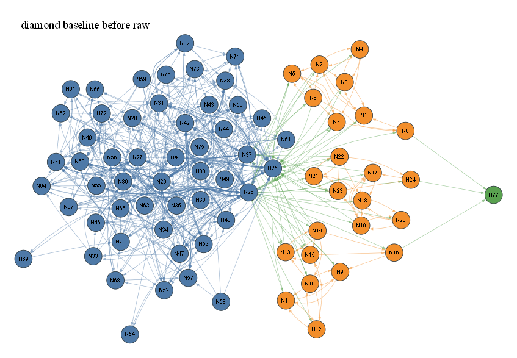 | 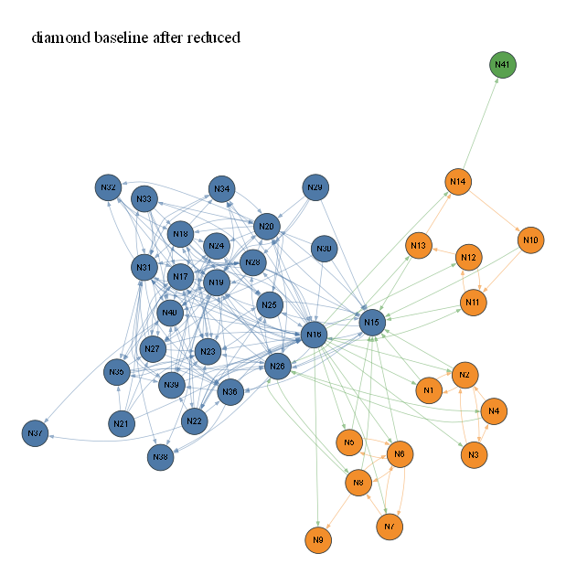 |  |

Node maps:

- [before node map](reports/eval53viz_labeled_networks/eval53viz_diamond_large_baseline_before_raw_simple_node_map.md)
- [after node map](reports/eval53viz_labeled_networks/eval53viz_diamond_large_baseline_after_reduced_simple_node_map.md)

### 6.2 Diamond / LearnCK++

縮退後は 43 species / 100 reactions。reaction reduction は 74.0%。baseline と species 数は同等だが、reaction 数を大きく削った。mandatory mean は 0.208 で、baseline より誤差は大きいが trace ベースの gate は通過した。

| before | after | macro |
|---|---|---|
|  |  | 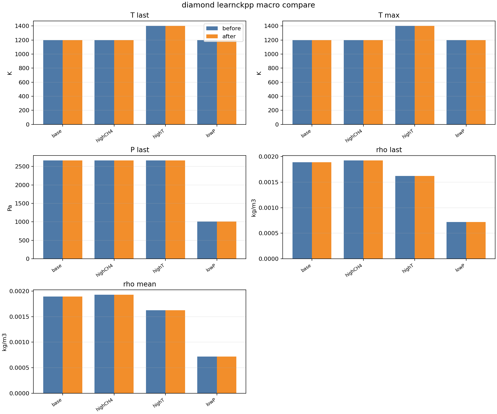 |

Node maps:

- [before node map](reports/eval53viz_labeled_networks/eval53viz_diamond_large_learnckpp_before_raw_simple_node_map.md)
- [after node map](reports/eval53viz_labeled_networks/eval53viz_diamond_large_learnckpp_after_reduced_simple_node_map.md)

### 6.3 Diamond / Pooling

縮退後は 40 clusters / 100 aggregate edges。species reduction 相当は 48.7%、reaction reduction 相当は 74.0%。learnckpp と同等の aggregate edge 数で、ノード数をさらに削った。ノードのマージが増えるため、対応表で cluster 内容を確認する必要がある。

| before | after | macro |
|---|---|---|
|  |  | 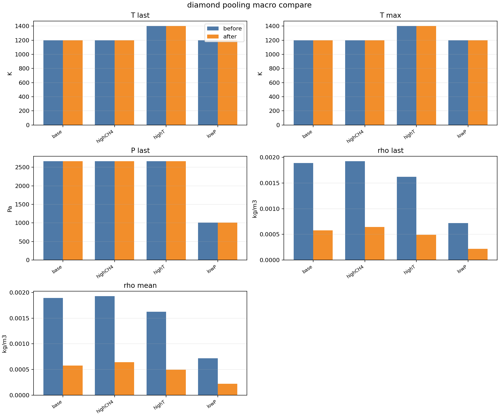 |

Node maps:

- [before node map](reports/eval53viz_labeled_networks/eval53viz_diamond_large_pooling_before_raw_simple_node_map.md)
- [after node map](reports/eval53viz_labeled_networks/eval53viz_diamond_large_pooling_after_reduced_simple_node_map.md)

### 6.4 SiF4 / Baseline

縮退後は 29 species / 146 reactions。species reduction は 64.6%、reaction reduction は 60.0%。mandatory pass は 0.972 と高く、trace ベース指標と削減率のバランスが良い。

| before | after | macro |
|---|---|---|
|  | 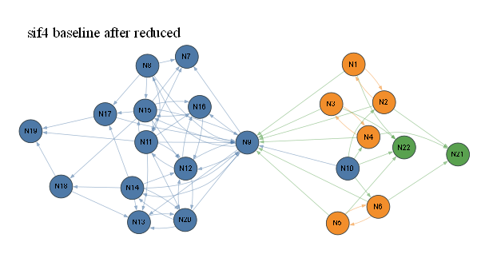 |  |

Node maps:

- [before node map](reports/eval53viz_labeled_networks/eval53viz_sif4_large_baseline_before_raw_simple_node_map.md)
- [after node map](reports/eval53viz_labeled_networks/eval53viz_sif4_large_baseline_after_reduced_simple_node_map.md)

### 6.5 SiF4 / LearnCK++

縮退後は 28 species / 11 reactions。reaction reduction は 97.0%。非常に強い reaction 圧縮を達成した。mandatory mean は 0.182 で trace ベース gate は通過しているが、縮退後ネットワークはかなり粗い。

| before | after | macro |
|---|---|---|
|  |  |  |

Node maps:

- [before node map](reports/eval53viz_labeled_networks/eval53viz_sif4_large_learnckpp_before_raw_simple_node_map.md)
- [after node map](reports/eval53viz_labeled_networks/eval53viz_sif4_large_learnckpp_after_reduced_simple_node_map.md)

### 6.6 SiF4 / Pooling

縮退後は 21 clusters / 11 aggregate edges。species reduction 相当は 74.4%、reaction reduction 相当は 97.0%。learnckpp と同じ aggregate edge 数まで落としつつ、ノード数もさらに削った。optional mean は 0.245 と3手法中では大きめである。

| before | after | macro |
|---|---|---|
| 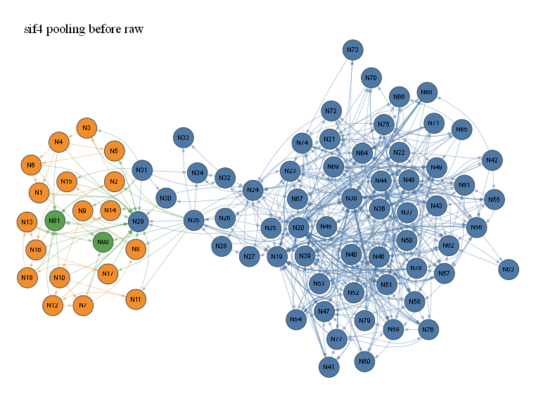 | 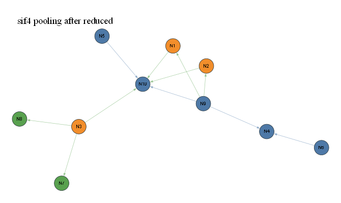 | 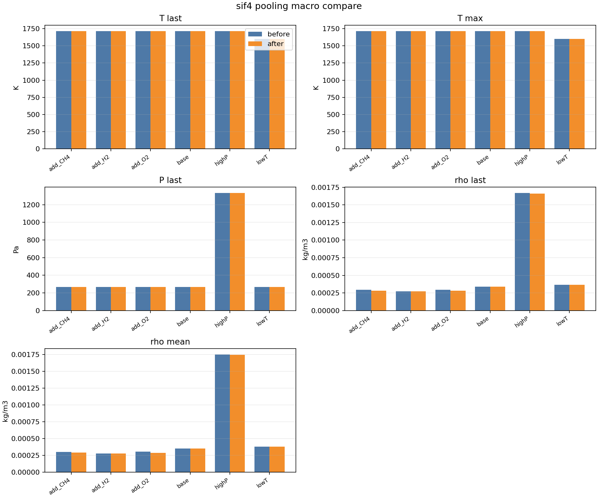 |

Node maps:

- [before node map](reports/eval53viz_labeled_networks/eval53viz_sif4_large_pooling_before_raw_simple_node_map.md)
- [after node map](reports/eval53viz_labeled_networks/eval53viz_sif4_large_pooling_after_reduced_simple_node_map.md)

### 6.7 AC / Baseline

縮退後は 33 species / 170 reactions。species reduction は 64.9%、reaction reduction は 60.0%。mandatory mean は 0.115 で、Acetylene 系 CVD では trace ベース指標が最も良い。

| before | after | macro |
|---|---|---|
|  |  |  |

Node maps:

- [before node map](reports/eval53viz_labeled_networks/eval53viz_ac_large_baseline_before_raw_simple_node_map.md)
- [after node map](reports/eval53viz_labeled_networks/eval53viz_ac_large_baseline_after_reduced_simple_node_map.md)

### 6.8 AC / LearnCK++

縮退後は 33 species / 22 reactions。species 数は baseline と同じだが、reaction 数は 22 まで減った。reaction reduction は 94.8%。mandatory mean は 0.151 で、強い圧縮に対して trace ベース指標の悪化は比較的小さい。

| before | after | macro |
|---|---|---|
| 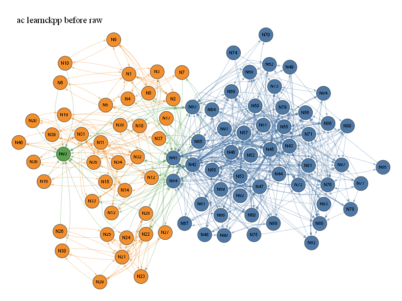 |  | 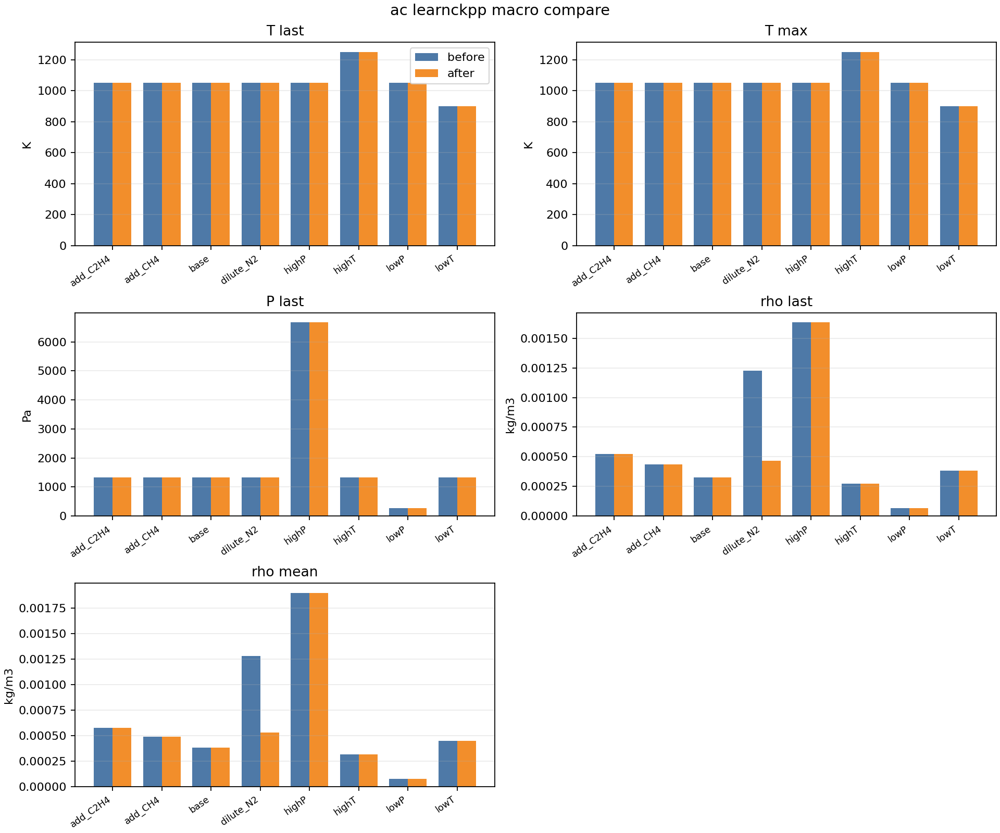 |

Node maps:

- [before node map](reports/eval53viz_labeled_networks/eval53viz_ac_large_learnckpp_before_raw_simple_node_map.md)
- [after node map](reports/eval53viz_labeled_networks/eval53viz_ac_large_learnckpp_after_reduced_simple_node_map.md)

### 6.9 AC / Pooling

縮退後は 8 clusters / 13 aggregate edges。species reduction 相当は 91.5%、reaction reduction 相当は 96.9%。今回の中で最も強い粗視化である。マージによりノード数が大きく減るため、縮退後ネットワークは非常に粗いが、mandatory pass は 0.951 を維持した。

| before | after | macro |
|---|---|---|
|  |  | 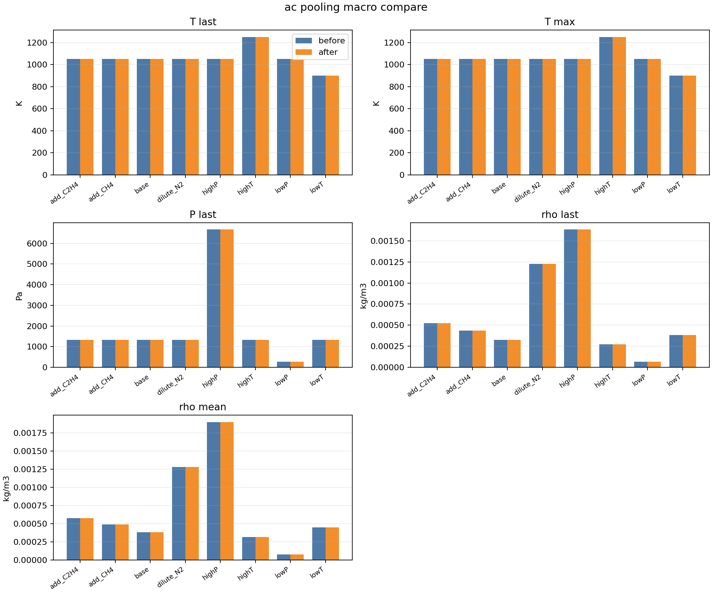 |

Node maps:

- [before node map](reports/eval53viz_labeled_networks/eval53viz_ac_large_pooling_before_raw_simple_node_map.md)
- [after node map](reports/eval53viz_labeled_networks/eval53viz_ac_large_pooling_after_reduced_simple_node_map.md)

## 7. 圧縮率 sweep による手法横断 Cantera 再評価

5章から learnCK だけの圧縮率比較を分離し、Acetylene/N2 希釈条件と SiF4/O2 添加条件に対して、保守的選択、learnCK 型スコアリング、pooling 型代表 species 選択を同じ圧縮率系列で再実行した。ここでの目的は、手法名の一般的な優劣を決めることではなく、同一条件で「どの縮退率から Cantera の時間発展が崩れるか」を第三者が追えるようにすることである。

この章も代替機構による評価である。元の大規模詳細機構を復元した正式評価ではない。また、ここでの保守的選択は species guard に基づく直接選択、pooling 型候補は代表 species を残す Cantera 実行可能候補であり、6章の保存済み `baseline` / `pooling` 図と完全に同じ実装ではない。

### 7.1 本章の結論

本章の結論は次の通りである。

1. `ac/dilute_N2` では、learnCK だけが高圧縮と時間発展再現を両立した。`ratio_100`、つまり reaction reduction 89.8% までは final T と density が1%以内に収まる。`ratio_050` まで削ると、full で起きる加熱が reduced で起きず、T -30.0%、density +44.2% に崩れる。
2. `sif4/add_O2` でも learnCK が最も安定した。`ratio_100`、reaction reduction 87.8% までは1%以内に収まる。`ratio_050` は T +6.25%、density +2.57% であり、5%基準を超えるため本章では採用しない。
3. 保守的選択は浅い圧縮では成立するが、強圧縮では候補生成そのものが failed になる。failed は隠さず、「その圧縮率では実行可能候補にならない」と読む。
4. pooling 型候補はCantera上は成功する場合が多いが、強圧縮では 0 reaction 相当まで退化し、時間発展を失う。network が小さいことは品質の証明ではない。

最初に次の判定ダッシュボードを見ると、章全体の結論が分かる。

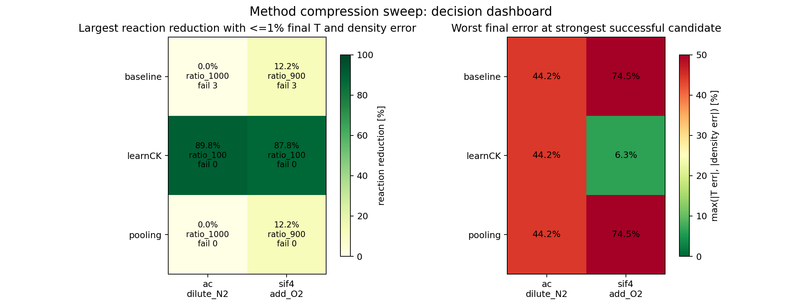

左図は「final T と density の両方が1%以内に収まる最大 reaction reduction」を示す。値が大きいほど、精度を保ったまま強く圧縮できたことを意味する。右図は「成功した最強圧縮候補での最大最終誤差」であり、成功したから良いとは限らないことを示す。learnCK は左図で高く、右図で比較的低い。baseline と pooling は、成功候補を最強まで進めると大きく壊れる。

### 7.2 評価設計と採否基準

実行条件は次の通りである。

| 項目 | 内容 |
|---|---|
| 対象 | Acetylene/N2 希釈条件、SiF4/O2 添加条件 |
| 手法 | 保守的選択、learnCK 型スコアリング、pooling 型代表 species 選択 |
| keep ratio | `1.0, 0.9, 0.75, 0.6, 0.5, 0.4, 0.3, 0.2, 0.1, 0.05` |
| 評価 | full と reduced を同一条件・同一時間軸で別々に Cantera 積分 |
| 出力 | summary CSV、圧縮率曲線、Cantera差分図、圧縮率別 network atlas、各候補の reduced YAML |

採否は、次の順で判断した。

| 判断段階 | 見るもの | 判定の意味 |
|---|---|---|
| 1 | reduced mechanism が生成・ロード・積分できるか | failed は候補として採用しない。 |
| 2 | final T と final density の相対誤差 | どちらも1%以内なら本章では安定域、5%超は watch / 不採用寄り。 |
| 3 | 時間発展の差分 | 最終値が近くても、途中の着火・冷却・加熱タイミングがずれれば危険。 |
| 4 | network atlas | 残った反応数と構造の粗さを確認する。ただし採否はCantera差分で決める。 |

実行結果の要約は次の通りである。

| 評価対象 / 条件 | method | success / failed | 1%以内で最大圧縮 | 5%以内で最大圧縮 | 最大成功圧縮での結果 |
|---|---|---:|---:|---:|---|
| Acetylene 系 / N2 希釈 | baseline | 7 / 3 | ratio_1000, reaction reduction 0.0% | ratio_1000, 0.0% | ratio_300 は成功するが T -30.0%、density +44.2% で不適 |
| Acetylene 系 / N2 希釈 | learnCK | 10 / 0 | ratio_100, 89.8% | ratio_100, 89.8% | ratio_050 で T -30.0%、density +44.2% に崩れる |
| Acetylene 系 / N2 希釈 | pooling | 10 / 0 | ratio_1000, 0.0% | ratio_1000, 0.0% | ratio_200 以降は 0 reaction 相当で T -30.0%、density +44.2% |
| SiF4 系 / O2 添加 | baseline | 7 / 3 | ratio_900, 12.2% | ratio_900, 12.2% | ratio_300 は成功するが T +74.5%、density +18.6% で不適 |
| SiF4 系 / O2 添加 | learnCK | 10 / 0 | ratio_100, 87.8% | ratio_100, 87.8% | ratio_050 は T +6.25%、density +2.57% で5%基準を超える |
| SiF4 系 / O2 添加 | pooling | 10 / 0 | ratio_900, 12.2% | ratio_900, 12.2% | ratio_200 以降は 0 reaction 相当で T +74.5%、density +18.6% |

### 7.3 グラフ1: 圧縮率ごとの採否マップ

曲線を重ねると、どの圧縮率が採用可能で、どこから崩れたのかが読み取りにくい。そこで、ここでは線グラフを主図から外し、各セルを1つの候補として色分けした。

横軸は実際の reaction reduction ではなく、縮退候補生成時に指定した **target keep ratio** である。`keep 1.00` は反応を全て残す目標、`keep 0.05` は5%だけ残す最強圧縮目標を意味する。実際の削減率は、保護 species、重複反応 group、Cantera load 可能性の制約で目標とずれるため、各セル内の `Rred` として別に表示した。セル内の `err` は `max(|final T error|, |final density error|)`、`R` は残った reaction 数である。緑は1%以内、黄は1-5%、橙は5-20%、赤は20%超、灰色は候補生成または実行が failed である。

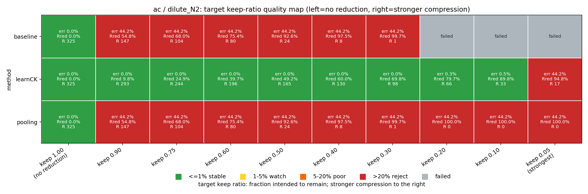

`ac/dilute_N2` の結論は明確である。learnCK は `ratio_100` まで緑を保ち、reaction reduction 89.8% でも final T と density の差が1%以内に収まる。一方、`ratio_050` では赤に落ち、加熱反応を失う。baseline と pooling は、`ratio_1000` を除くほぼ全域で赤または failed であり、この条件では圧縮手法として採用しにくい。

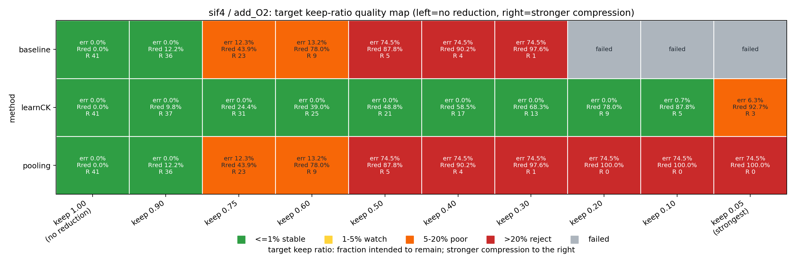

`sif4/add_O2` でも learnCK が最も安定している。`ratio_100` までは緑で、reaction reduction 87.8% まで1%以内に収まる。`ratio_050` は橙で、T +6.25%、density +2.57% までずれるため、さらに小さい network ではあるが採用候補から外す。baseline と pooling は `ratio_900` までは成立するが、それより強い圧縮では誤差が急増する。

### 7.4 グラフ2: 圧縮率ごとの final 差分

採否マップだけでは、差分が正負どちらに出たのかが見えない。次の図では、target keep ratio ごとに reduced と full の final T / final density の相対差を符号付きで示す。横軸は `keep 1.00` から `keep 0.05` へ進むほど、より少ない反応を残す強い圧縮目標になる。緑の帯は ±1% の accept 範囲を表す。

注意点として、この横軸は「実際に何%削れたか」ではない。たとえば同じ `keep 0.10` でも、手法や保護制約によって残る reaction 数と `Rred` は異なる。したがって、この図では横軸で「どの強さの圧縮指示か」を見て、点の色で success / accept を見て、7.3の `Rred` と合わせて「実際にどれだけ削れたか」を読む。

ここでの用語を明確に分ける。

| 表示 | 意味 | 採否上の扱い |
|---|---|---|
| green circle: accept | Cantera実行が成功し、final T と final density が両方1%以内 | 採用可能候補 |
| yellow star: accepted boundary | accept の中で最も強く圧縮できた点 | 本章で推奨する境界 |
| blue circle: success only | Cantera実行は成功したが、1%基準は満たさない | 成功だが不採用 |
| gray x: failed | 候補生成、load、または積分が成立しない | 不採用 |

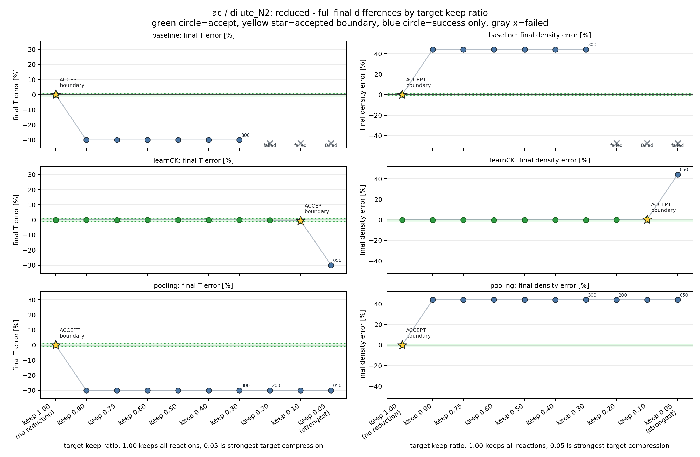

`ac/dilute_N2` では、learnCK だけが `ratio_100` まで緑の accept を維持する。`ratio_050` は Cantera 実行としては success だが、T が -30%、density が +44% まで外れるため accept ではない。baseline と pooling は、圧縮を始めると実行成功点はあっても青の success only になり、反応進行を保てていない。baseline の強圧縮側は failed であり、pooling の強圧縮側は成功しても0 reaction相当へ退化する。

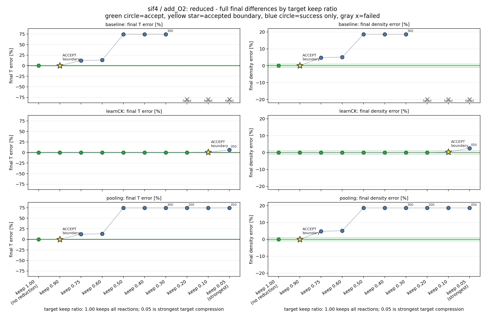

`sif4/add_O2` では、baseline と pooling は `ratio_900` までなら accept だが、それ以上の圧縮で差分が急増する。learnCK は `ratio_100` まで accept を維持し、`ratio_050` は success only に落ちる。つまり `ratio_050` は「計算できた」候補ではあるが、final T / density の基準からは採用しない。

### 7.5 グラフ3: 代表候補の Cantera 時間発展

次の図では、多数の差分線を重ねず、各手法について「採用境界」と「成功した最強圧縮」の2候補だけを示す。左列が1%基準を満たす最大圧縮、右列がCantera実行としては成功した最強圧縮である。黒線が full、破線が reduced で、2本が重なるほど時間発展を保てている。

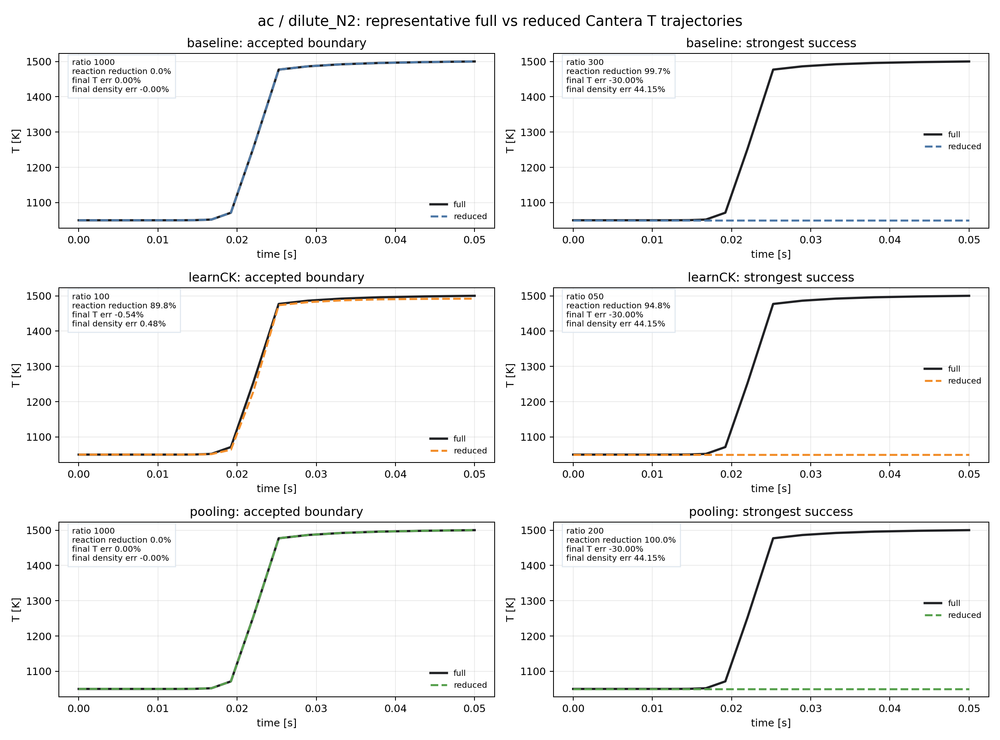

`ac/dilute_N2` では、full は約0.02 s以降で急激に加熱する。learnCK の採用境界 `ratio_100` は、この立ち上がりと最終温度をほぼ追っている。これに対して learnCK の `ratio_050`、baseline の強圧縮、pooling の強圧縮は、reduced 側が1050 K付近に張り付いたままで、反応進行を再現していない。したがって、このケースでは「さらに小さくできるか」ではなく「加熱イベントを残せるか」が採否の決定点である。

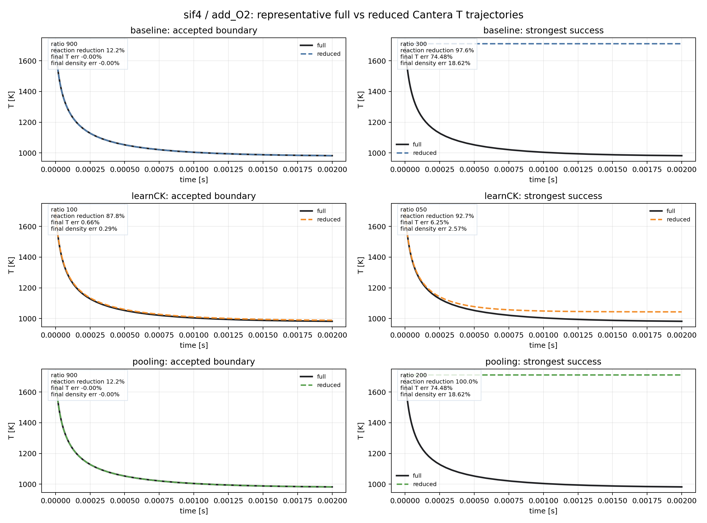

`sif4/add_O2` では、full は初期高温から短時間で冷却する。learnCK の `ratio_100` は冷却曲線をよく追うが、`ratio_050` では終盤の温度が高めに残る。baseline と pooling の最強圧縮では、冷却がほぼ消えて高温側に張り付くため、Canteraとしては成功しても物理的な時間発展は失われている。

### 7.6 グラフ4: 判断に必要な4状態ネットワーク

圧縮率をすべて並べた atlas は小さくなり、主張がぼやける。ここでは、判断に必要な4状態だけを大きく表示する。左上は基準 network、右上は採用した learnCK 境界、左下は learnCK をさらに削った状態、右下は pooling が0 reactionまで退化した状態である。network 図は「構造がどう削られたか」を見る図であり、採否は7.3の採否マップ、7.4の圧縮率別差分、7.5の代表時系列と合わせて決める。

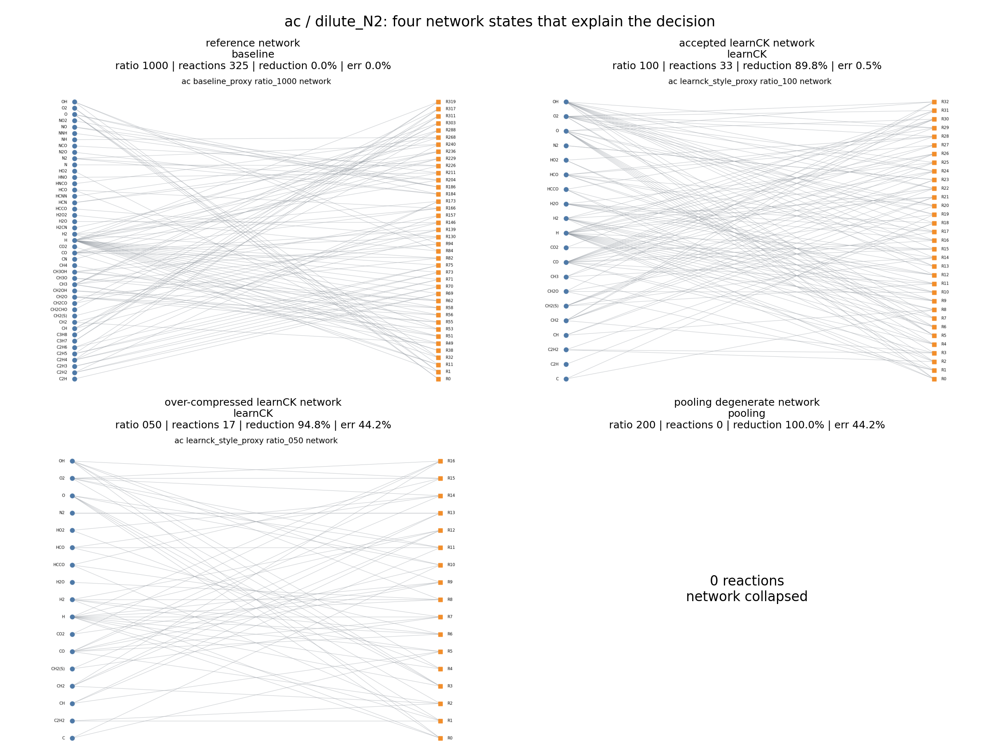

`ac/dilute_N2` では、learnCK `ratio_100` は 325 reactions から 33 reactions まで縮退しても誤差0.5%で時間発展を保つ。ところが `ratio_050` では 17 reactions まで削れて見た目はさらに小さいが、誤差44.2%となり加熱を失う。pooling は最強圧縮で0 reactionに落ち、network が小さいというより反応経路そのものが消えている。

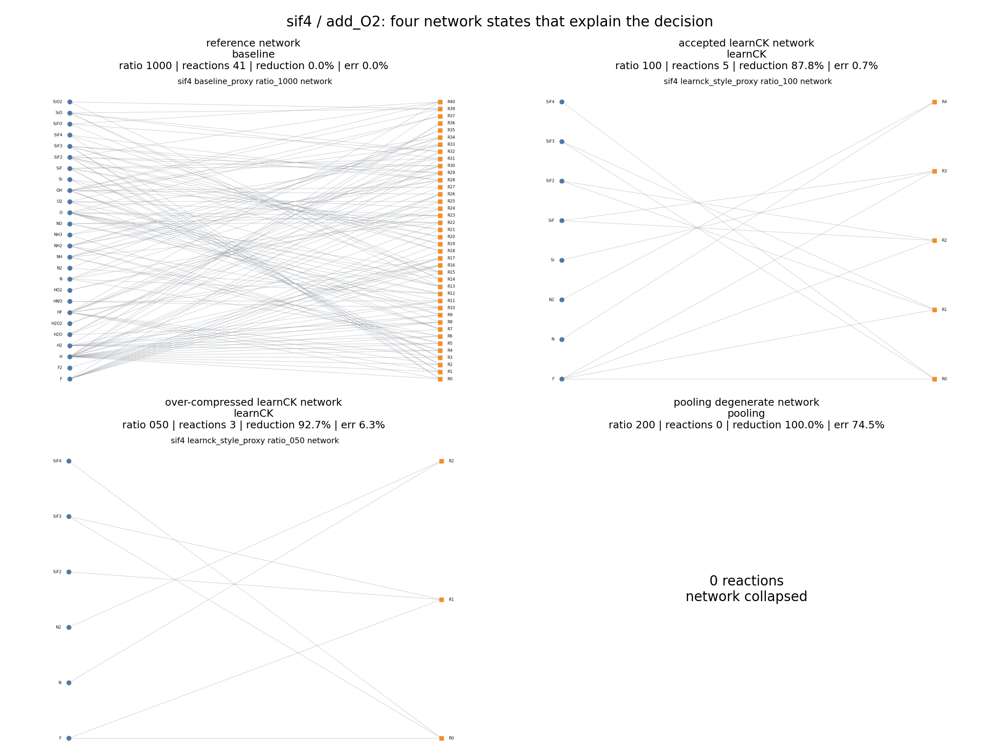

`sif4/add_O2` では、learnCK `ratio_100` は 41 reactions から 5 reactions まで縮退しても誤差0.7%で冷却履歴を保つ。`ratio_050` は 3 reactions まで削れているが誤差6.3%で、採用境界を越えている。pooling はこのケースでも0 reactionへ退化し、構造図だけではなく時間発展図でも不適である。

### 7.7 採用判断

この代替機構評価だけから採用候補を選ぶなら、Acetylene/N2 希釈条件と SiF4/O2 添加条件のどちらも learnCK の `ratio_100` が最も説明しやすい。理由は、約88–90%の reaction reduction を達成しながら、final T と density の誤差を1%以内に保ち、時間発展差分も大きく崩れないためである。

一方で、`ratio_050` はネットワークとしてはさらに小さいが、Acetylene 系では反応進行そのものを失い、SiF4 系でも5%基準を超える。保守的選択と pooling 型候補は、この2条件では強圧縮用の候補としては不適である。特に pooling 型候補は「Canteraで実行できる」ことと「反応機構として意味がある」ことが一致しない例になっている。

詳細な出力は [method compression sweep index](reports/eval53_method_compression_sweep_ac_sif4/index.md)、判断表は [method sweep decision summary](reports/eval53_method_compression_sweep_ac_sif4/report_assets/method_sweep_decision_summary.csv) に保存した。

## 8. 考察

### 8.1 総合解釈

本レポートの評価は、単一の「最良手法」を断定するものではない。対象 QoI、許容誤差、説明性、Cantera 実行可能性、圧縮率のどれを重視するかで、妥当な選択は変わる。第三者評価では、次のように読み分けるのが安全である。

| 判断軸 | 見る章 | 推奨される読み方 |
|---|---|---|
| trace ベースの安定性 | 5.3, 6章 | baseline は mandatory mean が小さく、解釈しやすい縮退候補として強い。 |
| 強い reaction reduction | 5.3, 6章 | learnCK++ と pooling は高圧縮候補を作れるが、独立 rerun で確認する必要がある。 |
| gas basis / density の危険信号 | 5.4 | `diamond/pooling` と `ac/learnckpp/dilute_N2` は正式 rerun 優先度が高い。 |
| 実時間発展の保持 | 7章 | 代替機構 sweep では learnCK `ratio_100` が2ケースで最も説明しやすい採用境界である。 |
| 第三者説明性 | 4章, 6章, 10章 | network、node map、success / accept 分離、artifact 台帳を合わせて確認する。 |

したがって、現時点の結論は「baseline は保守的で説明しやすい」「learnCK は高圧縮でも時間発展を保つ可能性が高い」「pooling は粗視化として有用だが、Cantera 実行可能機構として扱うには追加検証が必要」である。ただし元の大規模 full / reduced mechanism が復元されていないため、最終的な機構妥当性は正式 rerun 後に判断する。

### 8.2 品質重視なら Baseline

`baseline` は3つの評価対象すべてで、mandatory mean が最も小さい。特に Diamond CVD では 0.085、Acetylene 系 CVD では 0.115 であり、trace ベースの QoI 指標では最も安定している。reaction reduction は 47.3% から 60.0% に留まるが、第三者がネットワークを読むには最も解釈しやすい。

ただし、これは6章の保存済み `baseline` 評価に対する結論である。7章の保守的選択は、元の baseline 実装を完全復元したものではなく、Cantera実行可能性を優先した代替実装であるため、強圧縮側では早く崩れた。

### 8.3 圧縮重視なら LearnCK++ または Pooling

`learnckpp` と `pooling` は reaction 数または aggregate edge 数を大きく削る。`sif4` では 365→11、`ac/pooling` では 425→13 まで削減した。とくに `pooling` は cluster 数も強く削れるため、巨大機構の粗視化候補を作るには有効である。

一方で、マージ後ノードは複数 species を代表するため、ノード単体の物理的意味は広くなる。phase や site 種が混在する場合、単純な濃度・被覆率としての解釈は危険である。したがって、縮退後ネットワーク図だけではなく、必ず node map と併用する必要がある。

7章の代替機構 Cantera sweep では、learnCK は広い圧縮率で時間発展を保った一方、pooling 型候補は強圧縮で反応履歴を失いやすかった。この差は、projection-only の pooling 図を Cantera実行可能機構としてそのまま評価してはいけないことを示している。

### 8.4 マクロ診断の読み方

マクロ比較図では、temperature と pressure は before/after が重なる。これは縮退後の独立した Cantera 再積分結果が保存されておらず、trace の値を共通に使っているためである。

density は、縮退後ネットワークに含まれる gas species を用いて再正規化した理想気体密度である。したがって、これは「縮退後 gas basis で見た密度の整合性チェック」として読むのが適切である。

### 8.5 ネットワーク図から見える傾向

縮退前ネットワークは全評価対象で高密度であり、多数の状態が反応で結ばれている。縮退後は、baseline では密度を残した中規模ネットワーク、learnckpp では reaction が大きく間引かれた疎なネットワーク、pooling では少数の代表ノードに集約された粗いネットワークになる。

この差は、手法の思想をよく反映している。ただし、図の疎密は構造の読みやすさを示すものであり、縮退後 kinetics の正確さを直接示すものではない。

- baseline: 解釈性と安全性を優先
- learnckpp: reaction 数削減を優先
- pooling: species / state aggregation を優先

### 8.6 今後の改善点

保存済み可視化では、縮退後の独立した Cantera trajectory が保存されていない。今回、代替機構では Acetylene/N2 希釈条件と SiF4/O2 添加条件の baseline / learnCK / pooling 圧縮率 sweep を実行し、縮退数を変えたときの full/reduced 差を確認した。一方で、元の大規模詳細機構に対する正式な結論を出すには、Diamond CVD、SiF4 系 CVD、Acetylene 系 CVD の full mechanism と reduced mechanism を復元し、同一条件で再実行する必要がある。

また、pooling と learnckpp の縮退後 reaction は overall 再合成になりやすい。実務利用では、overall reaction に domain tag、元 reaction index、gas/surface/bulk の由来を保持すると、第三者がより解釈しやすくなる。

追加で優先すべき検証は次の通りである。

1. 元の full / reduced mechanism を復元し、代替機構ではなく正式な Cantera trajectory を保存する。
2. Diamond CVD では surface coverage と deposition proxy を含め、full / reduced を同一時間軸で比較する。
3. `pooling` も Cantera 実行可能な代替機構と projection-only 図を分け、縮退率 sweep を行う。
4. 元素保存、site balance、phase crossing、charge、thermo data、rate law の参照先を reaction ごとに検査する。
5. `learnckpp` の score が学習モデル由来なら、学習データ、特徴量、loss、validation split、seed をレポートに残す。heuristic / surrogate なら、そのように明示する。
6. mandatory / optional QoI の一覧、閾値、pass rate の分母、epsilon を付録に固定する。

## 9. 参考文献

| ID | 文献・資料 | 本レポートでの使い方 |
|---|---|---|
| R1 | Cantera Developers, [Cantera: An object-oriented software toolkit for chemical kinetics, thermodynamics, and transport processes](https://cantera.org/) | Cantera の位置づけ、kinetics / thermodynamics / transport の統合ツールとしての説明。 |
| R2 | R. J. Kee et al., [CHEMKIN Collection, Release 3.6](https://www.osti.gov/biblio/481621) | CHEMKIN が reactor、gas/surface/plasma chemistry、感度解析を含む化学反応計算基盤であることの説明。 |
| R3 | A. Sherman, [Modeling of CVD reactors](https://link.springer.com/article/10.1007/BF02652128), Journal of Electronic Materials, 1987. | CVD reactor modeling が実験依存を下げ、反応性ガス流れと表面反応を扱う背景。 |
| R4 | C. Bernard et al., [Modelling of chemical vapour deposition processes](https://www.sciencedirect.com/science/article/abs/pii/092583889190274E), Journal of Alloys and Compounds, 1991. | CVD モデリングにおける熱力学・速度論・輸送データの重要性。 |
| R5 | M. K. Gobbert and C. A. Ringhofer, [An asymptotic analysis for a model of chemical vapor deposition on a microstructured surface](https://epubs.siam.org/doi/10.1137/S0036139997328713), SIAM Journal on Applied Mathematics, 1998. | CVD で surface reaction と transport が結合する背景。 |
| R6 | K. E. Niemeyer, C.-J. Sung, and M. P. Raju, [Skeletal mechanism generation for surrogate fuels using directed relation graph with error propagation and sensitivity analysis](https://doi.org/10.1016/j.combustflame.2009.12.022), Combustion and Flame, 2010. | DRGEP / 感度解析による従来型 mechanism reduction の代表例。 |
| R7 | T. Lu and C. K. Law, [Toward accommodating realistic fuel chemistry in large-scale computations](https://doi.org/10.1016/j.pecs.2008.10.002), Progress in Energy and Combustion Science, 2009. | 詳細反応機構を大規模計算へ組み込む際の機構縮退・簡略化の背景。 |
| R8 | S. B. Pope, [Computationally efficient implementation of combustion chemistry using in situ adaptive tabulation](https://doi.org/10.1080/00102209708935688), Combustion Theory and Modelling, 1997. | 詳細化学計算の高コスト性と、CFD での加速手法が必要になる背景。 |

## 10. 付録

### 10.1 Appendix の役割と前提

本 Appendix は、本文の技術説明を繰り返す章ではなく、第三者がコード資産としての意味を評価するための整理である。ここでは、確認できた事実、合理的な技術的推定、今後専門家判断が必要な事項を分ける。

| 区分 | 扱う内容 | 注意 |
|---|---|---|
| 確認できた事実 | リポジトリ内の実装、設定、テスト、生成済み report asset、本文で示した評価結果 | 現 checkout に存在するファイルと出力を根拠にする。 |
| 技術的推定 | 必要スキル、再実装難度、レビュー工数、外部委託時の難しさ | 具体的な契約費用や市場単価は含めない。 |
| 要専門家確認 | 新規性、権利化可能性、事業価値、正式な機構妥当性 | 特許・契約・事業評価は別途専門家判断が必要である。 |

### 10.2 本コードで作られている資産

| 資産区分 | 内容 | 第三者評価での意味 |
|---|---|---|
| 課題設定資産 | 詳細反応機構、縮退、QoI、保存済み出力、代替機構 rerun の役割分担 | 単なる可視化ではなく、採否判断の問題設定が整理されている。 |
| 理論・方式設計 | stoichiometry、graph projection、reaction keep mask、cluster mapping、QoI 誤差、success / accept 分離 | 化学系シミュレーションとデータ評価の両方から説明できる。 |
| 実装資産 | `src/rxn_platform` の backend、tasks、graphs、features、reduction、viz、CLI | pipeline と artifact を中心に、複数カテゴリの処理が実装されている。 |
| 検証資産 | `tests`、smoke / subset 評価、Cantera rerun 出力、diagnostic CSV | 動くだけでなく、失敗・再利用・採否を確認する基盤がある。 |
| 設定資産 | `configs` の pipeline / task 設定 | 条件・task・評価を再実行可能な単位へ分離している。 |
| 説明資料資産 | `report.md`、`report.html`、各種 `reports/*/index.md`、図、CSV | 第三者が結果を追跡できる説明物が揃っている。 |

### 10.3 コード構成と規模

生成物、cache、`reports/` の図・CSVを除いた概算は次の通りである。行数は価値そのものではなく、レビュー・再実装・保守対象の規模を把握するための目安である。

| 対象 | ファイル数 | 概算行数 | 主な役割 |
|---|---:|---:|---|
| `src/` | 43 | 47,084 | 本体実装。backend、task、graph、feature、reduction、viz、CLI を含む。 |
| `tests/` | 84 | 7,284 | dummy backend、artifact、graph、feature、observables、temporal flux などの検証。 |
| `tools/` | 12 | 4,642 | report asset 生成、diagnostic plot、代替機構 asset、評価 runner。 |
| `configs/` | 82 | 6,158 | Hydra / pipeline / task 設定。 |
| `docs/` | 13 | 792 | invariant、artifact contract、config、testing、repo map などの運用契約。 |

特に `src/rxn_platform/tasks/reduction.py`、`tasks/viz.py`、`tasks/features.py`、`tasks/graphs.py` は大きく、縮退・可視化・特徴量・グラフ構築の主要な複雑性が集中している。今後の保守では、これらを単に行数で評価するのではなく、artifact contract、入出力、失敗時挙動、Cantera optional dependency の扱いを中心にレビューする必要がある。

### 10.4 単純外注が難しい理由

この資産は、仕様書どおりに画面や関数を実装するタイプの単純外注とは異なる。理由は次の通りである。

| 難しさ | 内容 |
|---|---|
| ドメイン理解 | Cantera、reaction mechanism、surface chemistry、stoichiometry、ROP、production rate、QoI を理解する必要がある。 |
| 問題設定 | 「小さくする」だけでなく、どこまでが success で、どこから accept かを定義する必要がある。 |
| 評価設計 | 保存済み出力、trace 診断、density basis、independent rerun、代替機構評価 / 正式評価を分ける必要がある。 |
| 実装設計 | pipeline、artifact、task、backend、cache、optional Cantera、plot asset を破綻なく接続する必要がある。 |
| 第三者説明性 | 図、CSV、node map、summary table、限界の明記まで含めて評価可能にする必要がある。 |

したがって、外注・社内開発・共同開発のいずれでも、実装工数だけでなく、課題理解、要件整理、手法調査、レビュー、検証、説明資料化の工数が発生する。

### 10.5 検証に必要な観点

| 観点 | 確認すること | 本レポートでの対応 |
|---|---|---|
| コード健全性 | cache、artifact reuse、fallback、optional dependency の扱い | 既存実装修正と関連テストで一部確認済み。 |
| 入出力妥当性 | full/reduced mechanism、condition CSV、trajectory、summary CSV | 入力不足時は missing input として扱い、fake fallback を避ける方針。 |
| テスト・fixture | 最小テスト、smoke、Cantera optional skip | 過剰なテスト追加ではなく、リスク箇所に絞る方針。 |
| 実データ接続 | 元の大規模 mechanism と reduced mechanism の復元 | 現時点の最大課題。代替機構評価と正式評価を分けている。 |
| 採用・棄却判断 | success、accept、failed、accepted boundary | 7章で明示し、図にも反映した。 |
| 第三者説明性 | 図、node map、decision table、limitations | 本 report と各 index / CSV で追跡可能にした。 |

### 10.6 開発・保守に必要なスキル

| 作業 | 必要スキル | 難易度 |
|---|---|---|
| Cantera backend / reactor 実装 | Python、Cantera、熱力学、反応速度論 | 高 |
| 反応ネットワーク / temporal flux graph | graph theory、stoichiometry、rate of progress | 高 |
| LearnCK / feature / GNN 系処理 | データサイエンス、特徴量設計、ML評価 | 中-高 |
| reduction / pooling | 機構縮退、クラスタリング、物理制約 | 高 |
| artifact / pipeline / cache | ソフトウェアアーキテクチャ、Hydra、再現性設計 | 中-高 |
| visualization / report asset | 可視化設計、matplotlib、第三者説明 | 中 |
| tests / QA | pytest、fixture、optional dependency、smoke設計 | 中 |

### 10.7 評価メタ情報と関連ファイル

評価メタ情報:

- 評価セット: 表面反応・気相反応を含む大規模3ケース
- 手法: `baseline`, `learnckpp`, `pooling`
- 比較図: network before/after、macro diagnostic before/after
- macro diagnostic の制約: reduced 側の T/P は独立再積分ではなく full trace と同一値
- density 診断: reduced 側 gas basis で mole fraction を再正規化して理想気体式で計算
- 未実施: 元の reduced mechanism の独立 Cantera trajectory 保存、solver stability 比較、rate law / thermo / site balance の反応単位レポート
- 代替機構で実施: Acetylene/N2 希釈条件と SiF4/O2 添加条件の baseline / learnCK / pooling 圧縮率 sweep、Diamond 表面反応の縮退前 full trajectory 図

評価run整理:

| group | 現在の扱い | レポートでの使い方 |
|---|---|---|
| 保存済み network figures | 9 run x before/after が揃った保存済み出力 | 構造比較に使用 |
| 保存済み macro diagnostics | 9 run の PNG/SVG/CSV と条件別CSVが揃った保存済み出力 | trace ベース密度診断として使用 |
| density diagnostic plots | `macro_compare_all.csv` から再集計した派生図 | 条件別の読みやすさ補助 |
| end-to-end rerun | source summary JSON、reduced YAML、trajectory artifact が欠落 | 独立Cantera検証としては使わない |
| full time evolution 代替評価 | 縮退前 full trajectory 図を生成済み | 5.2 の時間発展説明に使用 |
| method sweep 代替評価 | baseline / learnCK / pooling の圧縮率別 full/reduced Cantera 再実行を完了 | 7章の縮退効果評価に使用 |
| formal rerun 入口 | 入力資産チェックと代替機構評価入口を実装済み | 元資産復元後の正式再評価入口 |

過去生成の文字化けした構造図索引は、混乱を避けるためクリーンな索引へ置き換えた。詳細な台帳は [evaluation run inventory](reports/evaluation_run_inventory.md) に整理した。

`pooling` / `learnCK` の縮退効果別 Cantera 再評価入口として、[formal rerun runner](tools/run_eval53_large_reduction_effects.py) を追加した。元の大規模詳細機構は現checkoutに残っていないため、既存の保存済み図を独立再実行結果としては扱わない。

`baseline` / `learnCK` / `pooling` の圧縮率 sweep として、Acetylene/N2 希釈条件と SiF4/O2 添加条件を指定して Cantera 再実行を行った。実行可能にするため、acetylene 条件用のローカル gas 代替機構と SiF4/NH3/O2 の constant-cp gas 代替機構を生成した。したがって、これは「元の大規模機構の復元」ではなく、圧縮率別の評価・ネットワーク図・時系列比較を回すための透明な代替評価である。

生成スクリプト:

- [network graph generator](tools/generate_simple_network_graphs.py)
- [macro compare generator](tools/generate_macro_compare_plots.py)
- [diagnostic plot generator](tools/generate_eval53_diagnostic_plots.py)
- [alternative mechanism asset generator](tools/generate_eval53_proxy_assets.py)
- [full time evolution plot generator](tools/generate_eval53_full_time_evolution_plots.py)
- [method sweep report asset generator](tools/generate_eval53_method_sweep_report_assets.py)
- [formal rerun runner](tools/run_eval53_large_reduction_effects.py)

