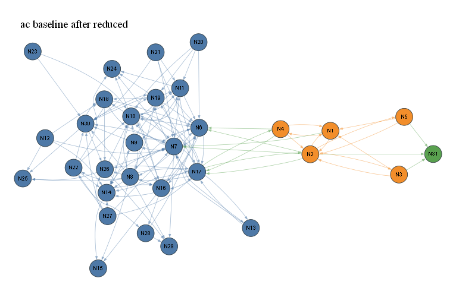

# ac baseline after reduced

- summary nodes: 33
- summary reactions: 170
- drawn nodes: 31
- drawn edges: 138
- colors: gas=blue, surface=orange, bulk/mixed=green

## N1 (orange)

Names: 8 merged: X_T(s), H_T(s), X_S(s), H_S(s), X_K(s), H_K(s), X_D(s), H_D(s)

Reactions:
- R328, 352, 353, 378, 403: C2H2 + X_T(s) => C2H2_T(s) | CH4 + X_S(s) => CH3_S(s) + H | C2H2 + X_S(s) => C2H2_S(s) | C2H2 + X_K(s) => C2H2_K(s) | C2H2 + X_D(s) => C2H2_D(s)
- R333, 346, 347, 349, 357, 358, 374, 382, 396, 397, 399, 407: CH3_T(s) + H_T(s) => CH4 + 2 X_T(s) | CH_T(s) => C_bulk + H + X_T(s) | CH2_T(s) => C_bulk + H2 + X_T(s) | C2H2_T(s) => 2 C_bulk + H2 + X_T(s) | C2H2_S(s) => C2H2 + X_S(s) | CH3_S(s) + H_S(s) => CH4 + 2 X_S(s)
- R329, 354, 379, 404: C2H4 + X_T(s) => C2H4_T(s) | C2H4 + X_S(s) => C2H4_S(s) | C2H4 + X_K(s) => C2H4_K(s) | C2H4 + X_D(s) => C2H4_D(s)
- R331, 356, 381, 406: C2H4_T(s) => C2H4 + X_T(s) | C2H4_S(s) => C2H4 + X_S(s) | C2H4_K(s) => C2H4 + X_K(s) | C2H4_D(s) => C2H4 + X_D(s)
- R348, 423: C2_T(s) => 2 C_bulk + X_T(s) | C2_D(s) => 2 C_bulk + X_D(s)
- R352: CH4 + X_S(s) => CH3_S(s) + H
- R420: C_D(s) => C_bulk + X_D(s)

## N2 (orange)

Names: 20 merged: CH3_T(s), CH2_T(s), CH_T(s), C2H2_T(s), C2H_T(s), CH3_S(s), CH2_S(s), CH_S(s), C2H2_S(s), C2H_S(s), CH3_K(s), CH2_K(s), CH_K(s), C2H2_K(s), C2H_K(s), CH3_D(s), CH2_D(s), CH_D(s), C2H2_D(s), C2H_D(s)

Reactions:
- R328, 352, 353, 378, 403: C2H2 + X_T(s) => C2H2_T(s) | CH4 + X_S(s) => CH3_S(s) + H | C2H2 + X_S(s) => C2H2_S(s) | C2H2 + X_K(s) => C2H2_K(s) | C2H2 + X_D(s) => C2H2_D(s)
- R333, 346, 347, 349, 357, 358, 374, 382, 396, 397, 399, 407: CH3_T(s) + H_T(s) => CH4 + 2 X_T(s) | CH_T(s) => C_bulk + H + X_T(s) | CH2_T(s) => C_bulk + H2 + X_T(s) | C2H2_T(s) => 2 C_bulk + H2 + X_T(s) | C2H2_S(s) => C2H2 + X_S(s) | CH3_S(s) + H_S(s) => CH4 + 2 X_S(s)
- R346, 347, 349, 374, 396, 397, 399, 424: CH_T(s) => C_bulk + H + X_T(s) | CH2_T(s) => C_bulk + H2 + X_T(s) | C2H2_T(s) => 2 C_bulk + H2 + X_T(s) | C2H2_S(s) => 2 C_bulk + H2 + X_S(s) | CH_K(s) => C_bulk + H + X_K(s) | CH2_K(s) => C_bulk + H2 + X_K(s)
- R347, 349, 374, 397, 399, 424: CH2_T(s) => C_bulk + H2 + X_T(s) | C2H2_T(s) => 2 C_bulk + H2 + X_T(s) | C2H2_S(s) => 2 C_bulk + H2 + X_S(s) | CH2_K(s) => C_bulk + H2 + X_K(s) | C2H2_K(s) => 2 C_bulk + H2 + X_K(s) | C2H2_D(s) => 2 C_bulk + H2 + X_D(s)
- R333, 357, 358, 382, 407, 408: CH3_T(s) + H_T(s) => CH4 + 2 X_T(s) | C2H2_S(s) => C2H2 + X_S(s) | CH3_S(s) + H_S(s) => CH4 + 2 X_S(s) | C2H2_K(s) => C2H2 + X_K(s) | C2H2_D(s) => C2H2 + X_D(s) | CH3_D(s) + H_D(s) => CH4 + 2 X_D(s)
- R341, 416: C2H_T(s) + X_T(s) => C2_T(s) + H_T(s) | C2H_D(s) + X_D(s) => C2_D(s) + H_D(s)
- R369, 394: C2H4_S(s) => C2H2_S(s) + H2 | C2H4_K(s) => C2H2_K(s) + H2
- R368, 418: C2_S(s) + H_S(s) => C2H_S(s) + X_S(s) | C2_D(s) + H_D(s) => C2H_D(s) + X_D(s)
- R346, 396: CH_T(s) => C_bulk + H + X_T(s) | CH_K(s) => C_bulk + H + X_K(s)
- R336, 361, 386, 411: CH_T(s) + X_T(s) => C_T(s) + H_T(s) | CH_S(s) + X_S(s) => C_S(s) + H_S(s) | CH_K(s) + X_K(s) => C_K(s) + H_K(s) | CH_D(s) + X_D(s) => C_D(s) + H_D(s)
- R339: C_T(s) + H_T(s) => CH_T(s) + X_T(s)

## N3 (orange)

Names: 4 merged: C_T(s), C_S(s), C_K(s), C_D(s)

Reactions:
- R336, 361, 386, 411: CH_T(s) + X_T(s) => C_T(s) + H_T(s) | CH_S(s) + X_S(s) => C_S(s) + H_S(s) | CH_K(s) + X_K(s) => C_K(s) + H_K(s) | CH_D(s) + X_D(s) => C_D(s) + H_D(s)
- R420: C_D(s) => C_bulk + X_D(s)
- R339: C_T(s) + H_T(s) => CH_T(s) + X_T(s)

## N4 (orange)

Names: 4 merged: C2H4_T(s), C2H4_S(s), C2H4_K(s), C2H4_D(s)

Reactions:
- R329, 354, 379, 404: C2H4 + X_T(s) => C2H4_T(s) | C2H4 + X_S(s) => C2H4_S(s) | C2H4 + X_K(s) => C2H4_K(s) | C2H4 + X_D(s) => C2H4_D(s)
- R331, 356, 381, 406: C2H4_T(s) => C2H4 + X_T(s) | C2H4_S(s) => C2H4 + X_S(s) | C2H4_K(s) => C2H4 + X_K(s) | C2H4_D(s) => C2H4 + X_D(s)
- R369, 394: C2H4_S(s) => C2H2_S(s) + H2 | C2H4_K(s) => C2H2_K(s) + H2

## N5 (orange)

Names: 4 merged: C2_T(s), C2_S(s), C2_K(s), C2_D(s)

Reactions:
- R341, 416: C2H_T(s) + X_T(s) => C2_T(s) + H_T(s) | C2H_D(s) + X_D(s) => C2_D(s) + H_D(s)
- R348, 423: C2_T(s) => 2 C_bulk + X_T(s) | C2_D(s) => 2 C_bulk + X_D(s)
- R368, 418: C2_S(s) + H_S(s) => C2H_S(s) + X_S(s) | C2_D(s) + H_D(s) => C2H_D(s) + X_D(s)

## N6 (blue)

Names: H2

Reactions:
- R347, 349, 374, 397, 399, 424: CH2_T(s) => C_bulk + H2 + X_T(s) | C2H2_T(s) => 2 C_bulk + H2 + X_T(s) | C2H2_S(s) => 2 C_bulk + H2 + X_S(s) | CH2_K(s) => C_bulk + H2 + X_K(s) | C2H2_K(s) => 2 C_bulk + H2 + X_K(s) | C2H2_D(s) => 2 C_bulk + H2 + X_D(s)
- R369, 394: C2H4_S(s) => C2H2_S(s) + H2 | C2H4_K(s) => C2H2_K(s) + H2
- R40, 41, 44, 46, 50, 52, 57, 67, 74, 79, 201, 208: 2 H + H2O <=> H2 + H2O | 2 H + CO2 <=> H2 + CO2 | H + HO2 <=> H2 + O2 | H + H2O2 <=> H2 + HO2 | CH2(S) + H <=> CH + H2 | CH4 + H <=> CH3 + H2
- R125, 135, 171: CH + H2 <=> CH2 + H | CH2 + H2 <=> CH3 + H | C2H + H2 <=> C2H2 + H
- R125: CH + H2 <=> CH2 + H
- R208: H + NNH <=> H2 + N2
- R7, 50, 275, 287, 292: CH2(S) + O <=> CO + H2 | CH2(S) + H <=> CH + H2 | CH3 + N <=> H2 + HCN | CH3 + OH => CH2O + H2 | CH2(S) + H2O => CH2O + H2
- R287: CH3 + OH => CH2O + H2
- R299: CH3CHO + H => CH3 + CO + H2
- R201: H + NH2 <=> H2 + NH
- R82: CO + H2 (+M) <=> CH2O (+M)
- R44, 196, 292: H + HO2 <=> H2 + O2 | H2O + NH <=> H2 + HNO | CH2(S) + H2O => CH2O + H2
- R7: CH2(S) + O <=> CO + H2
- R275: CH3 + N <=> H2 + HCN
- R196: H2O + NH <=> H2 + HNO
- R265: H + HNCO <=> H2 + NCO

## N7 (blue)

Names: H

Reactions:
- R40, 41, 44, 46, 50, 52, 57, 67, 74, 79, 201, 208: 2 H + H2O <=> H2 + H2O | 2 H + CO2 <=> H2 + CO2 | H + HO2 <=> H2 + O2 | H + H2O2 <=> H2 + HO2 | CH2(S) + H <=> CH + H2 | CH4 + H <=> CH3 + H2
- R6, 23, 91, 93, 106, 107, 134, 148, 158, 284, 285, 291: CH2 + O <=> H + HCO | C2H3 + O <=> CH2CO + H | CH2 + OH <=> CH2O + H | CH2(S) + OH <=> CH2O + H | C2H2 + OH <=> CH2CO + H | C2H2 + OH <=> H + HCCOH
- R352: CH4 + X_S(s) => CH3_S(s) + H
- R346, 396: CH_T(s) => C_bulk + H + X_T(s) | CH_K(s) => C_bulk + H + X_K(s)
- R125, 135, 171: CH + H2 <=> CH2 + H | CH2 + H2 <=> CH3 + H | C2H + H2 <=> C2H2 + H
- R125, 127, 129, 132: CH + H2 <=> CH2 + H | CH + CH2 <=> C2H2 + H | CH + CH4 <=> C2H4 + H | CH + CH2O <=> CH2CO + H
- R203, 204: NNH <=> H + N2 | NNH + M <=> H + N2 + M
- R182, 208, 260: H + N2O <=> N2 + OH | H + NNH <=> H2 + N2 | H + HCNN <=> CH2 + N2
- R89, 91, 93, 106, 107, 191: C + OH <=> CO + H | CH2 + OH <=> CH2O + H | CH2(S) + OH <=> CH2O + H | C2H2 + OH <=> CH2CO + H | C2H2 + OH <=> H + HCCOH | NH + OH <=> H + HNO
- R6, 23, 230, 256, 284, 285: CH2 + O <=> H + HCO | C2H3 + O <=> CH2CO + H | HCN + O <=> H + NCO | HCNN + O <=> CO + H + N2 | C2H4 + O <=> CH2CHO + H | C2H5 + O <=> CH3CHO + H
- R50: CH2(S) + H <=> CH + H2
- R60, 66, 260, 299, 307: CH2OH + H <=> CH3 + OH | CH3O + H <=> CH2(S) + H2O | H + HCNN <=> CH2 + N2 | CH3CHO + H => CH3 + CO + H2 | CH2CHO + H <=> CH3 + HCO
- R1, 37, 47, 60, 182: H + O + M <=> OH + M | H + O2 <=> O + OH | H + H2O2 <=> H2O + OH | CH2OH + H <=> CH3 + OH | H + N2O <=> N2 + OH
- R299: CH3CHO + H => CH3 + CO + H2
- R201: H + NH2 <=> H2 + NH
- R37, 43: H + O2 <=> O + OH | H + HO2 <=> H2O + O
- R66: CH3O + H <=> CH2(S) + H2O
- R44: H + HO2 <=> H2 + O2
- R191, 195: NH + OH <=> H + HNO | N + NH <=> H + N2
- R195: N + NH <=> H + N2
- R211: H + NO + M <=> HNO + M
- R265: H + HNCO <=> H2 + NCO
- R256: HCNN + O <=> CO + H + N2
- R89: C + OH <=> CO + H
- R134: CH2 + O2 => CO + H + OH
- R230: HCN + O <=> H + NCO

## N8 (blue)

Names: O

Reactions:
- R1, 10, 12, 15, 199, 232, 278, 295, 296: H + O + M <=> OH + M | CH4 + O <=> CH3 + OH | HCO + O <=> CO + OH | CH2OH + O <=> CH2O + OH | NH2 + O <=> NH + OH | HCN + O <=> CN + OH
- R6, 23, 24, 284, 285: CH2 + O <=> H + HCO | C2H3 + O <=> CH2CO + H | C2H4 + O <=> CH3 + HCO | C2H4 + O <=> CH2CHO + H | C2H5 + O <=> CH3CHO + H
- R6, 23, 230, 256, 284, 285: CH2 + O <=> H + HCO | C2H3 + O <=> CH2CO + H | HCN + O <=> H + NCO | HCNN + O <=> CO + H + N2 | C2H4 + O <=> CH2CHO + H | C2H5 + O <=> CH3CHO + H
- R11, 29: CO + O (+M) <=> CO2 (+M) | CH2CO + O <=> CH2 + CO2
- R29, 296: CH2CO + O <=> CH2 + CO2 | CH3CHO + O => CH3 + CO + OH
- R37, 293: H + O2 <=> O + OH | C2H3 + O2 <=> CH2CHO + O
- R37, 43: H + O2 <=> O + OH | H + HO2 <=> H2O + O
- R7, 12, 256, 296: CH2(S) + O <=> CO + H2 | HCO + O <=> CO + OH | HCNN + O <=> CO + H + N2 | CH3CHO + O => CH3 + CO + OH
- R7: CH2(S) + O <=> CO + H2
- R0: 2 O + M <=> O2 + M
- R293: C2H3 + O2 <=> CH2CHO + O
- R256: HCNN + O <=> CO + H + N2
- R257: HCNN + O <=> HCN + NO
- R230: HCN + O <=> H + NCO
- R199: NH2 + O <=> NH + OH
- R232: HCN + O <=> CN + OH

## N9 (blue)

Names: O2

Reactions:
- R37, 293: H + O2 <=> O + OH | C2H3 + O2 <=> CH2CHO + O
- R37, 134: H + O2 <=> O + OH | CH2 + O2 => CO + H + OH
- R44: H + HO2 <=> H2 + O2
- R0: 2 O + M <=> O2 + M
- R293: C2H3 + O2 <=> CH2CHO + O
- R205, 294: NNH + O2 <=> HO2 + N2 | C2H3 + O2 <=> C2H2 + HO2
- R134: CH2 + O2 => CO + H + OH
- R205: NNH + O2 <=> HO2 + N2

## N10 (blue)

Names: OH

Reactions:
- R1, 10, 12, 15, 199, 232, 278, 295, 296: H + O + M <=> OH + M | CH4 + O <=> CH3 + OH | HCO + O <=> CO + OH | CH2OH + O <=> CH2O + OH | NH2 + O <=> NH + OH | HCN + O <=> CN + OH
- R95, 97, 102, 103, 110, 111, 192, 202, 300: CH3 + OH <=> CH2 + H2O | CH4 + OH <=> CH3 + H2O | CH3O + OH <=> CH2O + H2O | CH3OH + OH <=> CH2OH + H2O | C2H3 + OH <=> C2H2 + H2O | C2H4 + OH <=> C2H3 + H2O
- R91, 93, 94, 106, 107, 287, 321: CH2 + OH <=> CH2O + H | CH2(S) + OH <=> CH2O + H | CH3 + OH (+M) <=> CH3OH (+M) | C2H2 + OH <=> CH2CO + H | C2H2 + OH <=> H + HCCOH | CH3 + OH => CH2O + H2
- R89, 91, 93, 106, 107, 191: C + OH <=> CO + H | CH2 + OH <=> CH2O + H | CH2(S) + OH <=> CH2O + H | C2H2 + OH <=> CH2CO + H | C2H2 + OH <=> H + HCCOH | NH + OH <=> H + HNO
- R287: CH3 + OH => CH2O + H2
- R1, 37, 47, 60, 182: H + O + M <=> OH + M | H + O2 <=> O + OH | H + H2O2 <=> H2O + OH | CH2OH + H <=> CH3 + OH | H + N2O <=> N2 + OH
- R12, 60, 296: HCO + O <=> CO + OH | CH2OH + H <=> CH3 + OH | CH3CHO + O => CH3 + CO + OH
- R37, 134: H + O2 <=> O + OH | CH2 + O2 => CO + H + OH
- R182: H + N2O <=> N2 + OH
- R197: NH + NO <=> N2 + OH
- R89, 300: C + OH <=> CO + H | CH3CHO + OH => CH3 + CO + H2O
- R300: CH3CHO + OH => CH3 + CO + H2O
- R118, 134: CH3 + HO2 <=> CH3O + OH | CH2 + O2 => CO + H + OH
- R118: CH3 + HO2 <=> CH3O + OH
- R191: NH + OH <=> H + HNO
- R192: NH + OH <=> H2O + N
- R199: NH2 + O <=> NH + OH
- R202: NH2 + OH <=> H2O + NH
- R232: HCN + O <=> CN + OH

## N11 (blue)

Names: 3 merged: H2O, HO2, H2O2

Reactions:
- R95, 97, 102, 103, 110, 111, 192, 202, 300: CH3 + OH <=> CH2 + H2O | CH4 + OH <=> CH3 + H2O | CH3O + OH <=> CH2O + H2O | CH3OH + OH <=> CH2OH + H2O | C2H3 + OH <=> C2H2 + H2O | C2H4 + OH <=> C2H3 + H2O
- R118, 146, 292: CH3 + HO2 <=> CH3O + OH | CH2(S) + H2O (+M) <=> CH3OH (+M) | CH2(S) + H2O => CH2O + H2
- R44, 196, 292: H + HO2 <=> H2 + O2 | H2O + NH <=> H2 + HNO | CH2(S) + H2O => CH2O + H2
- R66, 300: CH3O + H <=> CH2(S) + H2O | CH3CHO + OH => CH3 + CO + H2O
- R66: CH3O + H <=> CH2(S) + H2O
- R44: H + HO2 <=> H2 + O2
- R196: H2O + NH <=> H2 + HNO
- R205, 294: NNH + O2 <=> HO2 + N2 | C2H3 + O2 <=> C2H2 + HO2
- R118: CH3 + HO2 <=> CH3O + OH
- R192: NH + OH <=> H2O + N
- R205: NNH + O2 <=> HO2 + N2
- R202: NH2 + OH <=> H2O + NH

## N12 (blue)

Names: C

Reactions:
- R238: C + N2 <=> CN + N
- R89: C + OH <=> CO + H

## N13 (blue)

Names: CH

Reactions:
- R125, 127, 129, 132: CH + H2 <=> CH2 + H | CH + CH2 <=> C2H2 + H | CH + CH4 <=> C2H4 + H | CH + CH2O <=> CH2CO + H
- R125: CH + H2 <=> CH2 + H
- R50: CH2(S) + H <=> CH + H2

## N14 (blue)

Names: CO

Reactions:
- R12, 140, 176, 273, 296, 299, 300: HCO + O <=> CO + OH | CH2 + HCCO <=> C2H3 + CO | 2 HCCO <=> C2H2 + 2 CO | HCCO + NO <=> CO + HCNO | CH3CHO + O => CH3 + CO + OH | CH3CHO + H => CH3 + CO + H2
- R299: CH3CHO + H => CH3 + CO + H2
- R82: CO + H2 (+M) <=> CH2O (+M)
- R7, 12, 256, 296: CH2(S) + O <=> CO + H2 | HCO + O <=> CO + OH | HCNN + O <=> CO + H + N2 | CH3CHO + O => CH3 + CO + OH
- R7, 134: CH2(S) + O <=> CO + H2 | CH2 + O2 => CO + H + OH
- R11: CO + O (+M) <=> CO2 (+M)
- R89, 300: C + OH <=> CO + H | CH3CHO + OH => CH3 + CO + H2O
- R256: HCNN + O <=> CO + H + N2
- R89: C + OH <=> CO + H
- R273: HCCO + NO <=> CO + HCNO
- R134: CH2 + O2 => CO + H + OH

## N15 (blue)

Names: CO2

Reactions:
- R11, 29: CO + O (+M) <=> CO2 (+M) | CH2CO + O <=> CH2 + CO2
- R29: CH2CO + O <=> CH2 + CO2
- R11: CO + O (+M) <=> CO2 (+M)

## N16 (blue)

Names: 10 merged: HCO, CH2O, CH2OH, CH3O, CH3OH, HCCO, CH2CO, HCCOH, CH2CHO, CH3CHO

Reactions:
- R6, 23, 91, 93, 94, 106, 107, 118, 146, 284, 285, 287: CH2 + O <=> H + HCO | C2H3 + O <=> CH2CO + H | CH2 + OH <=> CH2O + H | CH2(S) + OH <=> CH2O + H | CH3 + OH (+M) <=> CH3OH (+M) | C2H2 + OH <=> CH2CO + H
- R91, 93, 94, 106, 107, 287, 321: CH2 + OH <=> CH2O + H | CH2(S) + OH <=> CH2O + H | CH3 + OH (+M) <=> CH3OH (+M) | C2H2 + OH <=> CH2CO + H | C2H2 + OH <=> H + HCCOH | CH3 + OH => CH2O + H2
- R6, 23, 24, 284, 285: CH2 + O <=> H + HCO | C2H3 + O <=> CH2CO + H | C2H4 + O <=> CH3 + HCO | C2H4 + O <=> CH2CHO + H | C2H5 + O <=> CH3CHO + H
- R29, 60, 66, 176, 296, 299, 300: CH2CO + O <=> CH2 + CO2 | CH2OH + H <=> CH3 + OH | CH3O + H <=> CH2(S) + H2O | 2 HCCO <=> C2H2 + 2 CO | CH3CHO + O => CH3 + CO + OH | CH3CHO + H => CH3 + CO + H2
- R12, 60, 296: HCO + O <=> CO + OH | CH2OH + H <=> CH3 + OH | CH3CHO + O => CH3 + CO + OH
- R12, 140, 176, 273, 296, 299, 300: HCO + O <=> CO + OH | CH2 + HCCO <=> C2H3 + CO | 2 HCCO <=> C2H2 + 2 CO | HCCO + NO <=> CO + HCNO | CH3CHO + O => CH3 + CO + OH | CH3CHO + H => CH3 + CO + H2
- R299: CH3CHO + H => CH3 + CO + H2
- R29: CH2CO + O <=> CH2 + CO2
- R82: CO + H2 (+M) <=> CH2O (+M)
- R118, 146, 292: CH3 + HO2 <=> CH3O + OH | CH2(S) + H2O (+M) <=> CH3OH (+M) | CH2(S) + H2O => CH2O + H2
- R66, 300: CH3O + H <=> CH2(S) + H2O | CH3CHO + OH => CH3 + CO + H2O
- R293: C2H3 + O2 <=> CH2CHO + O
- R273: HCCO + NO <=> CO + HCNO

## N17 (blue)

Names: 12 merged: CH2, CH2(S), CH3, CH4, C2H, C2H2, C2H3, C2H4, C2H5, C2H6, C3H7, C3H8

Reactions:
- R328, 352, 353, 378, 403: C2H2 + X_T(s) => C2H2_T(s) | CH4 + X_S(s) => CH3_S(s) + H | C2H2 + X_S(s) => C2H2_S(s) | C2H2 + X_K(s) => C2H2_K(s) | C2H2 + X_D(s) => C2H2_D(s)
- R329, 354, 379, 404: C2H4 + X_T(s) => C2H4_T(s) | C2H4 + X_S(s) => C2H4_S(s) | C2H4 + X_K(s) => C2H4_K(s) | C2H4 + X_D(s) => C2H4_D(s)
- R331, 356, 381, 406: C2H4_T(s) => C2H4 + X_T(s) | C2H4_S(s) => C2H4 + X_S(s) | C2H4_K(s) => C2H4 + X_K(s) | C2H4_D(s) => C2H4 + X_D(s)
- R333, 357, 358, 382, 407, 408: CH3_T(s) + H_T(s) => CH4 + 2 X_T(s) | C2H2_S(s) => C2H2 + X_S(s) | CH3_S(s) + H_S(s) => CH4 + 2 X_S(s) | C2H2_K(s) => C2H2 + X_K(s) | C2H2_D(s) => C2H2 + X_D(s) | CH3_D(s) + H_D(s) => CH4 + 2 X_D(s)
- R6, 23, 91, 93, 106, 107, 134, 148, 158, 284, 285, 291: CH2 + O <=> H + HCO | C2H3 + O <=> CH2CO + H | CH2 + OH <=> CH2O + H | CH2(S) + OH <=> CH2O + H | C2H2 + OH <=> CH2CO + H | C2H2 + OH <=> H + HCCOH
- R125: CH + H2 <=> CH2 + H
- R6, 23, 91, 93, 94, 106, 107, 118, 146, 284, 285, 287: CH2 + O <=> H + HCO | C2H3 + O <=> CH2CO + H | CH2 + OH <=> CH2O + H | CH2(S) + OH <=> CH2O + H | CH3 + OH (+M) <=> CH3OH (+M) | C2H2 + OH <=> CH2CO + H
- R7, 50, 275, 287, 292: CH2(S) + O <=> CO + H2 | CH2(S) + H <=> CH + H2 | CH3 + N <=> H2 + HCN | CH3 + OH => CH2O + H2 | CH2(S) + H2O => CH2O + H2
- R50: CH2(S) + H <=> CH + H2
- R60, 66, 260, 299, 307: CH2OH + H <=> CH3 + OH | CH3O + H <=> CH2(S) + H2O | H + HCNN <=> CH2 + N2 | CH3CHO + H => CH3 + CO + H2 | CH2CHO + H <=> CH3 + HCO
- R29, 60, 66, 176, 296, 299, 300: CH2CO + O <=> CH2 + CO2 | CH2OH + H <=> CH3 + OH | CH3O + H <=> CH2(S) + H2O | 2 HCCO <=> C2H2 + 2 CO | CH3CHO + O => CH3 + CO + OH | CH3CHO + H => CH3 + CO + H2
- R260: H + HCNN <=> CH2 + N2
- R29, 296: CH2CO + O <=> CH2 + CO2 | CH3CHO + O => CH3 + CO + OH
- R241, 275: CH2 + N2 <=> HCN + NH | CH3 + N <=> H2 + HCN
- R241: CH2 + N2 <=> HCN + NH
- R7, 134: CH2(S) + O <=> CO + H2 | CH2 + O2 => CO + H + OH
- R300: CH3CHO + OH => CH3 + CO + H2O
- R293: C2H3 + O2 <=> CH2CHO + O
- R118, 134: CH3 + HO2 <=> CH3O + OH | CH2 + O2 => CO + H + OH

## N18 (blue)

Names: N

Reactions:
- R238: C + N2 <=> CN + N
- R275: CH3 + N <=> H2 + HCN
- R195: N + NH <=> H + N2
- R192: NH + OH <=> H2O + N

## N19 (blue)

Names: NH

Reactions:
- R199, 201, 202: NH2 + O <=> NH + OH | H + NH2 <=> H2 + NH | NH2 + OH <=> H2O + NH
- R201: H + NH2 <=> H2 + NH
- R241: CH2 + N2 <=> HCN + NH
- R195, 197: N + NH <=> H + N2 | NH + NO <=> N2 + OH
- R197: NH + NO <=> N2 + OH
- R191, 196: NH + OH <=> H + HNO | H2O + NH <=> H2 + HNO
- R196: H2O + NH <=> H2 + HNO
- R191, 195: NH + OH <=> H + HNO | N + NH <=> H + N2
- R192: NH + OH <=> H2O + N
- R199: NH2 + O <=> NH + OH
- R202: NH2 + OH <=> H2O + NH

## N20 (blue)

Names: 2 merged: NH2, NH3

Reactions:
- R199, 201, 202: NH2 + O <=> NH + OH | H + NH2 <=> H2 + NH | NH2 + OH <=> H2O + NH
- R201: H + NH2 <=> H2 + NH
- R199: NH2 + O <=> NH + OH
- R202: NH2 + OH <=> H2O + NH

## N21 (blue)

Names: NNH

Reactions:
- R203, 204, 205, 208, 210: NNH <=> H + N2 | NNH + M <=> H + N2 + M | NNH + O2 <=> HO2 + N2 | H + NNH <=> H2 + N2 | CH3 + NNH <=> CH4 + N2
- R203, 204: NNH <=> H + N2 | NNH + M <=> H + N2 + M
- R208: H + NNH <=> H2 + N2
- R205: NNH + O2 <=> HO2 + N2

## N22 (blue)

Names: NO

Reactions:
- R197: NH + NO <=> N2 + OH
- R211: H + NO + M <=> HNO + M
- R273: HCCO + NO <=> CO + HCNO
- R257: HCNN + O <=> HCN + NO

## N23 (blue)

Names: N2O

Reactions:
- R182: H + N2O <=> N2 + OH

## N24 (blue)

Names: HNO

Reactions:
- R191, 196: NH + OH <=> H + HNO | H2O + NH <=> H2 + HNO
- R196: H2O + NH <=> H2 + HNO
- R211: H + NO + M <=> HNO + M
- R191: NH + OH <=> H + HNO

## N25 (blue)

Names: CN

Reactions:
- R238: C + N2 <=> CN + N
- R232: HCN + O <=> CN + OH

## N26 (blue)

Names: 2 merged: HCN, H2CN

Reactions:
- R241, 275: CH2 + N2 <=> HCN + NH | CH3 + N <=> H2 + HCN
- R241: CH2 + N2 <=> HCN + NH
- R275: CH3 + N <=> H2 + HCN
- R257: HCNN + O <=> HCN + NO
- R230: HCN + O <=> H + NCO
- R232: HCN + O <=> CN + OH

## N27 (blue)

Names: HCNN

Reactions:
- R256, 260: HCNN + O <=> CO + H + N2 | H + HCNN <=> CH2 + N2
- R260: H + HCNN <=> CH2 + N2
- R256: HCNN + O <=> CO + H + N2
- R257: HCNN + O <=> HCN + NO

## N28 (blue)

Names: 3 merged: HCNO, HOCN, HNCO

Reactions:
- R265: H + HNCO <=> H2 + NCO
- R273: HCCO + NO <=> CO + HCNO

## N29 (blue)

Names: NCO

Reactions:
- R265: H + HNCO <=> H2 + NCO
- R230: HCN + O <=> H + NCO

## N30 (blue)

Names: N2

Reactions:
- R203, 204, 205, 208, 210: NNH <=> H + N2 | NNH + M <=> H + N2 + M | NNH + O2 <=> HO2 + N2 | H + NNH <=> H2 + N2 | CH3 + NNH <=> CH4 + N2
- R182, 208, 260: H + N2O <=> N2 + OH | H + NNH <=> H2 + N2 | H + HCNN <=> CH2 + N2
- R256, 260: HCNN + O <=> CO + H + N2 | H + HCNN <=> CH2 + N2
- R241: CH2 + N2 <=> HCN + NH
- R182: H + N2O <=> N2 + OH
- R238: C + N2 <=> CN + N
- R195, 197: N + NH <=> H + N2 | NH + NO <=> N2 + OH
- R197: NH + NO <=> N2 + OH
- R195: N + NH <=> H + N2
- R256: HCNN + O <=> CO + H + N2
- R205: NNH + O2 <=> HO2 + N2

## N31 (green)

Names: C_bulk

Reactions:
- R346, 347, 349, 374, 396, 397, 399, 424: CH_T(s) => C_bulk + H + X_T(s) | CH2_T(s) => C_bulk + H2 + X_T(s) | C2H2_T(s) => 2 C_bulk + H2 + X_T(s) | C2H2_S(s) => 2 C_bulk + H2 + X_S(s) | CH_K(s) => C_bulk + H + X_K(s) | CH2_K(s) => C_bulk + H2 + X_K(s)
- R348, 423: C2_T(s) => 2 C_bulk + X_T(s) | C2_D(s) => 2 C_bulk + X_D(s)
- R420: C_D(s) => C_bulk + X_D(s)

SVG: [eval53viz_ac_large_baseline_after_reduced_simple.svg](eval53viz_ac_large_baseline_after_reduced_simple.svg)
