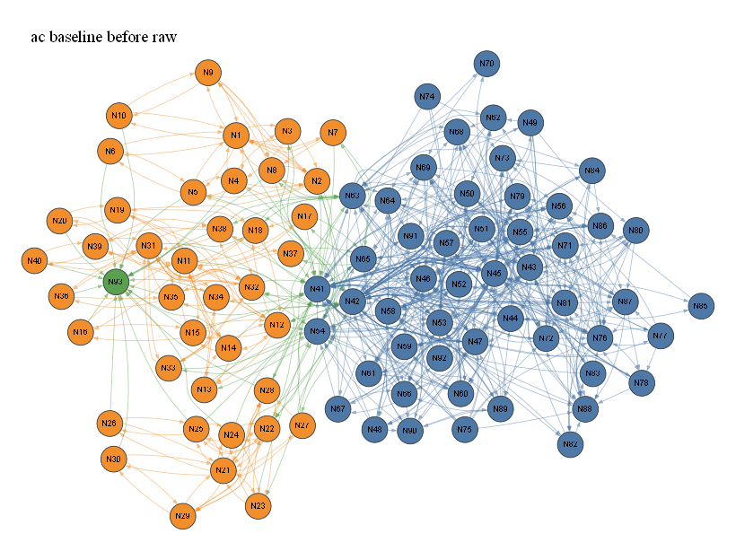

# ac baseline before raw

- summary nodes: 94
- summary reactions: 425
- drawn nodes: 93
- drawn edges: 778
- colors: gas=blue, surface=orange, bulk/mixed=green

## N1 (orange)

Names: X_T(s)

Reactions:
- R325, 326, 334, 335, 336, 340, 341: H + X_T(s) => H_T(s) | H2 + 2 X_T(s) => 2 H_T(s) | CH3_T(s) + X_T(s) => CH2_T(s) + H_T(s) | CH2_T(s) + X_T(s) => CH_T(s) + H_T(s) | CH_T(s) + X_T(s) => C_T(s) + H_T(s) | C2H2_T(s) + X_T(s) => C2H_T(s) + H_T(s)
- R330, 333, 337, 338, 339, 342, 343: 2 H_T(s) => H2 + 2 X_T(s) | CH3_T(s) + H_T(s) => CH4 + 2 X_T(s) | CH2_T(s) + H_T(s) => CH3_T(s) + X_T(s) | CH_T(s) + H_T(s) => CH2_T(s) + X_T(s) | C_T(s) + H_T(s) => CH_T(s) + X_T(s) | C2H_T(s) + H_T(s) => C2H2_T(s) + X_T(s)
- R328: C2H2 + X_T(s) => C2H2_T(s)
- R332, 349: C2H2_T(s) => C2H2 + X_T(s) | C2H2_T(s) => 2 C_bulk + H2 + X_T(s)
- R329: C2H4 + X_T(s) => C2H4_T(s)
- R331: C2H4_T(s) => C2H4 + X_T(s)
- R340: C2H2_T(s) + X_T(s) => C2H_T(s) + H_T(s)
- R343, 348: C2_T(s) + H_T(s) => C2H_T(s) + X_T(s) | C2_T(s) => 2 C_bulk + X_T(s)
- R341: C2H_T(s) + X_T(s) => C2_T(s) + H_T(s)
- R342: C2H_T(s) + H_T(s) => C2H2_T(s) + X_T(s)
- R327: CH4 + X_T(s) => CH3_T(s) + H
- R334: CH3_T(s) + X_T(s) => CH2_T(s) + H_T(s)
- R337, 347: CH2_T(s) + H_T(s) => CH3_T(s) + X_T(s) | CH2_T(s) => C_bulk + H2 + X_T(s)
- R333: CH3_T(s) + H_T(s) => CH4 + 2 X_T(s)
- R335: CH2_T(s) + X_T(s) => CH_T(s) + H_T(s)
- R338, 346: CH_T(s) + H_T(s) => CH2_T(s) + X_T(s) | CH_T(s) => C_bulk + H + X_T(s)
- R339, 345: C_T(s) + H_T(s) => CH_T(s) + X_T(s) | C_T(s) => C_bulk + X_T(s)
- R336: CH_T(s) + X_T(s) => C_T(s) + H_T(s)

## N2 (orange)

Names: H_T(s)

Reactions:
- R325, 326, 334, 335, 336, 340, 341: H + X_T(s) => H_T(s) | H2 + 2 X_T(s) => 2 H_T(s) | CH3_T(s) + X_T(s) => CH2_T(s) + H_T(s) | CH2_T(s) + X_T(s) => CH_T(s) + H_T(s) | CH_T(s) + X_T(s) => C_T(s) + H_T(s) | C2H2_T(s) + X_T(s) => C2H_T(s) + H_T(s)
- R326: H2 + 2 X_T(s) => 2 H_T(s)
- R330, 333, 337, 338, 339, 342, 343: 2 H_T(s) => H2 + 2 X_T(s) | CH3_T(s) + H_T(s) => CH4 + 2 X_T(s) | CH2_T(s) + H_T(s) => CH3_T(s) + X_T(s) | CH_T(s) + H_T(s) => CH2_T(s) + X_T(s) | C_T(s) + H_T(s) => CH_T(s) + X_T(s) | C2H_T(s) + H_T(s) => C2H2_T(s) + X_T(s)
- R330: 2 H_T(s) => H2 + 2 X_T(s)
- R340: C2H2_T(s) + X_T(s) => C2H_T(s) + H_T(s)
- R341: C2H_T(s) + X_T(s) => C2_T(s) + H_T(s)
- R342: C2H_T(s) + H_T(s) => C2H2_T(s) + X_T(s)
- R325: H + X_T(s) => H_T(s)
- R343: C2_T(s) + H_T(s) => C2H_T(s) + X_T(s)
- R334: CH3_T(s) + X_T(s) => CH2_T(s) + H_T(s)
- R333: CH3_T(s) + H_T(s) => CH4 + 2 X_T(s)
- R335: CH2_T(s) + X_T(s) => CH_T(s) + H_T(s)
- R337: CH2_T(s) + H_T(s) => CH3_T(s) + X_T(s)
- R336: CH_T(s) + X_T(s) => C_T(s) + H_T(s)
- R338: CH_T(s) + H_T(s) => CH2_T(s) + X_T(s)
- R339: C_T(s) + H_T(s) => CH_T(s) + X_T(s)

## N3 (orange)

Names: CH3_T(s)

Reactions:
- R327: CH4 + X_T(s) => CH3_T(s) + H
- R334: CH3_T(s) + X_T(s) => CH2_T(s) + H_T(s)
- R333: CH3_T(s) + H_T(s) => CH4 + 2 X_T(s)
- R337: CH2_T(s) + H_T(s) => CH3_T(s) + X_T(s)

## N4 (orange)

Names: CH2_T(s)

Reactions:
- R334: CH3_T(s) + X_T(s) => CH2_T(s) + H_T(s)
- R337, 347: CH2_T(s) + H_T(s) => CH3_T(s) + X_T(s) | CH2_T(s) => C_bulk + H2 + X_T(s)
- R347: CH2_T(s) => C_bulk + H2 + X_T(s)
- R335: CH2_T(s) + X_T(s) => CH_T(s) + H_T(s)
- R337: CH2_T(s) + H_T(s) => CH3_T(s) + X_T(s)
- R338: CH_T(s) + H_T(s) => CH2_T(s) + X_T(s)

## N5 (orange)

Names: CH_T(s)

Reactions:
- R335: CH2_T(s) + X_T(s) => CH_T(s) + H_T(s)
- R338, 346: CH_T(s) + H_T(s) => CH2_T(s) + X_T(s) | CH_T(s) => C_bulk + H + X_T(s)
- R346: CH_T(s) => C_bulk + H + X_T(s)
- R336: CH_T(s) + X_T(s) => C_T(s) + H_T(s)
- R338: CH_T(s) + H_T(s) => CH2_T(s) + X_T(s)
- R339: C_T(s) + H_T(s) => CH_T(s) + X_T(s)

## N6 (orange)

Names: C_T(s)

Reactions:
- R339, 345: C_T(s) + H_T(s) => CH_T(s) + X_T(s) | C_T(s) => C_bulk + X_T(s)
- R336: CH_T(s) + X_T(s) => C_T(s) + H_T(s)
- R345: C_T(s) => C_bulk + X_T(s)
- R339: C_T(s) + H_T(s) => CH_T(s) + X_T(s)

## N7 (orange)

Names: C2H4_T(s)

Reactions:
- R329: C2H4 + X_T(s) => C2H4_T(s)
- R331: C2H4_T(s) => C2H4 + X_T(s)
- R344: C2H4_T(s) => C2H2_T(s) + H2

## N8 (orange)

Names: C2H2_T(s)

Reactions:
- R328: C2H2 + X_T(s) => C2H2_T(s)
- R332, 349: C2H2_T(s) => C2H2 + X_T(s) | C2H2_T(s) => 2 C_bulk + H2 + X_T(s)
- R349: C2H2_T(s) => 2 C_bulk + H2 + X_T(s)
- R332: C2H2_T(s) => C2H2 + X_T(s)
- R340: C2H2_T(s) + X_T(s) => C2H_T(s) + H_T(s)
- R344: C2H4_T(s) => C2H2_T(s) + H2
- R342: C2H_T(s) + H_T(s) => C2H2_T(s) + X_T(s)

## N9 (orange)

Names: C2H_T(s)

Reactions:
- R340: C2H2_T(s) + X_T(s) => C2H_T(s) + H_T(s)
- R341: C2H_T(s) + X_T(s) => C2_T(s) + H_T(s)
- R342: C2H_T(s) + H_T(s) => C2H2_T(s) + X_T(s)
- R343: C2_T(s) + H_T(s) => C2H_T(s) + X_T(s)

## N10 (orange)

Names: C2_T(s)

Reactions:
- R343, 348: C2_T(s) + H_T(s) => C2H_T(s) + X_T(s) | C2_T(s) => 2 C_bulk + X_T(s)
- R341: C2H_T(s) + X_T(s) => C2_T(s) + H_T(s)
- R348: C2_T(s) => 2 C_bulk + X_T(s)
- R343: C2_T(s) + H_T(s) => C2H_T(s) + X_T(s)

## N11 (orange)

Names: X_S(s)

Reactions:
- R350, 351, 359, 360, 361, 365, 366: H + X_S(s) => H_S(s) | H2 + 2 X_S(s) => 2 H_S(s) | CH3_S(s) + X_S(s) => CH2_S(s) + H_S(s) | CH2_S(s) + X_S(s) => CH_S(s) + H_S(s) | CH_S(s) + X_S(s) => C_S(s) + H_S(s) | C2H2_S(s) + X_S(s) => C2H_S(s) + H_S(s)
- R355, 358, 362, 363, 364, 367, 368: 2 H_S(s) => H2 + 2 X_S(s) | CH3_S(s) + H_S(s) => CH4 + 2 X_S(s) | CH2_S(s) + H_S(s) => CH3_S(s) + X_S(s) | CH_S(s) + H_S(s) => CH2_S(s) + X_S(s) | C_S(s) + H_S(s) => CH_S(s) + X_S(s) | C2H_S(s) + H_S(s) => C2H2_S(s) + X_S(s)
- R353: C2H2 + X_S(s) => C2H2_S(s)
- R357, 374: C2H2_S(s) => C2H2 + X_S(s) | C2H2_S(s) => 2 C_bulk + H2 + X_S(s)
- R354: C2H4 + X_S(s) => C2H4_S(s)
- R356: C2H4_S(s) => C2H4 + X_S(s)
- R365: C2H2_S(s) + X_S(s) => C2H_S(s) + H_S(s)
- R366: C2H_S(s) + X_S(s) => C2_S(s) + H_S(s)
- R368, 373: C2_S(s) + H_S(s) => C2H_S(s) + X_S(s) | C2_S(s) => 2 C_bulk + X_S(s)
- R367: C2H_S(s) + H_S(s) => C2H2_S(s) + X_S(s)
- R352: CH4 + X_S(s) => CH3_S(s) + H
- R359: CH3_S(s) + X_S(s) => CH2_S(s) + H_S(s)
- R362, 372: CH2_S(s) + H_S(s) => CH3_S(s) + X_S(s) | CH2_S(s) => C_bulk + H2 + X_S(s)
- R358: CH3_S(s) + H_S(s) => CH4 + 2 X_S(s)
- R360: CH2_S(s) + X_S(s) => CH_S(s) + H_S(s)
- R363, 371: CH_S(s) + H_S(s) => CH2_S(s) + X_S(s) | CH_S(s) => C_bulk + H + X_S(s)
- R364, 370: C_S(s) + H_S(s) => CH_S(s) + X_S(s) | C_S(s) => C_bulk + X_S(s)
- R361: CH_S(s) + X_S(s) => C_S(s) + H_S(s)

## N12 (orange)

Names: H_S(s)

Reactions:
- R350, 351, 359, 360, 361, 365, 366: H + X_S(s) => H_S(s) | H2 + 2 X_S(s) => 2 H_S(s) | CH3_S(s) + X_S(s) => CH2_S(s) + H_S(s) | CH2_S(s) + X_S(s) => CH_S(s) + H_S(s) | CH_S(s) + X_S(s) => C_S(s) + H_S(s) | C2H2_S(s) + X_S(s) => C2H_S(s) + H_S(s)
- R351: H2 + 2 X_S(s) => 2 H_S(s)
- R355, 358, 362, 363, 364, 367, 368: 2 H_S(s) => H2 + 2 X_S(s) | CH3_S(s) + H_S(s) => CH4 + 2 X_S(s) | CH2_S(s) + H_S(s) => CH3_S(s) + X_S(s) | CH_S(s) + H_S(s) => CH2_S(s) + X_S(s) | C_S(s) + H_S(s) => CH_S(s) + X_S(s) | C2H_S(s) + H_S(s) => C2H2_S(s) + X_S(s)
- R355: 2 H_S(s) => H2 + 2 X_S(s)
- R365: C2H2_S(s) + X_S(s) => C2H_S(s) + H_S(s)
- R366: C2H_S(s) + X_S(s) => C2_S(s) + H_S(s)
- R367: C2H_S(s) + H_S(s) => C2H2_S(s) + X_S(s)
- R368: C2_S(s) + H_S(s) => C2H_S(s) + X_S(s)
- R350: H + X_S(s) => H_S(s)
- R359: CH3_S(s) + X_S(s) => CH2_S(s) + H_S(s)
- R358: CH3_S(s) + H_S(s) => CH4 + 2 X_S(s)
- R360: CH2_S(s) + X_S(s) => CH_S(s) + H_S(s)
- R362: CH2_S(s) + H_S(s) => CH3_S(s) + X_S(s)
- R361: CH_S(s) + X_S(s) => C_S(s) + H_S(s)
- R363: CH_S(s) + H_S(s) => CH2_S(s) + X_S(s)
- R364: C_S(s) + H_S(s) => CH_S(s) + X_S(s)

## N13 (orange)

Names: CH3_S(s)

Reactions:
- R352: CH4 + X_S(s) => CH3_S(s) + H
- R359: CH3_S(s) + X_S(s) => CH2_S(s) + H_S(s)
- R358: CH3_S(s) + H_S(s) => CH4 + 2 X_S(s)
- R362: CH2_S(s) + H_S(s) => CH3_S(s) + X_S(s)

## N14 (orange)

Names: CH2_S(s)

Reactions:
- R359: CH3_S(s) + X_S(s) => CH2_S(s) + H_S(s)
- R362, 372: CH2_S(s) + H_S(s) => CH3_S(s) + X_S(s) | CH2_S(s) => C_bulk + H2 + X_S(s)
- R372: CH2_S(s) => C_bulk + H2 + X_S(s)
- R360: CH2_S(s) + X_S(s) => CH_S(s) + H_S(s)
- R362: CH2_S(s) + H_S(s) => CH3_S(s) + X_S(s)
- R363: CH_S(s) + H_S(s) => CH2_S(s) + X_S(s)

## N15 (orange)

Names: CH_S(s)

Reactions:
- R360: CH2_S(s) + X_S(s) => CH_S(s) + H_S(s)
- R363, 371: CH_S(s) + H_S(s) => CH2_S(s) + X_S(s) | CH_S(s) => C_bulk + H + X_S(s)
- R371: CH_S(s) => C_bulk + H + X_S(s)
- R361: CH_S(s) + X_S(s) => C_S(s) + H_S(s)
- R363: CH_S(s) + H_S(s) => CH2_S(s) + X_S(s)
- R364: C_S(s) + H_S(s) => CH_S(s) + X_S(s)

## N16 (orange)

Names: C_S(s)

Reactions:
- R364, 370: C_S(s) + H_S(s) => CH_S(s) + X_S(s) | C_S(s) => C_bulk + X_S(s)
- R361: CH_S(s) + X_S(s) => C_S(s) + H_S(s)
- R370: C_S(s) => C_bulk + X_S(s)
- R364: C_S(s) + H_S(s) => CH_S(s) + X_S(s)

## N17 (orange)

Names: C2H4_S(s)

Reactions:
- R354: C2H4 + X_S(s) => C2H4_S(s)
- R356: C2H4_S(s) => C2H4 + X_S(s)
- R369: C2H4_S(s) => C2H2_S(s) + H2

## N18 (orange)

Names: C2H2_S(s)

Reactions:
- R353: C2H2 + X_S(s) => C2H2_S(s)
- R357, 374: C2H2_S(s) => C2H2 + X_S(s) | C2H2_S(s) => 2 C_bulk + H2 + X_S(s)
- R374: C2H2_S(s) => 2 C_bulk + H2 + X_S(s)
- R357: C2H2_S(s) => C2H2 + X_S(s)
- R365: C2H2_S(s) + X_S(s) => C2H_S(s) + H_S(s)
- R367: C2H_S(s) + H_S(s) => C2H2_S(s) + X_S(s)
- R369: C2H4_S(s) => C2H2_S(s) + H2

## N19 (orange)

Names: C2H_S(s)

Reactions:
- R365: C2H2_S(s) + X_S(s) => C2H_S(s) + H_S(s)
- R366: C2H_S(s) + X_S(s) => C2_S(s) + H_S(s)
- R367: C2H_S(s) + H_S(s) => C2H2_S(s) + X_S(s)
- R368: C2_S(s) + H_S(s) => C2H_S(s) + X_S(s)

## N20 (orange)

Names: C2_S(s)

Reactions:
- R366: C2H_S(s) + X_S(s) => C2_S(s) + H_S(s)
- R368, 373: C2_S(s) + H_S(s) => C2H_S(s) + X_S(s) | C2_S(s) => 2 C_bulk + X_S(s)
- R373: C2_S(s) => 2 C_bulk + X_S(s)
- R368: C2_S(s) + H_S(s) => C2H_S(s) + X_S(s)

## N21 (orange)

Names: X_K(s)

Reactions:
- R375, 376, 384, 385, 386, 390, 391: H + X_K(s) => H_K(s) | H2 + 2 X_K(s) => 2 H_K(s) | CH3_K(s) + X_K(s) => CH2_K(s) + H_K(s) | CH2_K(s) + X_K(s) => CH_K(s) + H_K(s) | CH_K(s) + X_K(s) => C_K(s) + H_K(s) | C2H2_K(s) + X_K(s) => C2H_K(s) + H_K(s)
- R380, 383, 387, 388, 389, 392, 393: 2 H_K(s) => H2 + 2 X_K(s) | CH3_K(s) + H_K(s) => CH4 + 2 X_K(s) | CH2_K(s) + H_K(s) => CH3_K(s) + X_K(s) | CH_K(s) + H_K(s) => CH2_K(s) + X_K(s) | C_K(s) + H_K(s) => CH_K(s) + X_K(s) | C2H_K(s) + H_K(s) => C2H2_K(s) + X_K(s)
- R378: C2H2 + X_K(s) => C2H2_K(s)
- R382, 399: C2H2_K(s) => C2H2 + X_K(s) | C2H2_K(s) => 2 C_bulk + H2 + X_K(s)
- R379: C2H4 + X_K(s) => C2H4_K(s)
- R381: C2H4_K(s) => C2H4 + X_K(s)
- R390: C2H2_K(s) + X_K(s) => C2H_K(s) + H_K(s)
- R391: C2H_K(s) + X_K(s) => C2_K(s) + H_K(s)
- R393, 398: C2_K(s) + H_K(s) => C2H_K(s) + X_K(s) | C2_K(s) => 2 C_bulk + X_K(s)
- R392: C2H_K(s) + H_K(s) => C2H2_K(s) + X_K(s)
- R377: CH4 + X_K(s) => CH3_K(s) + H
- R384: CH3_K(s) + X_K(s) => CH2_K(s) + H_K(s)
- R387, 397: CH2_K(s) + H_K(s) => CH3_K(s) + X_K(s) | CH2_K(s) => C_bulk + H2 + X_K(s)
- R383: CH3_K(s) + H_K(s) => CH4 + 2 X_K(s)
- R385: CH2_K(s) + X_K(s) => CH_K(s) + H_K(s)
- R388, 396: CH_K(s) + H_K(s) => CH2_K(s) + X_K(s) | CH_K(s) => C_bulk + H + X_K(s)
- R389, 395: C_K(s) + H_K(s) => CH_K(s) + X_K(s) | C_K(s) => C_bulk + X_K(s)
- R386: CH_K(s) + X_K(s) => C_K(s) + H_K(s)

## N22 (orange)

Names: H_K(s)

Reactions:
- R375, 376, 384, 385, 386, 390, 391: H + X_K(s) => H_K(s) | H2 + 2 X_K(s) => 2 H_K(s) | CH3_K(s) + X_K(s) => CH2_K(s) + H_K(s) | CH2_K(s) + X_K(s) => CH_K(s) + H_K(s) | CH_K(s) + X_K(s) => C_K(s) + H_K(s) | C2H2_K(s) + X_K(s) => C2H_K(s) + H_K(s)
- R376: H2 + 2 X_K(s) => 2 H_K(s)
- R380, 383, 387, 388, 389, 392, 393: 2 H_K(s) => H2 + 2 X_K(s) | CH3_K(s) + H_K(s) => CH4 + 2 X_K(s) | CH2_K(s) + H_K(s) => CH3_K(s) + X_K(s) | CH_K(s) + H_K(s) => CH2_K(s) + X_K(s) | C_K(s) + H_K(s) => CH_K(s) + X_K(s) | C2H_K(s) + H_K(s) => C2H2_K(s) + X_K(s)
- R380: 2 H_K(s) => H2 + 2 X_K(s)
- R390: C2H2_K(s) + X_K(s) => C2H_K(s) + H_K(s)
- R391: C2H_K(s) + X_K(s) => C2_K(s) + H_K(s)
- R392: C2H_K(s) + H_K(s) => C2H2_K(s) + X_K(s)
- R393: C2_K(s) + H_K(s) => C2H_K(s) + X_K(s)
- R375: H + X_K(s) => H_K(s)
- R384: CH3_K(s) + X_K(s) => CH2_K(s) + H_K(s)
- R383: CH3_K(s) + H_K(s) => CH4 + 2 X_K(s)
- R385: CH2_K(s) + X_K(s) => CH_K(s) + H_K(s)
- R387: CH2_K(s) + H_K(s) => CH3_K(s) + X_K(s)
- R386: CH_K(s) + X_K(s) => C_K(s) + H_K(s)
- R388: CH_K(s) + H_K(s) => CH2_K(s) + X_K(s)
- R389: C_K(s) + H_K(s) => CH_K(s) + X_K(s)

## N23 (orange)

Names: CH3_K(s)

Reactions:
- R377: CH4 + X_K(s) => CH3_K(s) + H
- R384: CH3_K(s) + X_K(s) => CH2_K(s) + H_K(s)
- R383: CH3_K(s) + H_K(s) => CH4 + 2 X_K(s)
- R387: CH2_K(s) + H_K(s) => CH3_K(s) + X_K(s)

## N24 (orange)

Names: CH2_K(s)

Reactions:
- R384: CH3_K(s) + X_K(s) => CH2_K(s) + H_K(s)
- R387, 397: CH2_K(s) + H_K(s) => CH3_K(s) + X_K(s) | CH2_K(s) => C_bulk + H2 + X_K(s)
- R397: CH2_K(s) => C_bulk + H2 + X_K(s)
- R385: CH2_K(s) + X_K(s) => CH_K(s) + H_K(s)
- R387: CH2_K(s) + H_K(s) => CH3_K(s) + X_K(s)
- R388: CH_K(s) + H_K(s) => CH2_K(s) + X_K(s)

## N25 (orange)

Names: CH_K(s)

Reactions:
- R385: CH2_K(s) + X_K(s) => CH_K(s) + H_K(s)
- R388, 396: CH_K(s) + H_K(s) => CH2_K(s) + X_K(s) | CH_K(s) => C_bulk + H + X_K(s)
- R396: CH_K(s) => C_bulk + H + X_K(s)
- R386: CH_K(s) + X_K(s) => C_K(s) + H_K(s)
- R388: CH_K(s) + H_K(s) => CH2_K(s) + X_K(s)
- R389: C_K(s) + H_K(s) => CH_K(s) + X_K(s)

## N26 (orange)

Names: C_K(s)

Reactions:
- R389, 395: C_K(s) + H_K(s) => CH_K(s) + X_K(s) | C_K(s) => C_bulk + X_K(s)
- R386: CH_K(s) + X_K(s) => C_K(s) + H_K(s)
- R395: C_K(s) => C_bulk + X_K(s)
- R389: C_K(s) + H_K(s) => CH_K(s) + X_K(s)

## N27 (orange)

Names: C2H4_K(s)

Reactions:
- R379: C2H4 + X_K(s) => C2H4_K(s)
- R381: C2H4_K(s) => C2H4 + X_K(s)
- R394: C2H4_K(s) => C2H2_K(s) + H2

## N28 (orange)

Names: C2H2_K(s)

Reactions:
- R378: C2H2 + X_K(s) => C2H2_K(s)
- R382, 399: C2H2_K(s) => C2H2 + X_K(s) | C2H2_K(s) => 2 C_bulk + H2 + X_K(s)
- R399: C2H2_K(s) => 2 C_bulk + H2 + X_K(s)
- R382: C2H2_K(s) => C2H2 + X_K(s)
- R390: C2H2_K(s) + X_K(s) => C2H_K(s) + H_K(s)
- R392: C2H_K(s) + H_K(s) => C2H2_K(s) + X_K(s)
- R394: C2H4_K(s) => C2H2_K(s) + H2

## N29 (orange)

Names: C2H_K(s)

Reactions:
- R390: C2H2_K(s) + X_K(s) => C2H_K(s) + H_K(s)
- R391: C2H_K(s) + X_K(s) => C2_K(s) + H_K(s)
- R392: C2H_K(s) + H_K(s) => C2H2_K(s) + X_K(s)
- R393: C2_K(s) + H_K(s) => C2H_K(s) + X_K(s)

## N30 (orange)

Names: C2_K(s)

Reactions:
- R391: C2H_K(s) + X_K(s) => C2_K(s) + H_K(s)
- R393, 398: C2_K(s) + H_K(s) => C2H_K(s) + X_K(s) | C2_K(s) => 2 C_bulk + X_K(s)
- R398: C2_K(s) => 2 C_bulk + X_K(s)
- R393: C2_K(s) + H_K(s) => C2H_K(s) + X_K(s)

## N31 (orange)

Names: X_D(s)

Reactions:
- R400, 401, 409, 410, 411, 415, 416: H + X_D(s) => H_D(s) | H2 + 2 X_D(s) => 2 H_D(s) | CH3_D(s) + X_D(s) => CH2_D(s) + H_D(s) | CH2_D(s) + X_D(s) => CH_D(s) + H_D(s) | CH_D(s) + X_D(s) => C_D(s) + H_D(s) | C2H2_D(s) + X_D(s) => C2H_D(s) + H_D(s)
- R405, 408, 412, 413, 414, 417, 418: 2 H_D(s) => H2 + 2 X_D(s) | CH3_D(s) + H_D(s) => CH4 + 2 X_D(s) | CH2_D(s) + H_D(s) => CH3_D(s) + X_D(s) | CH_D(s) + H_D(s) => CH2_D(s) + X_D(s) | C_D(s) + H_D(s) => CH_D(s) + X_D(s) | C2H_D(s) + H_D(s) => C2H2_D(s) + X_D(s)
- R403: C2H2 + X_D(s) => C2H2_D(s)
- R407, 424: C2H2_D(s) => C2H2 + X_D(s) | C2H2_D(s) => 2 C_bulk + H2 + X_D(s)
- R404: C2H4 + X_D(s) => C2H4_D(s)
- R406: C2H4_D(s) => C2H4 + X_D(s)
- R415: C2H2_D(s) + X_D(s) => C2H_D(s) + H_D(s)
- R418, 423: C2_D(s) + H_D(s) => C2H_D(s) + X_D(s) | C2_D(s) => 2 C_bulk + X_D(s)
- R416: C2H_D(s) + X_D(s) => C2_D(s) + H_D(s)
- R417: C2H_D(s) + H_D(s) => C2H2_D(s) + X_D(s)
- R402: CH4 + X_D(s) => CH3_D(s) + H
- R409: CH3_D(s) + X_D(s) => CH2_D(s) + H_D(s)
- R412, 422: CH2_D(s) + H_D(s) => CH3_D(s) + X_D(s) | CH2_D(s) => C_bulk + H2 + X_D(s)
- R408: CH3_D(s) + H_D(s) => CH4 + 2 X_D(s)
- R410: CH2_D(s) + X_D(s) => CH_D(s) + H_D(s)
- R413, 421: CH_D(s) + H_D(s) => CH2_D(s) + X_D(s) | CH_D(s) => C_bulk + H + X_D(s)
- R414, 420: C_D(s) + H_D(s) => CH_D(s) + X_D(s) | C_D(s) => C_bulk + X_D(s)
- R411: CH_D(s) + X_D(s) => C_D(s) + H_D(s)

## N32 (orange)

Names: H_D(s)

Reactions:
- R400, 401, 409, 410, 411, 415, 416: H + X_D(s) => H_D(s) | H2 + 2 X_D(s) => 2 H_D(s) | CH3_D(s) + X_D(s) => CH2_D(s) + H_D(s) | CH2_D(s) + X_D(s) => CH_D(s) + H_D(s) | CH_D(s) + X_D(s) => C_D(s) + H_D(s) | C2H2_D(s) + X_D(s) => C2H_D(s) + H_D(s)
- R401: H2 + 2 X_D(s) => 2 H_D(s)
- R405, 408, 412, 413, 414, 417, 418: 2 H_D(s) => H2 + 2 X_D(s) | CH3_D(s) + H_D(s) => CH4 + 2 X_D(s) | CH2_D(s) + H_D(s) => CH3_D(s) + X_D(s) | CH_D(s) + H_D(s) => CH2_D(s) + X_D(s) | C_D(s) + H_D(s) => CH_D(s) + X_D(s) | C2H_D(s) + H_D(s) => C2H2_D(s) + X_D(s)
- R405: 2 H_D(s) => H2 + 2 X_D(s)
- R415: C2H2_D(s) + X_D(s) => C2H_D(s) + H_D(s)
- R416: C2H_D(s) + X_D(s) => C2_D(s) + H_D(s)
- R417: C2H_D(s) + H_D(s) => C2H2_D(s) + X_D(s)
- R418: C2_D(s) + H_D(s) => C2H_D(s) + X_D(s)
- R400: H + X_D(s) => H_D(s)
- R409: CH3_D(s) + X_D(s) => CH2_D(s) + H_D(s)
- R408: CH3_D(s) + H_D(s) => CH4 + 2 X_D(s)
- R410: CH2_D(s) + X_D(s) => CH_D(s) + H_D(s)
- R412: CH2_D(s) + H_D(s) => CH3_D(s) + X_D(s)
- R413: CH_D(s) + H_D(s) => CH2_D(s) + X_D(s)
- R411: CH_D(s) + X_D(s) => C_D(s) + H_D(s)
- R414: C_D(s) + H_D(s) => CH_D(s) + X_D(s)

## N33 (orange)

Names: CH3_D(s)

Reactions:
- R402: CH4 + X_D(s) => CH3_D(s) + H
- R409: CH3_D(s) + X_D(s) => CH2_D(s) + H_D(s)
- R408: CH3_D(s) + H_D(s) => CH4 + 2 X_D(s)
- R412: CH2_D(s) + H_D(s) => CH3_D(s) + X_D(s)

## N34 (orange)

Names: CH2_D(s)

Reactions:
- R409: CH3_D(s) + X_D(s) => CH2_D(s) + H_D(s)
- R412, 422: CH2_D(s) + H_D(s) => CH3_D(s) + X_D(s) | CH2_D(s) => C_bulk + H2 + X_D(s)
- R422: CH2_D(s) => C_bulk + H2 + X_D(s)
- R410: CH2_D(s) + X_D(s) => CH_D(s) + H_D(s)
- R412: CH2_D(s) + H_D(s) => CH3_D(s) + X_D(s)
- R413: CH_D(s) + H_D(s) => CH2_D(s) + X_D(s)

## N35 (orange)

Names: CH_D(s)

Reactions:
- R410: CH2_D(s) + X_D(s) => CH_D(s) + H_D(s)
- R413, 421: CH_D(s) + H_D(s) => CH2_D(s) + X_D(s) | CH_D(s) => C_bulk + H + X_D(s)
- R421: CH_D(s) => C_bulk + H + X_D(s)
- R413: CH_D(s) + H_D(s) => CH2_D(s) + X_D(s)
- R411: CH_D(s) + X_D(s) => C_D(s) + H_D(s)
- R414: C_D(s) + H_D(s) => CH_D(s) + X_D(s)

## N36 (orange)

Names: C_D(s)

Reactions:
- R414, 420: C_D(s) + H_D(s) => CH_D(s) + X_D(s) | C_D(s) => C_bulk + X_D(s)
- R411: CH_D(s) + X_D(s) => C_D(s) + H_D(s)
- R420: C_D(s) => C_bulk + X_D(s)
- R414: C_D(s) + H_D(s) => CH_D(s) + X_D(s)

## N37 (orange)

Names: C2H4_D(s)

Reactions:
- R404: C2H4 + X_D(s) => C2H4_D(s)
- R406: C2H4_D(s) => C2H4 + X_D(s)
- R419: C2H4_D(s) => C2H2_D(s) + H2

## N38 (orange)

Names: C2H2_D(s)

Reactions:
- R403: C2H2 + X_D(s) => C2H2_D(s)
- R407, 424: C2H2_D(s) => C2H2 + X_D(s) | C2H2_D(s) => 2 C_bulk + H2 + X_D(s)
- R424: C2H2_D(s) => 2 C_bulk + H2 + X_D(s)
- R407: C2H2_D(s) => C2H2 + X_D(s)
- R415: C2H2_D(s) + X_D(s) => C2H_D(s) + H_D(s)
- R417: C2H_D(s) + H_D(s) => C2H2_D(s) + X_D(s)
- R419: C2H4_D(s) => C2H2_D(s) + H2

## N39 (orange)

Names: C2H_D(s)

Reactions:
- R415: C2H2_D(s) + X_D(s) => C2H_D(s) + H_D(s)
- R416: C2H_D(s) + X_D(s) => C2_D(s) + H_D(s)
- R417: C2H_D(s) + H_D(s) => C2H2_D(s) + X_D(s)
- R418: C2_D(s) + H_D(s) => C2H_D(s) + X_D(s)

## N40 (orange)

Names: C2_D(s)

Reactions:
- R418, 423: C2_D(s) + H_D(s) => C2H_D(s) + X_D(s) | C2_D(s) => 2 C_bulk + X_D(s)
- R416: C2H_D(s) + X_D(s) => C2_D(s) + H_D(s)
- R423: C2_D(s) => 2 C_bulk + X_D(s)
- R418: C2_D(s) + H_D(s) => C2H_D(s) + X_D(s)

## N41 (blue)

Names: H2

Reactions:
- R326: H2 + 2 X_T(s) => 2 H_T(s)
- R351: H2 + 2 X_S(s) => 2 H_S(s)
- R376: H2 + 2 X_K(s) => 2 H_K(s)
- R401: H2 + 2 X_D(s) => 2 H_D(s)
- R330: 2 H_T(s) => H2 + 2 X_T(s)
- R355: 2 H_S(s) => H2 + 2 X_S(s)
- R380: 2 H_K(s) => H2 + 2 X_K(s)
- R405: 2 H_D(s) => H2 + 2 X_D(s)
- R424: C2H2_D(s) => 2 C_bulk + H2 + X_D(s)
- R399: C2H2_K(s) => 2 C_bulk + H2 + X_K(s)
- R374: C2H2_S(s) => 2 C_bulk + H2 + X_S(s)
- R349: C2H2_T(s) => 2 C_bulk + H2 + X_T(s)
- R344: C2H4_T(s) => C2H2_T(s) + H2
- R369: C2H4_S(s) => C2H2_S(s) + H2
- R394: C2H4_K(s) => C2H2_K(s) + H2
- R419: C2H4_D(s) => C2H2_D(s) + H2
- R74, 173: C2H4 + H <=> C2H3 + H2 | C2H4 (+M) <=> C2H2 + H2 (+M)
- R38, 39, 40, 41, 44, 46, 48, 50, 52, 54, 57, 59: 2 H + M <=> H2 + M | 2 H + H2 <=> H2 + H2 | 2 H + H2O <=> H2 + H2O | 2 H + CO2 <=> H2 + CO2 | H + HO2 <=> H2 + O2 | H + H2O2 <=> H2 + HO2
- R72: C2H3 + H <=> C2H2 + H2
- R347: CH2_T(s) => C_bulk + H2 + X_T(s)
- R372: CH2_S(s) => C_bulk + H2 + X_S(s)
- R397: CH2_K(s) => C_bulk + H2 + X_K(s)
- R422: CH2_D(s) => C_bulk + H2 + X_D(s)
- R52: CH4 + H <=> CH3 + H2
- R77: C2H6 + H <=> C2H5 + H2
- R76: C2H5 + H <=> C2H4 + H2
- R2, 83, 125, 135, 145, 171, 220: H2 + O <=> H + OH | H2 + OH <=> H + H2O | CH + H2 <=> CH2 + H | CH2 + H2 <=> CH3 + H | CH2(S) + H2 <=> CH3 + H | C2H + H2 <=> C2H2 + H
- R171: C2H + H2 <=> C2H2 + H
- R83: H2 + OH <=> H + H2O
- R2: H2 + O <=> H + OH
- R79: CH2CO + H <=> H2 + HCCO
- R135, 145, 288: CH2 + H2 <=> CH3 + H | CH2(S) + H2 <=> CH3 + H | CH + H2 (+M) <=> CH3 (+M)
- R125: CH + H2 <=> CH2 + H
- R136: 2 CH2 <=> C2H2 + H2
- R208: H + NNH <=> H2 + N2
- R313: C3H8 + H <=> C3H7 + H2
- R7, 50, 292: CH2(S) + O <=> CO + H2 | CH2(S) + H <=> CH + H2 | CH2(S) + H2O => CH2O + H2
- R298, 299: CH3CHO + H <=> CH2CHO + H2 | CH3CHO + H => CH3 + CO + H2
- R48: CH + H <=> C + H2
- R57: CH2O + H <=> H2 + HCO
- R275, 283, 287: CH3 + N <=> H2 + HCN | CH3 + O => CO + H + H2 | CH3 + OH => CH2O + H2
- R7, 283: CH2(S) + O <=> CO + H2 | CH3 + O => CO + H + H2
- R308: CH2CHO + H <=> CH2CO + H2
- R287: CH3 + OH => CH2O + H2
- R67, 68: CH3OH + H <=> CH2OH + H2 | CH3OH + H <=> CH3O + H2
- R54: H + HCO <=> CO + H2
- R276: H + NH3 <=> H2 + NH2
- R201: H + NH2 <=> H2 + NH
- R190, 196: H + NH <=> H2 + N | H2O + NH <=> H2 + HNO
- R82: CO + H2 (+M) <=> CH2O (+M)
- R196, 292: H2O + NH <=> H2 + HNO | CH2(S) + H2O => CH2O + H2
- R59: CH2OH + H <=> CH2O + H2
- R220: CN + H2 <=> H + HCN
- R275: CH3 + N <=> H2 + HCN
- R44: H + HO2 <=> H2 + O2
- R64: CH3O + H <=> CH2O + H2
- R46: H + H2O2 <=> H2 + HO2
- R213: H + HNO <=> H2 + NO
- R265: H + HNCO <=> H2 + NCO

## N42 (blue)

Names: H

Reactions:
- R32, 33, 34, 35, 36, 46: H + O2 + M <=> HO2 + M | H + O2 + O2 <=> HO2 + O2 | H + O2 + H2O <=> HO2 + H2O | H + O2 + N2 <=> HO2 + N2 | H + O2 + AR <=> HO2 + AR | H + H2O2 <=> H2 + HO2
- R70, 74: C2H2 + H (+M) <=> C2H3 (+M) | C2H4 + H <=> C2H3 + H2
- R38, 39, 40, 41, 44, 46, 48, 50, 52, 54, 57, 59: 2 H + M <=> H2 + M | 2 H + H2 <=> H2 + H2 | 2 H + H2O <=> H2 + H2O | 2 H + CO2 <=> H2 + CO2 | H + HO2 <=> H2 + O2 | H + H2O2 <=> H2 + HO2
- R69, 72: C2H + H (+M) <=> C2H2 (+M) | C2H3 + H <=> C2H2 + H2
- R325: H + X_T(s) => H_T(s)
- R350: H + X_S(s) => H_S(s)
- R375: H + X_K(s) => H_K(s)
- R400: H + X_D(s) => H_D(s)
- R129, 327, 352, 377, 402: CH + CH4 <=> C2H4 + H | CH4 + X_T(s) => CH3_T(s) + H | CH4 + X_S(s) => CH3_S(s) + H | CH4 + X_K(s) => CH3_K(s) + H | CH4 + X_D(s) => CH3_D(s) + H
- R327: CH4 + X_T(s) => CH3_T(s) + H
- R352: CH4 + X_S(s) => CH3_S(s) + H
- R377: CH4 + X_K(s) => CH3_K(s) + H
- R402: CH4 + X_D(s) => CH3_D(s) + H
- R73, 77, 320: C2H4 + H (+M) <=> C2H5 (+M) | C2H6 + H <=> C2H5 + H2 | C3H7 + H <=> C2H5 + CH3
- R49, 52, 60, 65, 80, 299, 307, 320: CH2 + H (+M) <=> CH3 (+M) | CH4 + H <=> CH3 + H2 | CH2OH + H <=> CH3 + OH | CH3O + H <=> CH3 + OH | CH2CO + H <=> CH3 + CO | CH3CHO + H => CH3 + CO + H2
- R51: CH3 + H (+M) <=> CH4 (+M)
- R71, 76: C2H3 + H (+M) <=> C2H4 (+M) | C2H5 + H <=> C2H4 + H2
- R2, 83, 125, 135, 145, 171, 220: H2 + O <=> H + OH | H2 + OH <=> H + H2O | CH + H2 <=> CH2 + H | CH2 + H2 <=> CH3 + H | CH2(S) + H2 <=> CH3 + H | C2H + H2 <=> C2H2 + H
- R105, 171: C2H + OH <=> H + HCCO | C2H + H2 <=> C2H2 + H
- R346: CH_T(s) => C_bulk + H + X_T(s)
- R371: CH_S(s) => C_bulk + H + X_S(s)
- R396: CH_K(s) => C_bulk + H + X_K(s)
- R421: CH_D(s) => C_bulk + H + X_D(s)
- R2, 5, 6, 8, 9, 13, 20, 23, 27, 189, 200, 230: H2 + O <=> H + OH | CH + O <=> CO + H | CH2 + O <=> H + HCO | CH2(S) + O <=> H + HCO | CH3 + O <=> CH2O + H | HCO + O <=> CO2 + H
- R83, 89, 90, 91, 93, 98, 105, 106, 107, 179, 191, 217: H2 + OH <=> H + H2O | C + OH <=> CO + H | CH + OH <=> H + HCO | CH2 + OH <=> CH2O + H | CH2(S) + OH <=> CH2O + H | CO + OH <=> CO2 + H
- R79: CH2CO + H <=> H2 + HCCO
- R20, 106, 107: C2H2 + O <=> H + HCCO | C2H2 + OH <=> CH2CO + H | C2H2 + OH <=> H + HCCOH
- R6, 91, 122, 127, 134, 135, 137, 248, 250, 289, 291: CH2 + O <=> H + HCO | CH2 + OH <=> CH2O + H | C + CH2 <=> C2H + H | CH + CH2 <=> C2H2 + H | CH2 + O2 => CO + H + OH | CH2 + H2 <=> CH3 + H
- R8, 93, 143, 145, 148, 251, 253: CH2(S) + O <=> H + HCO | CH2(S) + OH <=> CH2O + H | CH2(S) + O2 <=> CO + H + OH | CH2(S) + H2 <=> CH3 + H | CH2(S) + CH3 <=> C2H4 + H | CH2(S) + NO <=> H + HNCO
- R9, 123, 128, 137, 148, 158, 274, 283: CH3 + O <=> CH2O + H | C + CH3 <=> C2H2 + H | CH + CH3 <=> C2H3 + H | CH2 + CH3 <=> C2H4 + H | CH2(S) + CH3 <=> C2H4 + H | 2 CH3 <=> C2H5 + H
- R75: C2H5 + H (+M) <=> C2H6 (+M)
- R5, 90, 125, 126, 127, 128, 129, 132, 246: CH + O <=> CO + H | CH + OH <=> H + HCO | CH + H2 <=> CH2 + H | CH + H2O <=> CH2O + H | CH + CH2 <=> C2H2 + H | CH + CH3 <=> C2H3 + H
- R203, 204: NNH <=> H + N2 | NNH + M <=> H + N2 + M
- R182, 208, 260: H + N2O <=> N2 + OH | H + NNH <=> H2 + N2 | H + HCNN <=> CH2 + N2
- R313: C3H8 + H <=> C3H7 + H2
- R13, 165, 166: HCO + O <=> CO2 + H | HCO + H2O <=> CO + H + H2O | HCO + M <=> CO + H + M
- R298, 303: CH3CHO + H <=> CH2CHO + H2 | CH2CO + H (+M) <=> CH2CHO (+M)
- R284: C2H4 + O <=> CH2CHO + H
- R54, 78, 80, 222, 264, 271, 299: H + HCO <=> CO + H2 | H + HCCO <=> CH2(S) + CO | CH2CO + H <=> CH3 + CO | H + NCO <=> CO + NH | H + HNCO <=> CO + NH2 | H + HCNO <=> CO + NH2
- R50: CH2(S) + H <=> CH + H2
- R48: CH + H <=> C + H2
- R89, 122, 123: C + OH <=> CO + H | C + CH2 <=> C2H + H | C + CH3 <=> C2H2 + H
- R61, 66, 78: CH2OH + H <=> CH2(S) + H2O | CH3O + H <=> CH2(S) + H2O | H + HCCO <=> CH2(S) + CO
- R57, 307: CH2O + H <=> H2 + HCO | CH2CHO + H <=> CH3 + HCO
- R308: CH2CHO + H <=> CH2CO + H2
- R1, 37, 45, 47, 60, 65, 182, 188, 270: H + O + M <=> OH + M | H + O2 <=> O + OH | H + HO2 <=> 2 OH | H + H2O2 <=> H2O + OH | CH2OH + H <=> CH3 + OH | CH3O + H <=> CH3 + OH
- R23: C2H3 + O <=> CH2CO + H
- R55, 67: CH2O + H (+M) <=> CH2OH (+M) | CH3OH + H <=> CH2OH + H2
- R319: C3H7 + H (+M) <=> C3H8 (+M)
- R56, 68: CH2O + H (+M) <=> CH3O (+M) | CH3OH + H <=> CH3O + H2
- R42, 43, 47, 61, 66: H + OH + M <=> H2O + M | H + HO2 <=> H2O + O | H + H2O2 <=> H2O + OH | CH2OH + H <=> CH2(S) + H2O | CH3O + H <=> CH2(S) + H2O
- R260: H + HCNN <=> CH2 + N2
- R264, 271, 276: H + HNCO <=> CO + NH2 | H + HCNO <=> CO + NH2 | H + NH3 <=> H2 + NH2
- R201, 222: H + NH2 <=> H2 + NH | H + NCO <=> CO + NH
- R190: H + NH <=> H2 + N
- R285: C2H5 + O <=> CH3CHO + H
- R27: HCCO + O <=> 2 CO + H
- R236: H + HCN (+M) <=> H2CN (+M)
- R37, 43: H + O2 <=> O + OH | H + HO2 <=> H2O + O
- R98: CO + OH <=> CO2 + H
- R53, 59, 64: H + HCO (+M) <=> CH2O (+M) | CH2OH + H <=> CH2O + H2 | CH3O + H <=> CH2O + H2
- R217, 220: CN + OH <=> H + NCO | CN + H2 <=> H + HCN
- R179, 195, 274: N + OH <=> H + NO | N + NH <=> H + N2 | CH3 + N <=> H + H2CN
- R304: CH2CHO + O => CH2 + CO2 + H
- R132: CH + CH2O <=> CH2CO + H
- R189, 191, 195, 198: NH + O <=> H + NO | NH + OH <=> H + HNO | N + NH <=> H + N2 | NH + NO <=> H + N2O
- R198, 246, 248, 250, 251, 253: NH + NO <=> H + N2O | CH + NO <=> H + NCO | CH2 + NO <=> H + HNCO | CH2 + NO <=> H + HCNO | CH2(S) + NO <=> H + HNCO | CH2(S) + NO <=> H + HCNO
- R44: H + HO2 <=> H2 + O2
- R188, 213: H + NO2 <=> NO + OH | H + HNO <=> H2 + NO
- R58, 62: CH2OH + H (+M) <=> CH3OH (+M) | CH3O + H (+M) <=> CH3OH (+M)
- R126: CH + H2O <=> CH2O + H
- R211: H + NO + M <=> HNO + M
- R265: H + HNCO <=> H2 + NCO
- R256, 259: HCNN + O <=> CO + H + N2 | HCNN + OH <=> H + HCO + N2
- R134, 143, 289: CH2 + O2 => CO + H + OH | CH2(S) + O2 <=> CO + H + OH | CH2 + O2 => CO2 + 2 H
- R229, 230, 233, 234: HCN + M <=> CN + H + M | HCN + O <=> H + NCO | HCN + OH <=> H + HOCN | HCN + OH <=> H + HNCO
- R200: NH2 + O <=> H + HNO
- R270: H + HCNO <=> HCN + OH
- R223: NCO + OH <=> CO + H + NO

## N43 (blue)

Names: O

Reactions:
- R2, 5, 6, 8, 9, 13, 20, 23, 27, 189, 200, 230: H2 + O <=> H + OH | CH + O <=> CO + H | CH2 + O <=> H + HCO | CH2(S) + O <=> H + HCO | CH3 + O <=> CH2O + H | HCO + O <=> CO2 + H
- R1, 2, 3, 4, 10, 12, 14, 15, 16, 17, 18, 21: H + O + M <=> OH + M | H2 + O <=> H + OH | HO2 + O <=> O2 + OH | H2O2 + O <=> HO2 + OH | CH4 + O <=> CH3 + OH | HCO + O <=> CO + OH
- R20, 28: C2H2 + O <=> H + HCCO | CH2CO + O <=> HCCO + OH
- R10, 24, 25, 296: CH4 + O <=> CH3 + OH | C2H4 + O <=> CH3 + HCO | C2H5 + O <=> CH2O + CH3 | CH3CHO + O => CH3 + CO + OH
- R5, 7, 12, 19, 22, 27, 216, 221, 231, 256, 262, 283: CH + O <=> CO + H | CH2(S) + O <=> CO + H2 | HCO + O <=> CO + OH | C2H + O <=> CH + CO | C2H2 + O <=> CH2 + CO | HCCO + O <=> 2 CO + H
- R22, 29, 304: C2H2 + O <=> CH2 + CO | CH2CO + O <=> CH2 + CO2 | CH2CHO + O => CH2 + CO2 + H
- R21: C2H2 + O <=> C2H + OH
- R6, 8, 14, 24: CH2 + O <=> H + HCO | CH2(S) + O <=> H + HCO | CH2O + O <=> HCO + OH | C2H4 + O <=> CH3 + HCO
- R284, 295: C2H4 + O <=> CH2CHO + H | CH3CHO + O <=> CH2CHO + OH
- R9, 15, 16, 25, 318: CH3 + O <=> CH2O + H | CH2OH + O <=> CH2O + OH | CH3O + O <=> CH2O + OH | C2H5 + O <=> CH2O + CH3 | C3H7 + O <=> C2H5 + CH2O
- R7, 283: CH2(S) + O <=> CO + H2 | CH3 + O => CO + H + H2
- R184: N2O (+M) <=> N2 + O (+M)
- R23: C2H3 + O <=> CH2CO + H
- R26, 318: C2H6 + O <=> C2H5 + OH | C3H7 + O <=> C2H5 + CH2O
- R285: C2H5 + O <=> CH3CHO + H
- R11, 13, 29, 261, 304: CO + O (+M) <=> CO2 (+M) | HCO + O <=> CO2 + H | CH2CO + O <=> CH2 + CO2 | HNCO + O <=> CO2 + NH | CH2CHO + O => CH2 + CO2 + H
- R177, 243, 245: N + NO <=> N2 + O | C + NO <=> CN + O | CH + NO <=> HCN + O
- R177, 178: N + NO <=> N2 + O | N + O2 <=> NO + O
- R19: C2H + O <=> CH + CO
- R30, 37, 121, 124, 154, 178, 193, 219, 258, 290, 293: CO + O2 <=> CO2 + O | H + O2 <=> O + OH | C + O2 <=> CO + O | CH + O2 <=> HCO + O | CH3 + O2 <=> CH3O + O | N + O2 <=> NO + O
- R37, 43: H + O2 <=> O + OH | H + HO2 <=> H2O + O
- R85: 2 OH <=> H2O + O
- R181, 187, 189, 207, 212, 221, 257: N2O + O <=> 2 NO | NO2 + O <=> NO + O2 | NH + O <=> H + NO | NNH + O <=> NH + NO | HNO + O <=> NO + OH | NCO + O <=> CO + NO
- R199, 207, 231, 261: NH2 + O <=> NH + OH | NNH + O <=> NH + NO | HCN + O <=> CO + NH | HNCO + O <=> CO2 + NH
- R312: C3H8 + O <=> C3H7 + OH
- R180, 206, 256: N2O + O <=> N2 + O2 | NNH + O <=> N2 + OH | HCNN + O <=> CO + H + N2
- R0, 3, 180, 187: 2 O + M <=> O2 + M | HO2 + O <=> O2 + OH | N2O + O <=> N2 + O2 | NO2 + O <=> NO + O2
- R293: C2H3 + O2 <=> CH2CHO + O
- R17: CH3OH + O <=> CH2OH + OH
- R43: H + HO2 <=> H2O + O
- R18: CH3OH + O <=> CH3O + OH
- R154: CH3 + O2 <=> CH3O + O
- R257: HCNN + O <=> HCN + NO
- R278: NH3 + O <=> NH2 + OH
- R290: CH2 + O2 <=> CH2O + O
- R200, 262: NH2 + O <=> H + HNO | HNCO + O <=> CO + HNO
- R230, 263: HCN + O <=> H + NCO | HNCO + O <=> NCO + OH
- R232: HCN + O <=> CN + OH
- R186: NO + O + M <=> NO2 + M
- R4: H2O2 + O <=> HO2 + OH
- R124, 245: CH + O2 <=> HCO + O | CH + NO <=> HCN + O
- R30: CO + O2 <=> CO2 + O
- R216: CN + O <=> CO + N
- R121, 243: C + O2 <=> CO + O | C + NO <=> CN + O
- R258: HCNN + O2 <=> HCO + N2 + O
- R193: NH + O2 <=> HNO + O
- R219: CN + O2 <=> NCO + O

## N44 (blue)

Names: O2

Reactions:
- R31, 32, 33, 34, 35, 36, 167, 168, 169, 174, 205, 215: CH2O + O2 <=> HCO + HO2 | H + O2 + M <=> HO2 + M | H + O2 + O2 <=> HO2 + O2 | H + O2 + H2O <=> HO2 + H2O | H + O2 + N2 <=> HO2 + N2 | H + O2 + AR <=> HO2 + AR
- R30, 37, 121, 124, 154, 178, 193, 219, 258, 290, 293: CO + O2 <=> CO2 + O | H + O2 <=> O + OH | C + O2 <=> CO + O | CH + O2 <=> HCO + O | CH3 + O2 <=> CH3O + O | N + O2 <=> NO + O
- R37, 134, 143, 155, 175, 194, 305, 306: H + O2 <=> O + OH | CH2 + O2 => CO + H + OH | CH2(S) + O2 <=> CO + H + OH | CH3 + O2 <=> CH2O + OH | HCCO + O2 <=> 2 CO + OH | NH + O2 <=> NO + OH
- R3, 44, 86, 114, 115, 117, 286, 322: HO2 + O <=> O2 + OH | H + HO2 <=> H2 + O2 | HO2 + OH <=> H2O + O2 | 2 HO2 <=> H2O2 + O2 | 2 HO2 <=> H2O2 + O2 | CH3 + HO2 <=> CH4 + O2
- R44: H + HO2 <=> H2 + O2
- R0, 3, 180, 187: 2 O + M <=> O2 + M | HO2 + O <=> O2 + OH | N2O + O <=> N2 + O2 | NO2 + O <=> NO + O2
- R117: CH3 + HO2 <=> CH4 + O2
- R293: C2H3 + O2 <=> CH2CHO + O
- R294: C2H3 + O2 <=> C2H2 + HO2
- R155, 168, 169, 172, 290, 305: CH3 + O2 <=> CH2O + OH | CH2OH + O2 <=> CH2O + HO2 | CH3O + O2 <=> CH2O + HO2 | C2H3 + O2 <=> CH2O + HCO | CH2 + O2 <=> CH2O + O | CH2CHO + O2 => CH2O + CO + OH
- R31, 124, 170, 172, 258, 306: CH2O + O2 <=> HCO + HO2 | CH + O2 <=> HCO + O | C2H + O2 <=> CO + HCO | C2H3 + O2 <=> CH2O + HCO | HCNN + O2 <=> HCO + N2 + O | CH2CHO + O2 => 2 HCO + OH
- R154: CH3 + O2 <=> CH3O + O
- R180: N2O + O <=> N2 + O2
- R121, 134, 143, 144, 167, 170, 175, 297, 305: C + O2 <=> CO + O | CH2 + O2 => CO + H + OH | CH2(S) + O2 <=> CO + H + OH | CH2(S) + O2 <=> CO + H2O | HCO + O2 <=> CO + HO2 | C2H + O2 <=> CO + HCO
- R134, 143, 289: CH2 + O2 => CO + H + OH | CH2(S) + O2 <=> CO + H + OH | CH2 + O2 => CO2 + 2 H
- R174: C2H5 + O2 <=> C2H4 + HO2
- R30, 225, 289: CO + O2 <=> CO2 + O | NCO + O2 <=> CO2 + NO | CH2 + O2 => CO2 + 2 H
- R205, 258: NNH + O2 <=> HO2 + N2 | HCNN + O2 <=> HCO + N2 + O
- R144: CH2(S) + O2 <=> CO + H2O
- R86, 286: HO2 + OH <=> H2O + O2 | HO2 + OH <=> H2O + O2
- R178, 194, 215, 225: N + O2 <=> NO + O | NH + O2 <=> NO + OH | HNO + O2 <=> HO2 + NO | NCO + O2 <=> CO2 + NO
- R297: CH3CHO + O2 => CH3 + CO + HO2
- R322: C3H7 + HO2 <=> C3H8 + O2
- R193: NH + O2 <=> HNO + O
- R187: NO2 + O <=> NO + O2
- R219: CN + O2 <=> NCO + O

## N45 (blue)

Names: OH

Reactions:
- R1, 2, 3, 4, 10, 12, 14, 15, 16, 17, 18, 21: H + O + M <=> OH + M | H2 + O <=> H + OH | HO2 + O <=> O2 + OH | H2O2 + O <=> HO2 + OH | CH4 + O <=> CH3 + OH | HCO + O <=> CO + OH
- R42, 83, 85, 86, 87, 88, 92, 95, 96, 97, 99, 100: H + OH + M <=> H2O + M | H2 + OH <=> H + H2O | 2 OH <=> H2O + O | HO2 + OH <=> H2O + O2 | H2O2 + OH <=> H2O + HO2 | H2O2 + OH <=> H2O + HO2
- R83, 89, 90, 91, 93, 98, 105, 106, 107, 179, 191, 217: H2 + OH <=> H + H2O | C + OH <=> CO + H | CH + OH <=> H + HCO | CH2 + OH <=> CH2O + H | CH2(S) + OH <=> CH2O + H | CO + OH <=> CO2 + H
- R2: H2 + O <=> H + OH
- R10: CH4 + O <=> CH3 + OH
- R97, 109, 300: CH4 + OH <=> CH3 + H2O | C2H2 + OH <=> CH3 + CO | CH3CHO + OH => CH3 + CO + H2O
- R108: C2H2 + OH <=> C2H + H2O
- R106, 309: C2H2 + OH <=> CH2CO + H | CH2CHO + OH <=> CH2CO + H2O
- R21: C2H2 + O <=> C2H + OH
- R107: C2H2 + OH <=> H + HCCOH
- R89, 99, 109, 223, 235, 300: C + OH <=> CO + H | HCO + OH <=> CO + H2O | C2H2 + OH <=> CH3 + CO | NCO + OH <=> CO + H + NO | HCN + OH <=> CO + NH2 | CH3CHO + OH => CH3 + CO + H2O
- R111: C2H4 + OH <=> C2H3 + H2O
- R96: CH3 + OH <=> CH2(S) + H2O
- R91, 93, 101, 102, 287: CH2 + OH <=> CH2O + H | CH2(S) + OH <=> CH2O + H | CH2OH + OH <=> CH2O + H2O | CH3O + OH <=> CH2O + H2O | CH3 + OH => CH2O + H2
- R287: CH3 + OH => CH2O + H2
- R1, 37, 45, 47, 60, 65, 182, 188, 270: H + O + M <=> OH + M | H + O2 <=> O + OH | H + HO2 <=> 2 OH | H + H2O2 <=> H2O + OH | CH2OH + H <=> CH3 + OH | CH3O + H <=> CH3 + OH
- R15, 60: CH2OH + O <=> CH2O + OH | CH2OH + H <=> CH3 + OH
- R95: CH3 + OH <=> CH2 + H2O
- R94: CH3 + OH (+M) <=> CH3OH (+M)
- R26: C2H6 + O <=> C2H5 + OH
- R110: C2H3 + OH <=> C2H2 + H2O
- R112, 321: C2H6 + OH <=> C2H5 + H2O | C3H7 + OH <=> C2H5 + CH2OH
- R16, 65: CH3O + O <=> CH2O + OH | CH3O + H <=> CH3 + OH
- R105, 113: C2H + OH <=> H + HCCO | CH2CO + OH <=> H2O + HCCO
- R28: CH2CO + O <=> HCCO + OH
- R37, 134, 143, 155, 175, 194, 305, 306: H + O2 <=> O + OH | CH2 + O2 => CO + H + OH | CH2(S) + O2 <=> CO + H + OH | CH3 + O2 <=> CH2O + OH | HCCO + O2 <=> 2 CO + OH | NH + O2 <=> NO + OH
- R98, 267: CO + OH <=> CO2 + H | HNCO + OH <=> CO2 + NH2
- R92: CH2 + OH <=> CH + H2O
- R85: 2 OH <=> H2O + O
- R312: C3H8 + O <=> C3H7 + OH
- R206: NNH + O <=> N2 + OH
- R182: H + N2O <=> N2 + OH
- R314: C3H8 + OH <=> C3H7 + H2O
- R183, 209, 259: N2O + OH <=> HO2 + N2 | NNH + OH <=> H2O + N2 | HCNN + OH <=> H + HCO + N2
- R84: 2 OH (+M) <=> H2O2 (+M)
- R103, 310, 321: CH3OH + OH <=> CH2OH + H2O | CH2CHO + OH <=> CH2OH + HCO | C3H7 + OH <=> C2H5 + CH2OH
- R12: HCO + O <=> CO + OH
- R295, 296: CH3CHO + O <=> CH2CHO + OH | CH3CHO + O => CH3 + CO + OH
- R185, 197, 249, 252, 255: HO2 + NO <=> NO2 + OH | NH + NO <=> N2 + OH | CH2 + NO <=> HCN + OH | CH2(S) + NO <=> HCN + OH | CH3 + NO <=> H2CN + OH
- R194, 197: NH + O2 <=> NO + OH | NH + NO <=> N2 + OH
- R90, 100, 259, 310: CH + OH <=> H + HCO | CH2O + OH <=> H2O + HCO | HCNN + OH <=> H + HCO + N2 | CH2CHO + OH <=> CH2OH + HCO
- R14: CH2O + O <=> HCO + OH
- R17, 18: CH3OH + O <=> CH2OH + OH | CH3OH + O <=> CH3O + OH
- R118, 155, 255: CH3 + HO2 <=> CH3O + OH | CH3 + O2 <=> CH2O + OH | CH3 + NO <=> H2CN + OH
- R3, 45, 116, 118, 119, 185, 323: HO2 + O <=> O2 + OH | H + HO2 <=> 2 OH | CH2 + HO2 <=> CH2O + OH | CH3 + HO2 <=> CH3O + OH | CO + HO2 <=> CO2 + OH | HO2 + NO <=> NO2 + OH
- R104: CH3OH + OH <=> CH3O + H2O
- R4, 47: H2O2 + O <=> HO2 + OH | H + H2O2 <=> H2O + OH
- R179, 214, 223: N + OH <=> H + NO | HNO + OH <=> H2O + NO | NCO + OH <=> CO + H + NO
- R116, 134, 249: CH2 + HO2 <=> CH2O + OH | CH2 + O2 => CO + H + OH | CH2 + NO <=> HCN + OH
- R235, 267, 277: HCN + OH <=> CO + NH2 | HNCO + OH <=> CO2 + NH2 | NH3 + OH <=> H2O + NH2
- R278: NH3 + O <=> NH2 + OH
- R175: HCCO + O2 <=> 2 CO + OH
- R87, 88, 183: H2O2 + OH <=> H2O + HO2 | H2O2 + OH <=> H2O + HO2 | N2O + OH <=> HO2 + N2
- R191: NH + OH <=> H + HNO
- R192: NH + OH <=> H2O + N
- R199: NH2 + O <=> NH + OH
- R202: NH2 + OH <=> H2O + NH
- R218: CN + H2O <=> HCN + OH
- R143, 252: CH2(S) + O2 <=> CO + H + OH | CH2(S) + NO <=> HCN + OH
- R232: HCN + O <=> CN + OH
- R233: HCN + OH <=> H + HOCN
- R234: HCN + OH <=> H + HNCO
- R270: H + HCNO <=> HCN + OH
- R188: H + NO2 <=> NO + OH
- R119: CO + HO2 <=> CO2 + OH
- R86, 286: HO2 + OH <=> H2O + O2 | HO2 + OH <=> H2O + O2
- R305, 306: CH2CHO + O2 => CH2O + CO + OH | CH2CHO + O2 => 2 HCO + OH
- R217, 266: CN + OH <=> H + NCO | HNCO + OH <=> H2O + NCO
- R212: HNO + O <=> NO + OH
- R323: C3H7 + HO2 => C2H5 + CH2O + OH
- R263: HNCO + O <=> NCO + OH

## N46 (blue)

Names: H2O

Reactions:
- R42, 83, 85, 86, 87, 88, 92, 95, 96, 97, 99, 100: H + OH + M <=> H2O + M | H2 + OH <=> H + H2O | 2 OH <=> H2O + O | HO2 + OH <=> H2O + O2 | H2O2 + OH <=> H2O + HO2 | H2O2 + OH <=> H2O + HO2
- R83: H2 + OH <=> H + H2O
- R97: CH4 + OH <=> CH3 + H2O
- R108: C2H2 + OH <=> C2H + H2O
- R111: C2H4 + OH <=> C2H3 + H2O
- R95, 96, 254: CH3 + OH <=> CH2 + H2O | CH3 + OH <=> CH2(S) + H2O | CH3 + NO <=> H2O + HCN
- R110: C2H3 + OH <=> C2H2 + H2O
- R112: C2H6 + OH <=> C2H5 + H2O
- R42, 43, 47, 61, 66: H + OH + M <=> H2O + M | H + HO2 <=> H2O + O | H + H2O2 <=> H2O + OH | CH2OH + H <=> CH2(S) + H2O | CH3O + H <=> CH2(S) + H2O
- R113: CH2CO + OH <=> H2O + HCCO
- R92: CH2 + OH <=> CH + H2O
- R196, 292: H2O + NH <=> H2 + HNO | CH2(S) + H2O => CH2O + H2
- R126, 292: CH + H2O <=> CH2O + H | CH2(S) + H2O => CH2O + H2
- R61, 101: CH2OH + H <=> CH2(S) + H2O | CH2OH + OH <=> CH2O + H2O
- R314: C3H8 + OH <=> C3H7 + H2O
- R146: CH2(S) + H2O (+M) <=> CH3OH (+M)
- R209: NNH + OH <=> H2O + N2
- R66, 102: CH3O + H <=> CH2(S) + H2O | CH3O + OH <=> CH2O + H2O
- R99: HCO + OH <=> CO + H2O
- R300: CH3CHO + OH => CH3 + CO + H2O
- R309: CH2CHO + OH <=> CH2CO + H2O
- R100: CH2O + OH <=> H2O + HCO
- R196: H2O + NH <=> H2 + HNO
- R126: CH + H2O <=> CH2O + H
- R103, 104: CH3OH + OH <=> CH2OH + H2O | CH3OH + OH <=> CH3O + H2O
- R47, 87, 88: H + H2O2 <=> H2O + OH | H2O2 + OH <=> H2O + HO2 | H2O2 + OH <=> H2O + HO2
- R43, 86, 286: H + HO2 <=> H2O + O | HO2 + OH <=> H2O + O2 | HO2 + OH <=> H2O + O2
- R254: CH3 + NO <=> H2O + HCN
- R277: NH3 + OH <=> H2O + NH2
- R192: NH + OH <=> H2O + N
- R202: NH2 + OH <=> H2O + NH
- R218: CN + H2O <=> HCN + OH
- R144: CH2(S) + O2 <=> CO + H2O
- R214: HNO + OH <=> H2O + NO
- R266: HNCO + OH <=> H2O + NCO

## N47 (blue)

Names: HO2

Reactions:
- R31, 32, 33, 34, 35, 36, 167, 168, 169, 174, 205, 215: CH2O + O2 <=> HCO + HO2 | H + O2 + M <=> HO2 + M | H + O2 + O2 <=> HO2 + O2 | H + O2 + H2O <=> HO2 + H2O | H + O2 + N2 <=> HO2 + N2 | H + O2 + AR <=> HO2 + AR
- R32, 33, 34, 35, 36, 46: H + O2 + M <=> HO2 + M | H + O2 + O2 <=> HO2 + O2 | H + O2 + H2O <=> HO2 + H2O | H + O2 + N2 <=> HO2 + N2 | H + O2 + AR <=> HO2 + AR | H + H2O2 <=> H2 + HO2
- R3, 44, 86, 114, 115, 117, 286, 322: HO2 + O <=> O2 + OH | H + HO2 <=> H2 + O2 | HO2 + OH <=> H2O + O2 | 2 HO2 <=> H2O2 + O2 | 2 HO2 <=> H2O2 + O2 | CH3 + HO2 <=> CH4 + O2
- R44: H + HO2 <=> H2 + O2
- R4, 46, 87, 88, 156, 315: H2O2 + O <=> HO2 + OH | H + H2O2 <=> H2 + HO2 | H2O2 + OH <=> H2O + HO2 | H2O2 + OH <=> H2O + HO2 | CH3 + H2O2 <=> CH4 + HO2 | C3H7 + H2O2 <=> C3H8 + HO2
- R117: CH3 + HO2 <=> CH4 + O2
- R156: CH3 + H2O2 <=> CH4 + HO2
- R294: C2H3 + O2 <=> C2H2 + HO2
- R3, 45, 116, 118, 119, 185, 323: HO2 + O <=> O2 + OH | H + HO2 <=> 2 OH | CH2 + HO2 <=> CH2O + OH | CH3 + HO2 <=> CH3O + OH | CO + HO2 <=> CO2 + OH | HO2 + NO <=> NO2 + OH
- R43, 86, 286: H + HO2 <=> H2O + O | HO2 + OH <=> H2O + O2 | HO2 + OH <=> H2O + O2
- R43: H + HO2 <=> H2O + O
- R118: CH3 + HO2 <=> CH3O + OH
- R174: C2H5 + O2 <=> C2H4 + HO2
- R87, 88, 183: H2O2 + OH <=> H2O + HO2 | H2O2 + OH <=> H2O + HO2 | N2O + OH <=> HO2 + N2
- R183: N2O + OH <=> HO2 + N2
- R205: NNH + O2 <=> HO2 + N2
- R167: HCO + O2 <=> CO + HO2
- R4: H2O2 + O <=> HO2 + OH
- R116, 323: CH2 + HO2 <=> CH2O + OH | C3H7 + HO2 => C2H5 + CH2O + OH
- R119: CO + HO2 <=> CO2 + OH
- R323: C3H7 + HO2 => C2H5 + CH2O + OH
- R168: CH2OH + O2 <=> CH2O + HO2
- R315: C3H7 + H2O2 <=> C3H8 + HO2
- R297: CH3CHO + O2 => CH3 + CO + HO2
- R322: C3H7 + HO2 <=> C3H8 + O2
- R31: CH2O + O2 <=> HCO + HO2
- R114, 115, 120, 301: 2 HO2 <=> H2O2 + O2 | 2 HO2 <=> H2O2 + O2 | CH2O + HO2 <=> H2O2 + HCO | CH3CHO + HO2 => CH3 + CO + H2O2
- R301: CH3CHO + HO2 => CH3 + CO + H2O2
- R120: CH2O + HO2 <=> H2O2 + HCO
- R169: CH3O + O2 <=> CH2O + HO2
- R185: HO2 + NO <=> NO2 + OH
- R215: HNO + O2 <=> HO2 + NO

## N48 (blue)

Names: H2O2

Reactions:
- R84: 2 OH (+M) <=> H2O2 (+M)
- R4, 46, 87, 88, 156, 315: H2O2 + O <=> HO2 + OH | H + H2O2 <=> H2 + HO2 | H2O2 + OH <=> H2O + HO2 | H2O2 + OH <=> H2O + HO2 | CH3 + H2O2 <=> CH4 + HO2 | C3H7 + H2O2 <=> C3H8 + HO2
- R46: H + H2O2 <=> H2 + HO2
- R156: CH3 + H2O2 <=> CH4 + HO2
- R4, 47: H2O2 + O <=> HO2 + OH | H + H2O2 <=> H2O + OH
- R47, 87, 88: H + H2O2 <=> H2O + OH | H2O2 + OH <=> H2O + HO2 | H2O2 + OH <=> H2O + HO2
- R315: C3H7 + H2O2 <=> C3H8 + HO2
- R114, 115, 120, 301: 2 HO2 <=> H2O2 + O2 | 2 HO2 <=> H2O2 + O2 | CH2O + HO2 <=> H2O2 + HCO | CH3CHO + HO2 => CH3 + CO + H2O2
- R301: CH3CHO + HO2 => CH3 + CO + H2O2
- R120: CH2O + HO2 <=> H2O2 + HCO

## N49 (blue)

Names: C

Reactions:
- R48: CH + H <=> C + H2
- R89, 122, 123: C + OH <=> CO + H | C + CH2 <=> C2H + H | C + CH3 <=> C2H2 + H
- R123: C + CH3 <=> C2H2 + H
- R122: C + CH2 <=> C2H + H
- R238, 244: C + N2 <=> CN + N | C + NO <=> CO + N
- R238, 243: C + N2 <=> CN + N | C + NO <=> CN + O
- R89, 121, 244: C + OH <=> CO + H | C + O2 <=> CO + O | C + NO <=> CO + N
- R121, 243: C + O2 <=> CO + O | C + NO <=> CN + O

## N50 (blue)

Names: CH

Reactions:
- R5, 90, 125, 126, 127, 128, 129, 132, 246: CH + O <=> CO + H | CH + OH <=> H + HCO | CH + H2 <=> CH2 + H | CH + H2O <=> CH2O + H | CH + CH2 <=> C2H2 + H | CH + CH3 <=> C2H3 + H
- R129: CH + CH4 <=> C2H4 + H
- R125: CH + H2 <=> CH2 + H
- R50: CH2(S) + H <=> CH + H2
- R288: CH + H2 (+M) <=> CH3 (+M)
- R48: CH + H <=> C + H2
- R130: CH + CO (+M) <=> HCCO (+M)
- R128: CH + CH3 <=> C2H3 + H
- R127, 133: CH + CH2 <=> C2H2 + H | CH + HCCO <=> C2H2 + CO
- R240: CH + N2 (+M) <=> HCNN (+M)
- R239, 247: CH + N2 <=> HCN + N | CH + NO <=> HCO + N
- R239, 245: CH + N2 <=> HCN + N | CH + NO <=> HCN + O
- R19: C2H + O <=> CH + CO
- R92: CH2 + OH <=> CH + H2O
- R132: CH + CH2O <=> CH2CO + H
- R126: CH + H2O <=> CH2O + H
- R5, 131, 133: CH + O <=> CO + H | CH + CO2 <=> CO + HCO | CH + HCCO <=> C2H2 + CO
- R90, 124, 131, 247: CH + OH <=> H + HCO | CH + O2 <=> HCO + O | CH + CO2 <=> CO + HCO | CH + NO <=> HCO + N
- R124, 245: CH + O2 <=> HCO + O | CH + NO <=> HCN + O
- R246: CH + NO <=> H + NCO

## N51 (blue)

Names: CH2

Reactions:
- R141, 142, 147, 150, 151: CH2(S) + N2 <=> CH2 + N2 | AR + CH2(S) <=> AR + CH2 | CH2(S) + H2O <=> CH2 + H2O | CH2(S) + CO <=> CH2 + CO | CH2(S) + CO2 <=> CH2 + CO2
- R49, 135, 138: CH2 + H (+M) <=> CH3 (+M) | CH2 + H2 <=> CH3 + H | CH2 + CH4 <=> 2 CH3
- R6, 91, 122, 127, 134, 135, 137, 248, 250, 289, 291: CH2 + O <=> H + HCO | CH2 + OH <=> CH2O + H | C + CH2 <=> C2H + H | CH + CH2 <=> C2H2 + H | CH2 + O2 => CO + H + OH | CH2 + H2 <=> CH3 + H
- R22, 29, 304: C2H2 + O <=> CH2 + CO | CH2CO + O <=> CH2 + CO2 | CH2CHO + O => CH2 + CO2 + H
- R22: C2H2 + O <=> CH2 + CO
- R137: CH2 + CH3 <=> C2H4 + H
- R125: CH + H2 <=> CH2 + H
- R127, 136, 291: CH + CH2 <=> C2H2 + H | 2 CH2 <=> C2H2 + H2 | 2 CH2 => C2H2 + 2 H
- R136: 2 CH2 <=> C2H2 + H2
- R139: CH2 + CO (+M) <=> CH2CO (+M)
- R95: CH3 + OH <=> CH2 + H2O
- R260: H + HCNN <=> CH2 + N2
- R6: CH2 + O <=> H + HCO
- R29: CH2CO + O <=> CH2 + CO2
- R241, 249: CH2 + N2 <=> HCN + NH | CH2 + NO <=> HCN + OH
- R241: CH2 + N2 <=> HCN + NH
- R134, 140: CH2 + O2 => CO + H + OH | CH2 + HCCO <=> C2H3 + CO
- R140: CH2 + HCCO <=> C2H3 + CO
- R91, 116, 290: CH2 + OH <=> CH2O + H | CH2 + HO2 <=> CH2O + OH | CH2 + O2 <=> CH2O + O
- R237: H2CN + N <=> CH2 + N2
- R92: CH2 + OH <=> CH + H2O
- R122: C + CH2 <=> C2H + H
- R304: CH2CHO + O => CH2 + CO2 + H
- R248: CH2 + NO <=> H + HNCO
- R116, 134, 249: CH2 + HO2 <=> CH2O + OH | CH2 + O2 => CO + H + OH | CH2 + NO <=> HCN + OH
- R289: CH2 + O2 => CO2 + 2 H
- R250: CH2 + NO <=> H + HCNO
- R290: CH2 + O2 <=> CH2O + O

## N52 (blue)

Names: CH2(S)

Reactions:
- R141, 142, 147, 150, 151: CH2(S) + N2 <=> CH2 + N2 | AR + CH2(S) <=> AR + CH2 | CH2(S) + H2O <=> CH2 + H2O | CH2(S) + CO <=> CH2 + CO | CH2(S) + CO2 <=> CH2 + CO2
- R145, 149, 153: CH2(S) + H2 <=> CH3 + H | CH2(S) + CH4 <=> 2 CH3 | C2H6 + CH2(S) <=> C2H5 + CH3
- R8, 93, 143, 145, 148, 251, 253: CH2(S) + O <=> H + HCO | CH2(S) + OH <=> CH2O + H | CH2(S) + O2 <=> CO + H + OH | CH2(S) + H2 <=> CH3 + H | CH2(S) + CH3 <=> C2H4 + H | CH2(S) + NO <=> H + HNCO
- R148: CH2(S) + CH3 <=> C2H4 + H
- R7, 50, 292: CH2(S) + O <=> CO + H2 | CH2(S) + H <=> CH + H2 | CH2(S) + H2O => CH2O + H2
- R50: CH2(S) + H <=> CH + H2
- R61, 66, 78: CH2OH + H <=> CH2(S) + H2O | CH3O + H <=> CH2(S) + H2O | H + HCCO <=> CH2(S) + CO
- R78: H + HCCO <=> CH2(S) + CO
- R96: CH3 + OH <=> CH2(S) + H2O
- R153: C2H6 + CH2(S) <=> C2H5 + CH3
- R93, 152, 292: CH2(S) + OH <=> CH2O + H | CH2(S) + CO2 <=> CH2O + CO | CH2(S) + H2O => CH2O + H2
- R61: CH2OH + H <=> CH2(S) + H2O
- R146: CH2(S) + H2O (+M) <=> CH3OH (+M)
- R7, 143, 144, 152: CH2(S) + O <=> CO + H2 | CH2(S) + O2 <=> CO + H + OH | CH2(S) + O2 <=> CO + H2O | CH2(S) + CO2 <=> CH2O + CO
- R8: CH2(S) + O <=> H + HCO
- R242, 252: CH2(S) + N2 <=> HCN + NH | CH2(S) + NO <=> HCN + OH
- R242: CH2(S) + N2 <=> HCN + NH
- R66: CH3O + H <=> CH2(S) + H2O
- R143, 252: CH2(S) + O2 <=> CO + H + OH | CH2(S) + NO <=> HCN + OH
- R144: CH2(S) + O2 <=> CO + H2O
- R251: CH2(S) + NO <=> H + HNCO
- R253: CH2(S) + NO <=> H + HCNO

## N53 (blue)

Names: CH3

Reactions:
- R10, 52, 97, 138, 149: CH4 + O <=> CH3 + OH | CH4 + H <=> CH3 + H2 | CH4 + OH <=> CH3 + H2O | CH2 + CH4 <=> 2 CH3 | CH2(S) + CH4 <=> 2 CH3
- R49, 52, 60, 65, 80, 299, 307, 320: CH2 + H (+M) <=> CH3 (+M) | CH4 + H <=> CH3 + H2 | CH2OH + H <=> CH3 + OH | CH3O + H <=> CH3 + OH | CH2CO + H <=> CH3 + CO | CH3CHO + H => CH3 + CO + H2
- R51, 117, 156, 159, 160, 161, 162, 163, 164, 210, 316: CH3 + H (+M) <=> CH4 (+M) | CH3 + HO2 <=> CH4 + O2 | CH3 + H2O2 <=> CH4 + HO2 | CH3 + HCO <=> CH4 + CO | CH2O + CH3 <=> CH4 + HCO | CH3 + CH3OH <=> CH2OH + CH4
- R128, 163: CH + CH3 <=> C2H3 + H | C2H4 + CH3 <=> C2H3 + CH4
- R157: 2 CH3 (+M) <=> C2H6 (+M)
- R135, 145, 288: CH2 + H2 <=> CH3 + H | CH2(S) + H2 <=> CH3 + H | CH + H2 (+M) <=> CH3 (+M)
- R49, 135, 138: CH2 + H (+M) <=> CH3 (+M) | CH2 + H2 <=> CH3 + H | CH2 + CH4 <=> 2 CH3
- R145, 149, 153: CH2(S) + H2 <=> CH3 + H | CH2(S) + CH4 <=> 2 CH3 | C2H6 + CH2(S) <=> C2H5 + CH3
- R10, 24, 25, 296: CH4 + O <=> CH3 + OH | C2H4 + O <=> CH3 + HCO | C2H5 + O <=> CH2O + CH3 | CH3CHO + O => CH3 + CO + OH
- R97, 109, 300: CH4 + OH <=> CH3 + H2O | C2H2 + OH <=> CH3 + CO | CH3CHO + OH => CH3 + CO + H2O
- R158, 164, 324: 2 CH3 <=> C2H5 + H | C2H6 + CH3 <=> C2H5 + CH4 | C3H7 + CH3 <=> 2 C2H5
- R9, 123, 128, 137, 148, 158, 274, 283: CH3 + O <=> CH2O + H | C + CH3 <=> C2H2 + H | CH + CH3 <=> C2H3 + H | CH2 + CH3 <=> C2H4 + H | CH2(S) + CH3 <=> C2H4 + H | 2 CH3 <=> C2H5 + H
- R137, 148: CH2 + CH3 <=> C2H4 + H | CH2(S) + CH3 <=> C2H4 + H
- R210: CH3 + NNH <=> CH4 + N2
- R316, 317: C3H8 + CH3 <=> C3H7 + CH4 | C2H4 + CH3 (+M) <=> C3H7 (+M)
- R109: C2H2 + OH <=> CH3 + CO
- R24: C2H4 + O <=> CH3 + HCO
- R80: CH2CO + H <=> CH3 + CO
- R288: CH + H2 (+M) <=> CH3 (+M)
- R311: C2H5 + CH3 (+M) <=> C3H8 (+M)
- R123: C + CH3 <=> C2H2 + H
- R9, 155, 287: CH3 + O <=> CH2O + H | CH3 + O2 <=> CH2O + OH | CH3 + OH => CH2O + H2
- R275, 283, 287: CH3 + N <=> H2 + HCN | CH3 + O => CO + H + H2 | CH3 + OH => CH2O + H2
- R159, 283: CH3 + HCO <=> CH4 + CO | CH3 + O => CO + H + H2
- R95, 96, 254: CH3 + OH <=> CH2 + H2O | CH3 + OH <=> CH2(S) + H2O | CH3 + NO <=> H2O + HCN
- R96: CH3 + OH <=> CH2(S) + H2O
- R160: CH2O + CH3 <=> CH4 + HCO
- R60: CH2OH + H <=> CH3 + OH
- R95: CH3 + OH <=> CH2 + H2O
- R94: CH3 + OH (+M) <=> CH3OH (+M)
- R320: C3H7 + H <=> C2H5 + CH3
- R153: C2H6 + CH2(S) <=> C2H5 + CH3
- R65: CH3O + H <=> CH3 + OH
- R296, 297, 299, 300, 301: CH3CHO + O => CH3 + CO + OH | CH3CHO + O2 => CH3 + CO + HO2 | CH3CHO + H => CH3 + CO + H2 | CH3CHO + OH => CH3 + CO + H2O | CH3CHO + HO2 => CH3 + CO + H2O2
- R307: CH2CHO + H <=> CH3 + HCO
- R161: CH3 + CH3OH <=> CH2OH + CH4
- R25: C2H5 + O <=> CH2O + CH3
- R118, 154, 162: CH3 + HO2 <=> CH3O + OH | CH3 + O2 <=> CH3O + O | CH3 + CH3OH <=> CH3O + CH4
- R255, 274: CH3 + NO <=> H2CN + OH | CH3 + N <=> H + H2CN
- R254, 275: CH3 + NO <=> H2O + HCN | CH3 + N <=> H2 + HCN
- R117: CH3 + HO2 <=> CH4 + O2
- R156: CH3 + H2O2 <=> CH4 + HO2
- R118, 155, 255: CH3 + HO2 <=> CH3O + OH | CH3 + O2 <=> CH2O + OH | CH3 + NO <=> H2CN + OH
- R154: CH3 + O2 <=> CH3O + O
- R297: CH3CHO + O2 => CH3 + CO + HO2
- R301: CH3CHO + HO2 => CH3 + CO + H2O2

## N54 (blue)

Names: CH4

Reactions:
- R129, 327, 352, 377, 402: CH + CH4 <=> C2H4 + H | CH4 + X_T(s) => CH3_T(s) + H | CH4 + X_S(s) => CH3_S(s) + H | CH4 + X_K(s) => CH3_K(s) + H | CH4 + X_D(s) => CH3_D(s) + H
- R327: CH4 + X_T(s) => CH3_T(s) + H
- R352: CH4 + X_S(s) => CH3_S(s) + H
- R377: CH4 + X_K(s) => CH3_K(s) + H
- R402: CH4 + X_D(s) => CH3_D(s) + H
- R10, 52, 97, 138, 149: CH4 + O <=> CH3 + OH | CH4 + H <=> CH3 + H2 | CH4 + OH <=> CH3 + H2O | CH2 + CH4 <=> 2 CH3 | CH2(S) + CH4 <=> 2 CH3
- R52: CH4 + H <=> CH3 + H2
- R51, 117, 156, 159, 160, 161, 162, 163, 164, 210, 316: CH3 + H (+M) <=> CH4 (+M) | CH3 + HO2 <=> CH4 + O2 | CH3 + H2O2 <=> CH4 + HO2 | CH3 + HCO <=> CH4 + CO | CH2O + CH3 <=> CH4 + HCO | CH3 + CH3OH <=> CH2OH + CH4
- R51: CH3 + H (+M) <=> CH4 (+M)
- R333: CH3_T(s) + H_T(s) => CH4 + 2 X_T(s)
- R358: CH3_S(s) + H_S(s) => CH4 + 2 X_S(s)
- R383: CH3_K(s) + H_K(s) => CH4 + 2 X_K(s)
- R408: CH3_D(s) + H_D(s) => CH4 + 2 X_D(s)
- R163: C2H4 + CH3 <=> C2H3 + CH4
- R10: CH4 + O <=> CH3 + OH
- R97: CH4 + OH <=> CH3 + H2O
- R164: C2H6 + CH3 <=> C2H5 + CH4
- R129: CH + CH4 <=> C2H4 + H
- R210: CH3 + NNH <=> CH4 + N2
- R316: C3H8 + CH3 <=> C3H7 + CH4
- R160: CH2O + CH3 <=> CH4 + HCO
- R159: CH3 + HCO <=> CH4 + CO
- R161, 162: CH3 + CH3OH <=> CH2OH + CH4 | CH3 + CH3OH <=> CH3O + CH4
- R302: CH3CHO + CH3 => CH4 + CO + CH3
- R117: CH3 + HO2 <=> CH4 + O2
- R156: CH3 + H2O2 <=> CH4 + HO2

## N55 (blue)

Names: CO

Reactions:
- R22, 109: C2H2 + O <=> CH2 + CO | C2H2 + OH <=> CH3 + CO
- R5, 7, 12, 19, 22, 27, 216, 221, 231, 256, 262, 283: CH + O <=> CO + H | CH2(S) + O <=> CO + H2 | HCO + O <=> CO + OH | C2H + O <=> CH + CO | C2H2 + O <=> CH2 + CO | HCCO + O <=> 2 CO + H
- R12, 54, 99, 159, 165, 166, 167: HCO + O <=> CO + OH | H + HCO <=> CO + H2 | HCO + OH <=> CO + H2O | CH3 + HCO <=> CH4 + CO | HCO + H2O <=> CO + H + H2O | HCO + M <=> CO + H + M
- R89, 99, 109, 223, 235, 300: C + OH <=> CO + H | HCO + OH <=> CO + H2O | C2H2 + OH <=> CH3 + CO | NCO + OH <=> CO + H + NO | HCN + OH <=> CO + NH2 | CH3CHO + OH => CH3 + CO + H2O
- R139: CH2 + CO (+M) <=> CH2CO (+M)
- R54, 78, 80, 222, 264, 271, 299: H + HCO <=> CO + H2 | H + HCCO <=> CH2(S) + CO | CH2CO + H <=> CH3 + CO | H + NCO <=> CO + NH | H + HNCO <=> CO + NH2 | H + HCNO <=> CO + NH2
- R80: CH2CO + H <=> CH3 + CO
- R27, 78, 133, 140, 175, 176, 273: HCCO + O <=> 2 CO + H | H + HCCO <=> CH2(S) + CO | CH + HCCO <=> C2H2 + CO | CH2 + HCCO <=> C2H3 + CO | HCCO + O2 <=> 2 CO + OH | 2 HCCO <=> C2H2 + 2 CO
- R130: CH + CO (+M) <=> HCCO (+M)
- R159, 283: CH3 + HCO <=> CH4 + CO | CH3 + O => CO + H + H2
- R296, 297, 299, 300, 301, 302: CH3CHO + O => CH3 + CO + OH | CH3CHO + O2 => CH3 + CO + HO2 | CH3CHO + H => CH3 + CO + H2 | CH3CHO + OH => CH3 + CO + H2O | CH3CHO + HO2 => CH3 + CO + H2O2 | CH3CHO + CH3 => CH4 + CO + CH3
- R19, 170: C2H + O <=> CH + CO | C2H + O2 <=> CO + HCO
- R134, 140: CH2 + O2 => CO + H + OH | CH2 + HCCO <=> C2H3 + CO
- R82: CO + H2 (+M) <=> CH2O (+M)
- R11, 30, 98, 119: CO + O (+M) <=> CO2 (+M) | CO + O2 <=> CO2 + O | CO + OH <=> CO2 + H | CO + HO2 <=> CO2 + OH
- R98: CO + OH <=> CO2 + H
- R7, 143, 144, 152: CH2(S) + O <=> CO + H2 | CH2(S) + O2 <=> CO + H + OH | CH2(S) + O2 <=> CO + H2O | CH2(S) + CO2 <=> CH2O + CO
- R5, 131, 133: CH + O <=> CO + H | CH + CO2 <=> CO + HCO | CH + HCCO <=> C2H2 + CO
- R256: HCNN + O <=> CO + H + N2
- R121, 134, 143, 144, 167, 170, 175, 297, 305: C + O2 <=> CO + O | CH2 + O2 => CO + H + OH | CH2(S) + O2 <=> CO + H + OH | CH2(S) + O2 <=> CO + H2O | HCO + O2 <=> CO + HO2 | C2H + O2 <=> CO + HCO
- R89, 121, 244: C + OH <=> CO + H | C + O2 <=> CO + O | C + NO <=> CO + N
- R227, 244, 273: NCO + NO <=> CO + N2O | C + NO <=> CO + N | HCCO + NO <=> CO + HCNO
- R231, 235: HCN + O <=> CO + NH | HCN + OH <=> CO + NH2
- R131, 152, 279, 282: CH + CO2 <=> CO + HCO | CH2(S) + CO2 <=> CH2O + CO | CO2 + NH <=> CO + HNO | CO2 + N <=> CO + NO
- R262, 264, 268: HNCO + O <=> CO + HNO | H + HNCO <=> CO + NH2 | HNCO + M <=> CO + NH + M
- R221, 222, 223, 224, 226, 227: NCO + O <=> CO + NO | H + NCO <=> CO + NH | NCO + OH <=> CO + H + NO | N + NCO <=> CO + N2 | NCO + M <=> CO + N + M | NCO + NO <=> CO + N2O
- R271: H + HCNO <=> CO + NH2
- R224, 282: N + NCO <=> CO + N2 | CO2 + N <=> CO + NO
- R119: CO + HO2 <=> CO2 + OH
- R30: CO + O2 <=> CO2 + O
- R216: CN + O <=> CO + N
- R305: CH2CHO + O2 => CH2O + CO + OH
- R279: CO2 + NH <=> CO + HNO
- R301: CH3CHO + HO2 => CH3 + CO + H2O2

## N56 (blue)

Names: CO2

Reactions:
- R11, 13, 29, 261, 304: CO + O (+M) <=> CO2 (+M) | HCO + O <=> CO2 + H | CH2CO + O <=> CH2 + CO2 | HNCO + O <=> CO2 + NH | CH2CHO + O => CH2 + CO2 + H
- R29: CH2CO + O <=> CH2 + CO2
- R11, 30, 98, 119: CO + O (+M) <=> CO2 (+M) | CO + O2 <=> CO2 + O | CO + OH <=> CO2 + H | CO + HO2 <=> CO2 + OH
- R98, 267: CO + OH <=> CO2 + H | HNCO + OH <=> CO2 + NH2
- R304: CH2CHO + O => CH2 + CO2 + H
- R13: HCO + O <=> CO2 + H
- R30, 225, 289: CO + O2 <=> CO2 + O | NCO + O2 <=> CO2 + NO | CH2 + O2 => CO2 + 2 H
- R289: CH2 + O2 => CO2 + 2 H
- R131, 152, 279, 282: CH + CO2 <=> CO + HCO | CH2(S) + CO2 <=> CH2O + CO | CO2 + NH <=> CO + HNO | CO2 + N <=> CO + NO
- R152: CH2(S) + CO2 <=> CH2O + CO
- R119: CO + HO2 <=> CO2 + OH
- R282: CO2 + N <=> CO + NO
- R131: CH + CO2 <=> CO + HCO
- R279: CO2 + NH <=> CO + HNO
- R225, 228, 281: NCO + O2 <=> CO2 + NO | NCO + NO <=> CO2 + N2 | NCO + NO2 <=> CO2 + N2O
- R228: NCO + NO <=> CO2 + N2
- R261, 267: HNCO + O <=> CO2 + NH | HNCO + OH <=> CO2 + NH2
- R281: NCO + NO2 <=> CO2 + N2O

## N57 (blue)

Names: HCO

Reactions:
- R12, 54, 99, 159, 165, 166, 167: HCO + O <=> CO + OH | H + HCO <=> CO + H2 | HCO + OH <=> CO + H2O | CH3 + HCO <=> CH4 + CO | HCO + H2O <=> CO + H + H2O | HCO + M <=> CO + H + M
- R13, 165, 166: HCO + O <=> CO2 + H | HCO + H2O <=> CO + H + H2O | HCO + M <=> CO + H + M
- R6, 8, 14, 24: CH2 + O <=> H + HCO | CH2(S) + O <=> H + HCO | CH2O + O <=> HCO + OH | C2H4 + O <=> CH3 + HCO
- R24: C2H4 + O <=> CH3 + HCO
- R14, 31, 57, 100, 120, 160: CH2O + O <=> HCO + OH | CH2O + O2 <=> HCO + HO2 | CH2O + H <=> H2 + HCO | CH2O + OH <=> H2O + HCO | CH2O + HO2 <=> H2O2 + HCO | CH2O + CH3 <=> CH4 + HCO
- R57, 307: CH2O + H <=> H2 + HCO | CH2CHO + H <=> CH3 + HCO
- R160: CH2O + CH3 <=> CH4 + HCO
- R54: H + HCO <=> CO + H2
- R159: CH3 + HCO <=> CH4 + CO
- R306, 307, 310: CH2CHO + O2 => 2 HCO + OH | CH2CHO + H <=> CH3 + HCO | CH2CHO + OH <=> CH2OH + HCO
- R6: CH2 + O <=> H + HCO
- R53: H + HCO (+M) <=> CH2O (+M)
- R8: CH2(S) + O <=> H + HCO
- R12: HCO + O <=> CO + OH
- R13: HCO + O <=> CO2 + H
- R99: HCO + OH <=> CO + H2O
- R90, 100, 259, 310: CH + OH <=> H + HCO | CH2O + OH <=> H2O + HCO | HCNN + OH <=> H + HCO + N2 | CH2CHO + OH <=> CH2OH + HCO
- R31, 124, 170, 172, 258, 306: CH2O + O2 <=> HCO + HO2 | CH + O2 <=> HCO + O | C2H + O2 <=> CO + HCO | C2H3 + O2 <=> CH2O + HCO | HCNN + O2 <=> HCO + N2 + O | CH2CHO + O2 => 2 HCO + OH
- R172: C2H3 + O2 <=> CH2O + HCO
- R90, 124, 131, 247: CH + OH <=> H + HCO | CH + O2 <=> HCO + O | CH + CO2 <=> CO + HCO | CH + NO <=> HCO + N
- R170: C2H + O2 <=> CO + HCO
- R258, 259: HCNN + O2 <=> HCO + N2 + O | HCNN + OH <=> H + HCO + N2
- R167: HCO + O2 <=> CO + HO2
- R131: CH + CO2 <=> CO + HCO
- R247: CH + NO <=> HCO + N
- R120: CH2O + HO2 <=> H2O2 + HCO

## N58 (blue)

Names: CH2O

Reactions:
- R9, 155, 287: CH3 + O <=> CH2O + H | CH3 + O2 <=> CH2O + OH | CH3 + OH => CH2O + H2
- R9, 15, 16, 25, 318: CH3 + O <=> CH2O + H | CH2OH + O <=> CH2O + OH | CH3O + O <=> CH2O + OH | C2H5 + O <=> CH2O + CH3 | C3H7 + O <=> C2H5 + CH2O
- R14, 31, 57, 100, 120, 160: CH2O + O <=> HCO + OH | CH2O + O2 <=> HCO + HO2 | CH2O + H <=> H2 + HCO | CH2O + OH <=> H2O + HCO | CH2O + HO2 <=> H2O2 + HCO | CH2O + CH3 <=> CH4 + HCO
- R57: CH2O + H <=> H2 + HCO
- R160: CH2O + CH3 <=> CH4 + HCO
- R91, 93, 101, 102, 287: CH2 + OH <=> CH2O + H | CH2(S) + OH <=> CH2O + H | CH2OH + OH <=> CH2O + H2O | CH3O + OH <=> CH2O + H2O | CH3 + OH => CH2O + H2
- R55: CH2O + H (+M) <=> CH2OH (+M)
- R56: CH2O + H (+M) <=> CH3O (+M)
- R25: C2H5 + O <=> CH2O + CH3
- R82: CO + H2 (+M) <=> CH2O (+M)
- R91, 116, 290: CH2 + OH <=> CH2O + H | CH2 + HO2 <=> CH2O + OH | CH2 + O2 <=> CH2O + O
- R53, 59, 64: H + HCO (+M) <=> CH2O (+M) | CH2OH + H <=> CH2O + H2 | CH3O + H <=> CH2O + H2
- R53: H + HCO (+M) <=> CH2O (+M)
- R93, 152, 292: CH2(S) + OH <=> CH2O + H | CH2(S) + CO2 <=> CH2O + CO | CH2(S) + H2O => CH2O + H2
- R126, 292: CH + H2O <=> CH2O + H | CH2(S) + H2O => CH2O + H2
- R15, 59, 101, 168: CH2OH + O <=> CH2O + OH | CH2OH + H <=> CH2O + H2 | CH2OH + OH <=> CH2O + H2O | CH2OH + O2 <=> CH2O + HO2
- R318, 323: C3H7 + O <=> C2H5 + CH2O | C3H7 + HO2 => C2H5 + CH2O + OH
- R132: CH + CH2O <=> CH2CO + H
- R14: CH2O + O <=> HCO + OH
- R16, 64, 102, 169: CH3O + O <=> CH2O + OH | CH3O + H <=> CH2O + H2 | CH3O + OH <=> CH2O + H2O | CH3O + O2 <=> CH2O + HO2
- R100: CH2O + OH <=> H2O + HCO
- R126: CH + H2O <=> CH2O + H
- R155, 168, 169, 172, 290, 305: CH3 + O2 <=> CH2O + OH | CH2OH + O2 <=> CH2O + HO2 | CH3O + O2 <=> CH2O + HO2 | C2H3 + O2 <=> CH2O + HCO | CH2 + O2 <=> CH2O + O | CH2CHO + O2 => CH2O + CO + OH
- R172: C2H3 + O2 <=> CH2O + HCO
- R152: CH2(S) + CO2 <=> CH2O + CO
- R116, 323: CH2 + HO2 <=> CH2O + OH | C3H7 + HO2 => C2H5 + CH2O + OH
- R305: CH2CHO + O2 => CH2O + CO + OH
- R31: CH2O + O2 <=> HCO + HO2
- R120: CH2O + HO2 <=> H2O2 + HCO

## N59 (blue)

Names: CH2OH

Reactions:
- R15, 60: CH2OH + O <=> CH2O + OH | CH2OH + H <=> CH3 + OH
- R60: CH2OH + H <=> CH3 + OH
- R55, 67: CH2O + H (+M) <=> CH2OH (+M) | CH3OH + H <=> CH2OH + H2
- R55: CH2O + H (+M) <=> CH2OH (+M)
- R17, 67, 103, 161: CH3OH + O <=> CH2OH + OH | CH3OH + H <=> CH2OH + H2 | CH3OH + OH <=> CH2OH + H2O | CH3 + CH3OH <=> CH2OH + CH4
- R161: CH3 + CH3OH <=> CH2OH + CH4
- R61, 101: CH2OH + H <=> CH2(S) + H2O | CH2OH + OH <=> CH2O + H2O
- R61: CH2OH + H <=> CH2(S) + H2O
- R15, 59, 101, 168: CH2OH + O <=> CH2O + OH | CH2OH + H <=> CH2O + H2 | CH2OH + OH <=> CH2O + H2O | CH2OH + O2 <=> CH2O + HO2
- R59: CH2OH + H <=> CH2O + H2
- R103, 310, 321: CH3OH + OH <=> CH2OH + H2O | CH2CHO + OH <=> CH2OH + HCO | C3H7 + OH <=> C2H5 + CH2OH
- R321: C3H7 + OH <=> C2H5 + CH2OH
- R310: CH2CHO + OH <=> CH2OH + HCO
- R58: CH2OH + H (+M) <=> CH3OH (+M)
- R63: CH3O + H <=> CH2OH + H
- R17: CH3OH + O <=> CH2OH + OH
- R168: CH2OH + O2 <=> CH2O + HO2

## N60 (blue)

Names: CH3O

Reactions:
- R16, 65: CH3O + O <=> CH2O + OH | CH3O + H <=> CH3 + OH
- R65: CH3O + H <=> CH3 + OH
- R56, 68: CH2O + H (+M) <=> CH3O (+M) | CH3OH + H <=> CH3O + H2
- R18, 68, 104, 162: CH3OH + O <=> CH3O + OH | CH3OH + H <=> CH3O + H2 | CH3OH + OH <=> CH3O + H2O | CH3 + CH3OH <=> CH3O + CH4
- R56: CH2O + H (+M) <=> CH3O (+M)
- R118, 154, 162: CH3 + HO2 <=> CH3O + OH | CH3 + O2 <=> CH3O + O | CH3 + CH3OH <=> CH3O + CH4
- R66, 102: CH3O + H <=> CH2(S) + H2O | CH3O + OH <=> CH2O + H2O
- R66: CH3O + H <=> CH2(S) + H2O
- R16, 64, 102, 169: CH3O + O <=> CH2O + OH | CH3O + H <=> CH2O + H2 | CH3O + OH <=> CH2O + H2O | CH3O + O2 <=> CH2O + HO2
- R64: CH3O + H <=> CH2O + H2
- R63: CH3O + H <=> CH2OH + H
- R62: CH3O + H (+M) <=> CH3OH (+M)
- R104: CH3OH + OH <=> CH3O + H2O
- R18: CH3OH + O <=> CH3O + OH
- R118: CH3 + HO2 <=> CH3O + OH
- R154: CH3 + O2 <=> CH3O + O
- R169: CH3O + O2 <=> CH2O + HO2

## N61 (blue)

Names: CH3OH

Reactions:
- R94: CH3 + OH (+M) <=> CH3OH (+M)
- R67, 68: CH3OH + H <=> CH2OH + H2 | CH3OH + H <=> CH3O + H2
- R17, 67, 103, 161: CH3OH + O <=> CH2OH + OH | CH3OH + H <=> CH2OH + H2 | CH3OH + OH <=> CH2OH + H2O | CH3 + CH3OH <=> CH2OH + CH4
- R18, 68, 104, 162: CH3OH + O <=> CH3O + OH | CH3OH + H <=> CH3O + H2 | CH3OH + OH <=> CH3O + H2O | CH3 + CH3OH <=> CH3O + CH4
- R161, 162: CH3 + CH3OH <=> CH2OH + CH4 | CH3 + CH3OH <=> CH3O + CH4
- R146: CH2(S) + H2O (+M) <=> CH3OH (+M)
- R58, 62: CH2OH + H (+M) <=> CH3OH (+M) | CH3O + H (+M) <=> CH3OH (+M)
- R58: CH2OH + H (+M) <=> CH3OH (+M)
- R17, 18: CH3OH + O <=> CH2OH + OH | CH3OH + O <=> CH3O + OH
- R62: CH3O + H (+M) <=> CH3OH (+M)
- R103, 104: CH3OH + OH <=> CH2OH + H2O | CH3OH + OH <=> CH3O + H2O

## N62 (blue)

Names: C2H

Reactions:
- R69, 171: C2H + H (+M) <=> C2H2 (+M) | C2H + H2 <=> C2H2 + H
- R105, 171: C2H + OH <=> H + HCCO | C2H + H2 <=> C2H2 + H
- R21, 108: C2H2 + O <=> C2H + OH | C2H2 + OH <=> C2H + H2O
- R108: C2H2 + OH <=> C2H + H2O
- R21: C2H2 + O <=> C2H + OH
- R19, 170: C2H + O <=> CH + CO | C2H + O2 <=> CO + HCO
- R19: C2H + O <=> CH + CO
- R105: C2H + OH <=> H + HCCO
- R122: C + CH2 <=> C2H + H
- R170: C2H + O2 <=> CO + HCO

## N63 (blue)

Names: C2H2

Reactions:
- R328: C2H2 + X_T(s) => C2H2_T(s)
- R353: C2H2 + X_S(s) => C2H2_S(s)
- R378: C2H2 + X_K(s) => C2H2_K(s)
- R403: C2H2 + X_D(s) => C2H2_D(s)
- R407: C2H2_D(s) => C2H2 + X_D(s)
- R382: C2H2_K(s) => C2H2 + X_K(s)
- R357: C2H2_S(s) => C2H2 + X_S(s)
- R332: C2H2_T(s) => C2H2 + X_T(s)
- R173: C2H4 (+M) <=> C2H2 + H2 (+M)
- R70: C2H2 + H (+M) <=> C2H3 (+M)
- R69, 72: C2H + H (+M) <=> C2H2 (+M) | C2H3 + H <=> C2H2 + H2
- R72, 110, 294: C2H3 + H <=> C2H2 + H2 | C2H3 + OH <=> C2H2 + H2O | C2H3 + O2 <=> C2H2 + HO2
- R69, 171: C2H + H (+M) <=> C2H2 (+M) | C2H + H2 <=> C2H2 + H
- R171: C2H + H2 <=> C2H2 + H
- R20, 106, 107: C2H2 + O <=> H + HCCO | C2H2 + OH <=> CH2CO + H | C2H2 + OH <=> H + HCCOH
- R20: C2H2 + O <=> H + HCCO
- R22, 109: C2H2 + O <=> CH2 + CO | C2H2 + OH <=> CH3 + CO
- R22: C2H2 + O <=> CH2 + CO
- R21, 108: C2H2 + O <=> C2H + OH | C2H2 + OH <=> C2H + H2O
- R108: C2H2 + OH <=> C2H + H2O
- R127, 136, 291: CH + CH2 <=> C2H2 + H | 2 CH2 <=> C2H2 + H2 | 2 CH2 => C2H2 + 2 H
- R106: C2H2 + OH <=> CH2CO + H
- R21: C2H2 + O <=> C2H + OH
- R107: C2H2 + OH <=> H + HCCOH
- R109: C2H2 + OH <=> CH3 + CO
- R123: C + CH3 <=> C2H2 + H
- R127, 133: CH + CH2 <=> C2H2 + H | CH + HCCO <=> C2H2 + CO
- R110: C2H3 + OH <=> C2H2 + H2O
- R133, 176: CH + HCCO <=> C2H2 + CO | 2 HCCO <=> C2H2 + 2 CO
- R294: C2H3 + O2 <=> C2H2 + HO2

## N64 (blue)

Names: C2H3

Reactions:
- R70, 74: C2H2 + H (+M) <=> C2H3 (+M) | C2H4 + H <=> C2H3 + H2
- R74, 111, 163: C2H4 + H <=> C2H3 + H2 | C2H4 + OH <=> C2H3 + H2O | C2H4 + CH3 <=> C2H3 + CH4
- R70: C2H2 + H (+M) <=> C2H3 (+M)
- R72, 110, 294: C2H3 + H <=> C2H2 + H2 | C2H3 + OH <=> C2H2 + H2O | C2H3 + O2 <=> C2H2 + HO2
- R72: C2H3 + H <=> C2H2 + H2
- R128, 163: CH + CH3 <=> C2H3 + H | C2H4 + CH3 <=> C2H3 + CH4
- R71: C2H3 + H (+M) <=> C2H4 (+M)
- R111: C2H4 + OH <=> C2H3 + H2O
- R128: CH + CH3 <=> C2H3 + H
- R23: C2H3 + O <=> CH2CO + H
- R110: C2H3 + OH <=> C2H2 + H2O
- R140: CH2 + HCCO <=> C2H3 + CO
- R293: C2H3 + O2 <=> CH2CHO + O
- R294: C2H3 + O2 <=> C2H2 + HO2
- R172: C2H3 + O2 <=> CH2O + HCO

## N65 (blue)

Names: C2H4

Reactions:
- R329: C2H4 + X_T(s) => C2H4_T(s)
- R354: C2H4 + X_S(s) => C2H4_S(s)
- R379: C2H4 + X_K(s) => C2H4_K(s)
- R404: C2H4 + X_D(s) => C2H4_D(s)
- R331: C2H4_T(s) => C2H4 + X_T(s)
- R356: C2H4_S(s) => C2H4 + X_S(s)
- R381: C2H4_K(s) => C2H4 + X_K(s)
- R406: C2H4_D(s) => C2H4 + X_D(s)
- R74, 173: C2H4 + H <=> C2H3 + H2 | C2H4 (+M) <=> C2H2 + H2 (+M)
- R173: C2H4 (+M) <=> C2H2 + H2 (+M)
- R74, 111, 163: C2H4 + H <=> C2H3 + H2 | C2H4 + OH <=> C2H3 + H2O | C2H4 + CH3 <=> C2H3 + CH4
- R73: C2H4 + H (+M) <=> C2H5 (+M)
- R71, 76: C2H3 + H (+M) <=> C2H4 (+M) | C2H5 + H <=> C2H4 + H2
- R76, 174: C2H5 + H <=> C2H4 + H2 | C2H5 + O2 <=> C2H4 + HO2
- R163: C2H4 + CH3 <=> C2H3 + CH4
- R71: C2H3 + H (+M) <=> C2H4 (+M)
- R137, 148: CH2 + CH3 <=> C2H4 + H | CH2(S) + CH3 <=> C2H4 + H
- R137: CH2 + CH3 <=> C2H4 + H
- R129: CH + CH4 <=> C2H4 + H
- R317: C2H4 + CH3 (+M) <=> C3H7 (+M)
- R24: C2H4 + O <=> CH3 + HCO
- R284: C2H4 + O <=> CH2CHO + H
- R148: CH2(S) + CH3 <=> C2H4 + H
- R111: C2H4 + OH <=> C2H3 + H2O
- R174: C2H5 + O2 <=> C2H4 + HO2

## N66 (blue)

Names: C2H5

Reactions:
- R73, 77, 320: C2H4 + H (+M) <=> C2H5 (+M) | C2H6 + H <=> C2H5 + H2 | C3H7 + H <=> C2H5 + CH3
- R26, 77, 112, 153, 164: C2H6 + O <=> C2H5 + OH | C2H6 + H <=> C2H5 + H2 | C2H6 + OH <=> C2H5 + H2O | C2H6 + CH2(S) <=> C2H5 + CH3 | C2H6 + CH3 <=> C2H5 + CH4
- R73: C2H4 + H (+M) <=> C2H5 (+M)
- R76, 174: C2H5 + H <=> C2H4 + H2 | C2H5 + O2 <=> C2H4 + HO2
- R76: C2H5 + H <=> C2H4 + H2
- R158, 164, 324: 2 CH3 <=> C2H5 + H | C2H6 + CH3 <=> C2H5 + CH4 | C3H7 + CH3 <=> 2 C2H5
- R75: C2H5 + H (+M) <=> C2H6 (+M)
- R318, 320, 321, 323, 324: C3H7 + O <=> C2H5 + CH2O | C3H7 + H <=> C2H5 + CH3 | C3H7 + OH <=> C2H5 + CH2OH | C3H7 + HO2 => C2H5 + CH2O + OH | C3H7 + CH3 <=> 2 C2H5
- R311: C2H5 + CH3 (+M) <=> C3H8 (+M)
- R153: C2H6 + CH2(S) <=> C2H5 + CH3
- R26, 318: C2H6 + O <=> C2H5 + OH | C3H7 + O <=> C2H5 + CH2O
- R112, 321: C2H6 + OH <=> C2H5 + H2O | C3H7 + OH <=> C2H5 + CH2OH
- R285: C2H5 + O <=> CH3CHO + H
- R25: C2H5 + O <=> CH2O + CH3
- R174: C2H5 + O2 <=> C2H4 + HO2
- R323: C3H7 + HO2 => C2H5 + CH2O + OH

## N67 (blue)

Names: C2H6

Reactions:
- R26, 77, 112, 153, 164: C2H6 + O <=> C2H5 + OH | C2H6 + H <=> C2H5 + H2 | C2H6 + OH <=> C2H5 + H2O | C2H6 + CH2(S) <=> C2H5 + CH3 | C2H6 + CH3 <=> C2H5 + CH4
- R77: C2H6 + H <=> C2H5 + H2
- R157: 2 CH3 (+M) <=> C2H6 (+M)
- R164: C2H6 + CH3 <=> C2H5 + CH4
- R75: C2H5 + H (+M) <=> C2H6 (+M)
- R153: C2H6 + CH2(S) <=> C2H5 + CH3
- R26: C2H6 + O <=> C2H5 + OH
- R112: C2H6 + OH <=> C2H5 + H2O

## N68 (blue)

Names: HCCO

Reactions:
- R28, 79, 113: CH2CO + O <=> HCCO + OH | CH2CO + H <=> H2 + HCCO | CH2CO + OH <=> H2O + HCCO
- R79: CH2CO + H <=> H2 + HCCO
- R20, 28: C2H2 + O <=> H + HCCO | CH2CO + O <=> HCCO + OH
- R20: C2H2 + O <=> H + HCCO
- R27, 78, 133, 140, 175, 176, 273: HCCO + O <=> 2 CO + H | H + HCCO <=> CH2(S) + CO | CH + HCCO <=> C2H2 + CO | CH2 + HCCO <=> C2H3 + CO | HCCO + O2 <=> 2 CO + OH | 2 HCCO <=> C2H2 + 2 CO
- R78: H + HCCO <=> CH2(S) + CO
- R130: CH + CO (+M) <=> HCCO (+M)
- R27: HCCO + O <=> 2 CO + H
- R105, 113: C2H + OH <=> H + HCCO | CH2CO + OH <=> H2O + HCCO
- R140: CH2 + HCCO <=> C2H3 + CO
- R133, 176: CH + HCCO <=> C2H2 + CO | 2 HCCO <=> C2H2 + 2 CO
- R105: C2H + OH <=> H + HCCO
- R273: HCCO + NO <=> CO + HCNO
- R175: HCCO + O2 <=> 2 CO + OH

## N69 (blue)

Names: CH2CO

Reactions:
- R28, 79, 113: CH2CO + O <=> HCCO + OH | CH2CO + H <=> H2 + HCCO | CH2CO + OH <=> H2O + HCCO
- R79: CH2CO + H <=> H2 + HCCO
- R106, 309: C2H2 + OH <=> CH2CO + H | CH2CHO + OH <=> CH2CO + H2O
- R106: C2H2 + OH <=> CH2CO + H
- R303: CH2CO + H (+M) <=> CH2CHO (+M)
- R139: CH2 + CO (+M) <=> CH2CO (+M)
- R80: CH2CO + H <=> CH3 + CO
- R81: H + HCCOH <=> CH2CO + H
- R308, 309: CH2CHO + H <=> CH2CO + H2 | CH2CHO + OH <=> CH2CO + H2O
- R308: CH2CHO + H <=> CH2CO + H2
- R23: C2H3 + O <=> CH2CO + H
- R29: CH2CO + O <=> CH2 + CO2
- R113: CH2CO + OH <=> H2O + HCCO
- R28: CH2CO + O <=> HCCO + OH
- R132: CH + CH2O <=> CH2CO + H

## N70 (blue)

Names: HCCOH

Reactions:
- R107: C2H2 + OH <=> H + HCCOH
- R81: H + HCCOH <=> CH2CO + H

## N71 (blue)

Names: N

Reactions:
- R238, 239: C + N2 <=> CN + N | CH + N2 <=> HCN + N
- R239, 247: CH + N2 <=> HCN + N | CH + NO <=> HCO + N
- R190, 192: H + NH <=> H2 + N | NH + OH <=> H2O + N
- R190: H + NH <=> H2 + N
- R177, 195, 224, 237: N + NO <=> N2 + O | N + NH <=> H + N2 | N + NCO <=> CO + N2 | H2CN + N <=> CH2 + N2
- R177, 178: N + NO <=> N2 + O | N + O2 <=> NO + O
- R237: H2CN + N <=> CH2 + N2
- R238, 244: C + N2 <=> CN + N | C + NO <=> CO + N
- R179, 195, 274: N + OH <=> H + NO | N + NH <=> H + N2 | CH3 + N <=> H + H2CN
- R274: CH3 + N <=> H + H2CN
- R275: CH3 + N <=> H2 + HCN
- R178, 179, 282: N + O2 <=> NO + O | N + OH <=> H + NO | CO2 + N <=> CO + NO
- R192: NH + OH <=> H2O + N
- R226: NCO + M <=> CO + N + M
- R224, 282: N + NCO <=> CO + N2 | CO2 + N <=> CO + NO
- R216: CN + O <=> CO + N
- R244, 247: C + NO <=> CO + N | CH + NO <=> HCO + N

## N72 (blue)

Names: NH

Reactions:
- R199, 201, 202: NH2 + O <=> NH + OH | H + NH2 <=> H2 + NH | NH2 + OH <=> H2O + NH
- R201, 222: H + NH2 <=> H2 + NH | H + NCO <=> CO + NH
- R190, 196: H + NH <=> H2 + N | H2O + NH <=> H2 + HNO
- R190, 192: H + NH <=> H2 + N | NH + OH <=> H2O + N
- R241, 242: CH2 + N2 <=> HCN + NH | CH2(S) + N2 <=> HCN + NH
- R241: CH2 + N2 <=> HCN + NH
- R199, 207, 231, 261: NH2 + O <=> NH + OH | NNH + O <=> NH + NO | HCN + O <=> CO + NH | HNCO + O <=> CO2 + NH
- R207: NNH + O <=> NH + NO
- R242: CH2(S) + N2 <=> HCN + NH
- R189, 191, 195, 198: NH + O <=> H + NO | NH + OH <=> H + HNO | N + NH <=> H + N2 | NH + NO <=> H + N2O
- R198: NH + NO <=> H + N2O
- R195, 197: N + NH <=> H + N2 | NH + NO <=> N2 + OH
- R194, 197: NH + O2 <=> NO + OH | NH + NO <=> N2 + OH
- R191, 193, 196, 279: NH + OH <=> H + HNO | NH + O2 <=> HNO + O | H2O + NH <=> H2 + HNO | CO2 + NH <=> CO + HNO
- R189, 194: NH + O <=> H + NO | NH + O2 <=> NO + OH
- R192: NH + OH <=> H2O + N
- R231: HCN + O <=> CO + NH
- R202: NH2 + OH <=> H2O + NH
- R261, 268: HNCO + O <=> CO2 + NH | HNCO + M <=> CO + NH + M
- R222: H + NCO <=> CO + NH
- R279: CO2 + NH <=> CO + HNO
- R193: NH + O2 <=> HNO + O

## N73 (blue)

Names: NH2

Reactions:
- R276, 277, 278: H + NH3 <=> H2 + NH2 | NH3 + OH <=> H2O + NH2 | NH3 + O <=> NH2 + OH
- R264, 271, 276: H + HNCO <=> CO + NH2 | H + HCNO <=> CO + NH2 | H + NH3 <=> H2 + NH2
- R199, 201, 202: NH2 + O <=> NH + OH | H + NH2 <=> H2 + NH | NH2 + OH <=> H2O + NH
- R201: H + NH2 <=> H2 + NH
- R235, 267, 277: HCN + OH <=> CO + NH2 | HNCO + OH <=> CO2 + NH2 | NH3 + OH <=> H2O + NH2
- R278: NH3 + O <=> NH2 + OH
- R200: NH2 + O <=> H + HNO
- R199: NH2 + O <=> NH + OH
- R202: NH2 + OH <=> H2O + NH
- R264, 267: H + HNCO <=> CO + NH2 | HNCO + OH <=> CO2 + NH2
- R235: HCN + OH <=> CO + NH2
- R271: H + HCNO <=> CO + NH2

## N74 (blue)

Names: NH3

Reactions:
- R276, 277, 278: H + NH3 <=> H2 + NH2 | NH3 + OH <=> H2O + NH2 | NH3 + O <=> NH2 + OH
- R276: H + NH3 <=> H2 + NH2
- R277: NH3 + OH <=> H2O + NH2
- R278: NH3 + O <=> NH2 + OH

## N75 (blue)

Names: NNH

Reactions:
- R203, 204, 205, 206, 208, 209, 210: NNH <=> H + N2 | NNH + M <=> H + N2 + M | NNH + O2 <=> HO2 + N2 | NNH + O <=> N2 + OH | H + NNH <=> H2 + N2 | NNH + OH <=> H2O + N2
- R203, 204: NNH <=> H + N2 | NNH + M <=> H + N2 + M
- R208: H + NNH <=> H2 + N2
- R210: CH3 + NNH <=> CH4 + N2
- R207: NNH + O <=> NH + NO
- R206: NNH + O <=> N2 + OH
- R209: NNH + OH <=> H2O + N2
- R205: NNH + O2 <=> HO2 + N2

## N76 (blue)

Names: NO

Reactions:
- R177, 197, 228: N + NO <=> N2 + O | NH + NO <=> N2 + OH | NCO + NO <=> CO2 + N2
- R177, 243, 245: N + NO <=> N2 + O | C + NO <=> CN + O | CH + NO <=> HCN + O
- R181, 187, 189, 207, 212, 221, 257: N2O + O <=> 2 NO | NO2 + O <=> NO + O2 | NH + O <=> H + NO | NNH + O <=> NH + NO | HNO + O <=> NO + OH | NCO + O <=> CO + NO
- R207: NNH + O <=> NH + NO
- R198, 246, 248, 250, 251, 253: NH + NO <=> H + N2O | CH + NO <=> H + NCO | CH2 + NO <=> H + HNCO | CH2 + NO <=> H + HCNO | CH2(S) + NO <=> H + HNCO | CH2(S) + NO <=> H + HCNO
- R198, 227: NH + NO <=> H + N2O | NCO + NO <=> CO + N2O
- R185, 197, 249, 252, 255: HO2 + NO <=> NO2 + OH | NH + NO <=> N2 + OH | CH2 + NO <=> HCN + OH | CH2(S) + NO <=> HCN + OH | CH3 + NO <=> H2CN + OH
- R188, 213: H + NO2 <=> NO + OH | H + HNO <=> H2 + NO
- R212, 213, 214, 215: HNO + O <=> NO + OH | H + HNO <=> H2 + NO | HNO + OH <=> H2O + NO | HNO + O2 <=> HO2 + NO
- R211: H + NO + M <=> HNO + M
- R245, 249, 252, 254: CH + NO <=> HCN + O | CH2 + NO <=> HCN + OH | CH2(S) + NO <=> HCN + OH | CH3 + NO <=> H2O + HCN
- R254: CH3 + NO <=> H2O + HCN
- R255: CH3 + NO <=> H2CN + OH
- R248, 251: CH2 + NO <=> H + HNCO | CH2(S) + NO <=> H + HNCO
- R178, 179, 282: N + O2 <=> NO + O | N + OH <=> H + NO | CO2 + N <=> CO + NO
- R179, 214, 223: N + OH <=> H + NO | HNO + OH <=> H2O + NO | NCO + OH <=> CO + H + NO
- R250, 253, 273: CH2 + NO <=> H + HCNO | CH2(S) + NO <=> H + HCNO | HCCO + NO <=> CO + HCNO
- R189, 194: NH + O <=> H + NO | NH + O2 <=> NO + OH
- R227, 244, 273: NCO + NO <=> CO + N2O | C + NO <=> CO + N | HCCO + NO <=> CO + HCNO
- R181: N2O + O <=> 2 NO
- R257: HCNN + O <=> HCN + NO
- R185, 186: HO2 + NO <=> NO2 + OH | NO + O + M <=> NO2 + M
- R187, 188, 280: NO2 + O <=> NO + O2 | H + NO2 <=> NO + OH | CN + NO2 <=> NCO + NO
- R282: CO2 + N <=> CO + NO
- R244, 247: C + NO <=> CO + N | CH + NO <=> HCO + N
- R247: CH + NO <=> HCO + N
- R246: CH + NO <=> H + NCO
- R178, 194, 215, 225: N + O2 <=> NO + O | NH + O2 <=> NO + OH | HNO + O2 <=> HO2 + NO | NCO + O2 <=> CO2 + NO
- R243: C + NO <=> CN + O
- R228: NCO + NO <=> CO2 + N2
- R221, 223, 225: NCO + O <=> CO + NO | NCO + OH <=> CO + H + NO | NCO + O2 <=> CO2 + NO
- R280: CN + NO2 <=> NCO + NO

## N77 (blue)

Names: NO2

Reactions:
- R185, 186: HO2 + NO <=> NO2 + OH | NO + O + M <=> NO2 + M
- R186: NO + O + M <=> NO2 + M
- R187, 188, 280: NO2 + O <=> NO + O2 | H + NO2 <=> NO + OH | CN + NO2 <=> NCO + NO
- R188: H + NO2 <=> NO + OH
- R187: NO2 + O <=> NO + O2
- R185: HO2 + NO <=> NO2 + OH
- R281: NCO + NO2 <=> CO2 + N2O
- R280: CN + NO2 <=> NCO + NO

## N78 (blue)

Names: N2O

Reactions:
- R180, 182, 183, 184: N2O + O <=> N2 + O2 | H + N2O <=> N2 + OH | N2O + OH <=> HO2 + N2 | N2O (+M) <=> N2 + O (+M)
- R184: N2O (+M) <=> N2 + O (+M)
- R182: H + N2O <=> N2 + OH
- R198, 227: NH + NO <=> H + N2O | NCO + NO <=> CO + N2O
- R198: NH + NO <=> H + N2O
- R180: N2O + O <=> N2 + O2
- R181: N2O + O <=> 2 NO
- R183: N2O + OH <=> HO2 + N2
- R227, 281: NCO + NO <=> CO + N2O | NCO + NO2 <=> CO2 + N2O
- R281: NCO + NO2 <=> CO2 + N2O

## N79 (blue)

Names: HNO

Reactions:
- R212, 213, 214, 215: HNO + O <=> NO + OH | H + HNO <=> H2 + NO | HNO + OH <=> H2O + NO | HNO + O2 <=> HO2 + NO
- R213: H + HNO <=> H2 + NO
- R191, 193, 196, 279: NH + OH <=> H + HNO | NH + O2 <=> HNO + O | H2O + NH <=> H2 + HNO | CO2 + NH <=> CO + HNO
- R196: H2O + NH <=> H2 + HNO
- R211: H + NO + M <=> HNO + M
- R200, 262: NH2 + O <=> H + HNO | HNCO + O <=> CO + HNO
- R200: NH2 + O <=> H + HNO
- R191: NH + OH <=> H + HNO
- R212: HNO + O <=> NO + OH
- R279: CO2 + NH <=> CO + HNO
- R214: HNO + OH <=> H2O + NO
- R193: NH + O2 <=> HNO + O
- R215: HNO + O2 <=> HO2 + NO
- R262: HNCO + O <=> CO + HNO

## N80 (blue)

Names: CN

Reactions:
- R238, 243: C + N2 <=> CN + N | C + NO <=> CN + O
- R238: C + N2 <=> CN + N
- R218, 220: CN + H2O <=> HCN + OH | CN + H2 <=> H + HCN
- R217, 220: CN + OH <=> H + NCO | CN + H2 <=> H + HCN
- R229, 232: HCN + M <=> CN + H + M | HCN + O <=> CN + OH
- R218: CN + H2O <=> HCN + OH
- R232: HCN + O <=> CN + OH
- R216: CN + O <=> CO + N
- R217, 219, 280: CN + OH <=> H + NCO | CN + O2 <=> NCO + O | CN + NO2 <=> NCO + NO
- R243: C + NO <=> CN + O
- R219: CN + O2 <=> NCO + O
- R280: CN + NO2 <=> NCO + NO

## N81 (blue)

Names: HCN

Reactions:
- R239, 241, 242: CH + N2 <=> HCN + N | CH2 + N2 <=> HCN + NH | CH2(S) + N2 <=> HCN + NH
- R239, 245: CH + N2 <=> HCN + N | CH + NO <=> HCN + O
- R241, 249: CH2 + N2 <=> HCN + NH | CH2 + NO <=> HCN + OH
- R236: H + HCN (+M) <=> H2CN (+M)
- R218, 220: CN + H2O <=> HCN + OH | CN + H2 <=> H + HCN
- R220: CN + H2 <=> H + HCN
- R242, 252: CH2(S) + N2 <=> HCN + NH | CH2(S) + NO <=> HCN + OH
- R254, 275: CH3 + NO <=> H2O + HCN | CH3 + N <=> H2 + HCN
- R275: CH3 + N <=> H2 + HCN
- R245, 249, 252, 254: CH + NO <=> HCN + O | CH2 + NO <=> HCN + OH | CH2(S) + NO <=> HCN + OH | CH3 + NO <=> H2O + HCN
- R257: HCNN + O <=> HCN + NO
- R229, 230, 233, 234: HCN + M <=> CN + H + M | HCN + O <=> H + NCO | HCN + OH <=> H + HOCN | HCN + OH <=> H + HNCO
- R230: HCN + O <=> H + NCO
- R231, 235: HCN + O <=> CO + NH | HCN + OH <=> CO + NH2
- R231: HCN + O <=> CO + NH
- R229, 232: HCN + M <=> CN + H + M | HCN + O <=> CN + OH
- R218: CN + H2O <=> HCN + OH
- R232: HCN + O <=> CN + OH
- R233: HCN + OH <=> H + HOCN
- R234: HCN + OH <=> H + HNCO
- R235: HCN + OH <=> CO + NH2
- R270: H + HCNO <=> HCN + OH

## N82 (blue)

Names: H2CN

Reactions:
- R237: H2CN + N <=> CH2 + N2
- R236: H + HCN (+M) <=> H2CN (+M)
- R255, 274: CH3 + NO <=> H2CN + OH | CH3 + N <=> H + H2CN
- R274: CH3 + N <=> H + H2CN
- R255: CH3 + NO <=> H2CN + OH

## N83 (blue)

Names: HCNN

Reactions:
- R240: CH + N2 (+M) <=> HCNN (+M)
- R256, 258, 259, 260: HCNN + O <=> CO + H + N2 | HCNN + O2 <=> HCO + N2 + O | HCNN + OH <=> H + HCO + N2 | H + HCNN <=> CH2 + N2
- R260: H + HCNN <=> CH2 + N2
- R256, 259: HCNN + O <=> CO + H + N2 | HCNN + OH <=> H + HCO + N2
- R256: HCNN + O <=> CO + H + N2
- R258, 259: HCNN + O2 <=> HCO + N2 + O | HCNN + OH <=> H + HCO + N2
- R257: HCNN + O <=> HCN + NO
- R258: HCNN + O2 <=> HCO + N2 + O

## N84 (blue)

Names: HCNO

Reactions:
- R250, 253, 273: CH2 + NO <=> H + HCNO | CH2(S) + NO <=> H + HCNO | HCCO + NO <=> CO + HCNO
- R273: HCCO + NO <=> CO + HCNO
- R250: CH2 + NO <=> H + HCNO
- R253: CH2(S) + NO <=> H + HCNO
- R269: H + HCNO <=> H + HNCO
- R270: H + HCNO <=> HCN + OH
- R271: H + HCNO <=> CO + NH2

## N85 (blue)

Names: HOCN

Reactions:
- R233: HCN + OH <=> H + HOCN
- R272: H + HOCN <=> H + HNCO

## N86 (blue)

Names: HNCO

Reactions:
- R263, 265, 266: HNCO + O <=> NCO + OH | H + HNCO <=> H2 + NCO | HNCO + OH <=> H2O + NCO
- R265: H + HNCO <=> H2 + NCO
- R248, 251: CH2 + NO <=> H + HNCO | CH2(S) + NO <=> H + HNCO
- R248: CH2 + NO <=> H + HNCO
- R251: CH2(S) + NO <=> H + HNCO
- R234: HCN + OH <=> H + HNCO
- R262, 264, 268: HNCO + O <=> CO + HNO | H + HNCO <=> CO + NH2 | HNCO + M <=> CO + NH + M
- R264, 267: H + HNCO <=> CO + NH2 | HNCO + OH <=> CO2 + NH2
- R269: H + HCNO <=> H + HNCO
- R261, 268: HNCO + O <=> CO2 + NH | HNCO + M <=> CO + NH + M
- R272: H + HOCN <=> H + HNCO
- R266: HNCO + OH <=> H2O + NCO
- R261, 267: HNCO + O <=> CO2 + NH | HNCO + OH <=> CO2 + NH2
- R263: HNCO + O <=> NCO + OH
- R262: HNCO + O <=> CO + HNO

## N87 (blue)

Names: NCO

Reactions:
- R263, 265, 266: HNCO + O <=> NCO + OH | H + HNCO <=> H2 + NCO | HNCO + OH <=> H2O + NCO
- R265: H + HNCO <=> H2 + NCO
- R230, 263: HCN + O <=> H + NCO | HNCO + O <=> NCO + OH
- R230: HCN + O <=> H + NCO
- R221, 222, 223, 224, 226, 227: NCO + O <=> CO + NO | H + NCO <=> CO + NH | NCO + OH <=> CO + H + NO | N + NCO <=> CO + N2 | NCO + M <=> CO + N + M | NCO + NO <=> CO + N2O
- R226: NCO + M <=> CO + N + M
- R227, 281: NCO + NO <=> CO + N2O | NCO + NO2 <=> CO2 + N2O
- R222: H + NCO <=> CO + NH
- R224, 228: N + NCO <=> CO + N2 | NCO + NO <=> CO2 + N2
- R246: CH + NO <=> H + NCO
- R217, 266: CN + OH <=> H + NCO | HNCO + OH <=> H2O + NCO
- R217, 219, 280: CN + OH <=> H + NCO | CN + O2 <=> NCO + O | CN + NO2 <=> NCO + NO
- R225, 228, 281: NCO + O2 <=> CO2 + NO | NCO + NO <=> CO2 + N2 | NCO + NO2 <=> CO2 + N2O
- R221, 223, 225: NCO + O <=> CO + NO | NCO + OH <=> CO + H + NO | NCO + O2 <=> CO2 + NO
- R223: NCO + OH <=> CO + H + NO
- R219: CN + O2 <=> NCO + O
- R280: CN + NO2 <=> NCO + NO

## N88 (blue)

Names: N2

Reactions:
- R203, 204, 205, 206, 208, 209, 210: NNH <=> H + N2 | NNH + M <=> H + N2 + M | NNH + O2 <=> HO2 + N2 | NNH + O <=> N2 + OH | H + NNH <=> H2 + N2 | NNH + OH <=> H2O + N2
- R182, 208, 260: H + N2O <=> N2 + OH | H + NNH <=> H2 + N2 | H + HCNN <=> CH2 + N2
- R210: CH3 + NNH <=> CH4 + N2
- R180, 182, 183, 184: N2O + O <=> N2 + O2 | H + N2O <=> N2 + OH | N2O + OH <=> HO2 + N2 | N2O (+M) <=> N2 + O (+M)
- R240: CH + N2 (+M) <=> HCNN (+M)
- R239, 241, 242: CH + N2 <=> HCN + N | CH2 + N2 <=> HCN + NH | CH2(S) + N2 <=> HCN + NH
- R238, 239: C + N2 <=> CN + N | CH + N2 <=> HCN + N
- R256, 258, 259, 260: HCNN + O <=> CO + H + N2 | HCNN + O2 <=> HCO + N2 + O | HCNN + OH <=> H + HCO + N2 | H + HCNN <=> CH2 + N2
- R177, 195, 224, 237: N + NO <=> N2 + O | N + NH <=> H + N2 | N + NCO <=> CO + N2 | H2CN + N <=> CH2 + N2
- R177, 197, 228: N + NO <=> N2 + O | NH + NO <=> N2 + OH | NCO + NO <=> CO2 + N2
- R241, 242: CH2 + N2 <=> HCN + NH | CH2(S) + N2 <=> HCN + NH
- R237: H2CN + N <=> CH2 + N2
- R180, 206, 256: N2O + O <=> N2 + O2 | NNH + O <=> N2 + OH | HCNN + O <=> CO + H + N2
- R238: C + N2 <=> CN + N
- R183, 209, 259: N2O + OH <=> HO2 + N2 | NNH + OH <=> H2O + N2 | HCNN + OH <=> H + HCO + N2
- R195, 197: N + NH <=> H + N2 | NH + NO <=> N2 + OH
- R205, 258: NNH + O2 <=> HO2 + N2 | HCNN + O2 <=> HCO + N2 + O
- R224, 228: N + NCO <=> CO + N2 | NCO + NO <=> CO2 + N2

## N89 (blue)

Names: C3H7

Reactions:
- R312, 313, 314, 316: C3H8 + O <=> C3H7 + OH | C3H8 + H <=> C3H7 + H2 | C3H8 + OH <=> C3H7 + H2O | C3H8 + CH3 <=> C3H7 + CH4
- R313: C3H8 + H <=> C3H7 + H2
- R316, 317: C3H8 + CH3 <=> C3H7 + CH4 | C2H4 + CH3 (+M) <=> C3H7 (+M)
- R317: C2H4 + CH3 (+M) <=> C3H7 (+M)
- R318, 320, 321, 323, 324: C3H7 + O <=> C2H5 + CH2O | C3H7 + H <=> C2H5 + CH3 | C3H7 + OH <=> C2H5 + CH2OH | C3H7 + HO2 => C2H5 + CH2O + OH | C3H7 + CH3 <=> 2 C2H5
- R320: C3H7 + H <=> C2H5 + CH3
- R315, 319, 322: C3H7 + H2O2 <=> C3H8 + HO2 | C3H7 + H (+M) <=> C3H8 (+M) | C3H7 + HO2 <=> C3H8 + O2
- R312: C3H8 + O <=> C3H7 + OH
- R314: C3H8 + OH <=> C3H7 + H2O
- R318, 323: C3H7 + O <=> C2H5 + CH2O | C3H7 + HO2 => C2H5 + CH2O + OH
- R321: C3H7 + OH <=> C2H5 + CH2OH
- R323: C3H7 + HO2 => C2H5 + CH2O + OH
- R315: C3H7 + H2O2 <=> C3H8 + HO2
- R322: C3H7 + HO2 <=> C3H8 + O2

## N90 (blue)

Names: C3H8

Reactions:
- R312, 313, 314, 316: C3H8 + O <=> C3H7 + OH | C3H8 + H <=> C3H7 + H2 | C3H8 + OH <=> C3H7 + H2O | C3H8 + CH3 <=> C3H7 + CH4
- R313: C3H8 + H <=> C3H7 + H2
- R311: C2H5 + CH3 (+M) <=> C3H8 (+M)
- R316: C3H8 + CH3 <=> C3H7 + CH4
- R315, 319, 322: C3H7 + H2O2 <=> C3H8 + HO2 | C3H7 + H (+M) <=> C3H8 (+M) | C3H7 + HO2 <=> C3H8 + O2
- R319: C3H7 + H (+M) <=> C3H8 (+M)
- R312: C3H8 + O <=> C3H7 + OH
- R314: C3H8 + OH <=> C3H7 + H2O
- R315: C3H7 + H2O2 <=> C3H8 + HO2
- R322: C3H7 + HO2 <=> C3H8 + O2

## N91 (blue)

Names: CH2CHO

Reactions:
- R298, 303: CH3CHO + H <=> CH2CHO + H2 | CH2CO + H (+M) <=> CH2CHO (+M)
- R303: CH2CO + H (+M) <=> CH2CHO (+M)
- R284, 295: C2H4 + O <=> CH2CHO + H | CH3CHO + O <=> CH2CHO + OH
- R284: C2H4 + O <=> CH2CHO + H
- R295, 298: CH3CHO + O <=> CH2CHO + OH | CH3CHO + H <=> CH2CHO + H2
- R308, 309: CH2CHO + H <=> CH2CO + H2 | CH2CHO + OH <=> CH2CO + H2O
- R308: CH2CHO + H <=> CH2CO + H2
- R306, 307, 310: CH2CHO + O2 => 2 HCO + OH | CH2CHO + H <=> CH3 + HCO | CH2CHO + OH <=> CH2OH + HCO
- R307: CH2CHO + H <=> CH3 + HCO
- R304: CH2CHO + O => CH2 + CO2 + H
- R310: CH2CHO + OH <=> CH2OH + HCO
- R309: CH2CHO + OH <=> CH2CO + H2O
- R293: C2H3 + O2 <=> CH2CHO + O
- R305, 306: CH2CHO + O2 => CH2O + CO + OH | CH2CHO + O2 => 2 HCO + OH
- R305: CH2CHO + O2 => CH2O + CO + OH

## N92 (blue)

Names: CH3CHO

Reactions:
- R298, 299: CH3CHO + H <=> CH2CHO + H2 | CH3CHO + H => CH3 + CO + H2
- R295, 298: CH3CHO + O <=> CH2CHO + OH | CH3CHO + H <=> CH2CHO + H2
- R296, 297, 299, 300, 301, 302: CH3CHO + O => CH3 + CO + OH | CH3CHO + O2 => CH3 + CO + HO2 | CH3CHO + H => CH3 + CO + H2 | CH3CHO + OH => CH3 + CO + H2O | CH3CHO + HO2 => CH3 + CO + H2O2 | CH3CHO + CH3 => CH4 + CO + CH3
- R296, 297, 299, 300, 301: CH3CHO + O => CH3 + CO + OH | CH3CHO + O2 => CH3 + CO + HO2 | CH3CHO + H => CH3 + CO + H2 | CH3CHO + OH => CH3 + CO + H2O | CH3CHO + HO2 => CH3 + CO + H2O2
- R285: C2H5 + O <=> CH3CHO + H
- R302: CH3CHO + CH3 => CH4 + CO + CH3
- R295, 296: CH3CHO + O <=> CH2CHO + OH | CH3CHO + O => CH3 + CO + OH
- R300: CH3CHO + OH => CH3 + CO + H2O
- R297: CH3CHO + O2 => CH3 + CO + HO2
- R301: CH3CHO + HO2 => CH3 + CO + H2O2

## N93 (green)

Names: C_bulk

Reactions:
- R424: C2H2_D(s) => 2 C_bulk + H2 + X_D(s)
- R399: C2H2_K(s) => 2 C_bulk + H2 + X_K(s)
- R374: C2H2_S(s) => 2 C_bulk + H2 + X_S(s)
- R349: C2H2_T(s) => 2 C_bulk + H2 + X_T(s)
- R348: C2_T(s) => 2 C_bulk + X_T(s)
- R373: C2_S(s) => 2 C_bulk + X_S(s)
- R398: C2_K(s) => 2 C_bulk + X_K(s)
- R423: C2_D(s) => 2 C_bulk + X_D(s)
- R347: CH2_T(s) => C_bulk + H2 + X_T(s)
- R372: CH2_S(s) => C_bulk + H2 + X_S(s)
- R397: CH2_K(s) => C_bulk + H2 + X_K(s)
- R422: CH2_D(s) => C_bulk + H2 + X_D(s)
- R346: CH_T(s) => C_bulk + H + X_T(s)
- R371: CH_S(s) => C_bulk + H + X_S(s)
- R396: CH_K(s) => C_bulk + H + X_K(s)
- R421: CH_D(s) => C_bulk + H + X_D(s)
- R345: C_T(s) => C_bulk + X_T(s)
- R370: C_S(s) => C_bulk + X_S(s)
- R395: C_K(s) => C_bulk + X_K(s)
- R420: C_D(s) => C_bulk + X_D(s)

SVG: [eval53viz_ac_large_baseline_before_raw_simple.svg](eval53viz_ac_large_baseline_before_raw_simple.svg)
