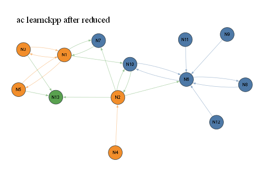

# ac learnckpp after reduced

- summary nodes: 33
- summary reactions: 22
- drawn nodes: 13
- drawn edges: 22
- colors: gas=blue, surface=orange, bulk/mixed=green

## N1 (orange)

Names: 8 merged: X_T(s), H_T(s), X_S(s), H_S(s), X_K(s), H_K(s), X_D(s), H_D(s)

Reactions:
- R21: X_T(s)+H_T(s)+X_S(s)+H_S(s)+X_K(s)+H_K(s)+X_D(s...
- R39: X_T(s)+H_T(s)+X_S(s)+H_S(s)+X_K(s)+H_K(s)+X_D(s...
- R40: C_T(s)+C_S(s)+C_K(s)+C_D(s) => X_T(s)+H_T(s)+X_...
- R53: C2_T(s)+C2_S(s)+C2_K(s)+C2_D(s) => X_T(s)+H_T(s...
- R54: X_T(s)+H_T(s)+X_S(s)+H_S(s)+X_K(s)+H_K(s)+X_D(s...
- R72: H => X_T(s)+H_T(s)+X_S(s)+H_S(s)+X_K(s)+H_K(s)+...
- R73: X_T(s)+H_T(s)+X_S(s)+H_S(s)+X_K(s)+H_K(s)+X_D(s...

## N2 (orange)

Names: 20 merged: CH3_T(s), CH2_T(s), CH_T(s), C2H2_T(s), C2H_T(s), CH3_S(s), CH2_S(s), CH_S(s), C2H2_S(s), C2H_S(s), CH3_K(s), CH2_K(s), CH_K(s), C2H2_K(s), C2H_K(s), CH3_D(s), CH2_D(s), CH_D(s), C2H2_D(s), C2H_D(s)

Reactions:
- R8: CH2+CH2(S)+CH3+CH4+C2H+C2H2+C2H3+C2H4+C2H5+C2H6...
- R9: CH3_T(s)+CH2_T(s)+CH_T(s)+C2H2_T(s)+C2H_T(s)+CH...
- R10: C2H4_T(s)+C2H4_S(s)+C2H4_K(s)+C2H4_D(s) => CH3_...
- R80: CH3_T(s)+CH2_T(s)+CH_T(s)+C2H2_T(s)+C2H_T(s)+CH...
- R86: CH3_T(s)+CH2_T(s)+CH_T(s)+C2H2_T(s)+C2H_T(s)+CH...
- R95: CH3_T(s)+CH2_T(s)+CH_T(s)+C2H2_T(s)+C2H_T(s)+CH...

## N3 (orange)

Names: 4 merged: C_T(s), C_S(s), C_K(s), C_D(s)

Reactions:
- R25: C_T(s)+C_S(s)+C_K(s)+C_D(s) => C_bulk
- R39: X_T(s)+H_T(s)+X_S(s)+H_S(s)+X_K(s)+H_K(s)+X_D(s...
- R40: C_T(s)+C_S(s)+C_K(s)+C_D(s) => X_T(s)+H_T(s)+X_...

## N4 (orange)

Names: 4 merged: C2H4_T(s), C2H4_S(s), C2H4_K(s), C2H4_D(s)

Reactions:
- R10: C2H4_T(s)+C2H4_S(s)+C2H4_K(s)+C2H4_D(s) => CH3_...

## N5 (orange)

Names: 4 merged: C2_T(s), C2_S(s), C2_K(s), C2_D(s)

Reactions:
- R28: C2_T(s)+C2_S(s)+C2_K(s)+C2_D(s) => C_bulk
- R53: C2_T(s)+C2_S(s)+C2_K(s)+C2_D(s) => X_T(s)+H_T(s...
- R54: X_T(s)+H_T(s)+X_S(s)+H_S(s)+X_K(s)+H_K(s)+X_D(s...

## N6 (blue)

Names: H2

Reactions:
- R42: H2 => OH
- R45: OH => H2
- R46: CH => H2
- R47: NH => H2
- R57: NNH => H2
- R80: CH3_T(s)+CH2_T(s)+CH_T(s)+C2H2_T(s)+C2H_T(s)+CH...
- R81: CH2+CH2(S)+CH3+CH4+C2H+C2H2+C2H3+C2H4+C2H5+C2H6...
- R82: H2 => CH2+CH2(S)+CH3+CH4+C2H+C2H2+C2H3+C2H4+C2H...

## N7 (blue)

Names: H

Reactions:
- R72: H => X_T(s)+H_T(s)+X_S(s)+H_S(s)+X_K(s)+H_K(s)+...
- R73: X_T(s)+H_T(s)+X_S(s)+H_S(s)+X_K(s)+H_K(s)+X_D(s...
- R86: CH3_T(s)+CH2_T(s)+CH_T(s)+C2H2_T(s)+C2H_T(s)+CH...

## N8 (blue)

Names: OH

Reactions:
- R42: H2 => OH
- R45: OH => H2

## N9 (blue)

Names: CH

Reactions:
- R46: CH => H2

## N10 (blue)

Names: 12 merged: CH2, CH2(S), CH3, CH4, C2H, C2H2, C2H3, C2H4, C2H5, C2H6, C3H7, C3H8

Reactions:
- R8: CH2+CH2(S)+CH3+CH4+C2H+C2H2+C2H3+C2H4+C2H5+C2H6...
- R9: CH3_T(s)+CH2_T(s)+CH_T(s)+C2H2_T(s)+C2H_T(s)+CH...
- R21: X_T(s)+H_T(s)+X_S(s)+H_S(s)+X_K(s)+H_K(s)+X_D(s...
- R81: CH2+CH2(S)+CH3+CH4+C2H+C2H2+C2H3+C2H4+C2H5+C2H6...
- R82: H2 => CH2+CH2(S)+CH3+CH4+C2H+C2H2+C2H3+C2H4+C2H...

## N11 (blue)

Names: NH

Reactions:
- R47: NH => H2

## N12 (blue)

Names: NNH

Reactions:
- R57: NNH => H2

## N13 (green)

Names: C_bulk

Reactions:
- R25: C_T(s)+C_S(s)+C_K(s)+C_D(s) => C_bulk
- R28: C2_T(s)+C2_S(s)+C2_K(s)+C2_D(s) => C_bulk
- R95: CH3_T(s)+CH2_T(s)+CH_T(s)+C2H2_T(s)+C2H_T(s)+CH...

SVG: [eval53viz_ac_large_learnckpp_after_reduced_simple.svg](eval53viz_ac_large_learnckpp_after_reduced_simple.svg)
