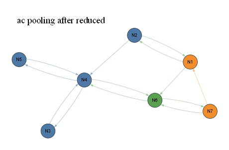

# ac pooling after reduced

- summary nodes: 8
- summary reactions: 13
- drawn nodes: 7
- drawn edges: 13
- colors: gas=blue, surface=orange, bulk/mixed=green

## N1 (orange)

Names: 39 merged: X_T(s), H_T(s), CH3_T(s), CH2_T(s), CH_T(s), C_T(s), C2H4_T(s), C2H2_T(s), C2H_T(s), C2_T(s), X_S(s), H_S(s), CH3_S(s), CH2_S(s), CH_S(s), C_S(s), C2H4_S(s), C2H2_S(s), C2H_S(s), C2_S(s), X_K(s), H_K(s), CH3_K(s), CH2_K(s), CH_K(s), C_K(s), C2H4_K(s), C2H2_K(s), C2H_K(s), C2_K(s), X_D(s), H_D(s), CH3_D(s), CH2_D(s), CH_D(s), C_D(s), C2H4_D(s), C2H2_D(s), C2H_D(s)

Reactions:
- R0: X_T(s)+H_T(s)+CH3_T(s)+CH2_T(s)+CH_T(s)+C_T(s)+...
- R1: H2+H+OH+H2O+HO2+H2O2+CH+CH2+CH2(S)+CH3+CH4+HCO+...
- R14: C2_D(s) => X_T(s)+H_T(s)+CH3_T(s)+CH2_T(s)+CH_T...
- R17: X_T(s)+H_T(s)+CH3_T(s)+CH2_T(s)+CH_T(s)+C_T(s)+...

## N2 (blue)

Names: 40 merged: H2, H, OH, H2O, HO2, H2O2, CH, CH2, CH2(S), CH3, CH4, HCO, CH2O, CH2OH, CH3O, CH3OH, C2H, C2H2, C2H3, C2H4, C2H5, C2H6, HCCO, CH2CO, HCCOH, NH, NH2, NH3, NNH, HNO, HCN, H2CN, HCNN, HCNO, HOCN, HNCO, C3H7, C3H8, CH2CHO, CH3CHO

Reactions:
- R0: X_T(s)+H_T(s)+CH3_T(s)+CH2_T(s)+CH_T(s)+C_T(s)+...
- R1: H2+H+OH+H2O+HO2+H2O2+CH+CH2+CH2(S)+CH3+CH4+HCO+...
- R16: H2+H+OH+H2O+HO2+H2O2+CH+CH2+CH2(S)+CH3+CH4+HCO+...

## N3 (blue)

Names: 8 merged: O, O2, CO, CO2, NO, NO2, N2O, NCO

Reactions:
- R6: O+O2+CO+CO2+NO+NO2+N2O+NCO => C+CN
- R7: C+CN => O+O2+CO+CO2+NO+NO2+N2O+NCO

## N4 (blue)

Names: 2 merged: C, CN

Reactions:
- R6: O+O2+CO+CO2+NO+NO2+N2O+NCO => C+CN
- R7: C+CN => O+O2+CO+CO2+NO+NO2+N2O+NCO
- R10: C+CN => C_bulk
- R11: C_bulk => C+CN
- R12: C+CN => N+N2
- R13: N+N2 => C+CN
- R16: H2+H+OH+H2O+HO2+H2O2+CH+CH2+CH2(S)+CH3+CH4+HCO+...

## N5 (blue)

Names: 2 merged: N, N2

Reactions:
- R12: C+CN => N+N2
- R13: N+N2 => C+CN

## N6 (green)

Names: C_bulk

Reactions:
- R2: C2_D(s) => C_bulk
- R3: C_bulk => C2_D(s)
- R10: C+CN => C_bulk
- R11: C_bulk => C+CN
- R17: X_T(s)+H_T(s)+CH3_T(s)+CH2_T(s)+CH_T(s)+C_T(s)+...

## N7 (orange)

Names: C2_D(s)

Reactions:
- R2: C2_D(s) => C_bulk
- R3: C_bulk => C2_D(s)
- R14: C2_D(s) => X_T(s)+H_T(s)+CH3_T(s)+CH2_T(s)+CH_T...

SVG: [eval53viz_ac_large_pooling_after_reduced_simple.svg](eval53viz_ac_large_pooling_after_reduced_simple.svg)
