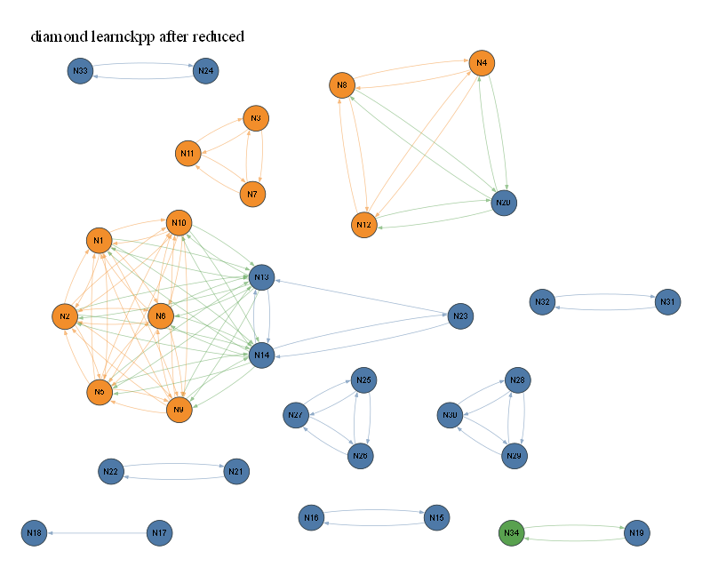

# diamond learnckpp after reduced

- summary nodes: 43
- summary reactions: 100
- drawn nodes: 34
- drawn edges: 100
- colors: gas=blue, surface=orange, bulk/mixed=green

## N1 (orange)

Names: t_c6HH

Reactions:
- R1: t_c6HH => t_c6H*+t_c6*H
- R2: t_c6HH => H2
- R7: t_c6H*+t_c6*H => t_c6HH
- R13: H2 => t_c6HH
- R30: H => t_c6HH
- R41: t_c6HH => s_c6HH
- R42: t_c6HH => s_c6H*+s_c6*H
- R43: t_c6HH => k_c6HH
- R44: t_c6HH => k_c6H*+k_c6*H
- R51: s_c6HH => t_c6HH
- R55: s_c6H*+s_c6*H => t_c6HH
- R61: k_c6HH => t_c6HH
- R65: k_c6H*+k_c6*H => t_c6HH
- R75: t_c6HH => H

## N2 (orange)

Names: 2 merged: t_c6H*, t_c6*H

Reactions:
- R1: t_c6HH => t_c6H*+t_c6*H
- R7: t_c6H*+t_c6*H => t_c6HH
- R10: t_c6H*+t_c6*H => H2
- R14: H2 => t_c6H*+t_c6*H
- R21: H => t_c6H*+t_c6*H
- R45: t_c6H*+t_c6*H => s_c6HH
- R46: t_c6H*+t_c6*H => s_c6H*+s_c6*H
- R47: t_c6H*+t_c6*H => k_c6HH
- R48: t_c6H*+t_c6*H => k_c6H*+k_c6*H
- R52: s_c6HH => t_c6H*+t_c6*H
- R56: s_c6H*+s_c6*H => t_c6H*+t_c6*H
- R62: k_c6HH => t_c6H*+t_c6*H
- R66: k_c6H*+k_c6*H => t_c6H*+t_c6*H
- R76: t_c6H*+t_c6*H => H

## N3 (orange)

Names: 3 merged: t_c6HM, t_c6HM*, t_c6*M

Reactions:
- R24: t_c6HM+t_c6HM*+t_c6*M => s_c6HM+s_c6HM*+s_c6*M
- R25: t_c6HM+t_c6HM*+t_c6*M => k_c6HM+k_c6HM*+k_c6*M
- R26: s_c6HM+s_c6HM*+s_c6*M => t_c6HM+t_c6HM*+t_c6*M
- R28: k_c6HM+k_c6HM*+k_c6*M => t_c6HM+t_c6HM*+t_c6*M

## N4 (orange)

Names: t_c6B

Reactions:
- R49: t_c6B => s_c6B
- R50: t_c6B => k_c6B
- R59: s_c6B => t_c6B
- R69: k_c6B => t_c6B
- R90: t_c6B => CH
- R93: CH => t_c6B

## N5 (orange)

Names: s_c6HH

Reactions:
- R3: s_c6HH => s_c6H*+s_c6*H
- R4: s_c6HH => H2
- R8: s_c6H*+s_c6*H => s_c6HH
- R15: H2 => s_c6HH
- R31: H => s_c6HH
- R41: t_c6HH => s_c6HH
- R45: t_c6H*+t_c6*H => s_c6HH
- R51: s_c6HH => t_c6HH
- R52: s_c6HH => t_c6H*+t_c6*H
- R53: s_c6HH => k_c6HH
- R54: s_c6HH => k_c6H*+k_c6*H
- R63: k_c6HH => s_c6HH
- R67: k_c6H*+k_c6*H => s_c6HH
- R77: s_c6HH => H

## N6 (orange)

Names: 2 merged: s_c6H*, s_c6*H

Reactions:
- R3: s_c6HH => s_c6H*+s_c6*H
- R8: s_c6H*+s_c6*H => s_c6HH
- R11: s_c6H*+s_c6*H => H2
- R16: H2 => s_c6H*+s_c6*H
- R22: H => s_c6H*+s_c6*H
- R42: t_c6HH => s_c6H*+s_c6*H
- R46: t_c6H*+t_c6*H => s_c6H*+s_c6*H
- R55: s_c6H*+s_c6*H => t_c6HH
- R56: s_c6H*+s_c6*H => t_c6H*+t_c6*H
- R57: s_c6H*+s_c6*H => k_c6HH
- R58: s_c6H*+s_c6*H => k_c6H*+k_c6*H
- R64: k_c6HH => s_c6H*+s_c6*H
- R68: k_c6H*+k_c6*H => s_c6H*+s_c6*H
- R78: s_c6H*+s_c6*H => H

## N7 (orange)

Names: 3 merged: s_c6HM, s_c6HM*, s_c6*M

Reactions:
- R24: t_c6HM+t_c6HM*+t_c6*M => s_c6HM+s_c6HM*+s_c6*M
- R26: s_c6HM+s_c6HM*+s_c6*M => t_c6HM+t_c6HM*+t_c6*M
- R27: s_c6HM+s_c6HM*+s_c6*M => k_c6HM+k_c6HM*+k_c6*M
- R29: k_c6HM+k_c6HM*+k_c6*M => s_c6HM+s_c6HM*+s_c6*M

## N8 (orange)

Names: s_c6B

Reactions:
- R49: t_c6B => s_c6B
- R59: s_c6B => t_c6B
- R60: s_c6B => k_c6B
- R70: k_c6B => s_c6B
- R91: s_c6B => CH
- R94: CH => s_c6B

## N9 (orange)

Names: k_c6HH

Reactions:
- R5: k_c6HH => k_c6H*+k_c6*H
- R6: k_c6HH => H2
- R9: k_c6H*+k_c6*H => k_c6HH
- R17: H2 => k_c6HH
- R32: H => k_c6HH
- R43: t_c6HH => k_c6HH
- R47: t_c6H*+t_c6*H => k_c6HH
- R53: s_c6HH => k_c6HH
- R57: s_c6H*+s_c6*H => k_c6HH
- R61: k_c6HH => t_c6HH
- R62: k_c6HH => t_c6H*+t_c6*H
- R63: k_c6HH => s_c6HH
- R64: k_c6HH => s_c6H*+s_c6*H
- R79: k_c6HH => H

## N10 (orange)

Names: 2 merged: k_c6H*, k_c6*H

Reactions:
- R5: k_c6HH => k_c6H*+k_c6*H
- R9: k_c6H*+k_c6*H => k_c6HH
- R12: k_c6H*+k_c6*H => H2
- R18: H2 => k_c6H*+k_c6*H
- R23: H => k_c6H*+k_c6*H
- R44: t_c6HH => k_c6H*+k_c6*H
- R48: t_c6H*+t_c6*H => k_c6H*+k_c6*H
- R54: s_c6HH => k_c6H*+k_c6*H
- R58: s_c6H*+s_c6*H => k_c6H*+k_c6*H
- R65: k_c6H*+k_c6*H => t_c6HH
- R66: k_c6H*+k_c6*H => t_c6H*+t_c6*H
- R67: k_c6H*+k_c6*H => s_c6HH
- R68: k_c6H*+k_c6*H => s_c6H*+s_c6*H
- R80: k_c6H*+k_c6*H => H

## N11 (orange)

Names: 3 merged: k_c6HM, k_c6HM*, k_c6*M

Reactions:
- R25: t_c6HM+t_c6HM*+t_c6*M => k_c6HM+k_c6HM*+k_c6*M
- R27: s_c6HM+s_c6HM*+s_c6*M => k_c6HM+k_c6HM*+k_c6*M
- R28: k_c6HM+k_c6HM*+k_c6*M => t_c6HM+t_c6HM*+t_c6*M
- R29: k_c6HM+k_c6HM*+k_c6*M => s_c6HM+s_c6HM*+s_c6*M

## N12 (orange)

Names: k_c6B

Reactions:
- R50: t_c6B => k_c6B
- R60: s_c6B => k_c6B
- R69: k_c6B => t_c6B
- R70: k_c6B => s_c6B
- R92: k_c6B => CH
- R95: CH => k_c6B

## N13 (blue)

Names: H2

Reactions:
- R0: H => H2
- R2: t_c6HH => H2
- R4: s_c6HH => H2
- R6: k_c6HH => H2
- R10: t_c6H*+t_c6*H => H2
- R11: s_c6H*+s_c6*H => H2
- R12: k_c6H*+k_c6*H => H2
- R13: H2 => t_c6HH
- R14: H2 => t_c6H*+t_c6*H
- R15: H2 => s_c6HH
- R16: H2 => s_c6H*+s_c6*H
- R17: H2 => k_c6HH
- R18: H2 => k_c6H*+k_c6*H
- R73: H2 => H
- R87: CH2+CH2(S)+CH3+CH4+C2H+C2H2+C2H3+C2H4+C2H5+C2H6...

## N14 (blue)

Names: H

Reactions:
- R0: H => H2
- R21: H => t_c6H*+t_c6*H
- R22: H => s_c6H*+s_c6*H
- R23: H => k_c6H*+k_c6*H
- R30: H => t_c6HH
- R31: H => s_c6HH
- R32: H => k_c6HH
- R73: H2 => H
- R74: H => CH2+CH2(S)+CH3+CH4+C2H+C2H2+C2H3+C2H4+C2H5...
- R75: t_c6HH => H
- R76: t_c6H*+t_c6*H => H
- R77: s_c6HH => H
- R78: s_c6H*+s_c6*H => H
- R79: k_c6HH => H
- R80: k_c6H*+k_c6*H => H
- R99: CH2+CH2(S)+CH3+CH4+C2H+C2H2+C2H3+C2H4+C2H5+C2H6...

## N15 (blue)

Names: O

Reactions:
- R81: O => O2
- R82: O2 => O

## N16 (blue)

Names: O2

Reactions:
- R81: O => O2
- R82: O2 => O

## N17 (blue)

Names: OH

Reactions:
- R98: OH => H2O+HO2+H2O2

## N18 (blue)

Names: 3 merged: H2O, HO2, H2O2

Reactions:
- R98: OH => H2O+HO2+H2O2

## N19 (blue)

Names: C

Reactions:
- R19: C => C(d)
- R20: C(d) => C

## N20 (blue)

Names: CH

Reactions:
- R90: t_c6B => CH
- R91: s_c6B => CH
- R92: k_c6B => CH
- R93: CH => t_c6B
- R94: CH => s_c6B
- R95: CH => k_c6B

## N21 (blue)

Names: CO

Reactions:
- R33: CO => CO2
- R34: CO2 => CO

## N22 (blue)

Names: CO2

Reactions:
- R33: CO => CO2
- R34: CO2 => CO

## N23 (blue)

Names: 12 merged: CH2, CH2(S), CH3, CH4, C2H, C2H2, C2H3, C2H4, C2H5, C2H6, C3H7, C3H8

Reactions:
- R74: H => CH2+CH2(S)+CH3+CH4+C2H+C2H2+C2H3+C2H4+C2H5...
- R87: CH2+CH2(S)+CH3+CH4+C2H+C2H2+C2H3+C2H4+C2H5+C2H6...
- R99: CH2+CH2(S)+CH3+CH4+C2H+C2H2+C2H3+C2H4+C2H5+C2H6...

## N24 (blue)

Names: N

Reactions:
- R83: N => N2
- R86: N2 => N

## N25 (blue)

Names: NH

Reactions:
- R35: NH => NNH
- R36: NNH => NH
- R96: NH => NH2+NH3
- R97: NH2+NH3 => NH

## N26 (blue)

Names: 2 merged: NH2, NH3

Reactions:
- R88: NH2+NH3 => NNH
- R89: NNH => NH2+NH3
- R96: NH => NH2+NH3
- R97: NH2+NH3 => NH

## N27 (blue)

Names: NNH

Reactions:
- R35: NH => NNH
- R36: NNH => NH
- R88: NH2+NH3 => NNH
- R89: NNH => NH2+NH3

## N28 (blue)

Names: NO

Reactions:
- R37: NO => NO2
- R38: NO => N2O
- R39: NO2 => NO
- R40: N2O => NO

## N29 (blue)

Names: NO2

Reactions:
- R37: NO => NO2
- R39: NO2 => NO
- R84: NO2 => N2O
- R85: N2O => NO2

## N30 (blue)

Names: N2O

Reactions:
- R38: NO => N2O
- R40: N2O => NO
- R84: NO2 => N2O
- R85: N2O => NO2

## N31 (blue)

Names: 2 merged: HCN, H2CN

Reactions:
- R71: HCN+H2CN => HCNN
- R72: HCNN => HCN+H2CN

## N32 (blue)

Names: HCNN

Reactions:
- R71: HCN+H2CN => HCNN
- R72: HCNN => HCN+H2CN

## N33 (blue)

Names: N2

Reactions:
- R83: N => N2
- R86: N2 => N

## N34 (green)

Names: C(d)

Reactions:
- R19: C => C(d)
- R20: C(d) => C

SVG: [eval53viz_diamond_large_learnckpp_after_reduced_simple.svg](eval53viz_diamond_large_learnckpp_after_reduced_simple.svg)
