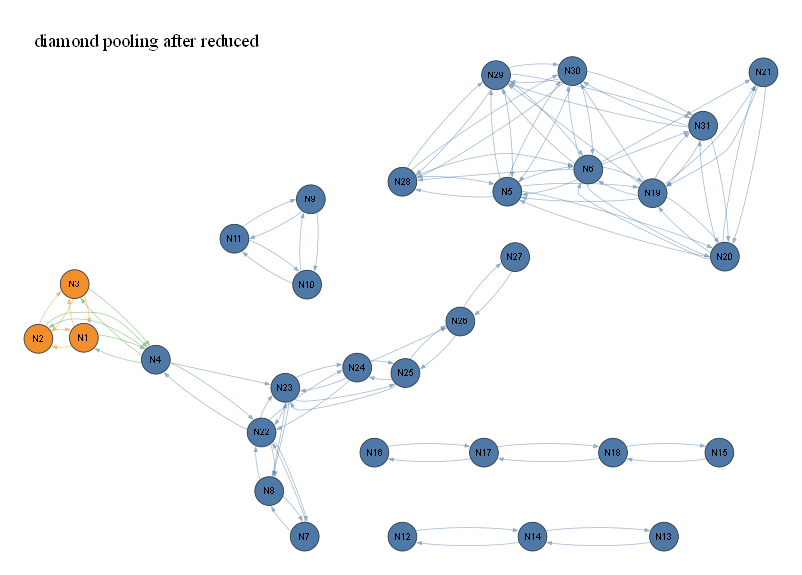

# diamond pooling after reduced

- summary nodes: 40
- summary reactions: 100
- drawn nodes: 31
- drawn edges: 100
- colors: gas=blue, surface=orange, bulk/mixed=green

## N1 (orange)

Names: 7 merged: t_c6HH, t_c6H*, t_c6*H, t_c6HM, t_c6HM*, t_c6*M, t_c6B

Reactions:
- R1: H2+H+OH+H2O+HO2+H2O2+CH+CH2+CH2(S)+CH3+CH4+HCO ...
- R4: t_c6HH+t_c6H*+t_c6*H+t_c6HM+t_c6HM*+t_c6*M+t_c6...
- R57: t_c6HH+t_c6H*+t_c6*H+t_c6HM+t_c6HM*+t_c6*M+t_c6...
- R58: t_c6HH+t_c6H*+t_c6*H+t_c6HM+t_c6HM*+t_c6*M+t_c6...
- R59: s_c6HH+s_c6H*+s_c6*H+s_c6HM+s_c6HM*+s_c6*M+s_c6...
- R61: k_c6HH+k_c6H*+k_c6*H+k_c6HM+k_c6HM*+k_c6*M+k_c6...

## N2 (orange)

Names: 7 merged: s_c6HH, s_c6H*, s_c6*H, s_c6HM, s_c6HM*, s_c6*M, s_c6B

Reactions:
- R0: H2+H+OH+H2O+HO2+H2O2+CH+CH2+CH2(S)+CH3+CH4+HCO ...
- R3: s_c6HH+s_c6H*+s_c6*H+s_c6HM+s_c6HM*+s_c6*M+s_c6...
- R57: t_c6HH+t_c6H*+t_c6*H+t_c6HM+t_c6HM*+t_c6*M+t_c6...
- R59: s_c6HH+s_c6H*+s_c6*H+s_c6HM+s_c6HM*+s_c6*M+s_c6...
- R60: s_c6HH+s_c6H*+s_c6*H+s_c6HM+s_c6HM*+s_c6*M+s_c6...
- R62: k_c6HH+k_c6H*+k_c6*H+k_c6HM+k_c6HM*+k_c6*M+k_c6...

## N3 (orange)

Names: 7 merged: k_c6HH, k_c6H*, k_c6*H, k_c6HM, k_c6HM*, k_c6*M, k_c6B

Reactions:
- R2: H2+H+OH+H2O+HO2+H2O2+CH+CH2+CH2(S)+CH3+CH4+HCO ...
- R5: k_c6HH+k_c6H*+k_c6*H+k_c6HM+k_c6HM*+k_c6*M+k_c6...
- R58: t_c6HH+t_c6H*+t_c6*H+t_c6HM+t_c6HM*+t_c6*M+t_c6...
- R60: s_c6HH+s_c6H*+s_c6*H+s_c6HM+s_c6HM*+s_c6*M+s_c6...
- R61: k_c6HH+k_c6H*+k_c6*H+k_c6HM+k_c6HM*+k_c6*M+k_c6...
- R62: k_c6HH+k_c6H*+k_c6*H+k_c6HM+k_c6HM*+k_c6*M+k_c6...

## N4 (blue)

Names: 12 merged: H2, H, OH, H2O, HO2, H2O2, CH, CH2, CH2(S), CH3, CH4, HCO

Reactions:
- R0: H2+H+OH+H2O+HO2+H2O2+CH+CH2+CH2(S)+CH3+CH4+HCO ...
- R1: H2+H+OH+H2O+HO2+H2O2+CH+CH2+CH2(S)+CH3+CH4+HCO ...
- R2: H2+H+OH+H2O+HO2+H2O2+CH+CH2+CH2(S)+CH3+CH4+HCO ...
- R3: s_c6HH+s_c6H*+s_c6*H+s_c6HM+s_c6HM*+s_c6*M+s_c6...
- R4: t_c6HH+t_c6H*+t_c6*H+t_c6HM+t_c6HM*+t_c6*M+t_c6...
- R5: k_c6HH+k_c6H*+k_c6*H+k_c6HM+k_c6HM*+k_c6*M+k_c6...
- R97: H2+H+OH+H2O+HO2+H2O2+CH+CH2+CH2(S)+CH3+CH4+HCO ...
- R98: H2+H+OH+H2O+HO2+H2O2+CH+CH2+CH2(S)+CH3+CH4+HCO ...
- R99: C2H6 => H2+H+OH+H2O+HO2+H2O2+CH+CH2+CH2(S)+CH3+...

## N5 (blue)

Names: CH3CHO

Reactions:
- R22: CH3CHO => CH2CHO
- R23: CH3CHO => CH3OH
- R24: CH2CHO => CH3CHO
- R25: CH3OH => CH3CHO
- R74: CH3CHO => HCCOH
- R75: CH3CHO => CH2CO
- R76: CH3CHO => CH3O
- R77: CH3CHO => CH2OH
- R79: HCCOH => CH3CHO
- R80: CH2CO => CH3CHO
- R84: CH3O => CH3CHO
- R85: CH2OH => CH3CHO

## N6 (blue)

Names: CH2CHO

Reactions:
- R22: CH3CHO => CH2CHO
- R24: CH2CHO => CH3CHO
- R28: CH2CHO => HCCOH
- R29: CH2CHO => CH2CO
- R30: CH2CHO => CH3O
- R31: CH2CHO => CH2OH
- R32: HCCOH => CH2CHO
- R33: CH2CO => CH2CHO
- R36: CH3O => CH2CHO
- R38: CH2OH => CH2CHO
- R78: CH2CHO => CH3OH
- R83: CH3OH => CH2CHO
- R89: CH2CHO => HCCO
- R90: CH2CHO => CH2O

## N7 (blue)

Names: C3H8

Reactions:
- R18: C3H8 => C3H7
- R19: C3H7 => C3H8
- R72: C3H8 => C2H6
- R73: C2H6 => C3H8

## N8 (blue)

Names: C3H7

Reactions:
- R18: C3H8 => C3H7
- R19: C3H7 => C3H8
- R42: C3H7 => C2H6
- R49: C2H6 => C3H7
- R86: C3H7 => C2H5
- R87: C2H5 => C3H7

## N9 (blue)

Names: HNCO

Reactions:
- R7: HNCO => HOCN
- R8: HNCO => HCNO
- R9: HOCN => HNCO
- R11: HCNO => HNCO

## N10 (blue)

Names: HOCN

Reactions:
- R7: HNCO => HOCN
- R9: HOCN => HNCO
- R10: HOCN => HCNO
- R12: HCNO => HOCN

## N11 (blue)

Names: HCNO

Reactions:
- R8: HNCO => HCNO
- R10: HOCN => HCNO
- R11: HCNO => HNCO
- R12: HCNO => HOCN

## N12 (blue)

Names: HCNN

Reactions:
- R63: HCNN => HCN
- R65: HCN => HCNN

## N13 (blue)

Names: H2CN

Reactions:
- R64: H2CN => HCN
- R66: HCN => H2CN

## N14 (blue)

Names: HCN

Reactions:
- R63: HCNN => HCN
- R64: H2CN => HCN
- R65: HCN => HCNN
- R66: HCN => H2CN

## N15 (blue)

Names: NNH

Reactions:
- R91: NNH => NH
- R93: NH => NNH

## N16 (blue)

Names: NH3

Reactions:
- R67: NH3 => NH2
- R68: NH2 => NH3

## N17 (blue)

Names: NH2

Reactions:
- R67: NH3 => NH2
- R68: NH2 => NH3
- R92: NH2 => NH
- R94: NH => NH2

## N18 (blue)

Names: NH

Reactions:
- R91: NNH => NH
- R92: NH2 => NH
- R93: NH => NNH
- R94: NH => NH2

## N19 (blue)

Names: HCCOH

Reactions:
- R13: HCCOH => CH2CO
- R14: CH2CO => HCCOH
- R28: CH2CHO => HCCOH
- R32: HCCOH => CH2CHO
- R43: HCCOH => HCCO
- R44: HCCOH => CH2O
- R47: HCCO => HCCOH
- R52: CH2O => HCCOH
- R74: CH3CHO => HCCOH
- R79: HCCOH => CH3CHO
- R95: HCCOH => CH3O
- R96: HCCOH => CH2OH

## N20 (blue)

Names: CH2CO

Reactions:
- R13: HCCOH => CH2CO
- R14: CH2CO => HCCOH
- R29: CH2CHO => CH2CO
- R33: CH2CO => CH2CHO
- R45: CH2CO => HCCO
- R46: CH2CO => CH2O
- R48: HCCO => CH2CO
- R53: CH2O => CH2CO
- R75: CH3CHO => CH2CO
- R80: CH2CO => CH3CHO

## N21 (blue)

Names: HCCO

Reactions:
- R43: HCCOH => HCCO
- R45: CH2CO => HCCO
- R47: HCCO => HCCOH
- R48: HCCO => CH2CO
- R89: CH2CHO => HCCO

## N22 (blue)

Names: C2H6

Reactions:
- R6: C2H6 => C2H5
- R20: C2H5 => C2H6
- R42: C3H7 => C2H6
- R49: C2H6 => C3H7
- R69: C2H6 => C2H4
- R70: C2H4 => C2H6
- R72: C3H8 => C2H6
- R73: C2H6 => C3H8
- R98: H2+H+OH+H2O+HO2+H2O2+CH+CH2+CH2(S)+CH3+CH4+HCO ...
- R99: C2H6 => H2+H+OH+H2O+HO2+H2O2+CH+CH2+CH2(S)+CH3+...

## N23 (blue)

Names: C2H5

Reactions:
- R6: C2H6 => C2H5
- R17: C2H4 => C2H5
- R20: C2H5 => C2H6
- R21: C2H5 => C2H4
- R81: C2H5 => C2H3
- R82: C2H3 => C2H5
- R86: C3H7 => C2H5
- R87: C2H5 => C3H7
- R97: H2+H+OH+H2O+HO2+H2O2+CH+CH2+CH2(S)+CH3+CH4+HCO ...

## N24 (blue)

Names: C2H4

Reactions:
- R17: C2H4 => C2H5
- R21: C2H5 => C2H4
- R26: C2H4 => C2H3
- R27: C2H3 => C2H4
- R69: C2H6 => C2H4
- R70: C2H4 => C2H6
- R88: C2H4 => C2H2

## N25 (blue)

Names: C2H3

Reactions:
- R26: C2H4 => C2H3
- R27: C2H3 => C2H4
- R40: C2H2 => C2H3
- R41: C2H3 => C2H2
- R81: C2H5 => C2H3
- R82: C2H3 => C2H5

## N26 (blue)

Names: C2H2

Reactions:
- R40: C2H2 => C2H3
- R41: C2H3 => C2H2
- R56: C2H => C2H2
- R71: C2H2 => C2H
- R88: C2H4 => C2H2

## N27 (blue)

Names: C2H

Reactions:
- R56: C2H => C2H2
- R71: C2H2 => C2H

## N28 (blue)

Names: CH3OH

Reactions:
- R23: CH3CHO => CH3OH
- R25: CH3OH => CH3CHO
- R34: CH3OH => CH3O
- R35: CH3OH => CH2OH
- R37: CH3O => CH3OH
- R39: CH2OH => CH3OH
- R78: CH2CHO => CH3OH
- R83: CH3OH => CH2CHO

## N29 (blue)

Names: CH3O

Reactions:
- R15: CH3O => CH2OH
- R16: CH2OH => CH3O
- R30: CH2CHO => CH3O
- R34: CH3OH => CH3O
- R36: CH3O => CH2CHO
- R37: CH3O => CH3OH
- R50: CH3O => CH2O
- R54: CH2O => CH3O
- R76: CH3CHO => CH3O
- R84: CH3O => CH3CHO
- R95: HCCOH => CH3O

## N30 (blue)

Names: CH2OH

Reactions:
- R15: CH3O => CH2OH
- R16: CH2OH => CH3O
- R31: CH2CHO => CH2OH
- R35: CH3OH => CH2OH
- R38: CH2OH => CH2CHO
- R39: CH2OH => CH3OH
- R51: CH2OH => CH2O
- R55: CH2O => CH2OH
- R77: CH3CHO => CH2OH
- R85: CH2OH => CH3CHO
- R96: HCCOH => CH2OH

## N31 (blue)

Names: CH2O

Reactions:
- R44: HCCOH => CH2O
- R46: CH2CO => CH2O
- R50: CH3O => CH2O
- R51: CH2OH => CH2O
- R52: CH2O => HCCOH
- R53: CH2O => CH2CO
- R54: CH2O => CH3O
- R55: CH2O => CH2OH
- R90: CH2CHO => CH2O

SVG: [eval53viz_diamond_large_pooling_after_reduced_simple.svg](eval53viz_diamond_large_pooling_after_reduced_simple.svg)
