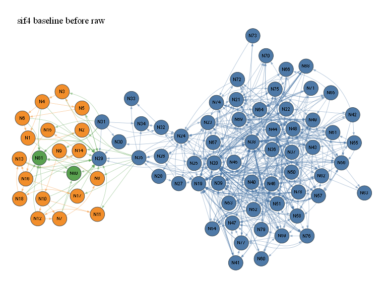

# sif4 baseline before raw

- summary nodes: 82
- summary reactions: 365
- drawn nodes: 81
- drawn edges: 649
- colors: gas=blue, surface=orange, bulk/mixed=green

## N1 (orange)

Names: t_HN_SIF(S)

Reactions:
- R350: NH3 + t_HN_SIF(S) => HF + SI(D) + t_HN_NH2(S)
- R352: t_F2SINH(S) + t_HN(FSINH)2(S) => HF + N(D) + 3 ...

## N2 (orange)

Names: t_HN_NH2(S)

Reactions:
- R350: NH3 + t_HN_SIF(S) => HF + SI(D) + t_HN_NH2(S)
- R351: SIF4 + t_HN_NH2(S) => HF + N(D) + t_F3SI_NH2(S)

## N3 (orange)

Names: t_F3SI_NH2(S)

Reactions:
- R351: SIF4 + t_HN_NH2(S) => HF + N(D) + t_F3SI_NH2(S)
- R347: t_F3SI_NH2(S) => HF + t_F2SINH(S)

## N4 (orange)

Names: t_F2SINH(S)

Reactions:
- R348, 349, 352: NH3 + t_F2SINH(S) => HF + t_H2NFSINH(S) | t_F2SINH(S) + t_H2NFSINH(S) => HF + t_HN(FSINH)... | t_F2SINH(S) + t_HN(FSINH)2(S) => HF + N(D) + 3 ...
- R347: t_F3SI_NH2(S) => HF + t_F2SINH(S)
- R348: NH3 + t_F2SINH(S) => HF + t_H2NFSINH(S)
- R352: t_F2SINH(S) + t_HN(FSINH)2(S) => HF + N(D) + 3 ...
- R349: t_F2SINH(S) + t_H2NFSINH(S) => HF + t_HN(FSINH)...

## N5 (orange)

Names: t_H2NFSINH(S)

Reactions:
- R348: NH3 + t_F2SINH(S) => HF + t_H2NFSINH(S)
- R349: t_F2SINH(S) + t_H2NFSINH(S) => HF + t_HN(FSINH)...

## N6 (orange)

Names: t_HN(FSINH)2(S)

Reactions:
- R352: t_F2SINH(S) + t_HN(FSINH)2(S) => HF + N(D) + 3 ...
- R349: t_F2SINH(S) + t_H2NFSINH(S) => HF + t_HN(FSINH)...

## N7 (orange)

Names: s_HN_SIF(S)

Reactions:
- R356: NH3 + s_HN_SIF(S) => HF + SI(D) + s_HN_NH2(S)
- R358: s_F2SINH(S) + s_HN(FSINH)2(S) => HF + N(D) + 3 ...

## N8 (orange)

Names: s_HN_NH2(S)

Reactions:
- R356: NH3 + s_HN_SIF(S) => HF + SI(D) + s_HN_NH2(S)
- R357: SIF4 + s_HN_NH2(S) => HF + N(D) + s_F3SI_NH2(S)

## N9 (orange)

Names: s_F3SI_NH2(S)

Reactions:
- R357: SIF4 + s_HN_NH2(S) => HF + N(D) + s_F3SI_NH2(S)
- R353: s_F3SI_NH2(S) => HF + s_F2SINH(S)

## N10 (orange)

Names: s_F2SINH(S)

Reactions:
- R354, 355, 358: NH3 + s_F2SINH(S) => HF + s_H2NFSINH(S) | s_F2SINH(S) + s_H2NFSINH(S) => HF + s_HN(FSINH)... | s_F2SINH(S) + s_HN(FSINH)2(S) => HF + N(D) + 3 ...
- R353: s_F3SI_NH2(S) => HF + s_F2SINH(S)
- R354: NH3 + s_F2SINH(S) => HF + s_H2NFSINH(S)
- R358: s_F2SINH(S) + s_HN(FSINH)2(S) => HF + N(D) + 3 ...
- R355: s_F2SINH(S) + s_H2NFSINH(S) => HF + s_HN(FSINH)...

## N11 (orange)

Names: s_H2NFSINH(S)

Reactions:
- R354: NH3 + s_F2SINH(S) => HF + s_H2NFSINH(S)
- R355: s_F2SINH(S) + s_H2NFSINH(S) => HF + s_HN(FSINH)...

## N12 (orange)

Names: s_HN(FSINH)2(S)

Reactions:
- R358: s_F2SINH(S) + s_HN(FSINH)2(S) => HF + N(D) + 3 ...
- R355: s_F2SINH(S) + s_H2NFSINH(S) => HF + s_HN(FSINH)...

## N13 (orange)

Names: k_HN_SIF(S)

Reactions:
- R362: NH3 + k_HN_SIF(S) => HF + SI(D) + k_HN_NH2(S)
- R364: k_F2SINH(S) + k_HN(FSINH)2(S) => HF + N(D) + 3 ...

## N14 (orange)

Names: k_HN_NH2(S)

Reactions:
- R362: NH3 + k_HN_SIF(S) => HF + SI(D) + k_HN_NH2(S)
- R363: SIF4 + k_HN_NH2(S) => HF + N(D) + k_F3SI_NH2(S)

## N15 (orange)

Names: k_F3SI_NH2(S)

Reactions:
- R363: SIF4 + k_HN_NH2(S) => HF + N(D) + k_F3SI_NH2(S)
- R359: k_F3SI_NH2(S) => HF + k_F2SINH(S)

## N16 (orange)

Names: k_F2SINH(S)

Reactions:
- R360, 361, 364: NH3 + k_F2SINH(S) => HF + k_H2NFSINH(S) | k_F2SINH(S) + k_H2NFSINH(S) => HF + k_HN(FSINH)... | k_F2SINH(S) + k_HN(FSINH)2(S) => HF + N(D) + 3 ...
- R359: k_F3SI_NH2(S) => HF + k_F2SINH(S)
- R360: NH3 + k_F2SINH(S) => HF + k_H2NFSINH(S)
- R364: k_F2SINH(S) + k_HN(FSINH)2(S) => HF + N(D) + 3 ...
- R361: k_F2SINH(S) + k_H2NFSINH(S) => HF + k_HN(FSINH)...

## N17 (orange)

Names: k_H2NFSINH(S)

Reactions:
- R360: NH3 + k_F2SINH(S) => HF + k_H2NFSINH(S)
- R361: k_F2SINH(S) + k_H2NFSINH(S) => HF + k_HN(FSINH)...

## N18 (orange)

Names: k_HN(FSINH)2(S)

Reactions:
- R364: k_F2SINH(S) + k_HN(FSINH)2(S) => HF + N(D) + 3 ...
- R361: k_F2SINH(S) + k_H2NFSINH(S) => HF + k_HN(FSINH)...

## N19 (blue)

Names: H2

Reactions:
- R0, 1, 3, 4, 5, 7, 14, 23, 71, 72, 75, 77: 2 H + M <=> H2 + M | 2 H + H2 <=> H2 + H2 | H + NH <=> H2 + N | H + NH2 <=> H2 + NH | H + NH3 <=> H2 + NH2 | H + NNH <=> H2 + N2
- R5: H + NH3 <=> H2 + NH2
- R4, 17: H + NH2 <=> H2 + NH | 2 NH2 <=> H2 + N2H2
- R35, 114, 154, 164, 174, 200, 244: H2 + O <=> H + OH | H2 + OH <=> H + H2O | CH + H2 <=> CH2 + H | CH2 + H2 <=> CH3 + H | CH2(S) + H2 <=> CH3 + H | C2H + H2 <=> C2H2 + H
- R114: H2 + OH <=> H + H2O
- R35: H2 + O <=> H + OH
- R3, 223: H + NH <=> H2 + N | H2O + NH <=> H2 + HNO
- R14: H + N2H2 <=> H2 + NNH
- R83: CH4 + H <=> CH3 + H2
- R105, 202: C2H4 + H <=> C2H3 + H2 | C2H4 (+M) <=> C2H2 + H2 (+M)
- R88: CH2O + H <=> H2 + HCO
- R237: H + HNO <=> H2 + NO
- R223, 314: H2O + NH <=> H2 + HNO | CH2(S) + H2O => CH2O + H2
- R299, 306, 309: CH3 + N <=> H2 + HCN | CH3 + O => CO + H + H2 | CH3 + OH => CH2O + H2
- R40, 306: CH2(S) + O <=> CO + H2 | CH3 + O => CO + H + H2
- R299: CH3 + N <=> H2 + HCN
- R98, 99: CH3OH + H <=> CH2OH + H2 | CH3OH + H <=> CH3O + H2
- R164, 174, 310: CH2 + H2 <=> CH3 + H | CH2(S) + H2 <=> CH3 + H | CH + H2 (+M) <=> CH3 (+M)
- R108: C2H6 + H <=> C2H5 + H2
- R110: CH2CO + H <=> H2 + HCCO
- R75: H + HO2 <=> H2 + O2
- R7: H + NNH <=> H2 + N2
- R154: CH + H2 <=> CH2 + H
- R85: H + HCO <=> CO + H2
- R103: C2H3 + H <=> C2H2 + H2
- R77: H + H2O2 <=> H2 + HO2
- R289: H + HNCO <=> H2 + NCO
- R309: CH3 + OH => CH2O + H2
- R200: C2H + H2 <=> C2H2 + H
- R40, 81, 314: CH2(S) + O <=> CO + H2 | CH2(S) + H <=> CH + H2 | CH2(S) + H2O => CH2O + H2
- R107: C2H5 + H <=> C2H4 + H2
- R320, 321: CH3CHO + H <=> CH2CHO + H2 | CH3CHO + H => CH3 + CO + H2
- R95: CH3O + H <=> CH2O + H2
- R90: CH2OH + H <=> CH2O + H2
- R113: CO + H2 (+M) <=> CH2O (+M)
- R79: CH + H <=> C + H2
- R244: CN + H2 <=> H + HCN
- R23: H + N2H4 <=> H2 + N2H3
- R330: CH2CHO + H <=> CH2CO + H2
- R165: 2 CH2 <=> C2H2 + H2
- R335: C3H8 + H <=> C3H7 + H2

## N20 (blue)

Names: H

Reactions:
- R0, 1, 3, 4, 5, 7, 14, 23, 71, 72, 75, 77: 2 H + M <=> H2 + M | 2 H + H2 <=> H2 + H2 | H + NH <=> H2 + N | H + NH2 <=> H2 + NH | H + NH3 <=> H2 + NH2 | H + NNH <=> H2 + N2
- R5, 19, 25, 288, 295: H + NH3 <=> H2 + NH2 | H + N2H3 <=> 2 NH2 | H + NH + M <=> NH2 + M | H + HNCO <=> CO + NH2 | H + HCNO <=> CO + NH2
- R6, 229: NNH <=> H + N2 | NNH + M <=> H + N2 + M
- R4, 246: H + NH2 <=> H2 + NH | H + NCO <=> CO + NH
- R10, 12, 227: NH + NH2 <=> H + N2H2 | N + NH2 <=> 2 H + N2 | NH2 + O <=> H + HNO
- R13: N2H2 + M <=> H + NNH + M
- R2, 10, 11, 218, 219, 225: N + NH <=> H + N2 | NH + NH2 <=> H + N2H2 | 2 NH <=> 2 H + N2 | NH + O <=> H + NO | NH + OH <=> H + HNO | NH + NO <=> H + N2O
- R35, 114, 154, 164, 174, 200, 244: H2 + O <=> H + OH | H2 + OH <=> H + H2O | CH + H2 <=> CH2 + H | CH2 + H2 <=> CH3 + H | CH2(S) + H2 <=> CH3 + H | C2H + H2 <=> C2H2 + H
- R34, 70, 76, 78, 91, 96, 211, 217, 294: H + O + M <=> OH + M | H + O2 <=> O + OH | H + HO2 <=> 2 OH | H + H2O2 <=> H2O + OH | CH2OH + H <=> CH3 + OH | CH3O + H <=> CH3 + OH
- R70, 74: H + O2 <=> O + OH | H + HO2 <=> H2O + O
- R114, 119, 120, 121, 123, 128, 135, 136, 137, 208, 219, 241: H2 + OH <=> H + H2O | C + OH <=> CO + H | CH + OH <=> H + HCO | CH2 + OH <=> CH2O + H | CH2(S) + OH <=> CH2O + H | CO + OH <=> CO2 + H
- R35, 38, 39, 41, 42, 46, 53, 56, 60, 218, 227, 254: H2 + O <=> H + OH | CH + O <=> CO + H | CH2 + O <=> H + HCO | CH2(S) + O <=> H + HCO | CH3 + O <=> CH2O + H | HCO + O <=> CO2 + H
- R3: H + NH <=> H2 + N
- R14: H + N2H2 <=> H2 + NNH
- R42, 152, 157, 166, 177, 187, 298, 306: CH3 + O <=> CH2O + H | C + CH3 <=> C2H2 + H | CH + CH3 <=> C2H3 + H | CH2 + CH3 <=> C2H4 + H | CH2(S) + CH3 <=> C2H4 + H | 2 CH3 <=> C2H5 + H
- R2, 12, 208, 298: N + NH <=> H + N2 | N + NH2 <=> 2 H + N2 | N + OH <=> H + NO | CH3 + N <=> H + H2CN
- R80, 83, 91, 96, 111, 321, 329, 342: CH2 + H (+M) <=> CH3 (+M) | CH4 + H <=> CH3 + H2 | CH2OH + H <=> CH3 + OH | CH3O + H <=> CH3 + OH | CH2CO + H <=> CH3 + CO | CH3CHO + H => CH3 + CO + H2
- R18, 31: NH3 + M <=> H + NH2 + M | NH3 + SIF3 <=> H + SIF3NH2
- R101, 105: C2H2 + H (+M) <=> C2H3 (+M) | C2H4 + H <=> C2H3 + H2
- R104, 108, 342: C2H4 + H (+M) <=> C2H5 (+M) | C2H6 + H <=> C2H5 + H2 | C3H7 + H <=> C2H5 + CH3
- R260: H + HCN (+M) <=> H2CN (+M)
- R82: CH3 + H (+M) <=> CH4 (+M)
- R88, 329: CH2O + H <=> H2 + HCO | CH2CHO + H <=> CH3 + HCO
- R46, 194, 195: HCO + O <=> CO2 + H | HCO + H2O <=> CO + H + H2O | HCO + M <=> CO + H + M
- R225, 270, 272, 274, 275, 277: NH + NO <=> H + N2O | CH + NO <=> H + NCO | CH2 + NO <=> H + HNCO | CH2 + NO <=> H + HCNO | CH2(S) + NO <=> H + HNCO | CH2(S) + NO <=> H + HCNO
- R7, 211, 284: H + NNH <=> H2 + N2 | H + N2O <=> N2 + OH | H + HCNN <=> CH2 + N2
- R20: N2H3 + M <=> H + N2H2 + M
- R217, 237: H + NO2 <=> NO + OH | H + HNO <=> H2 + NO
- R39, 121, 151, 156, 163, 164, 166, 272, 274, 311, 313: CH2 + O <=> H + HCO | CH2 + OH <=> CH2O + H | C + CH2 <=> C2H + H | CH + CH2 <=> C2H2 + H | CH2 + O2 => CO + H + OH | CH2 + H2 <=> CH3 + H
- R87, 99: CH2O + H (+M) <=> CH3O (+M) | CH3OH + H <=> CH3O + H2
- R85, 109, 111, 246, 288, 295, 321: H + HCO <=> CO + H2 | H + HCCO <=> CH2(S) + CO | CH2CO + H <=> CH3 + CO | H + NCO <=> CO + NH | H + HNCO <=> CO + NH2 | H + HCNO <=> CO + NH2
- R163, 172, 311: CH2 + O2 => CO + H + OH | CH2(S) + O2 <=> CO + H + OH | CH2 + O2 => CO2 + 2 H
- R86, 98: CH2O + H (+M) <=> CH2OH (+M) | CH3OH + H <=> CH2OH + H2
- R235: H + NO + M <=> HNO + M
- R53, 136, 137: C2H2 + O <=> H + HCCO | C2H2 + OH <=> CH2CO + H | C2H2 + OH <=> H + HCCOH
- R41, 123, 172, 174, 177, 275, 277: CH2(S) + O <=> H + HCO | CH2(S) + OH <=> CH2O + H | CH2(S) + O2 <=> CO + H + OH | CH2(S) + H2 <=> CH3 + H | CH2(S) + CH3 <=> C2H4 + H | CH2(S) + NO <=> H + HNCO
- R320, 325: CH3CHO + H <=> CH2CHO + H2 | CH2CO + H (+M) <=> CH2CHO (+M)
- R38, 120, 154, 155, 156, 157, 158, 161, 270: CH + O <=> CO + H | CH + OH <=> H + HCO | CH + H2 <=> CH2 + H | CH + H2O <=> CH2O + H | CH + CH2 <=> C2H2 + H | CH + CH3 <=> C2H3 + H
- R110: CH2CO + H <=> H2 + HCCO
- R75: H + HO2 <=> H2 + O2
- R92, 97, 109: CH2OH + H <=> CH2(S) + H2O | CH3O + H <=> CH2(S) + H2O | H + HCCO <=> CH2(S) + CO
- R65, 66, 67, 68, 69, 77: H + O2 + M <=> HO2 + M | H + O2 + O2 <=> HO2 + O2 | H + O2 + H2O <=> HO2 + H2O | H + O2 + N2 <=> HO2 + N2 | H + O2 + AR <=> HO2 + AR | H + H2O2 <=> H2 + HO2
- R100, 103: C2H + H (+M) <=> C2H2 (+M) | C2H3 + H <=> C2H2 + H2
- R158: CH + CH4 <=> C2H4 + H
- R253, 254, 257, 258: HCN + M <=> CN + H + M | HCN + O <=> H + NCO | HCN + OH <=> H + HOCN | HCN + OH <=> H + HNCO
- R289: H + HNCO <=> H2 + NCO
- R128: CO + OH <=> CO2 + H
- R73, 74, 78, 92, 97: H + OH + M <=> H2O + M | H + HO2 <=> H2O + O | H + H2O2 <=> H2O + OH | CH2OH + H <=> CH2(S) + H2O | CH3O + H <=> CH2(S) + H2O
- R307: C2H4 + O <=> CH2CHO + H
- R135, 200: C2H + OH <=> H + HCCO | C2H + H2 <=> C2H2 + H
- R155: CH + H2O <=> CH2O + H
- R102, 107: C2H3 + H (+M) <=> C2H4 (+M) | C2H5 + H <=> C2H4 + H2
- R84, 90, 95: H + HCO (+M) <=> CH2O (+M) | CH2OH + H <=> CH2O + H2 | CH3O + H <=> CH2O + H2
- R308: C2H5 + O <=> CH3CHO + H
- R81: CH2(S) + H <=> CH + H2
- R29: H + SIF4 <=> HF + SIF3
- R31: NH3 + SIF3 <=> H + SIF3NH2
- R79: CH + H <=> C + H2
- R294: H + HCNO <=> HCN + OH
- R241, 244: CN + OH <=> H + NCO | CN + H2 <=> H + HCN
- R60: HCCO + O <=> 2 CO + H
- R23: H + N2H4 <=> H2 + N2H3
- R56: C2H3 + O <=> CH2CO + H
- R330: CH2CHO + H <=> CH2CO + H2
- R106: C2H5 + H (+M) <=> C2H6 (+M)
- R119, 151, 152: C + OH <=> CO + H | C + CH2 <=> C2H + H | C + CH3 <=> C2H2 + H
- R161: CH + CH2O <=> CH2CO + H
- R326: CH2CHO + O => CH2 + CO2 + H
- R335: C3H8 + H <=> C3H7 + H2
- R89, 93: CH2OH + H (+M) <=> CH3OH (+M) | CH3O + H (+M) <=> CH3OH (+M)
- R247: NCO + OH <=> CO + H + NO
- R284: H + HCNN <=> CH2 + N2
- R341: C3H7 + H (+M) <=> C3H8 (+M)
- R280, 283: HCNN + O <=> CO + H + N2 | HCNN + OH <=> H + HCO + N2

## N21 (blue)

Names: N2

Reactions:
- R6, 7, 8, 9, 229, 230, 231, 233, 234: NNH <=> H + N2 | H + NNH <=> H2 + N2 | NH2 + NNH <=> N2 + NH3 | NH + NNH <=> N2 + NH2 | NNH + M <=> H + N2 + M | NNH + O2 <=> HO2 + N2
- R2, 12, 206, 248, 261: N + NH <=> H + N2 | N + NH2 <=> 2 H + N2 | N + NO <=> N2 + O | N + NCO <=> CO + N2 | H2CN + N <=> CH2 + N2
- R8, 12: NH2 + NNH <=> N2 + NH3 | N + NH2 <=> 2 H + N2
- R209, 211, 212, 213: N2O + O <=> N2 + O2 | H + N2O <=> N2 + OH | N2O + OH <=> HO2 + N2 | N2O (+M) <=> N2 + O (+M)
- R7, 211, 284: H + NNH <=> H2 + N2 | H + N2O <=> N2 + OH | H + HCNN <=> CH2 + N2
- R2, 9, 11, 224: N + NH <=> H + N2 | NH + NNH <=> N2 + NH2 | 2 NH <=> 2 H + N2 | NH + NO <=> N2 + OH
- R206, 224, 252: N + NO <=> N2 + O | NH + NO <=> N2 + OH | NCO + NO <=> CO2 + N2
- R230, 282: NNH + O2 <=> HO2 + N2 | HCNN + O2 <=> HCO + N2 + O
- R234: CH3 + NNH <=> CH4 + N2
- R262, 263: C + N2 <=> CN + N | CH + N2 <=> HCN + N
- R263, 265, 266: CH + N2 <=> HCN + N | CH2 + N2 <=> HCN + NH | CH2(S) + N2 <=> HCN + NH
- R261: H2CN + N <=> CH2 + N2
- R209, 231, 280: N2O + O <=> N2 + O2 | NNH + O <=> N2 + OH | HCNN + O <=> CO + H + N2
- R212, 233, 283: N2O + OH <=> HO2 + N2 | NNH + OH <=> H2O + N2 | HCNN + OH <=> H + HCO + N2
- R248, 252: N + NCO <=> CO + N2 | NCO + NO <=> CO2 + N2
- R262: C + N2 <=> CN + N
- R265, 266: CH2 + N2 <=> HCN + NH | CH2(S) + N2 <=> HCN + NH
- R280, 282, 283, 284: HCNN + O <=> CO + H + N2 | HCNN + O2 <=> HCO + N2 + O | HCNN + OH <=> H + HCO + N2 | H + HCNN <=> CH2 + N2
- R264: CH + N2 (+M) <=> HCNN (+M)

## N22 (blue)

Names: N

Reactions:
- R3, 220: H + NH <=> H2 + N | NH + OH <=> H2O + N
- R3: H + NH <=> H2 + N
- R2, 12, 208, 298: N + NH <=> H + N2 | N + NH2 <=> 2 H + N2 | N + OH <=> H + NO | CH3 + N <=> H + H2CN
- R2, 12, 206, 248, 261: N + NH <=> H + N2 | N + NH2 <=> 2 H + N2 | N + NO <=> N2 + O | N + NCO <=> CO + N2 | H2CN + N <=> CH2 + N2
- R298: CH3 + N <=> H + H2CN
- R206, 207: N + NO <=> N2 + O | N + O2 <=> NO + O
- R207, 208, 305: N + O2 <=> NO + O | N + OH <=> H + NO | CO2 + N <=> CO + NO
- R299: CH3 + N <=> H2 + HCN
- R220: NH + OH <=> H2O + N
- R263, 271: CH + N2 <=> HCN + N | CH + NO <=> HCO + N
- R262, 263: C + N2 <=> CN + N | CH + N2 <=> HCN + N
- R248, 305: N + NCO <=> CO + N2 | CO2 + N <=> CO + NO
- R261: H2CN + N <=> CH2 + N2
- R268, 271: C + NO <=> CO + N | CH + NO <=> HCO + N
- R262, 268: C + N2 <=> CN + N | C + NO <=> CO + N
- R250: NCO + M <=> CO + N + M
- R240: CN + O <=> CO + N

## N23 (blue)

Names: NH

Reactions:
- R4, 26, 226, 228: H + NH2 <=> H2 + NH | 2 NH2 <=> NH + NH3 | NH2 + O <=> NH + OH | NH2 + OH <=> H2O + NH
- R4, 246: H + NH2 <=> H2 + NH | H + NCO <=> CO + NH
- R2, 10, 11, 218, 219, 225: N + NH <=> H + N2 | NH + NH2 <=> H + N2H2 | 2 NH <=> 2 H + N2 | NH + O <=> H + NO | NH + OH <=> H + HNO | NH + NO <=> H + N2O
- R10, 21: NH + NH2 <=> H + N2H2 | N2H3 + NH <=> N2H2 + NH2
- R3, 223: H + NH <=> H2 + N | H2O + NH <=> H2 + HNO
- R3, 220: H + NH <=> H2 + N | NH + OH <=> H2O + N
- R219, 221, 223, 302: NH + OH <=> H + HNO | NH + O2 <=> HNO + O | H2O + NH <=> H2 + HNO | CO2 + NH <=> CO + HNO
- R225: NH + NO <=> H + N2O
- R2, 9, 11, 224: N + NH <=> H + N2 | NH + NNH <=> N2 + NH2 | 2 NH <=> 2 H + N2 | NH + NO <=> N2 + OH
- R222, 224: NH + O2 <=> NO + OH | NH + NO <=> N2 + OH
- R221: NH + O2 <=> HNO + O
- R218, 222: NH + O <=> H + NO | NH + O2 <=> NO + OH
- R9, 15, 21, 25: NH + NNH <=> N2 + NH2 | N2H2 + NH <=> NH2 + NNH | N2H3 + NH <=> N2H2 + NH2 | H + NH + M <=> NH2 + M
- R15: N2H2 + NH <=> NH2 + NNH
- R228: NH2 + OH <=> H2O + NH
- R226, 232, 255, 285: NH2 + O <=> NH + OH | NNH + O <=> NH + NO | HCN + O <=> CO + NH | HNCO + O <=> CO2 + NH
- R232: NNH + O <=> NH + NO
- R220: NH + OH <=> H2O + N
- R255: HCN + O <=> CO + NH
- R246: H + NCO <=> CO + NH
- R302: CO2 + NH <=> CO + HNO
- R285, 292: HNCO + O <=> CO2 + NH | HNCO + M <=> CO + NH + M
- R265, 266: CH2 + N2 <=> HCN + NH | CH2(S) + N2 <=> HCN + NH
- R265: CH2 + N2 <=> HCN + NH
- R266: CH2(S) + N2 <=> HCN + NH

## N24 (blue)

Names: NH2

Reactions:
- R5, 18, 27, 32, 300, 301: H + NH3 <=> H2 + NH2 | NH3 + M <=> H + NH2 + M | F + NH3 <=> HF + NH2 | NH3 + SIF3 <=> NH2 + SIHF3 | NH3 + OH <=> H2O + NH2 | NH3 + O <=> NH2 + OH
- R5, 19, 25, 288, 295: H + NH3 <=> H2 + NH2 | H + N2H3 <=> 2 NH2 | H + NH + M <=> NH2 + M | H + HNCO <=> CO + NH2 | H + HCNO <=> CO + NH2
- R4, 17: H + NH2 <=> H2 + NH | 2 NH2 <=> H2 + N2H2
- R10, 17: NH + NH2 <=> H + N2H2 | 2 NH2 <=> H2 + N2H2
- R4, 26, 226, 228: H + NH2 <=> H2 + NH | 2 NH2 <=> NH + NH3 | NH2 + O <=> NH + OH | NH2 + OH <=> H2O + NH
- R10, 12, 227: NH + NH2 <=> H + N2H2 | N + NH2 <=> 2 H + N2 | NH2 + O <=> H + HNO
- R259, 291, 300: HCN + OH <=> CO + NH2 | HNCO + OH <=> CO2 + NH2 | NH3 + OH <=> H2O + NH2
- R8, 16, 24, 26: NH2 + NNH <=> N2 + NH3 | N2H2 + NH2 <=> NH3 + NNH | N2H4 + NH2 <=> N2H3 + NH3 | 2 NH2 <=> NH + NH3
- R301: NH3 + O <=> NH2 + OH
- R16: N2H2 + NH2 <=> NH3 + NNH
- R8, 12: NH2 + NNH <=> N2 + NH3 | N + NH2 <=> 2 H + N2
- R19, 21: H + N2H3 <=> 2 NH2 | N2H3 + NH <=> N2H2 + NH2
- R227: NH2 + O <=> H + HNO
- R9, 15, 21, 25: NH + NNH <=> N2 + NH2 | N2H2 + NH <=> NH2 + NNH | N2H3 + NH <=> N2H2 + NH2 | H + NH + M <=> NH2 + M
- R15: N2H2 + NH <=> NH2 + NNH
- R228: NH2 + OH <=> H2O + NH
- R288, 291: H + HNCO <=> CO + NH2 | HNCO + OH <=> CO2 + NH2
- R226: NH2 + O <=> NH + OH
- R9: NH + NNH <=> N2 + NH2
- R27: F + NH3 <=> HF + NH2
- R30: NH2 + SIF4 <=> F + SIF3NH2
- R22: 2 NH2 + M <=> N2H4 + M
- R24: N2H4 + NH2 <=> N2H3 + NH3
- R295: H + HCNO <=> CO + NH2
- R32: NH3 + SIF3 <=> NH2 + SIHF3
- R259: HCN + OH <=> CO + NH2

## N25 (blue)

Names: NNH

Reactions:
- R6, 7, 8, 9, 229, 230, 231, 233, 234: NNH <=> H + N2 | H + NNH <=> H2 + N2 | NH2 + NNH <=> N2 + NH3 | NH + NNH <=> N2 + NH2 | NNH + M <=> H + N2 + M | NNH + O2 <=> HO2 + N2
- R13, 14, 15, 16: N2H2 + M <=> H + NNH + M | H + N2H2 <=> H2 + NNH | N2H2 + NH <=> NH2 + NNH | N2H2 + NH2 <=> NH3 + NNH
- R6, 229: NNH <=> H + N2 | NNH + M <=> H + N2 + M
- R16: N2H2 + NH2 <=> NH3 + NNH
- R14: H + N2H2 <=> H2 + NNH
- R15: N2H2 + NH <=> NH2 + NNH
- R232: NNH + O <=> NH + NO
- R8: NH2 + NNH <=> N2 + NH3
- R230: NNH + O2 <=> HO2 + N2
- R7: H + NNH <=> H2 + N2
- R234: CH3 + NNH <=> CH4 + N2
- R9: NH + NNH <=> N2 + NH2
- R233: NNH + OH <=> H2O + N2
- R231: NNH + O <=> N2 + OH

## N26 (blue)

Names: N2H2

Reactions:
- R13, 14, 15, 16: N2H2 + M <=> H + NNH + M | H + N2H2 <=> H2 + NNH | N2H2 + NH <=> NH2 + NNH | N2H2 + NH2 <=> NH3 + NNH
- R10, 17: NH + NH2 <=> H + N2H2 | 2 NH2 <=> H2 + N2H2
- R13: N2H2 + M <=> H + NNH + M
- R10, 21: NH + NH2 <=> H + N2H2 | N2H3 + NH <=> N2H2 + NH2
- R16: N2H2 + NH2 <=> NH3 + NNH
- R14: H + N2H2 <=> H2 + NNH
- R20, 21: N2H3 + M <=> H + N2H2 + M | N2H3 + NH <=> N2H2 + NH2
- R15: N2H2 + NH <=> NH2 + NNH

## N27 (blue)

Names: N2H3

Reactions:
- R20, 21: N2H3 + M <=> H + N2H2 + M | N2H3 + NH <=> N2H2 + NH2
- R20: N2H3 + M <=> H + N2H2 + M
- R19, 21: H + N2H3 <=> 2 NH2 | N2H3 + NH <=> N2H2 + NH2
- R23, 24: H + N2H4 <=> H2 + N2H3 | N2H4 + NH2 <=> N2H3 + NH3
- R24: N2H4 + NH2 <=> N2H3 + NH3
- R23: H + N2H4 <=> H2 + N2H3

## N28 (blue)

Names: N2H4

Reactions:
- R22: 2 NH2 + M <=> N2H4 + M
- R23, 24: H + N2H4 <=> H2 + N2H3 | N2H4 + NH2 <=> N2H3 + NH3
- R24: N2H4 + NH2 <=> N2H3 + NH3
- R23: H + N2H4 <=> H2 + N2H3

## N29 (blue)

Names: HF

Reactions:
- R27, 348, 350, 354, 356, 360, 362: F + NH3 <=> HF + NH2 | NH3 + t_F2SINH(S) => HF + t_H2NFSINH(S) | NH3 + t_HN_SIF(S) => HF + SI(D) + t_HN_NH2(S) | NH3 + s_F2SINH(S) => HF + s_H2NFSINH(S) | NH3 + s_HN_SIF(S) => HF + SI(D) + s_HN_NH2(S) | NH3 + k_F2SINH(S) => HF + k_H2NFSINH(S)
- R29, 351, 357, 363: H + SIF4 <=> HF + SIF3 | SIF4 + t_HN_NH2(S) => HF + N(D) + t_F3SI_NH2(S) | SIF4 + s_HN_NH2(S) => HF + N(D) + s_F3SI_NH2(S) | SIF4 + k_HN_NH2(S) => HF + N(D) + k_F3SI_NH2(S)
- R350: NH3 + t_HN_SIF(S) => HF + SI(D) + t_HN_NH2(S)
- R362: NH3 + k_HN_SIF(S) => HF + SI(D) + k_HN_NH2(S)
- R356: NH3 + s_HN_SIF(S) => HF + SI(D) + s_HN_NH2(S)
- R363: SIF4 + k_HN_NH2(S) => HF + N(D) + k_F3SI_NH2(S)
- R357: SIF4 + s_HN_NH2(S) => HF + N(D) + s_F3SI_NH2(S)
- R351: SIF4 + t_HN_NH2(S) => HF + N(D) + t_F3SI_NH2(S)
- R360, 361, 364: NH3 + k_F2SINH(S) => HF + k_H2NFSINH(S) | k_F2SINH(S) + k_H2NFSINH(S) => HF + k_HN(FSINH)... | k_F2SINH(S) + k_HN(FSINH)2(S) => HF + N(D) + 3 ...
- R354, 355, 358: NH3 + s_F2SINH(S) => HF + s_H2NFSINH(S) | s_F2SINH(S) + s_H2NFSINH(S) => HF + s_HN(FSINH)... | s_F2SINH(S) + s_HN(FSINH)2(S) => HF + N(D) + 3 ...
- R348, 349, 352: NH3 + t_F2SINH(S) => HF + t_H2NFSINH(S) | t_F2SINH(S) + t_H2NFSINH(S) => HF + t_HN(FSINH)... | t_F2SINH(S) + t_HN(FSINH)2(S) => HF + N(D) + 3 ...
- R359: k_F3SI_NH2(S) => HF + k_F2SINH(S)
- R347: t_F3SI_NH2(S) => HF + t_F2SINH(S)
- R353: s_F3SI_NH2(S) => HF + s_F2SINH(S)
- R364: k_F2SINH(S) + k_HN(FSINH)2(S) => HF + N(D) + 3 ...
- R352: t_F2SINH(S) + t_HN(FSINH)2(S) => HF + N(D) + 3 ...
- R358: s_F2SINH(S) + s_HN(FSINH)2(S) => HF + N(D) + 3 ...
- R361: k_F2SINH(S) + k_H2NFSINH(S) => HF + k_HN(FSINH)...
- R355: s_F2SINH(S) + s_H2NFSINH(S) => HF + s_HN(FSINH)...
- R349: t_F2SINH(S) + t_H2NFSINH(S) => HF + t_HN(FSINH)...
- R27: F + NH3 <=> HF + NH2
- R29: H + SIF4 <=> HF + SIF3

## N30 (blue)

Names: F

Reactions:
- R28, 30: SIF4 <=> F + SIF3 | NH2 + SIF4 <=> F + SIF3NH2
- R27: F + NH3 <=> HF + NH2
- R30: NH2 + SIF4 <=> F + SIF3NH2

## N31 (blue)

Names: SIF4

Reactions:
- R29, 351, 357, 363: H + SIF4 <=> HF + SIF3 | SIF4 + t_HN_NH2(S) => HF + N(D) + t_F3SI_NH2(S) | SIF4 + s_HN_NH2(S) => HF + N(D) + s_F3SI_NH2(S) | SIF4 + k_HN_NH2(S) => HF + N(D) + k_F3SI_NH2(S)
- R351, 357, 363: SIF4 + t_HN_NH2(S) => HF + N(D) + t_F3SI_NH2(S) | SIF4 + s_HN_NH2(S) => HF + N(D) + s_F3SI_NH2(S) | SIF4 + k_HN_NH2(S) => HF + N(D) + k_F3SI_NH2(S)
- R363: SIF4 + k_HN_NH2(S) => HF + N(D) + k_F3SI_NH2(S)
- R357: SIF4 + s_HN_NH2(S) => HF + N(D) + s_F3SI_NH2(S)
- R351: SIF4 + t_HN_NH2(S) => HF + N(D) + t_F3SI_NH2(S)
- R28, 30: SIF4 <=> F + SIF3 | NH2 + SIF4 <=> F + SIF3NH2
- R30: NH2 + SIF4 <=> F + SIF3NH2
- R28, 29: SIF4 <=> F + SIF3 | H + SIF4 <=> HF + SIF3

## N32 (blue)

Names: SIF3

Reactions:
- R28, 29: SIF4 <=> F + SIF3 | H + SIF4 <=> HF + SIF3
- R29: H + SIF4 <=> HF + SIF3
- R31: NH3 + SIF3 <=> H + SIF3NH2
- R32: NH3 + SIF3 <=> NH2 + SIHF3

## N33 (blue)

Names: SIHF3

Reactions:
- R32: NH3 + SIF3 <=> NH2 + SIHF3

## N34 (blue)

Names: SIF3NH2

Reactions:
- R30: NH2 + SIF4 <=> F + SIF3NH2
- R31: NH3 + SIF3 <=> H + SIF3NH2

## N35 (blue)

Names: NH3

Reactions:
- R27, 348, 350, 354, 356, 360, 362: F + NH3 <=> HF + NH2 | NH3 + t_F2SINH(S) => HF + t_H2NFSINH(S) | NH3 + t_HN_SIF(S) => HF + SI(D) + t_HN_NH2(S) | NH3 + s_F2SINH(S) => HF + s_H2NFSINH(S) | NH3 + s_HN_SIF(S) => HF + SI(D) + s_HN_NH2(S) | NH3 + k_F2SINH(S) => HF + k_H2NFSINH(S)
- R350, 356, 362: NH3 + t_HN_SIF(S) => HF + SI(D) + t_HN_NH2(S) | NH3 + s_HN_SIF(S) => HF + SI(D) + s_HN_NH2(S) | NH3 + k_HN_SIF(S) => HF + SI(D) + k_HN_NH2(S)
- R5, 18, 27, 32, 300, 301: H + NH3 <=> H2 + NH2 | NH3 + M <=> H + NH2 + M | F + NH3 <=> HF + NH2 | NH3 + SIF3 <=> NH2 + SIHF3 | NH3 + OH <=> H2O + NH2 | NH3 + O <=> NH2 + OH
- R5: H + NH3 <=> H2 + NH2
- R350: NH3 + t_HN_SIF(S) => HF + SI(D) + t_HN_NH2(S)
- R362: NH3 + k_HN_SIF(S) => HF + SI(D) + k_HN_NH2(S)
- R356: NH3 + s_HN_SIF(S) => HF + SI(D) + s_HN_NH2(S)
- R300: NH3 + OH <=> H2O + NH2
- R360: NH3 + k_F2SINH(S) => HF + k_H2NFSINH(S)
- R348: NH3 + t_F2SINH(S) => HF + t_H2NFSINH(S)
- R354: NH3 + s_F2SINH(S) => HF + s_H2NFSINH(S)
- R8, 16, 24, 26: NH2 + NNH <=> N2 + NH3 | N2H2 + NH2 <=> NH3 + NNH | N2H4 + NH2 <=> N2H3 + NH3 | 2 NH2 <=> NH + NH3
- R301: NH3 + O <=> NH2 + OH
- R16: N2H2 + NH2 <=> NH3 + NNH
- R18, 31: NH3 + M <=> H + NH2 + M | NH3 + SIF3 <=> H + SIF3NH2
- R8: NH2 + NNH <=> N2 + NH3
- R24: N2H4 + NH2 <=> N2H3 + NH3
- R31: NH3 + SIF3 <=> H + SIF3NH2
- R32: NH3 + SIF3 <=> NH2 + SIHF3

## N36 (blue)

Names: O

Reactions:
- R63, 70, 150, 153, 183, 207, 221, 243, 282, 312, 315: CO + O2 <=> CO2 + O | H + O2 <=> O + OH | C + O2 <=> CO + O | CH + O2 <=> HCO + O | CH3 + O2 <=> CH3O + O | N + O2 <=> NO + O
- R34, 35, 36, 37, 43, 45, 47, 48, 49, 50, 51, 54: H + O + M <=> OH + M | H2 + O <=> H + OH | HO2 + O <=> O2 + OH | H2O2 + O <=> HO2 + OH | CH4 + O <=> CH3 + OH | HCO + O <=> CO + OH
- R70, 74: H + O2 <=> O + OH | H + HO2 <=> H2O + O
- R35, 38, 39, 41, 42, 46, 53, 56, 60, 218, 227, 254: H2 + O <=> H + OH | CH + O <=> CO + H | CH2 + O <=> H + HCO | CH2(S) + O <=> H + HCO | CH3 + O <=> CH2O + H | HCO + O <=> CO2 + H
- R301: NH3 + O <=> NH2 + OH
- R43, 57, 58, 318: CH4 + O <=> CH3 + OH | C2H4 + O <=> CH3 + HCO | C2H5 + O <=> CH2O + CH3 | CH3CHO + O => CH3 + CO + OH
- R206, 207: N + NO <=> N2 + O | N + O2 <=> NO + O
- R227, 286: NH2 + O <=> H + HNO | HNCO + O <=> CO + HNO
- R42, 48, 49, 58, 340: CH3 + O <=> CH2O + H | CH2OH + O <=> CH2O + OH | CH3O + O <=> CH2O + OH | C2H5 + O <=> CH2O + CH3 | C3H7 + O <=> C2H5 + CH2O
- R221: NH + O2 <=> HNO + O
- R38, 40, 45, 52, 55, 60, 240, 245, 255, 280, 286, 306: CH + O <=> CO + H | CH2(S) + O <=> CO + H2 | HCO + O <=> CO + OH | C2H + O <=> CH + CO | C2H2 + O <=> CH2 + CO | HCCO + O <=> 2 CO + H
- R40, 306: CH2(S) + O <=> CO + H2 | CH3 + O => CO + H + H2
- R206, 267, 269: N + NO <=> N2 + O | C + NO <=> CN + O | CH + NO <=> HCN + O
- R226, 232, 255, 285: NH2 + O <=> NH + OH | NNH + O <=> NH + NO | HCN + O <=> CO + NH | HNCO + O <=> CO2 + NH
- R183: CH3 + O2 <=> CH3O + O
- R210, 216, 218, 232, 236, 245, 281: N2O + O <=> 2 NO | NO2 + O <=> NO + O2 | NH + O <=> H + NO | NNH + O <=> NH + NO | HNO + O <=> NO + OH | NCO + O <=> CO + NO
- R53, 61: C2H2 + O <=> H + HCCO | CH2CO + O <=> HCCO + OH
- R213: N2O (+M) <=> N2 + O (+M)
- R315: C2H3 + O2 <=> CH2CHO + O
- R116: 2 OH <=> H2O + O
- R55, 62, 326: C2H2 + O <=> CH2 + CO | CH2CO + O <=> CH2 + CO2 | CH2CHO + O => CH2 + CO2 + H
- R312: CH2 + O2 <=> CH2O + O
- R39, 41, 47, 57: CH2 + O <=> H + HCO | CH2(S) + O <=> H + HCO | CH2O + O <=> HCO + OH | C2H4 + O <=> CH3 + HCO
- R254, 287: HCN + O <=> H + NCO | HNCO + O <=> NCO + OH
- R307, 317: C2H4 + O <=> CH2CHO + H | CH3CHO + O <=> CH2CHO + OH
- R153, 269: CH + O2 <=> HCO + O | CH + NO <=> HCN + O
- R74: H + HO2 <=> H2O + O
- R243: CN + O2 <=> NCO + O
- R308: C2H5 + O <=> CH3CHO + H
- R256: HCN + O <=> CN + OH
- R54: C2H2 + O <=> C2H + OH
- R50: CH3OH + O <=> CH2OH + OH
- R59, 340: C2H6 + O <=> C2H5 + OH | C3H7 + O <=> C2H5 + CH2O
- R33, 36, 209, 216: 2 O + M <=> O2 + M | HO2 + O <=> O2 + OH | N2O + O <=> N2 + O2 | NO2 + O <=> NO + O2
- R150, 267: C + O2 <=> CO + O | C + NO <=> CN + O
- R44, 46, 62, 285, 326: CO + O (+M) <=> CO2 (+M) | HCO + O <=> CO2 + H | CH2CO + O <=> CH2 + CO2 | HNCO + O <=> CO2 + NH | CH2CHO + O => CH2 + CO2 + H
- R56: C2H3 + O <=> CH2CO + H
- R209, 231, 280: N2O + O <=> N2 + O2 | NNH + O <=> N2 + OH | HCNN + O <=> CO + H + N2
- R51: CH3OH + O <=> CH3O + OH
- R63: CO + O2 <=> CO2 + O
- R215: NO + O + M <=> NO2 + M
- R240: CN + O <=> CO + N
- R37: H2O2 + O <=> HO2 + OH
- R52: C2H + O <=> CH + CO
- R334: C3H8 + O <=> C3H7 + OH
- R282: HCNN + O2 <=> HCO + N2 + O
- R281: HCNN + O <=> HCN + NO

## N37 (blue)

Names: O2

Reactions:
- R63, 70, 150, 153, 183, 207, 221, 243, 282, 312, 315: CO + O2 <=> CO2 + O | H + O2 <=> O + OH | C + O2 <=> CO + O | CH + O2 <=> HCO + O | CH3 + O2 <=> CH3O + O | N + O2 <=> NO + O
- R70, 163, 172, 184, 204, 222, 327, 328: H + O2 <=> O + OH | CH2 + O2 => CO + H + OH | CH2(S) + O2 <=> CO + H + OH | CH3 + O2 <=> CH2O + OH | HCCO + O2 <=> 2 CO + OH | NH + O2 <=> NO + OH
- R207, 222, 239, 249: N + O2 <=> NO + O | NH + O2 <=> NO + OH | HNO + O2 <=> HO2 + NO | NCO + O2 <=> CO2 + NO
- R150, 163, 172, 173, 196, 199, 204, 319, 327: C + O2 <=> CO + O | CH2 + O2 => CO + H + OH | CH2(S) + O2 <=> CO + H + OH | CH2(S) + O2 <=> CO + H2O | HCO + O2 <=> CO + HO2 | C2H + O2 <=> CO + HCO
- R64, 65, 66, 67, 68, 69, 196, 197, 198, 203, 230, 239: CH2O + O2 <=> HCO + HO2 | H + O2 + M <=> HO2 + M | H + O2 + O2 <=> HO2 + O2 | H + O2 + H2O <=> HO2 + H2O | H + O2 + N2 <=> HO2 + N2 | H + O2 + AR <=> HO2 + AR
- R221: NH + O2 <=> HNO + O
- R184, 197, 198, 201, 312, 327: CH3 + O2 <=> CH2O + OH | CH2OH + O2 <=> CH2O + HO2 | CH3O + O2 <=> CH2O + HO2 | C2H3 + O2 <=> CH2O + HCO | CH2 + O2 <=> CH2O + O | CH2CHO + O2 => CH2O + CO + OH
- R163, 172, 311: CH2 + O2 => CO + H + OH | CH2(S) + O2 <=> CO + H + OH | CH2 + O2 => CO2 + 2 H
- R183: CH3 + O2 <=> CH3O + O
- R63, 249, 311: CO + O2 <=> CO2 + O | NCO + O2 <=> CO2 + NO | CH2 + O2 => CO2 + 2 H
- R315: C2H3 + O2 <=> CH2CHO + O
- R230, 282: NNH + O2 <=> HO2 + N2 | HCNN + O2 <=> HCO + N2 + O
- R36, 75, 117, 144, 146, 344: HO2 + O <=> O2 + OH | H + HO2 <=> H2 + O2 | HO2 + OH <=> H2O + O2 | 2 HO2 <=> H2O2 + O2 | CH3 + HO2 <=> CH4 + O2 | C3H7 + HO2 <=> C3H8 + O2
- R75: H + HO2 <=> H2 + O2
- R64, 153, 199, 201, 282, 328: CH2O + O2 <=> HCO + HO2 | CH + O2 <=> HCO + O | C2H + O2 <=> CO + HCO | C2H3 + O2 <=> CH2O + HCO | HCNN + O2 <=> HCO + N2 + O | CH2CHO + O2 => 2 HCO + OH
- R173: CH2(S) + O2 <=> CO + H2O
- R203: C2H5 + O2 <=> C2H4 + HO2
- R316: C2H3 + O2 <=> C2H2 + HO2
- R146: CH3 + HO2 <=> CH4 + O2
- R243: CN + O2 <=> NCO + O
- R33, 36, 209, 216: 2 O + M <=> O2 + M | HO2 + O <=> O2 + OH | N2O + O <=> N2 + O2 | NO2 + O <=> NO + O2
- R117: HO2 + OH <=> H2O + O2
- R209: N2O + O <=> N2 + O2
- R216: NO2 + O <=> NO + O2
- R319: CH3CHO + O2 => CH3 + CO + HO2
- R344: C3H7 + HO2 <=> C3H8 + O2

## N38 (blue)

Names: OH

Reactions:
- R73, 114, 116, 117, 118, 122, 125, 126, 127, 129, 130, 131: H + OH + M <=> H2O + M | H2 + OH <=> H + H2O | 2 OH <=> H2O + O | HO2 + OH <=> H2O + O2 | H2O2 + OH <=> H2O + HO2 | CH2 + OH <=> CH + H2O
- R259, 291, 300: HCN + OH <=> CO + NH2 | HNCO + OH <=> CO2 + NH2 | NH3 + OH <=> H2O + NH2
- R34, 70, 76, 78, 91, 96, 211, 217, 294: H + O + M <=> OH + M | H + O2 <=> O + OH | H + HO2 <=> 2 OH | H + H2O2 <=> H2O + OH | CH2OH + H <=> CH3 + OH | CH3O + H <=> CH3 + OH
- R70, 163, 172, 184, 204, 222, 327, 328: H + O2 <=> O + OH | CH2 + O2 => CO + H + OH | CH2(S) + O2 <=> CO + H + OH | CH3 + O2 <=> CH2O + OH | HCCO + O2 <=> 2 CO + OH | NH + O2 <=> NO + OH
- R34, 35, 36, 37, 43, 45, 47, 48, 49, 50, 51, 54: H + O + M <=> OH + M | H2 + O <=> H + OH | HO2 + O <=> O2 + OH | H2O2 + O <=> HO2 + OH | CH4 + O <=> CH3 + OH | HCO + O <=> CO + OH
- R114, 119, 120, 121, 123, 128, 135, 136, 137, 208, 219, 241: H2 + OH <=> H + H2O | C + OH <=> CO + H | CH + OH <=> H + HCO | CH2 + OH <=> CH2O + H | CH2(S) + OH <=> CH2O + H | CO + OH <=> CO2 + H
- R301: NH3 + O <=> NH2 + OH
- R35: H2 + O <=> H + OH
- R127, 139, 322: CH4 + OH <=> CH3 + H2O | C2H2 + OH <=> CH3 + CO | CH3CHO + OH => CH3 + CO + H2O
- R43: CH4 + O <=> CH3 + OH
- R211: H + N2O <=> N2 + OH
- R222, 224: NH + O2 <=> NO + OH | NH + NO <=> N2 + OH
- R147, 184, 279: CH3 + HO2 <=> CH3O + OH | CH3 + O2 <=> CH2O + OH | CH3 + NO <=> H2CN + OH
- R36, 76, 145, 147, 148, 214, 345: HO2 + O <=> O2 + OH | H + HO2 <=> 2 OH | CH2 + HO2 <=> CH2O + OH | CH3 + HO2 <=> CH3O + OH | CO + HO2 <=> CO2 + OH | HO2 + NO <=> NO2 + OH
- R214, 224, 273, 276, 279: HO2 + NO <=> NO2 + OH | NH + NO <=> N2 + OH | CH2 + NO <=> HCN + OH | CH2(S) + NO <=> HCN + OH | CH3 + NO <=> H2CN + OH
- R126: CH3 + OH <=> CH2(S) + H2O
- R228: NH2 + OH <=> H2O + NH
- R145, 163, 273: CH2 + HO2 <=> CH2O + OH | CH2 + O2 => CO + H + OH | CH2 + NO <=> HCN + OH
- R116: 2 OH <=> H2O + O
- R172, 276: CH2(S) + O2 <=> CO + H + OH | CH2(S) + NO <=> HCN + OH
- R226: NH2 + O <=> NH + OH
- R115: 2 OH (+M) <=> H2O2 (+M)
- R48, 91: CH2OH + O <=> CH2O + OH | CH2OH + H <=> CH3 + OH
- R204: HCCO + O2 <=> 2 CO + OH
- R141: C2H4 + OH <=> C2H3 + H2O
- R125: CH3 + OH <=> CH2 + H2O
- R128, 291: CO + OH <=> CO2 + H | HNCO + OH <=> CO2 + NH2
- R120, 130, 283, 332: CH + OH <=> H + HCO | CH2O + OH <=> H2O + HCO | HCNN + OH <=> H + HCO + N2 | CH2CHO + OH <=> CH2OH + HCO
- R220: NH + OH <=> H2O + N
- R121, 123, 131, 132, 309: CH2 + OH <=> CH2O + H | CH2(S) + OH <=> CH2O + H | CH2OH + OH <=> CH2O + H2O | CH3O + OH <=> CH2O + H2O | CH3 + OH => CH2O + H2
- R309: CH3 + OH => CH2O + H2
- R219: NH + OH <=> H + HNO
- R138: C2H2 + OH <=> C2H + H2O
- R208, 238, 247: N + OH <=> H + NO | HNO + OH <=> H2O + NO | NCO + OH <=> CO + H + NO
- R47: CH2O + O <=> HCO + OH
- R136, 331: C2H2 + OH <=> CH2CO + H | CH2CHO + OH <=> CH2CO + H2O
- R217: H + NO2 <=> NO + OH
- R49, 96: CH3O + O <=> CH2O + OH | CH3O + H <=> CH3 + OH
- R257: HCN + OH <=> H + HOCN
- R137: C2H2 + OH <=> H + HCCOH
- R256: HCN + O <=> CN + OH
- R242: CN + H2O <=> HCN + OH
- R54: C2H2 + O <=> C2H + OH
- R50, 51: CH3OH + O <=> CH2OH + OH | CH3OH + O <=> CH3O + OH
- R148: CO + HO2 <=> CO2 + OH
- R119, 129, 139, 247, 259, 322: C + OH <=> CO + H | HCO + OH <=> CO + H2O | C2H2 + OH <=> CH3 + CO | NCO + OH <=> CO + H + NO | HCN + OH <=> CO + NH2 | CH3CHO + OH => CH3 + CO + H2O
- R135, 143: C2H + OH <=> H + HCCO | CH2CO + OH <=> H2O + HCCO
- R59: C2H6 + O <=> C2H5 + OH
- R142, 343: C2H6 + OH <=> C2H5 + H2O | C3H7 + OH <=> C2H5 + CH2OH
- R236: HNO + O <=> NO + OH
- R134: CH3OH + OH <=> CH3O + H2O
- R258: HCN + OH <=> H + HNCO
- R117: HO2 + OH <=> H2O + O2
- R124: CH3 + OH (+M) <=> CH3OH (+M)
- R294: H + HCNO <=> HCN + OH
- R133, 332, 343: CH3OH + OH <=> CH2OH + H2O | CH2CHO + OH <=> CH2OH + HCO | C3H7 + OH <=> C2H5 + CH2OH
- R241, 290: CN + OH <=> H + NCO | HNCO + OH <=> H2O + NCO
- R287: HNCO + O <=> NCO + OH
- R37, 78: H2O2 + O <=> HO2 + OH | H + H2O2 <=> H2O + OH
- R45: HCO + O <=> CO + OH
- R212, 233, 283: N2O + OH <=> HO2 + N2 | NNH + OH <=> H2O + N2 | HCNN + OH <=> H + HCO + N2
- R61: CH2CO + O <=> HCCO + OH
- R122: CH2 + OH <=> CH + H2O
- R231: NNH + O <=> N2 + OH
- R140: C2H3 + OH <=> C2H2 + H2O
- R118, 212: H2O2 + OH <=> H2O + HO2 | N2O + OH <=> HO2 + N2
- R327, 328: CH2CHO + O2 => CH2O + CO + OH | CH2CHO + O2 => 2 HCO + OH
- R317, 318: CH3CHO + O <=> CH2CHO + OH | CH3CHO + O => CH3 + CO + OH
- R334: C3H8 + O <=> C3H7 + OH
- R336: C3H8 + OH <=> C3H7 + H2O
- R345: C3H7 + HO2 => C2H5 + CH2O + OH

## N39 (blue)

Names: H2O

Reactions:
- R73, 114, 116, 117, 118, 122, 125, 126, 127, 129, 130, 131: H + OH + M <=> H2O + M | H2 + OH <=> H + H2O | 2 OH <=> H2O + O | HO2 + OH <=> H2O + O2 | H2O2 + OH <=> H2O + HO2 | CH2 + OH <=> CH + H2O
- R300: NH3 + OH <=> H2O + NH2
- R114: H2 + OH <=> H + H2O
- R127: CH4 + OH <=> CH3 + H2O
- R223, 314: H2O + NH <=> H2 + HNO | CH2(S) + H2O => CH2O + H2
- R223: H2O + NH <=> H2 + HNO
- R125, 126, 278: CH3 + OH <=> CH2 + H2O | CH3 + OH <=> CH2(S) + H2O | CH3 + NO <=> H2O + HCN
- R228: NH2 + OH <=> H2O + NH
- R173: CH2(S) + O2 <=> CO + H2O
- R278: CH3 + NO <=> H2O + HCN
- R141: C2H4 + OH <=> C2H3 + H2O
- R73, 74, 78, 92, 97: H + OH + M <=> H2O + M | H + HO2 <=> H2O + O | H + H2O2 <=> H2O + OH | CH2OH + H <=> CH2(S) + H2O | CH3O + H <=> CH2(S) + H2O
- R130: CH2O + OH <=> H2O + HCO
- R220: NH + OH <=> H2O + N
- R155, 314: CH + H2O <=> CH2O + H | CH2(S) + H2O => CH2O + H2
- R138: C2H2 + OH <=> C2H + H2O
- R92, 131: CH2OH + H <=> CH2(S) + H2O | CH2OH + OH <=> CH2O + H2O
- R74, 117: H + HO2 <=> H2O + O | HO2 + OH <=> H2O + O2
- R155: CH + H2O <=> CH2O + H
- R97, 132: CH3O + H <=> CH2(S) + H2O | CH3O + OH <=> CH2O + H2O
- R238: HNO + OH <=> H2O + NO
- R242: CN + H2O <=> HCN + OH
- R133, 134: CH3OH + OH <=> CH2OH + H2O | CH3OH + OH <=> CH3O + H2O
- R143: CH2CO + OH <=> H2O + HCCO
- R142: C2H6 + OH <=> C2H5 + H2O
- R129: HCO + OH <=> CO + H2O
- R175: CH2(S) + H2O (+M) <=> CH3OH (+M)
- R290: HNCO + OH <=> H2O + NCO
- R78, 118: H + H2O2 <=> H2O + OH | H2O2 + OH <=> H2O + HO2
- R233: NNH + OH <=> H2O + N2
- R122: CH2 + OH <=> CH + H2O
- R140: C2H3 + OH <=> C2H2 + H2O
- R322: CH3CHO + OH => CH3 + CO + H2O
- R331: CH2CHO + OH <=> CH2CO + H2O
- R336: C3H8 + OH <=> C3H7 + H2O

## N40 (blue)

Names: HO2

Reactions:
- R64, 65, 66, 67, 68, 69, 196, 197, 198, 203, 230, 239: CH2O + O2 <=> HCO + HO2 | H + O2 + M <=> HO2 + M | H + O2 + O2 <=> HO2 + O2 | H + O2 + H2O <=> HO2 + H2O | H + O2 + N2 <=> HO2 + N2 | H + O2 + AR <=> HO2 + AR
- R36, 76, 145, 147, 148, 214, 345: HO2 + O <=> O2 + OH | H + HO2 <=> 2 OH | CH2 + HO2 <=> CH2O + OH | CH3 + HO2 <=> CH3O + OH | CO + HO2 <=> CO2 + OH | HO2 + NO <=> NO2 + OH
- R196: HCO + O2 <=> CO + HO2
- R147: CH3 + HO2 <=> CH3O + OH
- R230: NNH + O2 <=> HO2 + N2
- R36, 75, 117, 144, 146, 344: HO2 + O <=> O2 + OH | H + HO2 <=> H2 + O2 | HO2 + OH <=> H2O + O2 | 2 HO2 <=> H2O2 + O2 | CH3 + HO2 <=> CH4 + O2 | C3H7 + HO2 <=> C3H8 + O2
- R75: H + HO2 <=> H2 + O2
- R197: CH2OH + O2 <=> CH2O + HO2
- R65, 66, 67, 68, 69, 77: H + O2 + M <=> HO2 + M | H + O2 + O2 <=> HO2 + O2 | H + O2 + H2O <=> HO2 + H2O | H + O2 + N2 <=> HO2 + N2 | H + O2 + AR <=> HO2 + AR | H + H2O2 <=> H2 + HO2
- R37, 77, 118, 185, 337: H2O2 + O <=> HO2 + OH | H + H2O2 <=> H2 + HO2 | H2O2 + OH <=> H2O + HO2 | CH3 + H2O2 <=> CH4 + HO2 | C3H7 + H2O2 <=> C3H8 + HO2
- R239: HNO + O2 <=> HO2 + NO
- R198: CH3O + O2 <=> CH2O + HO2
- R203: C2H5 + O2 <=> C2H4 + HO2
- R316: C2H3 + O2 <=> C2H2 + HO2
- R74, 117: H + HO2 <=> H2O + O | HO2 + OH <=> H2O + O2
- R74: H + HO2 <=> H2O + O
- R185: CH3 + H2O2 <=> CH4 + HO2
- R146: CH3 + HO2 <=> CH4 + O2
- R214: HO2 + NO <=> NO2 + OH
- R148: CO + HO2 <=> CO2 + OH
- R64: CH2O + O2 <=> HCO + HO2
- R144, 149, 323: 2 HO2 <=> H2O2 + O2 | CH2O + HO2 <=> H2O2 + HCO | CH3CHO + HO2 => CH3 + CO + H2O2
- R149: CH2O + HO2 <=> H2O2 + HCO
- R145, 345: CH2 + HO2 <=> CH2O + OH | C3H7 + HO2 => C2H5 + CH2O + OH
- R118, 212: H2O2 + OH <=> H2O + HO2 | N2O + OH <=> HO2 + N2
- R212: N2O + OH <=> HO2 + N2
- R37: H2O2 + O <=> HO2 + OH
- R319: CH3CHO + O2 => CH3 + CO + HO2
- R323: CH3CHO + HO2 => CH3 + CO + H2O2
- R345: C3H7 + HO2 => C2H5 + CH2O + OH
- R337: C3H7 + H2O2 <=> C3H8 + HO2
- R344: C3H7 + HO2 <=> C3H8 + O2

## N41 (blue)

Names: H2O2

Reactions:
- R37, 77, 118, 185, 337: H2O2 + O <=> HO2 + OH | H + H2O2 <=> H2 + HO2 | H2O2 + OH <=> H2O + HO2 | CH3 + H2O2 <=> CH4 + HO2 | C3H7 + H2O2 <=> C3H8 + HO2
- R115: 2 OH (+M) <=> H2O2 (+M)
- R77: H + H2O2 <=> H2 + HO2
- R185: CH3 + H2O2 <=> CH4 + HO2
- R78, 118: H + H2O2 <=> H2O + OH | H2O2 + OH <=> H2O + HO2
- R37, 78: H2O2 + O <=> HO2 + OH | H + H2O2 <=> H2O + OH
- R144, 149, 323: 2 HO2 <=> H2O2 + O2 | CH2O + HO2 <=> H2O2 + HCO | CH3CHO + HO2 => CH3 + CO + H2O2
- R149: CH2O + HO2 <=> H2O2 + HCO
- R323: CH3CHO + HO2 => CH3 + CO + H2O2
- R337: C3H7 + H2O2 <=> C3H8 + HO2

## N42 (blue)

Names: C

Reactions:
- R79: CH + H <=> C + H2
- R119, 150, 268: C + OH <=> CO + H | C + O2 <=> CO + O | C + NO <=> CO + N
- R150, 267: C + O2 <=> CO + O | C + NO <=> CN + O
- R119, 151, 152: C + OH <=> CO + H | C + CH2 <=> C2H + H | C + CH3 <=> C2H2 + H
- R152: C + CH3 <=> C2H2 + H
- R262, 268: C + N2 <=> CN + N | C + NO <=> CO + N
- R262, 267: C + N2 <=> CN + N | C + NO <=> CN + O
- R151: C + CH2 <=> C2H + H

## N43 (blue)

Names: CH

Reactions:
- R38, 120, 154, 155, 156, 157, 158, 161, 270: CH + O <=> CO + H | CH + OH <=> H + HCO | CH + H2 <=> CH2 + H | CH + H2O <=> CH2O + H | CH + CH2 <=> C2H2 + H | CH + CH3 <=> C2H3 + H
- R154: CH + H2 <=> CH2 + H
- R158: CH + CH4 <=> C2H4 + H
- R153, 269: CH + O2 <=> HCO + O | CH + NO <=> HCN + O
- R120, 153, 160, 271: CH + OH <=> H + HCO | CH + O2 <=> HCO + O | CH + CO2 <=> CO + HCO | CH + NO <=> HCO + N
- R155: CH + H2O <=> CH2O + H
- R263, 269: CH + N2 <=> HCN + N | CH + NO <=> HCN + O
- R263, 271: CH + N2 <=> HCN + N | CH + NO <=> HCO + N
- R81: CH2(S) + H <=> CH + H2
- R79: CH + H <=> C + H2
- R159: CH + CO (+M) <=> HCCO (+M)
- R157: CH + CH3 <=> C2H3 + H
- R310: CH + H2 (+M) <=> CH3 (+M)
- R122: CH2 + OH <=> CH + H2O
- R270: CH + NO <=> H + NCO
- R161: CH + CH2O <=> CH2CO + H
- R38, 160, 162: CH + O <=> CO + H | CH + CO2 <=> CO + HCO | CH + HCCO <=> C2H2 + CO
- R52: C2H + O <=> CH + CO
- R156, 162: CH + CH2 <=> C2H2 + H | CH + HCCO <=> C2H2 + CO
- R264: CH + N2 (+M) <=> HCNN (+M)

## N44 (blue)

Names: CH2

Reactions:
- R39, 121, 151, 156, 163, 164, 166, 272, 274, 311, 313: CH2 + O <=> H + HCO | CH2 + OH <=> CH2O + H | C + CH2 <=> C2H + H | CH + CH2 <=> C2H2 + H | CH2 + O2 => CO + H + OH | CH2 + H2 <=> CH3 + H
- R80, 164, 167: CH2 + H (+M) <=> CH3 (+M) | CH2 + H2 <=> CH3 + H | CH2 + CH4 <=> 2 CH3
- R166: CH2 + CH3 <=> C2H4 + H
- R170, 171, 176, 179, 180: CH2(S) + N2 <=> CH2 + N2 | AR + CH2(S) <=> AR + CH2 | CH2(S) + H2O <=> CH2 + H2O | CH2(S) + CO <=> CH2 + CO | CH2(S) + CO2 <=> CH2 + CO2
- R311: CH2 + O2 => CO2 + 2 H
- R145, 163, 273: CH2 + HO2 <=> CH2O + OH | CH2 + O2 => CO + H + OH | CH2 + NO <=> HCN + OH
- R163, 169: CH2 + O2 => CO + H + OH | CH2 + HCCO <=> C2H3 + CO
- R55, 62, 326: C2H2 + O <=> CH2 + CO | CH2CO + O <=> CH2 + CO2 | CH2CHO + O => CH2 + CO2 + H
- R55: C2H2 + O <=> CH2 + CO
- R168: CH2 + CO (+M) <=> CH2CO (+M)
- R121, 145, 312: CH2 + OH <=> CH2O + H | CH2 + HO2 <=> CH2O + OH | CH2 + O2 <=> CH2O + O
- R312: CH2 + O2 <=> CH2O + O
- R154: CH + H2 <=> CH2 + H
- R125: CH3 + OH <=> CH2 + H2O
- R272: CH2 + NO <=> H + HNCO
- R274: CH2 + NO <=> H + HCNO
- R265, 273: CH2 + N2 <=> HCN + NH | CH2 + NO <=> HCN + OH
- R39: CH2 + O <=> H + HCO
- R261: H2CN + N <=> CH2 + N2
- R62: CH2CO + O <=> CH2 + CO2
- R122: CH2 + OH <=> CH + H2O
- R156, 165, 313: CH + CH2 <=> C2H2 + H | 2 CH2 <=> C2H2 + H2 | 2 CH2 => C2H2 + 2 H
- R165: 2 CH2 <=> C2H2 + H2
- R326: CH2CHO + O => CH2 + CO2 + H
- R169: CH2 + HCCO <=> C2H3 + CO
- R265: CH2 + N2 <=> HCN + NH
- R151: C + CH2 <=> C2H + H
- R284: H + HCNN <=> CH2 + N2

## N45 (blue)

Names: CH2(S)

Reactions:
- R126: CH3 + OH <=> CH2(S) + H2O
- R41, 123, 172, 174, 177, 275, 277: CH2(S) + O <=> H + HCO | CH2(S) + OH <=> CH2O + H | CH2(S) + O2 <=> CO + H + OH | CH2(S) + H2 <=> CH3 + H | CH2(S) + CH3 <=> C2H4 + H | CH2(S) + NO <=> H + HNCO
- R170, 171, 176, 179, 180: CH2(S) + N2 <=> CH2 + N2 | AR + CH2(S) <=> AR + CH2 | CH2(S) + H2O <=> CH2 + H2O | CH2(S) + CO <=> CH2 + CO | CH2(S) + CO2 <=> CH2 + CO2
- R40, 172, 173, 181: CH2(S) + O <=> CO + H2 | CH2(S) + O2 <=> CO + H + OH | CH2(S) + O2 <=> CO + H2O | CH2(S) + CO2 <=> CH2O + CO
- R172, 276: CH2(S) + O2 <=> CO + H + OH | CH2(S) + NO <=> HCN + OH
- R92, 97, 109: CH2OH + H <=> CH2(S) + H2O | CH3O + H <=> CH2(S) + H2O | H + HCCO <=> CH2(S) + CO
- R109: H + HCCO <=> CH2(S) + CO
- R174, 178, 182: CH2(S) + H2 <=> CH3 + H | CH2(S) + CH4 <=> 2 CH3 | C2H6 + CH2(S) <=> C2H5 + CH3
- R173: CH2(S) + O2 <=> CO + H2O
- R92: CH2OH + H <=> CH2(S) + H2O
- R40, 81, 314: CH2(S) + O <=> CO + H2 | CH2(S) + H <=> CH + H2 | CH2(S) + H2O => CH2O + H2
- R123, 181, 314: CH2(S) + OH <=> CH2O + H | CH2(S) + CO2 <=> CH2O + CO | CH2(S) + H2O => CH2O + H2
- R177: CH2(S) + CH3 <=> C2H4 + H
- R97: CH3O + H <=> CH2(S) + H2O
- R81: CH2(S) + H <=> CH + H2
- R275: CH2(S) + NO <=> H + HNCO
- R175: CH2(S) + H2O (+M) <=> CH3OH (+M)
- R277: CH2(S) + NO <=> H + HCNO
- R266, 276: CH2(S) + N2 <=> HCN + NH | CH2(S) + NO <=> HCN + OH
- R182: C2H6 + CH2(S) <=> C2H5 + CH3
- R41: CH2(S) + O <=> H + HCO
- R266: CH2(S) + N2 <=> HCN + NH

## N46 (blue)

Names: CH3

Reactions:
- R43, 83, 127, 167, 178: CH4 + O <=> CH3 + OH | CH4 + H <=> CH3 + H2 | CH4 + OH <=> CH3 + H2O | CH2 + CH4 <=> 2 CH3 | CH2(S) + CH4 <=> 2 CH3
- R42, 152, 157, 166, 177, 187, 298, 306: CH3 + O <=> CH2O + H | C + CH3 <=> C2H2 + H | CH + CH3 <=> C2H3 + H | CH2 + CH3 <=> C2H4 + H | CH2(S) + CH3 <=> C2H4 + H | 2 CH3 <=> C2H5 + H
- R80, 83, 91, 96, 111, 321, 329, 342: CH2 + H (+M) <=> CH3 (+M) | CH4 + H <=> CH3 + H2 | CH2OH + H <=> CH3 + OH | CH3O + H <=> CH3 + OH | CH2CO + H <=> CH3 + CO | CH3CHO + H => CH3 + CO + H2
- R187, 193, 346: 2 CH3 <=> C2H5 + H | C2H6 + CH3 <=> C2H5 + CH4 | C3H7 + CH3 <=> 2 C2H5
- R127, 139, 322: CH4 + OH <=> CH3 + H2O | C2H2 + OH <=> CH3 + CO | CH3CHO + OH => CH3 + CO + H2O
- R43, 57, 58, 318: CH4 + O <=> CH3 + OH | C2H4 + O <=> CH3 + HCO | C2H5 + O <=> CH2O + CH3 | CH3CHO + O => CH3 + CO + OH
- R279, 298: CH3 + NO <=> H2CN + OH | CH3 + N <=> H + H2CN
- R82, 146, 185, 188, 189, 190, 191, 192, 193, 234, 338: CH3 + H (+M) <=> CH4 (+M) | CH3 + HO2 <=> CH4 + O2 | CH3 + H2O2 <=> CH4 + HO2 | CH3 + HCO <=> CH4 + CO | CH2O + CH3 <=> CH4 + HCO | CH3 + CH3OH <=> CH2OH + CH4
- R42, 184, 309: CH3 + O <=> CH2O + H | CH3 + O2 <=> CH2O + OH | CH3 + OH => CH2O + H2
- R299, 306, 309: CH3 + N <=> H2 + HCN | CH3 + O => CO + H + H2 | CH3 + OH => CH2O + H2
- R147, 184, 279: CH3 + HO2 <=> CH3O + OH | CH3 + O2 <=> CH2O + OH | CH3 + NO <=> H2CN + OH
- R147, 183, 191: CH3 + HO2 <=> CH3O + OH | CH3 + O2 <=> CH3O + O | CH3 + CH3OH <=> CH3O + CH4
- R188, 306: CH3 + HCO <=> CH4 + CO | CH3 + O => CO + H + H2
- R278, 299: CH3 + NO <=> H2O + HCN | CH3 + N <=> H2 + HCN
- R125, 126, 278: CH3 + OH <=> CH2 + H2O | CH3 + OH <=> CH2(S) + H2O | CH3 + NO <=> H2O + HCN
- R126: CH3 + OH <=> CH2(S) + H2O
- R183: CH3 + O2 <=> CH3O + O
- R80, 164, 167: CH2 + H (+M) <=> CH3 (+M) | CH2 + H2 <=> CH3 + H | CH2 + CH4 <=> 2 CH3
- R164, 174, 310: CH2 + H2 <=> CH3 + H | CH2(S) + H2 <=> CH3 + H | CH + H2 (+M) <=> CH3 (+M)
- R111: CH2CO + H <=> CH3 + CO
- R166, 177: CH2 + CH3 <=> C2H4 + H | CH2(S) + CH3 <=> C2H4 + H
- R186: 2 CH3 (+M) <=> C2H6 (+M)
- R189: CH2O + CH3 <=> CH4 + HCO
- R174, 178, 182: CH2(S) + H2 <=> CH3 + H | CH2(S) + CH4 <=> 2 CH3 | C2H6 + CH2(S) <=> C2H5 + CH3
- R157, 192: CH + CH3 <=> C2H3 + H | C2H4 + CH3 <=> C2H3 + CH4
- R91: CH2OH + H <=> CH3 + OH
- R234: CH3 + NNH <=> CH4 + N2
- R125: CH3 + OH <=> CH2 + H2O
- R57: C2H4 + O <=> CH3 + HCO
- R185: CH3 + H2O2 <=> CH4 + HO2
- R146: CH3 + HO2 <=> CH4 + O2
- R96: CH3O + H <=> CH3 + OH
- R318, 319, 321, 322, 323: CH3CHO + O => CH3 + CO + OH | CH3CHO + O2 => CH3 + CO + HO2 | CH3CHO + H => CH3 + CO + H2 | CH3CHO + OH => CH3 + CO + H2O | CH3CHO + HO2 => CH3 + CO + H2O2
- R190: CH3 + CH3OH <=> CH2OH + CH4
- R124: CH3 + OH (+M) <=> CH3OH (+M)
- R58: C2H5 + O <=> CH2O + CH3
- R139: C2H2 + OH <=> CH3 + CO
- R329: CH2CHO + H <=> CH3 + HCO
- R338, 339: C3H8 + CH3 <=> C3H7 + CH4 | C2H4 + CH3 (+M) <=> C3H7 (+M)
- R310: CH + H2 (+M) <=> CH3 (+M)
- R342: C3H7 + H <=> C2H5 + CH3
- R152: C + CH3 <=> C2H2 + H
- R333: C2H5 + CH3 (+M) <=> C3H8 (+M)
- R182: C2H6 + CH2(S) <=> C2H5 + CH3
- R319: CH3CHO + O2 => CH3 + CO + HO2
- R323: CH3CHO + HO2 => CH3 + CO + H2O2

## N47 (blue)

Names: CH4

Reactions:
- R43, 83, 127, 167, 178: CH4 + O <=> CH3 + OH | CH4 + H <=> CH3 + H2 | CH4 + OH <=> CH3 + H2O | CH2 + CH4 <=> 2 CH3 | CH2(S) + CH4 <=> 2 CH3
- R83: CH4 + H <=> CH3 + H2
- R127: CH4 + OH <=> CH3 + H2O
- R43: CH4 + O <=> CH3 + OH
- R82, 146, 185, 188, 189, 190, 191, 192, 193, 234, 338: CH3 + H (+M) <=> CH4 (+M) | CH3 + HO2 <=> CH4 + O2 | CH3 + H2O2 <=> CH4 + HO2 | CH3 + HCO <=> CH4 + CO | CH2O + CH3 <=> CH4 + HCO | CH3 + CH3OH <=> CH2OH + CH4
- R82: CH3 + H (+M) <=> CH4 (+M)
- R189: CH2O + CH3 <=> CH4 + HCO
- R188: CH3 + HCO <=> CH4 + CO
- R192: C2H4 + CH3 <=> C2H3 + CH4
- R158: CH + CH4 <=> C2H4 + H
- R234: CH3 + NNH <=> CH4 + N2
- R185: CH3 + H2O2 <=> CH4 + HO2
- R146: CH3 + HO2 <=> CH4 + O2
- R190, 191: CH3 + CH3OH <=> CH2OH + CH4 | CH3 + CH3OH <=> CH3O + CH4
- R193: C2H6 + CH3 <=> C2H5 + CH4
- R324: CH3CHO + CH3 => CH4 + CO + CH3
- R338: C3H8 + CH3 <=> C3H7 + CH4

## N48 (blue)

Names: CO

Reactions:
- R45, 85, 129, 188, 194, 195, 196: HCO + O <=> CO + OH | H + HCO <=> CO + H2 | HCO + OH <=> CO + H2O | CH3 + HCO <=> CH4 + CO | HCO + H2O <=> CO + H + H2O | HCO + M <=> CO + H + M
- R150, 163, 172, 173, 196, 199, 204, 319, 327: C + O2 <=> CO + O | CH2 + O2 => CO + H + OH | CH2(S) + O2 <=> CO + H + OH | CH2(S) + O2 <=> CO + H2O | HCO + O2 <=> CO + HO2 | C2H + O2 <=> CO + HCO
- R38, 40, 45, 52, 55, 60, 240, 245, 255, 280, 286, 306: CH + O <=> CO + H | CH2(S) + O <=> CO + H2 | HCO + O <=> CO + OH | C2H + O <=> CH + CO | C2H2 + O <=> CH2 + CO | HCCO + O <=> 2 CO + H
- R188, 306: CH3 + HCO <=> CH4 + CO | CH3 + O => CO + H + H2
- R85, 109, 111, 246, 288, 295, 321: H + HCO <=> CO + H2 | H + HCCO <=> CH2(S) + CO | CH2CO + H <=> CH3 + CO | H + NCO <=> CO + NH | H + HNCO <=> CO + NH2 | H + HCNO <=> CO + NH2
- R111: CH2CO + H <=> CH3 + CO
- R40, 172, 173, 181: CH2(S) + O <=> CO + H2 | CH2(S) + O2 <=> CO + H + OH | CH2(S) + O2 <=> CO + H2O | CH2(S) + CO2 <=> CH2O + CO
- R163, 169: CH2 + O2 => CO + H + OH | CH2 + HCCO <=> C2H3 + CO
- R60, 109, 162, 169, 204, 205, 297: HCCO + O <=> 2 CO + H | H + HCCO <=> CH2(S) + CO | CH + HCCO <=> C2H2 + CO | CH2 + HCCO <=> C2H3 + CO | HCCO + O2 <=> 2 CO + OH | 2 HCCO <=> C2H2 + 2 CO
- R55, 139: C2H2 + O <=> CH2 + CO | C2H2 + OH <=> CH3 + CO
- R286, 288, 292: HNCO + O <=> CO + HNO | H + HNCO <=> CO + NH2 | HNCO + M <=> CO + NH + M
- R168: CH2 + CO (+M) <=> CH2CO (+M)
- R44, 63, 128, 148: CO + O (+M) <=> CO2 (+M) | CO + O2 <=> CO2 + O | CO + OH <=> CO2 + H | CO + HO2 <=> CO2 + OH
- R128: CO + OH <=> CO2 + H
- R251, 268, 297: NCO + NO <=> CO + N2O | C + NO <=> CO + N | HCCO + NO <=> CO + HCNO
- R255, 259: HCN + O <=> CO + NH | HCN + OH <=> CO + NH2
- R245, 246, 247, 248, 250, 251: NCO + O <=> CO + NO | H + NCO <=> CO + NH | NCO + OH <=> CO + H + NO | N + NCO <=> CO + N2 | NCO + M <=> CO + N + M | NCO + NO <=> CO + N2O
- R52, 199: C2H + O <=> CH + CO | C2H + O2 <=> CO + HCO
- R160, 181, 302, 305: CH + CO2 <=> CO + HCO | CH2(S) + CO2 <=> CH2O + CO | CO2 + NH <=> CO + HNO | CO2 + N <=> CO + NO
- R318, 319, 321, 322, 323, 324: CH3CHO + O => CH3 + CO + OH | CH3CHO + O2 => CH3 + CO + HO2 | CH3CHO + H => CH3 + CO + H2 | CH3CHO + OH => CH3 + CO + H2O | CH3CHO + HO2 => CH3 + CO + H2O2 | CH3CHO + CH3 => CH4 + CO + CH3
- R302: CO2 + NH <=> CO + HNO
- R148: CO + HO2 <=> CO2 + OH
- R119, 129, 139, 247, 259, 322: C + OH <=> CO + H | HCO + OH <=> CO + H2O | C2H2 + OH <=> CH3 + CO | NCO + OH <=> CO + H + NO | HCN + OH <=> CO + NH2 | CH3CHO + OH => CH3 + CO + H2O
- R113: CO + H2 (+M) <=> CH2O (+M)
- R119, 150, 268: C + OH <=> CO + H | C + O2 <=> CO + O | C + NO <=> CO + N
- R248, 305: N + NCO <=> CO + N2 | CO2 + N <=> CO + NO
- R159: CH + CO (+M) <=> HCCO (+M)
- R295: H + HCNO <=> CO + NH2
- R63: CO + O2 <=> CO2 + O
- R240: CN + O <=> CO + N
- R327: CH2CHO + O2 => CH2O + CO + OH
- R38, 160, 162: CH + O <=> CO + H | CH + CO2 <=> CO + HCO | CH + HCCO <=> C2H2 + CO
- R323: CH3CHO + HO2 => CH3 + CO + H2O2
- R280: HCNN + O <=> CO + H + N2

## N49 (blue)

Names: CO2

Reactions:
- R63, 249, 311: CO + O2 <=> CO2 + O | NCO + O2 <=> CO2 + NO | CH2 + O2 => CO2 + 2 H
- R311: CH2 + O2 => CO2 + 2 H
- R44, 63, 128, 148: CO + O (+M) <=> CO2 (+M) | CO + O2 <=> CO2 + O | CO + OH <=> CO2 + H | CO + HO2 <=> CO2 + OH
- R128, 291: CO + OH <=> CO2 + H | HNCO + OH <=> CO2 + NH2
- R160, 181, 302, 305: CH + CO2 <=> CO + HCO | CH2(S) + CO2 <=> CH2O + CO | CO2 + NH <=> CO + HNO | CO2 + N <=> CO + NO
- R302: CO2 + NH <=> CO + HNO
- R148: CO + HO2 <=> CO2 + OH
- R44, 46, 62, 285, 326: CO + O (+M) <=> CO2 (+M) | HCO + O <=> CO2 + H | CH2CO + O <=> CH2 + CO2 | HNCO + O <=> CO2 + NH | CH2CHO + O => CH2 + CO2 + H
- R305: CO2 + N <=> CO + NO
- R181: CH2(S) + CO2 <=> CH2O + CO
- R62: CH2CO + O <=> CH2 + CO2
- R285, 291: HNCO + O <=> CO2 + NH | HNCO + OH <=> CO2 + NH2
- R46: HCO + O <=> CO2 + H
- R249, 252, 304: NCO + O2 <=> CO2 + NO | NCO + NO <=> CO2 + N2 | NCO + NO2 <=> CO2 + N2O
- R252: NCO + NO <=> CO2 + N2
- R326: CH2CHO + O => CH2 + CO2 + H
- R160: CH + CO2 <=> CO + HCO
- R304: NCO + NO2 <=> CO2 + N2O

## N50 (blue)

Names: HCO

Reactions:
- R45, 85, 129, 188, 194, 195, 196: HCO + O <=> CO + OH | H + HCO <=> CO + H2 | HCO + OH <=> CO + H2O | CH3 + HCO <=> CH4 + CO | HCO + H2O <=> CO + H + H2O | HCO + M <=> CO + H + M
- R47, 64, 88, 130, 149, 189: CH2O + O <=> HCO + OH | CH2O + O2 <=> HCO + HO2 | CH2O + H <=> H2 + HCO | CH2O + OH <=> H2O + HCO | CH2O + HO2 <=> H2O2 + HCO | CH2O + CH3 <=> CH4 + HCO
- R88, 329: CH2O + H <=> H2 + HCO | CH2CHO + H <=> CH3 + HCO
- R46, 194, 195: HCO + O <=> CO2 + H | HCO + H2O <=> CO + H + H2O | HCO + M <=> CO + H + M
- R196: HCO + O2 <=> CO + HO2
- R189: CH2O + CH3 <=> CH4 + HCO
- R64, 153, 199, 201, 282, 328: CH2O + O2 <=> HCO + HO2 | CH + O2 <=> HCO + O | C2H + O2 <=> CO + HCO | C2H3 + O2 <=> CH2O + HCO | HCNN + O2 <=> HCO + N2 + O | CH2CHO + O2 => 2 HCO + OH
- R188: CH3 + HCO <=> CH4 + CO
- R201: C2H3 + O2 <=> CH2O + HCO
- R85: H + HCO <=> CO + H2
- R39, 41, 47, 57: CH2 + O <=> H + HCO | CH2(S) + O <=> H + HCO | CH2O + O <=> HCO + OH | C2H4 + O <=> CH3 + HCO
- R57: C2H4 + O <=> CH3 + HCO
- R120, 130, 283, 332: CH + OH <=> H + HCO | CH2O + OH <=> H2O + HCO | HCNN + OH <=> H + HCO + N2 | CH2CHO + OH <=> CH2OH + HCO
- R120, 153, 160, 271: CH + OH <=> H + HCO | CH + O2 <=> HCO + O | CH + CO2 <=> CO + HCO | CH + NO <=> HCO + N
- R199: C2H + O2 <=> CO + HCO
- R39: CH2 + O <=> H + HCO
- R129: HCO + OH <=> CO + H2O
- R328, 329, 332: CH2CHO + O2 => 2 HCO + OH | CH2CHO + H <=> CH3 + HCO | CH2CHO + OH <=> CH2OH + HCO
- R84: H + HCO (+M) <=> CH2O (+M)
- R46: HCO + O <=> CO2 + H
- R45: HCO + O <=> CO + OH
- R271: CH + NO <=> HCO + N
- R149: CH2O + HO2 <=> H2O2 + HCO
- R41: CH2(S) + O <=> H + HCO
- R160: CH + CO2 <=> CO + HCO
- R282, 283: HCNN + O2 <=> HCO + N2 + O | HCNN + OH <=> H + HCO + N2

## N51 (blue)

Names: CH2O

Reactions:
- R47, 64, 88, 130, 149, 189: CH2O + O <=> HCO + OH | CH2O + O2 <=> HCO + HO2 | CH2O + H <=> H2 + HCO | CH2O + OH <=> H2O + HCO | CH2O + HO2 <=> H2O2 + HCO | CH2O + CH3 <=> CH4 + HCO
- R88: CH2O + H <=> H2 + HCO
- R42, 184, 309: CH3 + O <=> CH2O + H | CH3 + O2 <=> CH2O + OH | CH3 + OH => CH2O + H2
- R42, 48, 49, 58, 340: CH3 + O <=> CH2O + H | CH2OH + O <=> CH2O + OH | CH3O + O <=> CH2O + OH | C2H5 + O <=> CH2O + CH3 | C3H7 + O <=> C2H5 + CH2O
- R184, 197, 198, 201, 312, 327: CH3 + O2 <=> CH2O + OH | CH2OH + O2 <=> CH2O + HO2 | CH3O + O2 <=> CH2O + HO2 | C2H3 + O2 <=> CH2O + HCO | CH2 + O2 <=> CH2O + O | CH2CHO + O2 => CH2O + CO + OH
- R87: CH2O + H (+M) <=> CH3O (+M)
- R86: CH2O + H (+M) <=> CH2OH (+M)
- R189: CH2O + CH3 <=> CH4 + HCO
- R48, 90, 131, 197: CH2OH + O <=> CH2O + OH | CH2OH + H <=> CH2O + H2 | CH2OH + OH <=> CH2O + H2O | CH2OH + O2 <=> CH2O + HO2
- R121, 145, 312: CH2 + OH <=> CH2O + H | CH2 + HO2 <=> CH2O + OH | CH2 + O2 <=> CH2O + O
- R201: C2H3 + O2 <=> CH2O + HCO
- R49, 95, 132, 198: CH3O + O <=> CH2O + OH | CH3O + H <=> CH2O + H2 | CH3O + OH <=> CH2O + H2O | CH3O + O2 <=> CH2O + HO2
- R130: CH2O + OH <=> H2O + HCO
- R121, 123, 131, 132, 309: CH2 + OH <=> CH2O + H | CH2(S) + OH <=> CH2O + H | CH2OH + OH <=> CH2O + H2O | CH3O + OH <=> CH2O + H2O | CH3 + OH => CH2O + H2
- R155, 314: CH + H2O <=> CH2O + H | CH2(S) + H2O => CH2O + H2
- R47: CH2O + O <=> HCO + OH
- R123, 181, 314: CH2(S) + OH <=> CH2O + H | CH2(S) + CO2 <=> CH2O + CO | CH2(S) + H2O => CH2O + H2
- R155: CH + H2O <=> CH2O + H
- R84, 90, 95: H + HCO (+M) <=> CH2O (+M) | CH2OH + H <=> CH2O + H2 | CH3O + H <=> CH2O + H2
- R64: CH2O + O2 <=> HCO + HO2
- R113: CO + H2 (+M) <=> CH2O (+M)
- R58: C2H5 + O <=> CH2O + CH3
- R181: CH2(S) + CO2 <=> CH2O + CO
- R84: H + HCO (+M) <=> CH2O (+M)
- R149: CH2O + HO2 <=> H2O2 + HCO
- R145, 345: CH2 + HO2 <=> CH2O + OH | C3H7 + HO2 => C2H5 + CH2O + OH
- R161: CH + CH2O <=> CH2CO + H
- R327: CH2CHO + O2 => CH2O + CO + OH
- R340, 345: C3H7 + O <=> C2H5 + CH2O | C3H7 + HO2 => C2H5 + CH2O + OH

## N52 (blue)

Names: CH2OH

Reactions:
- R86, 98: CH2O + H (+M) <=> CH2OH (+M) | CH3OH + H <=> CH2OH + H2
- R50, 98, 133, 190: CH3OH + O <=> CH2OH + OH | CH3OH + H <=> CH2OH + H2 | CH3OH + OH <=> CH2OH + H2O | CH3 + CH3OH <=> CH2OH + CH4
- R86: CH2O + H (+M) <=> CH2OH (+M)
- R48, 90, 131, 197: CH2OH + O <=> CH2O + OH | CH2OH + H <=> CH2O + H2 | CH2OH + OH <=> CH2O + H2O | CH2OH + O2 <=> CH2O + HO2
- R197: CH2OH + O2 <=> CH2O + HO2
- R48, 91: CH2OH + O <=> CH2O + OH | CH2OH + H <=> CH3 + OH
- R91: CH2OH + H <=> CH3 + OH
- R92, 131: CH2OH + H <=> CH2(S) + H2O | CH2OH + OH <=> CH2O + H2O
- R92: CH2OH + H <=> CH2(S) + H2O
- R90: CH2OH + H <=> CH2O + H2
- R190: CH3 + CH3OH <=> CH2OH + CH4
- R50: CH3OH + O <=> CH2OH + OH
- R133, 332, 343: CH3OH + OH <=> CH2OH + H2O | CH2CHO + OH <=> CH2OH + HCO | C3H7 + OH <=> C2H5 + CH2OH
- R94: CH3O + H <=> CH2OH + H
- R332: CH2CHO + OH <=> CH2OH + HCO
- R89: CH2OH + H (+M) <=> CH3OH (+M)
- R343: C3H7 + OH <=> C2H5 + CH2OH

## N53 (blue)

Names: CH3O

Reactions:
- R147, 183, 191: CH3 + HO2 <=> CH3O + OH | CH3 + O2 <=> CH3O + O | CH3 + CH3OH <=> CH3O + CH4
- R87, 99: CH2O + H (+M) <=> CH3O (+M) | CH3OH + H <=> CH3O + H2
- R87: CH2O + H (+M) <=> CH3O (+M)
- R147: CH3 + HO2 <=> CH3O + OH
- R183: CH3 + O2 <=> CH3O + O
- R51, 99, 134, 191: CH3OH + O <=> CH3O + OH | CH3OH + H <=> CH3O + H2 | CH3OH + OH <=> CH3O + H2O | CH3 + CH3OH <=> CH3O + CH4
- R49, 95, 132, 198: CH3O + O <=> CH2O + OH | CH3O + H <=> CH2O + H2 | CH3O + OH <=> CH2O + H2O | CH3O + O2 <=> CH2O + HO2
- R198: CH3O + O2 <=> CH2O + HO2
- R49, 96: CH3O + O <=> CH2O + OH | CH3O + H <=> CH3 + OH
- R96: CH3O + H <=> CH3 + OH
- R97, 132: CH3O + H <=> CH2(S) + H2O | CH3O + OH <=> CH2O + H2O
- R97: CH3O + H <=> CH2(S) + H2O
- R95: CH3O + H <=> CH2O + H2
- R134: CH3OH + OH <=> CH3O + H2O
- R94: CH3O + H <=> CH2OH + H
- R51: CH3OH + O <=> CH3O + OH
- R93: CH3O + H (+M) <=> CH3OH (+M)

## N54 (blue)

Names: CH3OH

Reactions:
- R98, 99: CH3OH + H <=> CH2OH + H2 | CH3OH + H <=> CH3O + H2
- R51, 99, 134, 191: CH3OH + O <=> CH3O + OH | CH3OH + H <=> CH3O + H2 | CH3OH + OH <=> CH3O + H2O | CH3 + CH3OH <=> CH3O + CH4
- R50, 98, 133, 190: CH3OH + O <=> CH2OH + OH | CH3OH + H <=> CH2OH + H2 | CH3OH + OH <=> CH2OH + H2O | CH3 + CH3OH <=> CH2OH + CH4
- R190, 191: CH3 + CH3OH <=> CH2OH + CH4 | CH3 + CH3OH <=> CH3O + CH4
- R50, 51: CH3OH + O <=> CH2OH + OH | CH3OH + O <=> CH3O + OH
- R133, 134: CH3OH + OH <=> CH2OH + H2O | CH3OH + OH <=> CH3O + H2O
- R124: CH3 + OH (+M) <=> CH3OH (+M)
- R175: CH2(S) + H2O (+M) <=> CH3OH (+M)
- R89, 93: CH2OH + H (+M) <=> CH3OH (+M) | CH3O + H (+M) <=> CH3OH (+M)
- R89: CH2OH + H (+M) <=> CH3OH (+M)
- R93: CH3O + H (+M) <=> CH3OH (+M)

## N55 (blue)

Names: C2H

Reactions:
- R54, 138: C2H2 + O <=> C2H + OH | C2H2 + OH <=> C2H + H2O
- R138: C2H2 + OH <=> C2H + H2O
- R100, 200: C2H + H (+M) <=> C2H2 (+M) | C2H + H2 <=> C2H2 + H
- R135, 200: C2H + OH <=> H + HCCO | C2H + H2 <=> C2H2 + H
- R52, 199: C2H + O <=> CH + CO | C2H + O2 <=> CO + HCO
- R199: C2H + O2 <=> CO + HCO
- R54: C2H2 + O <=> C2H + OH
- R135: C2H + OH <=> H + HCCO
- R52: C2H + O <=> CH + CO
- R151: C + CH2 <=> C2H + H

## N56 (blue)

Names: C2H2

Reactions:
- R101: C2H2 + H (+M) <=> C2H3 (+M)
- R202: C2H4 (+M) <=> C2H2 + H2 (+M)
- R53, 136, 137: C2H2 + O <=> H + HCCO | C2H2 + OH <=> CH2CO + H | C2H2 + OH <=> H + HCCOH
- R53: C2H2 + O <=> H + HCCO
- R55, 139: C2H2 + O <=> CH2 + CO | C2H2 + OH <=> CH3 + CO
- R55: C2H2 + O <=> CH2 + CO
- R103, 140, 316: C2H3 + H <=> C2H2 + H2 | C2H3 + OH <=> C2H2 + H2O | C2H3 + O2 <=> C2H2 + HO2
- R100, 103: C2H + H (+M) <=> C2H2 (+M) | C2H3 + H <=> C2H2 + H2
- R54, 138: C2H2 + O <=> C2H + OH | C2H2 + OH <=> C2H + H2O
- R138: C2H2 + OH <=> C2H + H2O
- R100, 200: C2H + H (+M) <=> C2H2 (+M) | C2H + H2 <=> C2H2 + H
- R200: C2H + H2 <=> C2H2 + H
- R316: C2H3 + O2 <=> C2H2 + HO2
- R136: C2H2 + OH <=> CH2CO + H
- R137: C2H2 + OH <=> H + HCCOH
- R54: C2H2 + O <=> C2H + OH
- R139: C2H2 + OH <=> CH3 + CO
- R156, 165, 313: CH + CH2 <=> C2H2 + H | 2 CH2 <=> C2H2 + H2 | 2 CH2 => C2H2 + 2 H
- R140: C2H3 + OH <=> C2H2 + H2O
- R152: C + CH3 <=> C2H2 + H
- R162, 205: CH + HCCO <=> C2H2 + CO | 2 HCCO <=> C2H2 + 2 CO
- R156, 162: CH + CH2 <=> C2H2 + H | CH + HCCO <=> C2H2 + CO

## N57 (blue)

Names: C2H3

Reactions:
- R101, 105: C2H2 + H (+M) <=> C2H3 (+M) | C2H4 + H <=> C2H3 + H2
- R105, 141, 192: C2H4 + H <=> C2H3 + H2 | C2H4 + OH <=> C2H3 + H2O | C2H4 + CH3 <=> C2H3 + CH4
- R101: C2H2 + H (+M) <=> C2H3 (+M)
- R315: C2H3 + O2 <=> CH2CHO + O
- R103, 140, 316: C2H3 + H <=> C2H2 + H2 | C2H3 + OH <=> C2H2 + H2O | C2H3 + O2 <=> C2H2 + HO2
- R201: C2H3 + O2 <=> CH2O + HCO
- R103: C2H3 + H <=> C2H2 + H2
- R157, 192: CH + CH3 <=> C2H3 + H | C2H4 + CH3 <=> C2H3 + CH4
- R141: C2H4 + OH <=> C2H3 + H2O
- R316: C2H3 + O2 <=> C2H2 + HO2
- R157: CH + CH3 <=> C2H3 + H
- R102: C2H3 + H (+M) <=> C2H4 (+M)
- R56: C2H3 + O <=> CH2CO + H
- R140: C2H3 + OH <=> C2H2 + H2O
- R169: CH2 + HCCO <=> C2H3 + CO

## N58 (blue)

Names: C2H4

Reactions:
- R105, 202: C2H4 + H <=> C2H3 + H2 | C2H4 (+M) <=> C2H2 + H2 (+M)
- R104: C2H4 + H (+M) <=> C2H5 (+M)
- R105, 141, 192: C2H4 + H <=> C2H3 + H2 | C2H4 + OH <=> C2H3 + H2O | C2H4 + CH3 <=> C2H3 + CH4
- R202: C2H4 (+M) <=> C2H2 + H2 (+M)
- R166, 177: CH2 + CH3 <=> C2H4 + H | CH2(S) + CH3 <=> C2H4 + H
- R166: CH2 + CH3 <=> C2H4 + H
- R192: C2H4 + CH3 <=> C2H3 + CH4
- R158: CH + CH4 <=> C2H4 + H
- R141: C2H4 + OH <=> C2H3 + H2O
- R57: C2H4 + O <=> CH3 + HCO
- R107, 203: C2H5 + H <=> C2H4 + H2 | C2H5 + O2 <=> C2H4 + HO2
- R203: C2H5 + O2 <=> C2H4 + HO2
- R307: C2H4 + O <=> CH2CHO + H
- R102, 107: C2H3 + H (+M) <=> C2H4 (+M) | C2H5 + H <=> C2H4 + H2
- R177: CH2(S) + CH3 <=> C2H4 + H
- R102: C2H3 + H (+M) <=> C2H4 (+M)
- R339: C2H4 + CH3 (+M) <=> C3H7 (+M)

## N59 (blue)

Names: C2H5

Reactions:
- R187, 193, 346: 2 CH3 <=> C2H5 + H | C2H6 + CH3 <=> C2H5 + CH4 | C3H7 + CH3 <=> 2 C2H5
- R104, 108, 342: C2H4 + H (+M) <=> C2H5 (+M) | C2H6 + H <=> C2H5 + H2 | C3H7 + H <=> C2H5 + CH3
- R104: C2H4 + H (+M) <=> C2H5 (+M)
- R59, 108, 142, 182, 193: C2H6 + O <=> C2H5 + OH | C2H6 + H <=> C2H5 + H2 | C2H6 + OH <=> C2H5 + H2O | C2H6 + CH2(S) <=> C2H5 + CH3 | C2H6 + CH3 <=> C2H5 + CH4
- R107, 203: C2H5 + H <=> C2H4 + H2 | C2H5 + O2 <=> C2H4 + HO2
- R203: C2H5 + O2 <=> C2H4 + HO2
- R107: C2H5 + H <=> C2H4 + H2
- R308: C2H5 + O <=> CH3CHO + H
- R59, 340: C2H6 + O <=> C2H5 + OH | C3H7 + O <=> C2H5 + CH2O
- R142, 343: C2H6 + OH <=> C2H5 + H2O | C3H7 + OH <=> C2H5 + CH2OH
- R58: C2H5 + O <=> CH2O + CH3
- R340, 342, 343, 345, 346: C3H7 + O <=> C2H5 + CH2O | C3H7 + H <=> C2H5 + CH3 | C3H7 + OH <=> C2H5 + CH2OH | C3H7 + HO2 => C2H5 + CH2O + OH | C3H7 + CH3 <=> 2 C2H5
- R106: C2H5 + H (+M) <=> C2H6 (+M)
- R333: C2H5 + CH3 (+M) <=> C3H8 (+M)
- R182: C2H6 + CH2(S) <=> C2H5 + CH3
- R345: C3H7 + HO2 => C2H5 + CH2O + OH

## N60 (blue)

Names: C2H6

Reactions:
- R59, 108, 142, 182, 193: C2H6 + O <=> C2H5 + OH | C2H6 + H <=> C2H5 + H2 | C2H6 + OH <=> C2H5 + H2O | C2H6 + CH2(S) <=> C2H5 + CH3 | C2H6 + CH3 <=> C2H5 + CH4
- R108: C2H6 + H <=> C2H5 + H2
- R186: 2 CH3 (+M) <=> C2H6 (+M)
- R193: C2H6 + CH3 <=> C2H5 + CH4
- R59: C2H6 + O <=> C2H5 + OH
- R142: C2H6 + OH <=> C2H5 + H2O
- R106: C2H5 + H (+M) <=> C2H6 (+M)
- R182: C2H6 + CH2(S) <=> C2H5 + CH3

## N61 (blue)

Names: HCCO

Reactions:
- R53, 61: C2H2 + O <=> H + HCCO | CH2CO + O <=> HCCO + OH
- R53: C2H2 + O <=> H + HCCO
- R60, 109, 162, 169, 204, 205, 297: HCCO + O <=> 2 CO + H | H + HCCO <=> CH2(S) + CO | CH + HCCO <=> C2H2 + CO | CH2 + HCCO <=> C2H3 + CO | HCCO + O2 <=> 2 CO + OH | 2 HCCO <=> C2H2 + 2 CO
- R61, 110, 143: CH2CO + O <=> HCCO + OH | CH2CO + H <=> H2 + HCCO | CH2CO + OH <=> H2O + HCCO
- R110: CH2CO + H <=> H2 + HCCO
- R109: H + HCCO <=> CH2(S) + CO
- R204: HCCO + O2 <=> 2 CO + OH
- R297: HCCO + NO <=> CO + HCNO
- R135, 143: C2H + OH <=> H + HCCO | CH2CO + OH <=> H2O + HCCO
- R159: CH + CO (+M) <=> HCCO (+M)
- R60: HCCO + O <=> 2 CO + H
- R169: CH2 + HCCO <=> C2H3 + CO
- R135: C2H + OH <=> H + HCCO
- R162, 205: CH + HCCO <=> C2H2 + CO | 2 HCCO <=> C2H2 + 2 CO

## N62 (blue)

Names: CH2CO

Reactions:
- R111: CH2CO + H <=> CH3 + CO
- R325: CH2CO + H (+M) <=> CH2CHO (+M)
- R61, 110, 143: CH2CO + O <=> HCCO + OH | CH2CO + H <=> H2 + HCCO | CH2CO + OH <=> H2O + HCCO
- R110: CH2CO + H <=> H2 + HCCO
- R168: CH2 + CO (+M) <=> CH2CO (+M)
- R136, 331: C2H2 + OH <=> CH2CO + H | CH2CHO + OH <=> CH2CO + H2O
- R136: C2H2 + OH <=> CH2CO + H
- R112: H + HCCOH <=> CH2CO + H
- R143: CH2CO + OH <=> H2O + HCCO
- R56: C2H3 + O <=> CH2CO + H
- R62: CH2CO + O <=> CH2 + CO2
- R61: CH2CO + O <=> HCCO + OH
- R330, 331: CH2CHO + H <=> CH2CO + H2 | CH2CHO + OH <=> CH2CO + H2O
- R330: CH2CHO + H <=> CH2CO + H2
- R161: CH + CH2O <=> CH2CO + H

## N63 (blue)

Names: HCCOH

Reactions:
- R137: C2H2 + OH <=> H + HCCOH
- R112: H + HCCOH <=> CH2CO + H

## N64 (blue)

Names: NO

Reactions:
- R225, 270, 272, 274, 275, 277: NH + NO <=> H + N2O | CH + NO <=> H + NCO | CH2 + NO <=> H + HNCO | CH2 + NO <=> H + HCNO | CH2(S) + NO <=> H + HNCO | CH2(S) + NO <=> H + HCNO
- R225, 251: NH + NO <=> H + N2O | NCO + NO <=> CO + N2O
- R207, 222, 239, 249: N + O2 <=> NO + O | NH + O2 <=> NO + OH | HNO + O2 <=> HO2 + NO | NCO + O2 <=> CO2 + NO
- R236, 237, 238, 239: HNO + O <=> NO + OH | H + HNO <=> H2 + NO | HNO + OH <=> H2O + NO | HNO + O2 <=> HO2 + NO
- R217, 237: H + NO2 <=> NO + OH | H + HNO <=> H2 + NO
- R207, 208, 305: N + O2 <=> NO + O | N + OH <=> H + NO | CO2 + N <=> CO + NO
- R206, 224, 252: N + NO <=> N2 + O | NH + NO <=> N2 + OH | NCO + NO <=> CO2 + N2
- R214, 224, 273, 276, 279: HO2 + NO <=> NO2 + OH | NH + NO <=> N2 + OH | CH2 + NO <=> HCN + OH | CH2(S) + NO <=> HCN + OH | CH3 + NO <=> H2CN + OH
- R206, 267, 269: N + NO <=> N2 + O | C + NO <=> CN + O | CH + NO <=> HCN + O
- R218, 222: NH + O <=> H + NO | NH + O2 <=> NO + OH
- R235: H + NO + M <=> HNO + M
- R210, 216, 218, 232, 236, 245, 281: N2O + O <=> 2 NO | NO2 + O <=> NO + O2 | NH + O <=> H + NO | NNH + O <=> NH + NO | HNO + O <=> NO + OH | NCO + O <=> CO + NO
- R232: NNH + O <=> NH + NO
- R269, 273, 276, 278: CH + NO <=> HCN + O | CH2 + NO <=> HCN + OH | CH2(S) + NO <=> HCN + OH | CH3 + NO <=> H2O + HCN
- R278: CH3 + NO <=> H2O + HCN
- R272, 275: CH2 + NO <=> H + HNCO | CH2(S) + NO <=> H + HNCO
- R208, 238, 247: N + OH <=> H + NO | HNO + OH <=> H2O + NO | NCO + OH <=> CO + H + NO
- R274, 277, 297: CH2 + NO <=> H + HCNO | CH2(S) + NO <=> H + HCNO | HCCO + NO <=> CO + HCNO
- R251, 268, 297: NCO + NO <=> CO + N2O | C + NO <=> CO + N | HCCO + NO <=> CO + HCNO
- R214, 215: HO2 + NO <=> NO2 + OH | NO + O + M <=> NO2 + M
- R216, 217, 303: NO2 + O <=> NO + O2 | H + NO2 <=> NO + OH | CN + NO2 <=> NCO + NO
- R279: CH3 + NO <=> H2CN + OH
- R305: CO2 + N <=> CO + NO
- R268, 271: C + NO <=> CO + N | CH + NO <=> HCO + N
- R271: CH + NO <=> HCO + N
- R270: CH + NO <=> H + NCO
- R252: NCO + NO <=> CO2 + N2
- R210: N2O + O <=> 2 NO
- R245, 247, 249: NCO + O <=> CO + NO | NCO + OH <=> CO + H + NO | NCO + O2 <=> CO2 + NO
- R267: C + NO <=> CN + O
- R303: CN + NO2 <=> NCO + NO
- R281: HCNN + O <=> HCN + NO

## N65 (blue)

Names: NO2

Reactions:
- R214, 215: HO2 + NO <=> NO2 + OH | NO + O + M <=> NO2 + M
- R216, 217, 303: NO2 + O <=> NO + O2 | H + NO2 <=> NO + OH | CN + NO2 <=> NCO + NO
- R214: HO2 + NO <=> NO2 + OH
- R217: H + NO2 <=> NO + OH
- R215: NO + O + M <=> NO2 + M
- R216: NO2 + O <=> NO + O2
- R303: CN + NO2 <=> NCO + NO
- R304: NCO + NO2 <=> CO2 + N2O

## N66 (blue)

Names: N2O

Reactions:
- R225, 251: NH + NO <=> H + N2O | NCO + NO <=> CO + N2O
- R225: NH + NO <=> H + N2O
- R209, 211, 212, 213: N2O + O <=> N2 + O2 | H + N2O <=> N2 + OH | N2O + OH <=> HO2 + N2 | N2O (+M) <=> N2 + O (+M)
- R211: H + N2O <=> N2 + OH
- R213: N2O (+M) <=> N2 + O (+M)
- R251, 304: NCO + NO <=> CO + N2O | NCO + NO2 <=> CO2 + N2O
- R209: N2O + O <=> N2 + O2
- R210: N2O + O <=> 2 NO
- R212: N2O + OH <=> HO2 + N2
- R304: NCO + NO2 <=> CO2 + N2O

## N67 (blue)

Names: HNO

Reactions:
- R219, 221, 223, 302: NH + OH <=> H + HNO | NH + O2 <=> HNO + O | H2O + NH <=> H2 + HNO | CO2 + NH <=> CO + HNO
- R236, 237, 238, 239: HNO + O <=> NO + OH | H + HNO <=> H2 + NO | HNO + OH <=> H2O + NO | HNO + O2 <=> HO2 + NO
- R237: H + HNO <=> H2 + NO
- R223: H2O + NH <=> H2 + HNO
- R227, 286: NH2 + O <=> H + HNO | HNCO + O <=> CO + HNO
- R227: NH2 + O <=> H + HNO
- R221: NH + O2 <=> HNO + O
- R235: H + NO + M <=> HNO + M
- R239: HNO + O2 <=> HO2 + NO
- R219: NH + OH <=> H + HNO
- R238: HNO + OH <=> H2O + NO
- R302: CO2 + NH <=> CO + HNO
- R236: HNO + O <=> NO + OH
- R286: HNCO + O <=> CO + HNO

## N68 (blue)

Names: CN

Reactions:
- R241, 243, 303: CN + OH <=> H + NCO | CN + O2 <=> NCO + O | CN + NO2 <=> NCO + NO
- R243: CN + O2 <=> NCO + O
- R242, 244: CN + H2O <=> HCN + OH | CN + H2 <=> H + HCN
- R253, 256: HCN + M <=> CN + H + M | HCN + O <=> CN + OH
- R256: HCN + O <=> CN + OH
- R242: CN + H2O <=> HCN + OH
- R241, 244: CN + OH <=> H + NCO | CN + H2 <=> H + HCN
- R262, 267: C + N2 <=> CN + N | C + NO <=> CN + O
- R262: C + N2 <=> CN + N
- R240: CN + O <=> CO + N
- R267: C + NO <=> CN + O
- R303: CN + NO2 <=> NCO + NO

## N69 (blue)

Names: HCN

Reactions:
- R260: H + HCN (+M) <=> H2CN (+M)
- R278, 299: CH3 + NO <=> H2O + HCN | CH3 + N <=> H2 + HCN
- R299: CH3 + N <=> H2 + HCN
- R269, 273, 276, 278: CH + NO <=> HCN + O | CH2 + NO <=> HCN + OH | CH2(S) + NO <=> HCN + OH | CH3 + NO <=> H2O + HCN
- R253, 254, 257, 258: HCN + M <=> CN + H + M | HCN + O <=> H + NCO | HCN + OH <=> H + HOCN | HCN + OH <=> H + HNCO
- R254: HCN + O <=> H + NCO
- R255, 259: HCN + O <=> CO + NH | HCN + OH <=> CO + NH2
- R255: HCN + O <=> CO + NH
- R263, 269: CH + N2 <=> HCN + N | CH + NO <=> HCN + O
- R263, 265, 266: CH + N2 <=> HCN + N | CH2 + N2 <=> HCN + NH | CH2(S) + N2 <=> HCN + NH
- R257: HCN + OH <=> H + HOCN
- R242, 244: CN + H2O <=> HCN + OH | CN + H2 <=> H + HCN
- R253, 256: HCN + M <=> CN + H + M | HCN + O <=> CN + OH
- R256: HCN + O <=> CN + OH
- R242: CN + H2O <=> HCN + OH
- R265, 273: CH2 + N2 <=> HCN + NH | CH2 + NO <=> HCN + OH
- R258: HCN + OH <=> H + HNCO
- R294: H + HCNO <=> HCN + OH
- R244: CN + H2 <=> H + HCN
- R259: HCN + OH <=> CO + NH2
- R266, 276: CH2(S) + N2 <=> HCN + NH | CH2(S) + NO <=> HCN + OH
- R281: HCNN + O <=> HCN + NO

## N70 (blue)

Names: H2CN

Reactions:
- R279, 298: CH3 + NO <=> H2CN + OH | CH3 + N <=> H + H2CN
- R260: H + HCN (+M) <=> H2CN (+M)
- R298: CH3 + N <=> H + H2CN
- R279: CH3 + NO <=> H2CN + OH
- R261: H2CN + N <=> CH2 + N2

## N71 (blue)

Names: HCNN

Reactions:
- R280, 282, 283, 284: HCNN + O <=> CO + H + N2 | HCNN + O2 <=> HCO + N2 + O | HCNN + OH <=> H + HCO + N2 | H + HCNN <=> CH2 + N2
- R284: H + HCNN <=> CH2 + N2
- R264: CH + N2 (+M) <=> HCNN (+M)
- R282, 283: HCNN + O2 <=> HCO + N2 + O | HCNN + OH <=> H + HCO + N2
- R282: HCNN + O2 <=> HCO + N2 + O
- R280, 283: HCNN + O <=> CO + H + N2 | HCNN + OH <=> H + HCO + N2
- R280: HCNN + O <=> CO + H + N2
- R281: HCNN + O <=> HCN + NO

## N72 (blue)

Names: HCNO

Reactions:
- R274, 277, 297: CH2 + NO <=> H + HCNO | CH2(S) + NO <=> H + HCNO | HCCO + NO <=> CO + HCNO
- R293: H + HCNO <=> H + HNCO
- R297: HCCO + NO <=> CO + HCNO
- R274: CH2 + NO <=> H + HCNO
- R294: H + HCNO <=> HCN + OH
- R295: H + HCNO <=> CO + NH2
- R277: CH2(S) + NO <=> H + HCNO

## N73 (blue)

Names: HOCN

Reactions:
- R257: HCN + OH <=> H + HOCN
- R296: H + HOCN <=> H + HNCO

## N74 (blue)

Names: HNCO

Reactions:
- R286, 288, 292: HNCO + O <=> CO + HNO | H + HNCO <=> CO + NH2 | HNCO + M <=> CO + NH + M
- R288, 291: H + HNCO <=> CO + NH2 | HNCO + OH <=> CO2 + NH2
- R287, 289, 290: HNCO + O <=> NCO + OH | H + HNCO <=> H2 + NCO | HNCO + OH <=> H2O + NCO
- R289: H + HNCO <=> H2 + NCO
- R272, 275: CH2 + NO <=> H + HNCO | CH2(S) + NO <=> H + HNCO
- R272: CH2 + NO <=> H + HNCO
- R293: H + HCNO <=> H + HNCO
- R296: H + HOCN <=> H + HNCO
- R258: HCN + OH <=> H + HNCO
- R275: CH2(S) + NO <=> H + HNCO
- R285, 292: HNCO + O <=> CO2 + NH | HNCO + M <=> CO + NH + M
- R290: HNCO + OH <=> H2O + NCO
- R287: HNCO + O <=> NCO + OH
- R285, 291: HNCO + O <=> CO2 + NH | HNCO + OH <=> CO2 + NH2
- R286: HNCO + O <=> CO + HNO

## N75 (blue)

Names: NCO

Reactions:
- R287, 289, 290: HNCO + O <=> NCO + OH | H + HNCO <=> H2 + NCO | HNCO + OH <=> H2O + NCO
- R289: H + HNCO <=> H2 + NCO
- R254, 287: HCN + O <=> H + NCO | HNCO + O <=> NCO + OH
- R254: HCN + O <=> H + NCO
- R241, 243, 303: CN + OH <=> H + NCO | CN + O2 <=> NCO + O | CN + NO2 <=> NCO + NO
- R243: CN + O2 <=> NCO + O
- R245, 246, 247, 248, 250, 251: NCO + O <=> CO + NO | H + NCO <=> CO + NH | NCO + OH <=> CO + H + NO | N + NCO <=> CO + N2 | NCO + M <=> CO + N + M | NCO + NO <=> CO + N2O
- R246: H + NCO <=> CO + NH
- R241, 290: CN + OH <=> H + NCO | HNCO + OH <=> H2O + NCO
- R251, 304: NCO + NO <=> CO + N2O | NCO + NO2 <=> CO2 + N2O
- R248, 252: N + NCO <=> CO + N2 | NCO + NO <=> CO2 + N2
- R249, 252, 304: NCO + O2 <=> CO2 + NO | NCO + NO <=> CO2 + N2 | NCO + NO2 <=> CO2 + N2O
- R270: CH + NO <=> H + NCO
- R245, 247, 249: NCO + O <=> CO + NO | NCO + OH <=> CO + H + NO | NCO + O2 <=> CO2 + NO
- R250: NCO + M <=> CO + N + M
- R247: NCO + OH <=> CO + H + NO
- R303: CN + NO2 <=> NCO + NO

## N76 (blue)

Names: C3H7

Reactions:
- R338, 339: C3H8 + CH3 <=> C3H7 + CH4 | C2H4 + CH3 (+M) <=> C3H7 (+M)
- R339: C2H4 + CH3 (+M) <=> C3H7 (+M)
- R340, 342, 343, 345, 346: C3H7 + O <=> C2H5 + CH2O | C3H7 + H <=> C2H5 + CH3 | C3H7 + OH <=> C2H5 + CH2OH | C3H7 + HO2 => C2H5 + CH2O + OH | C3H7 + CH3 <=> 2 C2H5
- R342: C3H7 + H <=> C2H5 + CH3
- R334, 335, 336, 338: C3H8 + O <=> C3H7 + OH | C3H8 + H <=> C3H7 + H2 | C3H8 + OH <=> C3H7 + H2O | C3H8 + CH3 <=> C3H7 + CH4
- R335: C3H8 + H <=> C3H7 + H2
- R334: C3H8 + O <=> C3H7 + OH
- R336: C3H8 + OH <=> C3H7 + H2O
- R343: C3H7 + OH <=> C2H5 + CH2OH
- R340, 345: C3H7 + O <=> C2H5 + CH2O | C3H7 + HO2 => C2H5 + CH2O + OH
- R345: C3H7 + HO2 => C2H5 + CH2O + OH
- R337, 341, 344: C3H7 + H2O2 <=> C3H8 + HO2 | C3H7 + H (+M) <=> C3H8 (+M) | C3H7 + HO2 <=> C3H8 + O2
- R337: C3H7 + H2O2 <=> C3H8 + HO2
- R344: C3H7 + HO2 <=> C3H8 + O2

## N77 (blue)

Names: C3H8

Reactions:
- R333: C2H5 + CH3 (+M) <=> C3H8 (+M)
- R334, 335, 336, 338: C3H8 + O <=> C3H7 + OH | C3H8 + H <=> C3H7 + H2 | C3H8 + OH <=> C3H7 + H2O | C3H8 + CH3 <=> C3H7 + CH4
- R335: C3H8 + H <=> C3H7 + H2
- R334: C3H8 + O <=> C3H7 + OH
- R336: C3H8 + OH <=> C3H7 + H2O
- R338: C3H8 + CH3 <=> C3H7 + CH4
- R337, 341, 344: C3H7 + H2O2 <=> C3H8 + HO2 | C3H7 + H (+M) <=> C3H8 (+M) | C3H7 + HO2 <=> C3H8 + O2
- R341: C3H7 + H (+M) <=> C3H8 (+M)
- R337: C3H7 + H2O2 <=> C3H8 + HO2
- R344: C3H7 + HO2 <=> C3H8 + O2

## N78 (blue)

Names: CH2CHO

Reactions:
- R320, 325: CH3CHO + H <=> CH2CHO + H2 | CH2CO + H (+M) <=> CH2CHO (+M)
- R325: CH2CO + H (+M) <=> CH2CHO (+M)
- R315: C2H3 + O2 <=> CH2CHO + O
- R307, 317: C2H4 + O <=> CH2CHO + H | CH3CHO + O <=> CH2CHO + OH
- R307: C2H4 + O <=> CH2CHO + H
- R317, 320: CH3CHO + O <=> CH2CHO + OH | CH3CHO + H <=> CH2CHO + H2
- R328, 329, 332: CH2CHO + O2 => 2 HCO + OH | CH2CHO + H <=> CH3 + HCO | CH2CHO + OH <=> CH2OH + HCO
- R329: CH2CHO + H <=> CH3 + HCO
- R330, 331: CH2CHO + H <=> CH2CO + H2 | CH2CHO + OH <=> CH2CO + H2O
- R330: CH2CHO + H <=> CH2CO + H2
- R326: CH2CHO + O => CH2 + CO2 + H
- R327, 328: CH2CHO + O2 => CH2O + CO + OH | CH2CHO + O2 => 2 HCO + OH
- R327: CH2CHO + O2 => CH2O + CO + OH
- R332: CH2CHO + OH <=> CH2OH + HCO
- R331: CH2CHO + OH <=> CH2CO + H2O

## N79 (blue)

Names: CH3CHO

Reactions:
- R308: C2H5 + O <=> CH3CHO + H
- R320, 321: CH3CHO + H <=> CH2CHO + H2 | CH3CHO + H => CH3 + CO + H2
- R318, 319, 321, 322, 323, 324: CH3CHO + O => CH3 + CO + OH | CH3CHO + O2 => CH3 + CO + HO2 | CH3CHO + H => CH3 + CO + H2 | CH3CHO + OH => CH3 + CO + H2O | CH3CHO + HO2 => CH3 + CO + H2O2 | CH3CHO + CH3 => CH4 + CO + CH3
- R318, 319, 321, 322, 323: CH3CHO + O => CH3 + CO + OH | CH3CHO + O2 => CH3 + CO + HO2 | CH3CHO + H => CH3 + CO + H2 | CH3CHO + OH => CH3 + CO + H2O | CH3CHO + HO2 => CH3 + CO + H2O2
- R317, 320: CH3CHO + O <=> CH2CHO + OH | CH3CHO + H <=> CH2CHO + H2
- R324: CH3CHO + CH3 => CH4 + CO + CH3
- R322: CH3CHO + OH => CH3 + CO + H2O
- R317, 318: CH3CHO + O <=> CH2CHO + OH | CH3CHO + O => CH3 + CO + OH
- R319: CH3CHO + O2 => CH3 + CO + HO2
- R323: CH3CHO + HO2 => CH3 + CO + H2O2

## N80 (green)

Names: SI(D)

Reactions:
- R350, 356, 362: NH3 + t_HN_SIF(S) => HF + SI(D) + t_HN_NH2(S) | NH3 + s_HN_SIF(S) => HF + SI(D) + s_HN_NH2(S) | NH3 + k_HN_SIF(S) => HF + SI(D) + k_HN_NH2(S)
- R350: NH3 + t_HN_SIF(S) => HF + SI(D) + t_HN_NH2(S)
- R362: NH3 + k_HN_SIF(S) => HF + SI(D) + k_HN_NH2(S)
- R356: NH3 + s_HN_SIF(S) => HF + SI(D) + s_HN_NH2(S)

## N81 (green)

Names: N(D)

Reactions:
- R351, 357, 363: SIF4 + t_HN_NH2(S) => HF + N(D) + t_F3SI_NH2(S) | SIF4 + s_HN_NH2(S) => HF + N(D) + s_F3SI_NH2(S) | SIF4 + k_HN_NH2(S) => HF + N(D) + k_F3SI_NH2(S)
- R363: SIF4 + k_HN_NH2(S) => HF + N(D) + k_F3SI_NH2(S)
- R357: SIF4 + s_HN_NH2(S) => HF + N(D) + s_F3SI_NH2(S)
- R351: SIF4 + t_HN_NH2(S) => HF + N(D) + t_F3SI_NH2(S)
- R364: k_F2SINH(S) + k_HN(FSINH)2(S) => HF + N(D) + 3 ...
- R352: t_F2SINH(S) + t_HN(FSINH)2(S) => HF + N(D) + 3 ...
- R358: s_F2SINH(S) + s_HN(FSINH)2(S) => HF + N(D) + 3 ...

SVG: [eval53viz_sif4_large_baseline_before_raw_simple.svg](eval53viz_sif4_large_baseline_before_raw_simple.svg)
