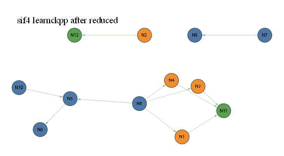

# sif4 learnckpp after reduced

- summary nodes: 28
- summary reactions: 11
- drawn nodes: 12
- drawn edges: 11
- colors: gas=blue, surface=orange, bulk/mixed=green

## N1 (orange)

Names: 5 merged: t_HN_SIF(S), t_F3SI_NH2(S), t_F2SINH(S), t_H2NFSINH(S), t_HN(FSINH)2(S)

Reactions:
- R16: SIF4+SIF3 => t_HN_SIF(S)+t_F3SI_NH2(S)+t_F2SINH...
- R35: t_HN_SIF(S)+t_F3SI_NH2(S)+t_F2SINH(S)+t_H2NFSIN...

## N2 (orange)

Names: s_HN_NH2(S)

Reactions:
- R25: s_HN_NH2(S) => N(D)

## N3 (orange)

Names: 5 merged: s_HN_SIF(S), s_F3SI_NH2(S), s_F2SINH(S), s_H2NFSINH(S), s_HN(FSINH)2(S)

Reactions:
- R14: SIF4+SIF3 => s_HN_SIF(S)+s_F3SI_NH2(S)+s_F2SINH...
- R33: s_HN_SIF(S)+s_F3SI_NH2(S)+s_F2SINH(S)+s_H2NFSIN...

## N4 (orange)

Names: 5 merged: k_HN_SIF(S), k_F3SI_NH2(S), k_F2SINH(S), k_H2NFSINH(S), k_HN(FSINH)2(S)

Reactions:
- R15: SIF4+SIF3 => k_HN_SIF(S)+k_F3SI_NH2(S)+k_F2SINH...
- R36: k_HN_SIF(S)+k_F3SI_NH2(S)+k_F2SINH(S)+k_H2NFSIN...

## N5 (blue)

Names: 10 merged: H2, H, NH, NH2, NNH, N2H2, N2H3, N2H4, HF, NH3

Reactions:
- R17: SIF4+SIF3 => H2+H+NH+NH2+NNH+N2H2+N2H3+N2H4+HF+...
- R38: HCO+CH2O+CH2OH+CH3O+CH3OH+HCCO+CH2CO+HCCOH+CH2C...
- R44: H2+H+NH+NH2+NNH+N2H2+N2H3+N2H4+HF+NH3 => NO+NO2...

## N6 (blue)

Names: 2 merged: SIF4, SIF3

Reactions:
- R14: SIF4+SIF3 => s_HN_SIF(S)+s_F3SI_NH2(S)+s_F2SINH...
- R15: SIF4+SIF3 => k_HN_SIF(S)+k_F3SI_NH2(S)+k_F2SINH...
- R16: SIF4+SIF3 => t_HN_SIF(S)+t_F3SI_NH2(S)+t_F2SINH...
- R17: SIF4+SIF3 => H2+H+NH+NH2+NNH+N2H2+N2H3+N2H4+HF+...

## N7 (blue)

Names: 2 merged: O, O2

Reactions:
- R18: O+O2 => OH+H2O+HO2+H2O2

## N8 (blue)

Names: 4 merged: OH, H2O, HO2, H2O2

Reactions:
- R18: O+O2 => OH+H2O+HO2+H2O2

## N9 (blue)

Names: 3 merged: NO, NO2, N2O

Reactions:
- R44: H2+H+NH+NH2+NNH+N2H2+N2H3+N2H4+HF+NH3 => NO+NO2...

## N10 (blue)

Names: 10 merged: HCO, CH2O, CH2OH, CH3O, CH3OH, HCCO, CH2CO, HCCOH, CH2CHO, CH3CHO

Reactions:
- R38: HCO+CH2O+CH2OH+CH3O+CH3OH+HCCO+CH2CO+HCCOH+CH2C...

## N11 (green)

Names: SI(D)

Reactions:
- R33: s_HN_SIF(S)+s_F3SI_NH2(S)+s_F2SINH(S)+s_H2NFSIN...
- R35: t_HN_SIF(S)+t_F3SI_NH2(S)+t_F2SINH(S)+t_H2NFSIN...
- R36: k_HN_SIF(S)+k_F3SI_NH2(S)+k_F2SINH(S)+k_H2NFSIN...

## N12 (green)

Names: N(D)

Reactions:
- R25: s_HN_NH2(S) => N(D)

SVG: [eval53viz_sif4_large_learnckpp_after_reduced_simple.svg](eval53viz_sif4_large_learnckpp_after_reduced_simple.svg)
