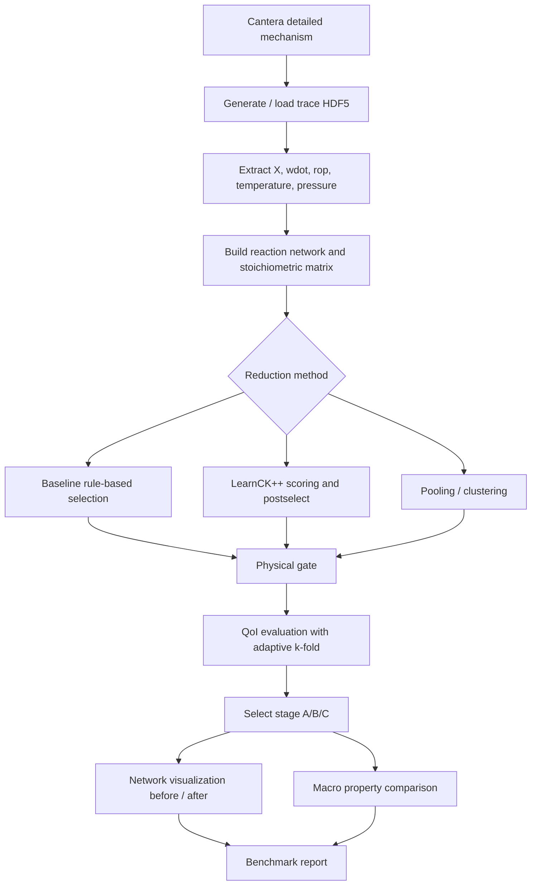
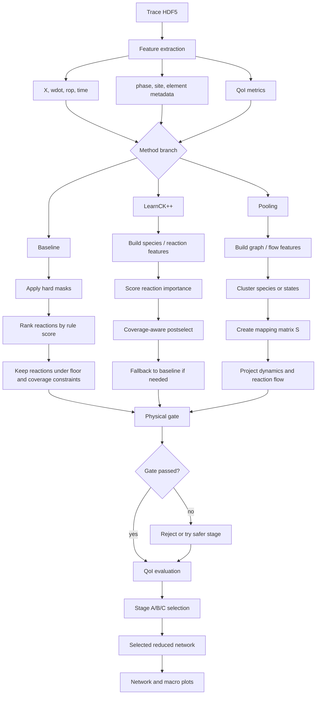

# Cantera Mechanism Reduction Benchmark Report

対象: `eval53viz` large 3-benchmark set  
対象手法: `baseline`, `learnckpp`, `pooling`

## 1. 問題設定

本レポートは、Cantera で扱う表面反応を含む大規模反応機構を、物理制約を守りながら小さい反応ネットワークへ縮退できるかを評価する。

ベンチマークは次の3ケースである。

| benchmark | 対象 | 縮退前 species | 縮退前 reactions | 条件数 |
|---|---|---:|---:|---:|
| `diamond` | diamond CVD large | 78 | 385 | 4 |
| `sif4` | SiF4 / NH3 / Si3N4 CVD large | 82 | 365 | 6 |
| `ac` | acetylene hydrocarbon CVD large | 94 | 425 | 8 |

各 benchmark に対し、3つの縮退手法を適用した。結果は、縮退前後のネットワーク図と、温度・圧力・密度などのマクロ物性比較図で確認する。

ネットワーク図の読み方:

- ノード: 状態または species。マージされた場合は代表ノードとして描画する。
- エッジ: 反応により結ばれる状態間の関係。
- ノード色: 青 = gas、橙 = surface、緑 = bulk または mixed/other。
- ノードサイズ: 全ノード固定。密度と接続数を見やすくするため。
- ノード番号と反応式: 各 `*_node_map.md` に記載。

ノード色の凡例:

| 色 | 意味 | 説明 |
|---|---|---|
| ● 青 | gas | 気相 species または気相 species を代表する縮退ノード |
| ● 橙 | surface | 表面 species、表面 site、または表面 species を代表する縮退ノード |
| ● 緑 | bulk / mixed / other | bulk species、bulk を含むノード、または phase が混在・未分類の縮退ノード |

縮退後の `pooling` では、1つのノードが複数 species を代表することがある。その場合、色は代表ノードに含まれる主な phase bucket を示す。正確なマージ内容は各 `*_node_map.md` の `Names` 欄で確認する。

## 2. 課題

大規模な表面反応機構では、詳細機構をそのまま使うと計算負荷が高い。単純に species や reaction を削ると、次の問題が起きる。

1. 重要な gas / surface / bulk 経路が欠落する。
2. 元素保存や非負性が崩れる。
3. 特定条件では平均誤差が小さくても、別条件で QoI が大きく外れる。
4. 反応数を強く削るほど、ネットワーク構造の意味が読みにくくなる。

したがって、縮退は「小さくする」だけでは足りない。物理制約、QoI 精度、ネットワーク構造の可読性を同時に評価する必要がある。

## 3. ゴール設定

本評価のゴールは次の通りである。

| goal | 内容 |
|---|---|
| 圧縮 | species 数と reaction 数を削減する |
| 物理整合 | 元素保存、非負性、最低 species/reaction 数、重要相の coverage を守る |
| QoI 保持 | 主要な濃度、表面被覆率、deposition 指標の誤差を抑える |
| 汎化評価 | `adaptive_kfold` により、未使用条件への外挿性能を確認する |
| 可視化 | 縮退前後のネットワーク密度とマクロ物性を第三者が比較できるようにする |

## 4. 手法

### 4.1 共通表現

詳細機構を有向グラフとして表す。

$$
G = (V, E)
$$

ここで、

- $V$: species または縮退後の状態ノード集合
- $E$: reaction に由来する状態間エッジ集合
- $n = |V|$: ノード数
- $m = |E|$: エッジまたは反応数

反応系の stoichiometric matrix を次で表す。

$$
\nu \in \mathbb{R}^{N_s \times N_r}
$$

- $N_s$: 縮退前 species 数
- $N_r$: 縮退前 reaction 数
- $\nu_{ij}$: species $i$ の reaction $j$ における正味係数

縮退では、species または状態を縮約写像 $S$ で低次元に写す。

$$
Y = X S
$$

- $X \in \mathbb{R}^{T \times N_s}$: trace から得た時系列状態量
- $S \in \mathbb{R}^{N_s \times K}$: species から縮退ノードへの写像
- $Y \in \mathbb{R}^{T \times K}$: 縮退後状態
- $K$: 縮退後ノード数
- $T$: 時系列サンプル数

reaction の選択は keep mask で表す。

$$
z_j \in \{0, 1\}
$$

- $z_j = 1$: reaction $j$ を保持
- $z_j = 0$: reaction $j$ を削除

縮退率は次で計算する。

$$
r_{\mathrm{sp}} = 1 - \frac{N_s^{\mathrm{after}}}{N_s^{\mathrm{before}}}
$$

$$
r_{\mathrm{rxn}} = 1 - \frac{N_r^{\mathrm{after}}}{N_r^{\mathrm{before}}}
$$

QoI 誤差は相対誤差で評価する。

$$
\mathrm{relerr}(q) =
\frac{|q_{\mathrm{reduced}} - q_{\mathrm{full}}|}
{|q_{\mathrm{full}}| + \epsilon}
$$

- $q_{\mathrm{full}}$: 詳細機構の QoI
- $q_{\mathrm{reduced}}$: 縮退機構の QoI
- $\epsilon$: ゼロ割り防止の小定数

平均誤差は次で集計する。

$$
\overline{e} = \frac{1}{|\mathcal{Q}|}
\sum_{q \in \mathcal{Q}} \mathrm{relerr}(q)
$$

- $\mathcal{Q}$: 評価対象 QoI 集合

pass rate は、閾値を満たしたケースまたは QoI の割合である。

$$
\mathrm{pass\_rate} =
\frac{1}{|\mathcal{C}|}
\sum_{c \in \mathcal{C}}
\mathbf{1}\left[e_c \le \tau\right]
$$

- $\mathcal{C}$: benchmark 条件集合
- $e_c$: 条件 $c$ の誤差
- $\tau$: 合格閾値

マクロ密度は理想気体近似で確認した。

$$
\rho =
\frac{P \overline{M}}{R T}
$$

- $\rho$: gas density
- $P$: pressure
- $T$: temperature
- $R$: universal gas constant
- $\overline{M}$: 混合平均分子量

$$
\overline{M} = \sum_i X_i M_i
$$

- $X_i$: gas species $i$ の mole fraction
- $M_i$: species $i$ の分子量

縮退後の密度は、縮退後ネットワークに残った、またはマージされた gas species を用いて再正規化して計算した。縮退後の独立した Cantera マクロ時系列は保存されていないため、温度と圧力は trace の値を before/after に重ねている。

### 4.2 Baseline

`baseline` は rule-based な reaction / species 選択を行う。元素 overlap、phase / site mask、物理 floor、balance gate を使い、危険な削除を避ける。

主な特徴:

- gas / surface の反応分解が追いやすい。
- reaction 数の削減は中程度。
- 物理的な診断性が高い。

選択は、おおまかに次の制約付き最適化として見られる。

$$
\max_z \quad \sum_j z_j w_j
$$

subject to:

$$
N_s^{\mathrm{after}} \ge N_s^{\min}
$$

$$
N_r^{\mathrm{after}} \ge N_r^{\min}
$$

$$
\mathrm{coverage}_{\mathrm{active}} \ge \gamma
$$

- $w_j$: reaction $j$ の重要度
- $N_s^{\min}$: 最低 species 数
- $N_r^{\min}$: 最低 reaction 数
- $\gamma$: active species coverage の閾値

### 4.3 LearnCK++ 型選択

`learnckpp` は trace 由来の特徴量から重要 reaction を選び、反応数を強く削減する。選択後に coverage-aware postselect と物理 gate を適用する。

特徴量の例:

$$
\phi_i =
[
\max_t X_i(t),
\mathrm{mean}_t X_i(t),
\max_t |\dot{\omega}_i(t)|,
\mathrm{element}(i),
\mathrm{phase}(i)
]
$$

- $\phi_i$: species $i$ の特徴量
- $X_i(t)$: mole fraction または状態量
- $\dot{\omega}_i(t)$: production rate

reaction 選択の score は次の形で考えられる。

$$
s_j = f_{\theta}(\phi_{\mathrm{reactants}}, \phi_{\mathrm{products}}, r_j)
$$

- $s_j$: reaction $j$ の重要度 score
- $f_{\theta}$: 学習または surrogate による scoring 関数
- $r_j$: reaction 固有特徴

主な特徴:

- reaction 数を大きく減らせる。
- overall 再合成 reaction になる場合があり、gas/surface の1対1分解は baseline より読みにくい。
- 今回は多くのケースで非常に高い reaction reduction を得た。

### 4.4 Pooling

`pooling` は species をクラスタへ集約する。

$$
S_{ik} =
\begin{cases}
1 & \text{species } i \text{ が cluster } k \text{ に属する} \\
0 & \text{otherwise}
\end{cases}
$$

クラスタ後の状態は、

$$
Y_k(t) = \sum_i X_i(t) S_{ik}
$$

となる。

反応フラックス行列も cluster 空間へ写す。

$$
F_{\mathrm{red}} = S^{\top} F S
$$

- $F$: 縮退前の species 間 reaction flow
- $F_{\mathrm{red}}$: 縮退後 cluster 間 flow

クラスタリングでは、次のような損失を抑える。

$$
\mathcal{L}
= \mathcal{L}_{\mathrm{recon}}
+ \lambda_{\mathrm{phys}}\mathcal{L}_{\mathrm{phys}}
+ \lambda_{\mathrm{cov}}\mathcal{L}_{\mathrm{coverage}}
$$

- $\mathcal{L}_{\mathrm{recon}}$: dynamics reconstruction error
- $\mathcal{L}_{\mathrm{phys}}$: 元素・phase・site などの物理制約違反
- $\mathcal{L}_{\mathrm{coverage}}$: 重要 species / cluster coverage の不足
- $\lambda_{\mathrm{phys}}, \lambda_{\mathrm{cov}}$: 各制約の重み

主な特徴:

- species 数を最も強く削れる。
- ノードがマージされるため、縮退後ネットワークの可読性は node map と併用する必要がある。
- AC case では species 91.5% 削減、reaction 96.9% 削減を達成した。

### 4.5 Workflow

### 4.6 縮退手法の学習・選択フロー

3手法は、同じ trace と評価 gate を使うが、縮退候補の作り方が異なる。`baseline` は明示ルール、`learnckpp` は特徴量に基づく reaction scoring、`pooling` は species / state のクラスタリングを中心に使う。

学習・選択で使う代表的な量は以下である。

$$
\Phi =
\left[
X,\ \dot{\omega},\ \mathrm{ROP},\ A,\ p,\ s
\right]
$$

- $\Phi$: 縮退候補を作るための特徴量集合
- $X$: species mole fraction または state value
- $\dot{\omega}$: species production rate
- $\mathrm{ROP}$: reaction rate of progress
- $A$: element composition や保存量の行列
- $p$: phase label。gas / surface / bulk など
- $s$: site label。surface site type など

`learnckpp` では reaction $j$ の重要度を、

$$
s_j = f_{\theta}(\Phi_j)
$$

として求める。ここで、$s_j$ は reaction score、$\Phi_j$ は reaction $j$ に関係する reactant / product / flow 特徴量、$f_{\theta}$ は学習または surrogate に相当する scoring 関数である。

`pooling` では、species から cluster への写像 $S$ を学習または探索し、縮退後状態を

$$
Y = XS
$$

として得る。さらに、反応 flow を

$$
F_{\mathrm{red}} = S^{\top}FS
$$

で cluster 空間へ写す。

最終選択では、品質と圧縮を同時に見る。

$$
\mathrm{score}
= \alpha r_{\mathrm{rxn}}
+ \beta r_{\mathrm{sp}}
- \lambda \overline{e}
- \mu d_{\mathrm{struct}}
$$

- $r_{\mathrm{rxn}}$: reaction reduction
- $r_{\mathrm{sp}}$: species reduction
- $\overline{e}$: QoI 平均相対誤差
- $d_{\mathrm{struct}}$: structure deficit。coverage や cluster guard の不足量
- $\alpha,\beta,\lambda,\mu$: 各項の重み

### 4.7 手法比較

| 手法 | 概要 | コア技術 | メリット | デメリット |
|---|---|---|---|---|
| `baseline` | 物理ルールと重要度 ranking に基づいて species / reaction を直接選択する。 | hard mask、element overlap、phase/site guard、physics floor、coverage gate、stage A/B/C 探索 | 物理的に説明しやすい。gas / surface の反応分解が追いやすい。品質が安定しやすい。 | reaction 削減率は learnckpp / pooling より控えめ。既存ルールに強く依存する。 |
| `learnckpp` | trace 由来特徴量から reaction importance を評価し、重要 reaction を残す。 | species / reaction feature、surrogate scoring、coverage-aware postselect、fallback policy | reaction 数を大きく削れる。baseline より aggressive な縮退が可能。 | overall 再合成 reaction になりやすく、反応ドメインの解釈性が下がる。特徴量と scoring の設計に依存する。 |
| `pooling` | species / state を cluster に集約し、少数の代表ノードで反応ネットワークを表す。 | mapping matrix $S$、graph pooling、cluster guard、flow projection、dynamics reconstruction check | species 数も reaction 数も強く削れる。巨大機構の粗視化に向く。ネットワーク全体の密度を一気に下げられる。 | ノードが複数 species を代表するため、単独ノードの意味が広くなる。node map なしでは解釈しづらい。 |

この比較から、第三者に説明しやすい縮退機構を作るなら `baseline` が扱いやすい。一方で、計算負荷を最小化したい場合は `learnckpp` または `pooling` が有力である。特に `pooling` は「状態をまとめる」手法なので、縮退後ネットワーク図では node map と併読することが重要である。

## 5. ベンチマーク結果サマリ

| benchmark | method | gate | stage | species before→after | species reduction | reactions before→after | reaction reduction | mandatory pass | mandatory mean | optional mean |
|---|---|---:|---|---:|---:|---:|---:|---:|---:|---:|
| diamond | baseline | true | B | 78→43 | 44.9% | 385→203 | 47.3% | 1.000 | 0.085 | 0.047 |
| diamond | learnckpp | true | B | 78→43 | 44.9% | 385→100 | 74.0% | 0.897 | 0.208 | 0.137 |
| diamond | pooling | true | B | 78→40 | 48.7% | 385→100 | 74.0% | 0.897 | 0.208 | 0.137 |
| sif4 | baseline | true | C | 82→29 | 64.6% | 365→146 | 60.0% | 0.972 | 0.152 | 0.128 |
| sif4 | learnckpp | true | C | 82→28 | 65.9% | 365→11 | 97.0% | 0.933 | 0.182 | 0.168 |
| sif4 | pooling | true | C | 82→21 | 74.4% | 365→11 | 97.0% | 0.917 | 0.168 | 0.245 |
| ac | baseline | true | C | 94→33 | 64.9% | 425→170 | 60.0% | 0.951 | 0.115 | 0.163 |
| ac | learnckpp | true | C | 94→33 | 64.9% | 425→22 | 94.8% | 0.951 | 0.151 | 0.221 |
| ac | pooling | true | C | 94→8 | 91.5% | 425→13 | 96.9% | 0.951 | 0.151 | 0.221 |

全9 run で `gate=true`、primary blocker は `none` だった。`baseline` は品質面で安定し、`learnckpp` と `pooling` は reaction reduction が非常に大きい。

## 6. ケース別結果

### 6.1 Diamond / Baseline

縮退前は 78 species / 385 reactions、縮退後は 43 species / 203 reactions。reaction reduction は 47.3%。baseline は削減率を抑えつつ、mandatory mean 0.085 と最も良い品質を示した。

| before | after | macro |
|---|---|---|
|  |  |  |

Node maps:

- [before node map](eval53viz_diamond_large_baseline_before_raw_simple_node_map.md)
- [after node map](eval53viz_diamond_large_baseline_after_reduced_simple_node_map.md)

### 6.2 Diamond / LearnCK++

縮退後は 43 species / 100 reactions。reaction reduction は 74.0%。baseline と species 数は同等だが、reaction 数を大きく削った。mandatory mean は 0.208 で、baseline より誤差は大きいが gate は通過した。

| before | after | macro |
|---|---|---|
|  |  |  |

Node maps:

- [before node map](eval53viz_diamond_large_learnckpp_before_raw_simple_node_map.md)
- [after node map](eval53viz_diamond_large_learnckpp_after_reduced_simple_node_map.md)

### 6.3 Diamond / Pooling

縮退後は 40 species / 100 reactions。species reduction は 48.7%、reaction reduction は 74.0%。learnckpp と同等の reaction 数で、species をさらに削った。ノードのマージが増えるため、対応表で cluster 内容を確認する必要がある。

| before | after | macro |
|---|---|---|
|  |  |  |

Node maps:

- [before node map](eval53viz_diamond_large_pooling_before_raw_simple_node_map.md)
- [after node map](eval53viz_diamond_large_pooling_after_reduced_simple_node_map.md)

### 6.4 SiF4 / Baseline

縮退後は 29 species / 146 reactions。species reduction は 64.6%、reaction reduction は 60.0%。mandatory pass は 0.972 と高く、品質と削減率のバランスが良い。

| before | after | macro |
|---|---|---|
|  |  |  |

Node maps:

- [before node map](eval53viz_sif4_large_baseline_before_raw_simple_node_map.md)
- [after node map](eval53viz_sif4_large_baseline_after_reduced_simple_node_map.md)

### 6.5 SiF4 / LearnCK++

縮退後は 28 species / 11 reactions。reaction reduction は 97.0%。非常に強い reaction 圧縮を達成した。mandatory mean は 0.182 で gate は通過しているが、縮退後ネットワークはかなり粗い。

| before | after | macro |
|---|---|---|
|  |  |  |

Node maps:

- [before node map](eval53viz_sif4_large_learnckpp_before_raw_simple_node_map.md)
- [after node map](eval53viz_sif4_large_learnckpp_after_reduced_simple_node_map.md)

### 6.6 SiF4 / Pooling

縮退後は 21 species / 11 reactions。species reduction は 74.4%、reaction reduction は 97.0%。learnckpp と同じ reaction 数まで落としつつ、species 数もさらに削った。optional mean は 0.245 と3手法中では大きめである。

| before | after | macro |
|---|---|---|
|  |  |  |

Node maps:

- [before node map](eval53viz_sif4_large_pooling_before_raw_simple_node_map.md)
- [after node map](eval53viz_sif4_large_pooling_after_reduced_simple_node_map.md)

### 6.7 AC / Baseline

縮退後は 33 species / 170 reactions。species reduction は 64.9%、reaction reduction は 60.0%。mandatory mean は 0.115 で、AC benchmark では品質が最も良い。

| before | after | macro |
|---|---|---|
|  |  |  |

Node maps:

- [before node map](eval53viz_ac_large_baseline_before_raw_simple_node_map.md)
- [after node map](eval53viz_ac_large_baseline_after_reduced_simple_node_map.md)

### 6.8 AC / LearnCK++

縮退後は 33 species / 22 reactions。species 数は baseline と同じだが、reaction 数は 22 まで減った。reaction reduction は 94.8%。mandatory mean は 0.151 で、強い圧縮の割に品質は維持されている。

| before | after | macro |
|---|---|---|
|  |  |  |

Node maps:

- [before node map](eval53viz_ac_large_learnckpp_before_raw_simple_node_map.md)
- [after node map](eval53viz_ac_large_learnckpp_after_reduced_simple_node_map.md)

### 6.9 AC / Pooling

縮退後は 8 species / 13 reactions。species reduction は 91.5%、reaction reduction は 96.9%。今回の中で最も強い縮退である。マージによりノード数が大きく減るため、縮退後ネットワークは非常に粗いが、mandatory pass は 0.951 を維持した。

| before | after | macro |
|---|---|---|
|  |  |  |

Node maps:

- [before node map](eval53viz_ac_large_pooling_before_raw_simple_node_map.md)
- [after node map](eval53viz_ac_large_pooling_after_reduced_simple_node_map.md)

## 7. 考察

### 7.1 品質重視なら Baseline

`baseline` は3 benchmark すべてで、mandatory mean が最も小さい。特に `diamond` では 0.085、`ac` では 0.115 であり、縮退後も QoI の安定性が高い。reaction reduction は 47.3% から 60.0% に留まるが、第三者がネットワークを読むには最も解釈しやすい。

### 7.2 圧縮重視なら LearnCK++ または Pooling

`learnckpp` と `pooling` は reaction 数を大きく削る。`sif4` では 365→11、`ac/pooling` では 425→13 まで削減した。とくに `pooling` は species も強く削れるため、巨大機構の粗視化には有効である。

一方で、マージ後ノードは複数 species を代表するため、ノード単体の物理的意味は広くなる。したがって、縮退後ネットワーク図だけではなく、必ず node map と併用する必要がある。

### 7.3 マクロ物性の読み方

マクロ比較図では、temperature と pressure は before/after が重なる。これは縮退後の独立した Cantera 再積分結果が保存されておらず、trace の値を共通に使っているためである。

density は、縮退後ネットワークに含まれる gas species を用いて再正規化した理想気体密度である。したがって、これは「縮退後 gas basis で見た密度の整合性チェック」として読むのが適切である。

### 7.4 ネットワーク図から見える傾向

縮退前ネットワークは全 benchmark で高密度であり、多数の状態が反応で結ばれている。縮退後は、baseline では密度を残した中規模ネットワーク、learnckpp では reaction が大きく間引かれた疎なネットワーク、pooling では少数の代表ノードに集約された粗いネットワークになる。

この差は、手法の思想をよく反映している。

- baseline: 解釈性と安全性を優先
- learnckpp: reaction 数削減を優先
- pooling: species / state aggregation を優先

### 7.5 今後の改善点

今回の可視化では、縮退後の独立した Cantera trajectory が保存されていない。次の評価では、縮退機構そのものを Cantera で再実行し、temperature、pressure、density、deposition rate の full vs reduced trajectory を直接比較するのが望ましい。

また、pooling と learnckpp の縮退後 reaction は overall 再合成になりやすい。実務利用では、overall reaction に domain tag、元 reaction index、gas/surface/bulk の由来を保持すると、第三者がより解釈しやすくなる。

## 8. 付録

関連ファイル:

- [network index](index.md)
- [macro compare index](macro_compare_index.md)
- [all macro CSV](macro_compare_all.csv)

生成スクリプト:

- [network graph generator](../../tools/generate_simple_network_graphs.py)
- [macro compare generator](../../tools/generate_macro_compare_plots.py)
